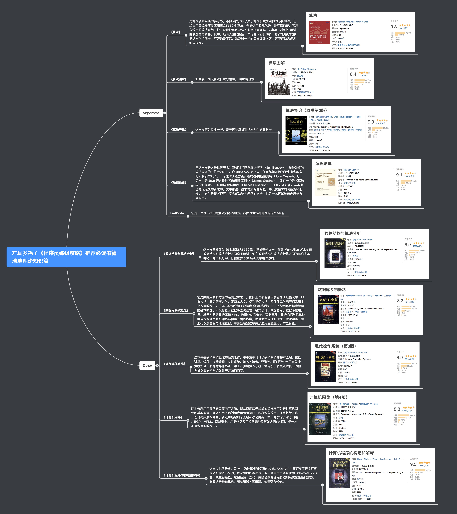

# Full Stack(全栈之路)

做这个项目的初衷其实很简单，仅仅是为了留下精华，减少重复的精力。

## 左耳朵耗子推荐

《程序员练级攻略》推荐必读书籍清单

## 推荐网站

[在线个性化定制个人简历](http://resumemaker.online/)

[掌握 3 个搜索技巧，在 GitHub 上快速找到实用软件资源](https://sspai.com/post/46061)

[JVM调优](http://xxfox.perfma.com/)

[GC 分析](https://gceasy.io/)

[设计数据密集型应用 - 中文翻译](https://vonng.gitbooks.io/ddia-cn/content/)

