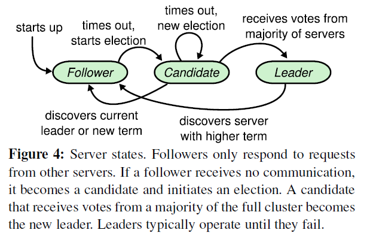
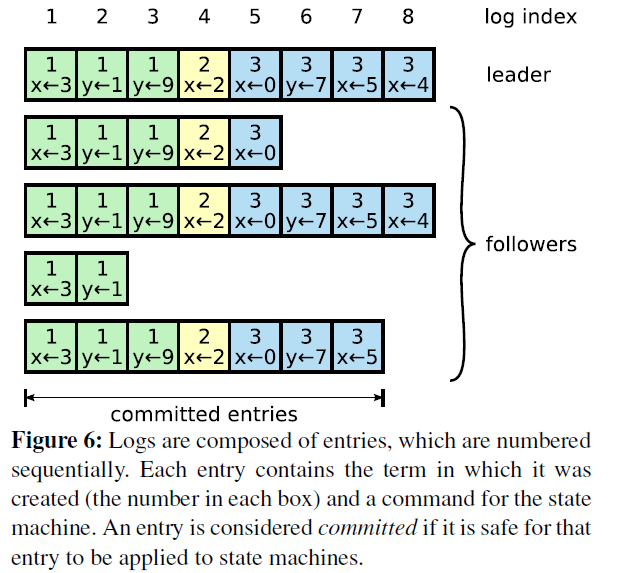
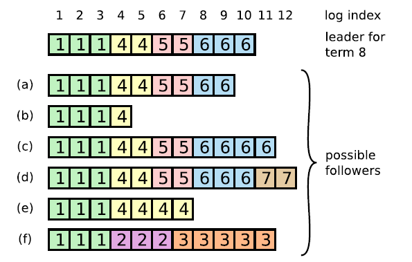
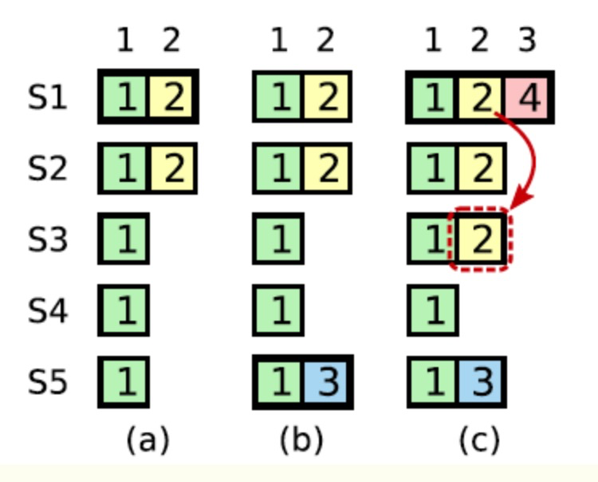

### Leader 选举过程

在一个由 Raft 协议组织的集群中有三类角色：

1. Leader（领袖）
2. Follower（群众）
3. Candidate（候选人）

当启动集群 A、B、C 三个节点时，三个节点都处于 Follower 状态中，在心跳超时时间内没有收到 Leader 节点的信息，某一个节点优先转入 Candidate 状态，并发起一个投票请求，这里假设是 A 节点，A 在发起投票请求之前会先投一票给自己，如果 B 和 C 在收到请求的时候，还处于 `election time out` ，会直接投给 A ，A 就成为了 Leader 节点，并通知其他节点自己当选，并维护心跳。

以上是比较理想情况下的选举过程，我们先提炼一下关键信息：

- 触发选举条件：心跳超时时间内没有收到 Leader 节点的心跳
- 当选 Leader 条件：获得最多票数的节点当选

Raft 集群各个节点之间是通过**RPC通讯**传递消息的，每个节点都包含一个RPC服务端与客户端，初始时启动RPC服务端、状态设置为Follower、启动选举定时器，每个Raft节点的选举定时器**超时时间都在100-500毫秒之间且并不一致**；

处于 Candidate 状态的节点会发起一个投票请求，**请求内容：**候选人任期（term）、候选人ID（candidateId）、日志项索引（lastLogIndex）、日志项任期（lastLogTerm）。**响应内容：**当前任期（term）、投票结果（voteGranted）。每个任期内，每个 Raft 节点都只能投票一次。

假设 A（Term=1） 发起投票请求时，B（Term=1） 也发起了投票请求（此时B还没有收到A的请求），如果 A 先请求到 C 并及时响应，那么 A（Term=1）。如果出现票数一样的情况，超过选举定时器超时时间，节点进行下一轮的投票请求（Term 加 1）。

**如何保证选举票数存在相同的情况（脑裂）？**

- 选举定时器超时时间不同节点不一致
- Raft 集群节点数设为奇数

**心跳超时时间与选举超时时间怎么定？**

当 Follower 节点收到 Leader 节点心跳信息时，会重置选举超时时间，因而，心跳时间应该小于选举时间。

**A 能获得 C 的票的前提？**

- 一个节点得到 majority 的投票才能成为 leader，而节点 A 给节点 B 投票的其中一个前提是，B 的日志不能比 A 的日志旧。（下文讲述）
- C 未发起投票请求，且最先收到 A 的投票请求

### Log Replication

当 Leader 被选举出来之后，由 Leader 处理来自客户端的请求，Leader 会对并发处理进行排序，并将这些请求的排序和信息通过心跳的方式传递到 Follower 节点。

完整流程：

- leader append log entry
- leader issue AppendEntries RPC in parallel
- leader wait for majority response
- leader apply entry to state machine
- leader reply to client
- leader notify follower apply log

log entry

在 Raft 中，Leader 将客户端请求（command）封装到一个个 log entry，并将 log entry 按与 Leader 中存储的先后顺序同步到 Follower 节点。

从上图中可以看出，logs 顺序排列的 log entry 组成 ，每个 log entry 除了包含 command，还包含产生该 log entry 时的 leader term。从上图可以看到，5 个节点的日志并不完全一致，raft 算法为了保证高可用，并不是强一致性，而是最终一致性，leader会不断尝试给follower发 log entries，直到所有节点的 log entries 都相同。

在上面的流程中，leader只需要 log entry 被复制到大多数节点即可向客户端返回，一旦向客户端返回成功消息，那么系统就必须保证 log entry（其实是 log 所包含的 command ）在任何异常的情况下都不会发生回滚，即：当前 log entry 处于 commited 状态了。

正常情况下，一切都是没有问题的，但存在网络问题、Leader 选举等情况从而存在 Follower 与 Leader 之间的数据不一致性。在 Raft 中，**一切根据 Leader 数据进行覆盖，因为 Leader 一定包含最新的 committed log**，这里注意是 committed log，也就是说已经被绝大多节点所复制了确认的，不能回滚的日志数据。

其过程是 A节点收到 Leader 的请求后，对比 Leader 节点记录的上一个日志记录的i ndex 和 term，发现自己的日志中不存在这个命令，于是拒绝这个请求。此时，Leader 节点知道发生了不一致，于是递减 nextIndex，并重新给A节点发送日志复制请求，直到找到日志一致的地方为止。然后把 Follower 节点的日志覆盖为 Leader 节点的日志内容。

**为什么 Leader 具有最新的 committed log？**

Raft 在选举的过程中，就存在一个校验项，当选 Leader 的节点 commited 日志数据不能旧于其他节点。

在场景 c 中，当前 Leader 为 S1，最新的 log entry 是 4，此时 raft 算法会将最新的 4 的数据同步到各个节点上，顺带对缺失 2 数据信息进行补充，这里要注意是顺带哦，而不是先同步 2，在同步 4。如果 2 数据绝大多数节点都存在了，就可以处于 commited 状态，响应客户端请求，不再允许回滚。

**如果 Leader 节点获取大多数的节点的同意，但不同意的节点上存在 log 数据是 Leader 节点所没有的数据呢？**

Leader 节点的数据会覆盖该节点的数据。

**如果 leader 收不到majority节点的消息呢？**

Leader 可以自己 step down，自行转换到 follower 状态。

### 总结：

Leader 选举：

- 一个节点得到 majority 的投票才能成为 leader，而节点 A 给节点 B 投票的其中一个前提是，B 的日志不能比 A 的日志旧。
- 触发选举条件：心跳超时时间内没有收到 Leader 节点的心跳
- 当选 Leader 条件：获得最多票数的节点当选
- 心跳时间应该小于选举时间

Log Replication 约束：

- 一个 log 被复制到大多数节点，就是 committed，保证不会回滚
- leader 一定包含最新的 committed log，因此leader只会追加日志，不会删除覆盖日志
- 不同节点，某个位置上日志相同，那么这个位置之前的所有日志一定是相同的
- Raft never commits log entries from previous terms by counting replicas.
- log 数据只允许追加，不允许删除和修改

https://www.cnblogs.com/xybaby/p/10124083.html