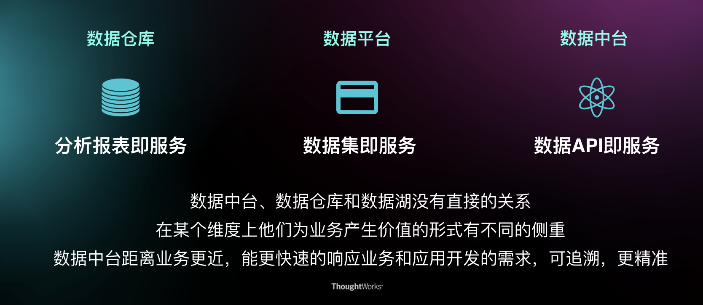
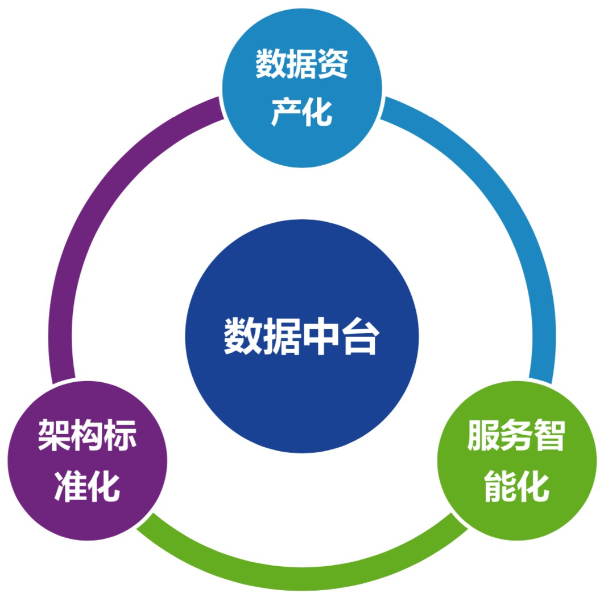
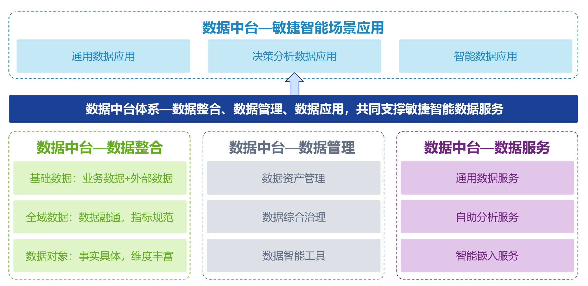
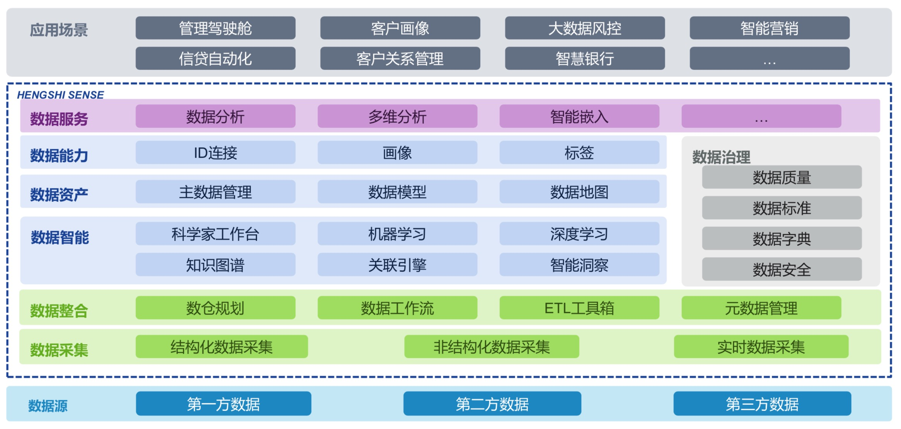

# 数据中台

企业级的可复用的能力平台。

数据+技术+产品+组织

数据中台是指通过数据技术，对海量数据进行采集、计算、存储、加工，同时统一标准和口径。数据中台把数据统一之后，会形成标准数据，再进行存储，形成大数据资产层，进而为客户提供高效服务。

**数据资产不等同于数据，数据资产是唯一的，能为业务产生价值的数据**

有一定抽象的数据仓库中间层模型能缓解业务变化对数据模型的冲击；数据规范定义能有效避免数据的重复设计、存储降低省直消除业务人员的困惑；合理的数据生命周期管理能避免数据计算特别是数据存储的浪费。

数据公共层：ODS数据层、DWS+DWD数据中间层（统一性和可复用性）。

流程

现状梳理

确定问题

寻找解决方案

确立项目计划

明确关键产出内容

## 数据中台解决什么问题

数据孤岛、重复建设

1. 效率：为什么应用开发增加一个报表，就要十几天时间？为什么不能实时获得用户推荐清单？当业务人员对数据产生一点疑问的时候，需要花费很长的时间，结果发现是数据源的数据变了，最终影响上线时间。
2. 协作问题：当业务应用开发的时候，虽然和别的项目需求大致差不多，但因为是别的项目组维护的，所以数据还是要自己再开发一遍。
3. 能力问题：数据的处理和维护是一个相对独立的技术，需要相当专业的人来完成，但是很多时候，我们有一大把的应用开发人员，而数据开发人员很少。

## 数据中台建设过程中会存在什么问题

- 为了建中台而建
- 业务数据混乱
  - 数据杂乱无章。没有统一的文档
  - 不成系统。各个业务自知道自己负责的那一块内容，若出现离职等变更，信息准确性又会大打折扣
  - 数据断层。例如现在业务需要知道浙江省每日口罩生产总量这个指标数据，但是业务没有一张表记录每个口罩厂的生产数据，从而导致这个指标数据结果无法渠道。

## 数据中台的特性

- 通过 API 的方式提供数据服务，而不是直接把数据库给前台、让前台开发自行使用数据
- 从业务的角度对数据进行规划

### 数据中台和数据仓库、数据平台的关键区别

## 数据中台建设目的

更高效的响应用户需求。数字化企业是以客户中心的基础，在统一的愿景下建立了实时的战略机制和敏捷生态的生机型组织。

数字化竞争实际上就是**用户响应力**的比拼。

有了“中台”这⼀新的 Pace-Layered 断层，我们即可以将早已臃肿不堪的前台系统中的稳定通用业务能力“沉降”到中台层，为前台减肥，恢复前台的响应⼒；又可以将后台系统中需要频繁变化或是需要被前台直接使用的业务能力“提取”到中台层，赋予这些业务能力更强的灵活度和更低的变更成本，从而为前台提供更强大的“能力炮火”⽀援。

### 数据中台意义

- 组织优化：聚合大数据相关经验的人员，集中进行数据相关的功能
- 数据价值化：业务全面数据化，基于数据构建数据应用，用数据支撑业务发展
- 降低成本：避免重复搭建大数据环境，导致资源浪费和利用率低
- 提升效率：数据集中，降低沟通成本，规范统一，开发效率提升

## 核心方法论

## 数据架构

## 数据资产

一切能为产品和公司带来经济效益的数据，就叫数据资产。

数据中台的建设过程中，就会原本不被重视、不被加以利用的数据进行组合或者在生产，实现数据资产化。

## 底线

任何操作不能影响业务方

不能出现数据丢失

尽可能不要出现服务器奔溃

## 标签

临时性标签：商品A突然销售额大涨

[指标管理体系设计](https://zhuanlan.zhihu.com/p/59272558)

