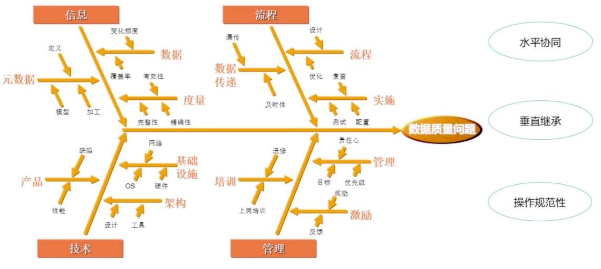
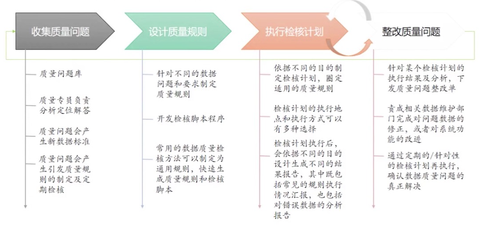
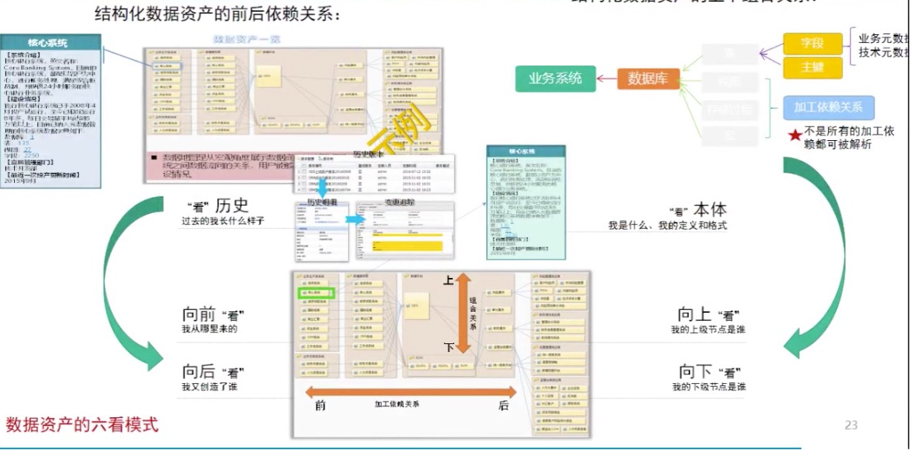
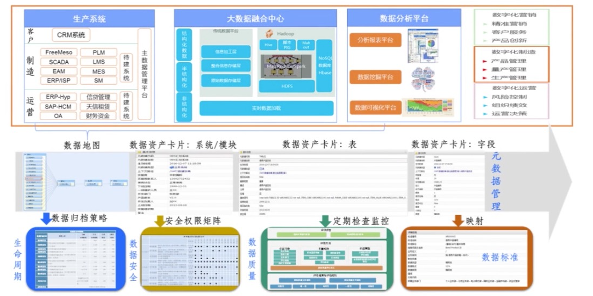

# 数据治理

## 数据质量

数据质量是指数据满足明确或隐含需求程度的指标。数据质量管理是通过业务管控及数据检查手段，控制并保证数据信息的准确性、完整性、一致性等关键因素，使得能够准确反映企业的经营状况，为企业的管理决策提供正确的信息。

### 数据质量问题

在数据产生、流转、整合、应用等重要环节中，由于业务信息录入、交换及传输、整合、技术及平台转换、加工和存储过程中所产生的完整性、准确性、一致性、时效性、规范性等问题。导致不能满足现行业务数据应用要求的情况被视为数据质量问题。

| 方面   | 说明                           | 解释                                                     |
| ------ | ------------------------------ | -------------------------------------------------------- |
| 完整性 | 数据的缺失程度                 | 为空值，或全空格                                         |
| 准确性 | 数据与目标特征值之间的差异程度 | 超过值域约束，非法值，非法代码，不满足数据间交叉检验规则 |
| 规范性 | 数据格式的规范程度             | 长度、精度、格式不满足要求                               |
| 一致性 | 数据在流转过程中的等价程度     | 主外键一致性，同一数据项在系统间流转的一致性             |
| 唯一性 | 主键唯一约束                   | 一个唯一标识只能属于一个个体                             |
| 时效性 | 数据刷新时间窗口               | 数据获取、加工时间和频率不满足要求                       |

### 产生原因

信息、管理、技术、流程

### 改善建设方法

## 数据标准

### 解决问题

同名不同义的处理

同义不同名

代码分类不统一

## 元数据

**元数据管理=数据资产目录**

### 元数据应用

数据地图、影响分析、血缘分析、一致性分析、元数据变更分析、元数据版本比对。

