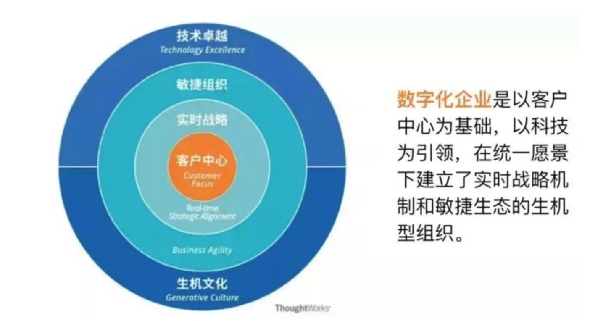

# 数据中台

企业级的可复用的能力平台。

数据+技术+产品+组织

## 数据中台建设目的

更高效的响应用户需求。数字化企业是以客户中心的基础，在统一的愿景下建立了实时的战略机制和敏捷生态的生机型组织。

数字化竞争实际上就是**用户响应力**的比拼。

有了“中台”这⼀新的 Pace-Layered 断层，我们即可以将早已臃肿不堪的前台系统中的稳定通用业务能力“沉降”到中台层，为前台减肥，恢复前台的响应⼒；又可以将后台系统中需要频繁变化或是需要被前台直接使用的业务能力“提取”到中台层，赋予这些业务能力更强的灵活度和更低的变更成本，从而为前台提供更强大的“能力炮火”⽀援。

### 数据中台意义

- 组织优化：聚合大数据相关经验的人员，集中进行数据相关的功能
- 数据价值化：业务全面数据化，基于数据构建数据应用，用数据支撑业务发展
- 降低成本：避免重复搭建大数据环境，导致资源浪费和利用率低
- 提升效率：数据集中，降低沟通成本，规范统一，开发效率提升

## 核心方法论

## 数据架构

## 数据资产

一切能为产品和公司带来经济效益的数据，就叫数据资产。

数据中台的建设过程中，就会原本不被重视、不被加以利用的数据进行组合或者在生产，实现数据资产化。

## 底线

任何操作不能影响业务方

不能出现数据丢失

尽可能不要出现服务器奔溃

## 标签

临时性标签：商品A突然销售额大涨

[指标管理体系设计](https://zhuanlan.zhihu.com/p/59272558)

