## 模型类型

### 范式建模法（Third Normal Form，3NF）

范式建模法其实是我们在构建数据模型常用的一个方法，该方法的主要由 Inmon 所提倡，主要解决关系型数据库得数据存储，利用的一种技术层面上的方法。

目前，我们在关系型数据库中的建模方法，大部分采用的是三范式建模法。

范式是数据库逻辑模型设计的基本理论，一个关系模型可以从第一范式到第五范式进行无损分解，这个过程也可称为规范化。

在数据仓库的模型设计中目前一般采用第三范式，它有着严格的数学定义。从其表达的含义来看，一个符合第三范式的关系必须具有以下三个条件 :

- 每个属性值唯一，不具有多义性 ;
- 每个非主属性必须完全依赖于整个主键，而非主键的一部分 ;
- 每个非主属性不能依赖于其他关系中的属性，因为这样的话，这种属性应该归到其他关系中去。

由于范式是基于整个关系型数据库的理论基础之上发展而来的，因此，本人在这里不多做介绍，有兴趣的读者可以通过阅读相应的材料来获得这方面的知识。

根据 Inmon 的观点，数据仓库模型得建设方法和业务系统的企业数据模型类似。在业务系统中，企业数据模型决定了数据的来源，而企业数据模型也分为两个层次，即主题域模型和逻辑模型。同样，主题域模型可以看成是业务模型的概念模型，而逻辑模型则是域模型在关系型数据库上的实例。

从业务数据模型转向数据仓库模型时，同样也需要有数据仓库的域模型，即概念模型，同时也存在域模型的逻辑模型。

这里，业务模型中的数据模型和数据仓库的模型稍微有一些不同。主要区别在于：

数据仓库的域模型应该包含企业数据模型的域模型之间的关系，以及各主题域定义。

数据仓库的域模型的概念应该比业务系统的主题域模型范围更加广。

在数据仓库的逻辑模型需要从业务系统的数据模型中的逻辑模型中抽象实体，实体的属性，实体的子类，以及实体的关系等。
以笔者的观点来看，Inmon 的范式建模法的最大优点就是从关系型数据库的角度出发，结合了业务系统的数据模型，能够比较方便的实现数据仓库的建模。

但其缺点也是明显的，由于建模方法限定在关系型数据库之上，在某些时候反而限制了整个数据仓库模型的灵活性，性能等，特别是考虑到数据仓库的底层数据向数据集市的数据进行汇总时，需要进行一定的变通才能满足相应的需求。

### 维度建模法

维度建模法，Kimball 最先提出这一概念。其最简单的描述就是，按照事实表，维表来构建数据仓库，数据集市。

事实表是用来记录具体事件的，包含了每个事件的具体要素，以及具体发生的事情；维表则是对事实表中事件的要素的描述信息。

比如一个事件会包含时间、地点、人物、事件，事实表记录了整个事件的信息，但对时间、地点和人物等要素只记录了一些关键标记，比如事件的主角叫“Michael”，那么Michael到底“长什么样”，就需要到相应的维表里面去查询“Michael”的具体描述信息了。

基于事实表和维表就可以构建出多种多维模型，包括星形模型、雪花模型和星座模型。

维度建模法最被人广泛知晓的名字就是星型模式（Star-schema）。

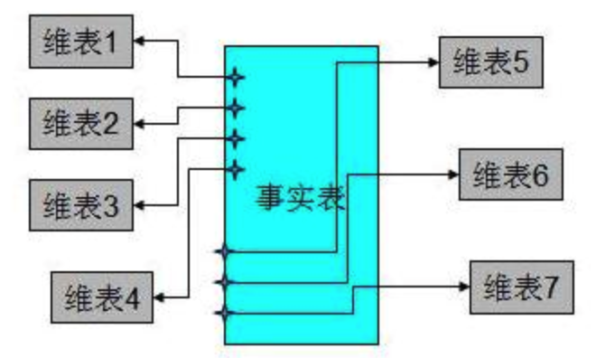

上图的这个架构中是典型的星型架构。星型模式之所以广泛被使用，在于针对各个维作了大量的预处理，如按照维进行预先的统计、分类、排序等。

通过这些预处理，能够极大的提升数据仓库的处理能力。

特别是针对 3NF 的建模方法，星型模式在性能上占据明显的优势。

同时，维度建模法的另外一个优点是，维度建模非常直观，紧紧围绕着业务模型，可以直观的反映出业务模型中的业务问题。
不需要经过特别的抽象处理，即可以完成维度建模。这一点也是维度建模的优势。

但是，维度建模法的缺点也是非常明显的，由于在构建星型模式之前需要进行大量的数据预处理，因此会导致大量的数据处理工作。

而且，当业务发生变化，需要重新进行维度的定义时，往往需要重新进行维度数据的预处理。

而在这些与处理过程中，往往会导致大量的数据冗余。

另外一个维度建模法的缺点就是，如果只是依靠单纯的维度建模，不能保证数据来源的一致性和准确性，而且在数据仓库的底层，不是特别适用于维度建模的方法。

因此以笔者的观点看，维度建模的领域主要适用与数据集市层，它的最大的作用其实是为了解决数据仓库建模中的性能问题。

维度建模很难能够提供一个完整地描述真实业务实体之间的复杂关系的抽象方法。

### 实体建模法

实体建模法并不是数据仓库建模中常见的一个方法，它来源于哲学的一个流派。

从哲学的意义上说，客观世界应该是可以细分的，客观世界应该可以分成由一个个实体，以及实体与实体之间的关系组成。

那么我们在数据仓库的建模过程中完全可以引入这个抽象的方法，将整个业务也可以划分成一个个的实体，而每个实体之间的关系，以及针对这些关系的说明就是我们数据建模需要做的工作。

虽然实体法粗看起来好像有一些抽象，其实理解起来很容易。

即我们可以将任何一个业务过程划分成 3 个部分，实体，事件和说明。

例如我们描述一个简单的事实：“小明开车去学校上学”。以这个业务事实为例，我们可以把“小明”，“学校”看成是一个实体，“上学”描述的是一个业务过程，我们在这里可以抽象为一个具体“事件”，而“开车去”则可以看成是事件“上学”的一个说明。
从上面的举例我们可以了解，我们使用的抽象归纳方法其实很简单，任何业务可以看成 3 个部分：

实体，主要指领域模型中特定的概念主体，指发生业务关系的对象。

事件，主要指概念主体之间完成一次业务流程的过程，特指特定的业务过程。

说明，主要是针对实体和事件的特殊说明。

由于实体建模法，能够很轻松的实现业务模型的划分，因此，在业务建模阶段和领域概念建模阶段，实体建模法有着广泛的应用。从笔者的经验来看，再没有现成的行业模型的情况下，我们可以采用实体建模的方法，和客户一起理清整个业务的模型，进行领域概念模型的划分，抽象出具体的业务概念，结合客户的使用特点，完全可以创建出一个符合自己需要的数据仓库模型来。

但是，实体建模法也有着自己先天的缺陷，由于实体说明法只是一种抽象客观世界的方法，因此，注定了该建模方法只能局限在业务建模和领域概念建模阶段。因此，到了逻辑建模阶段和物理建模阶段，则是范式建模和维度建模发挥长处的阶段。

因此，笔者建议读者在创建自己的数据仓库模型的时候，可以参考使用上述的三种数据仓库得建模方法，在各个不同阶段采用不同的方法，从而能够保证整个数据仓库建模的质量。

### 维度建模法数据模型的区别

多维数据模型是最流行的数据仓库的数据模型，多维数据模型最典型的数据模式包括星型模式、雪花模式和事实星座模式，本文以实例方式展示三者的模式和区别。

#### 星型模式（star schema）

星型模式的核心是一个大的中心表（事实表），一组小的附属表（维表）。星型模式示例如下所示：

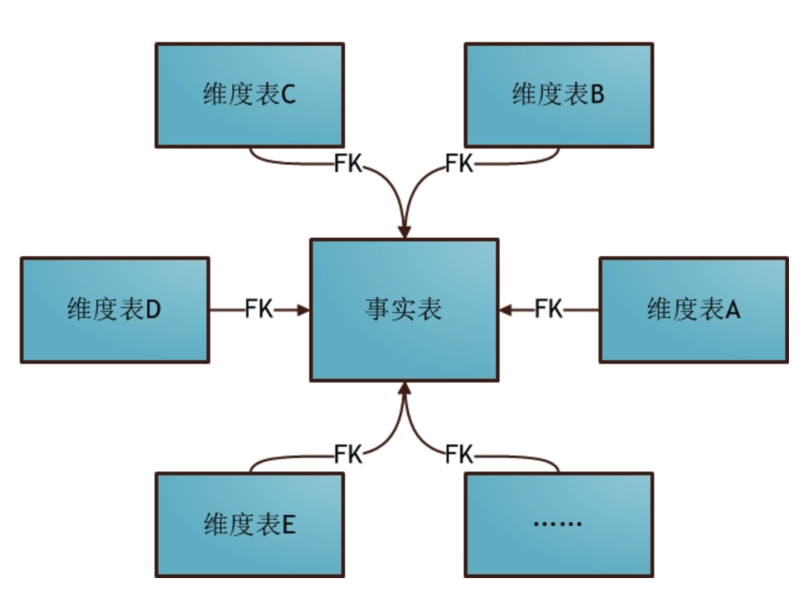

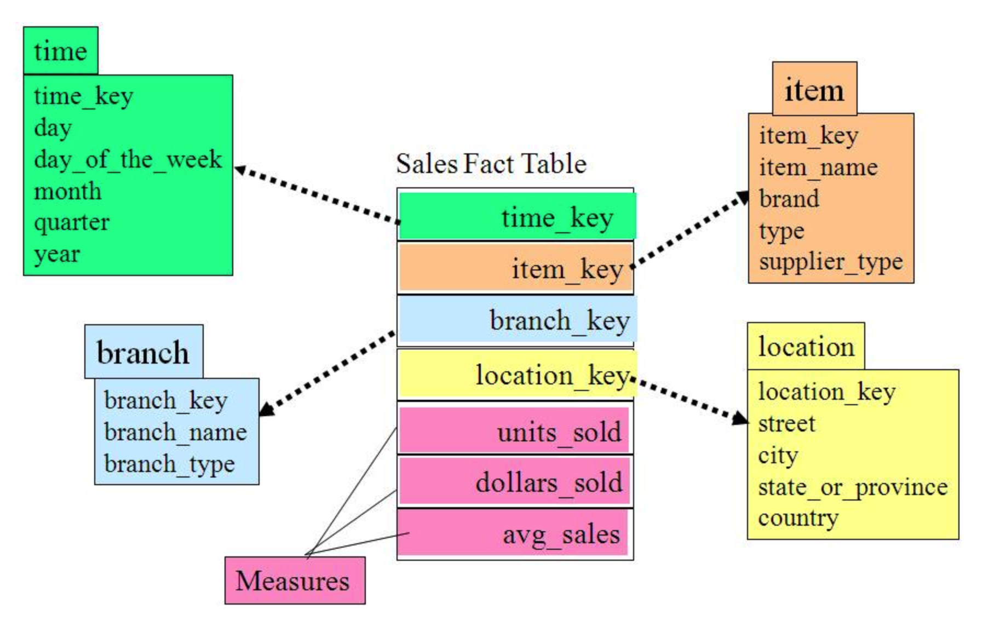

可以看出，星形模式的维度建模由一个事实表和一组维表成，且具有以下特点：

a. 维表只和事实表关联，维表之间没有关联；

b. 每个维表的主码为单列，且该主码放置在事实表中，作为两边连接的外码；

c. 以事实表为核心，维表围绕核心呈星形分布；

#### 雪花模式（snowflake schema）

雪花模式是星型模式的扩展，其中某些维表被规范化，进一步分解到附加表（维表）中。雪花模式示例如下图所示：

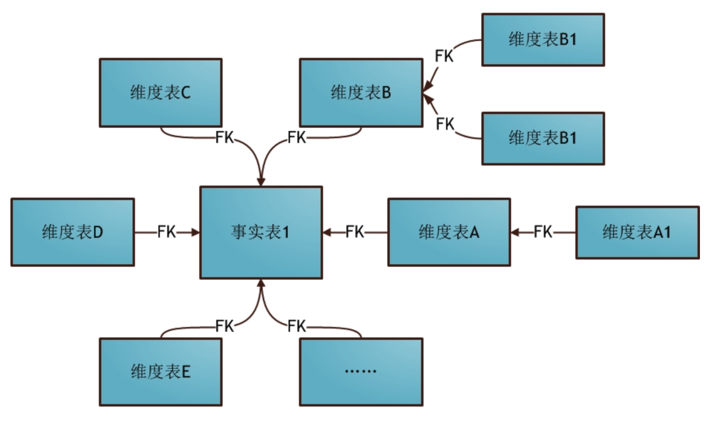

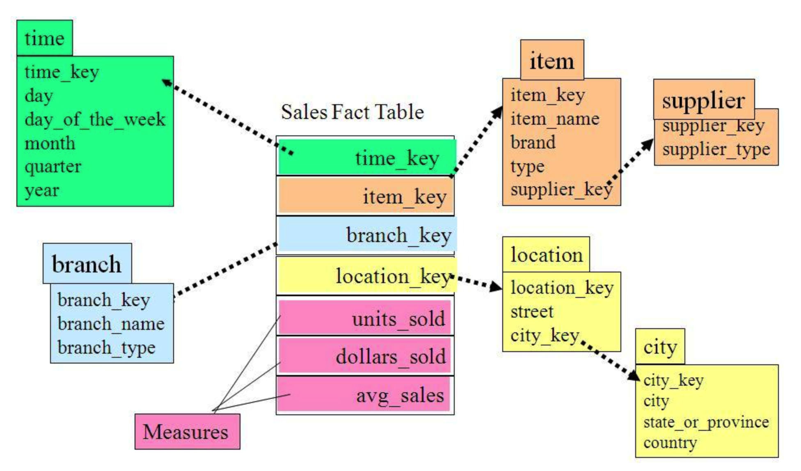

从图中我们可以看到地址表被进一步细分出了城市（city）维。supplier_type表被进一步细分出来supplier维。

星形模式中的维表相对雪花模式来说要大，而且不满足规范化设计。雪花模型相当于将星形模式的大维表拆分成小维表，满足了规范化设计。然而这种模式在实际应用中很少见，因为这样做会导致开发难度增大，而数据冗余问题在数据仓库里并不严重。

#### 事实星座模式（Fact Constellation）或星系模式（galaxy schema）

数据仓库由多个主题构成，包含多个事实表，而维表是公共的，可以共享，这种模式可以看做星型模式的汇集，因而称作星系模式或者事实星座模式。本模式示例如下图所示：

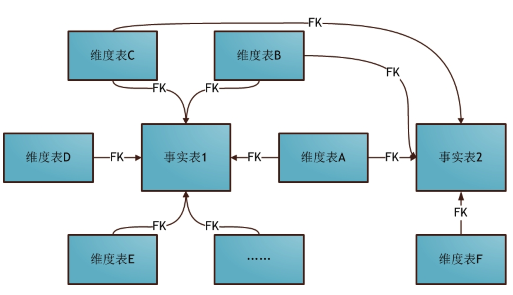

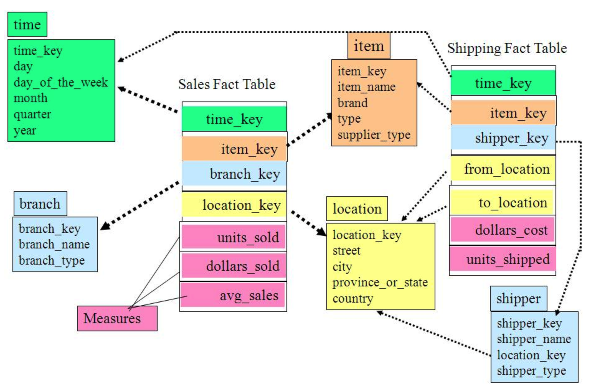

如上图所示，事实星座模式包含两个事实表：sales和shipping，二者共享维表。

事实星座模式是数据仓库最常使用的数据模式，尤其是企业级数据仓库（EDW）。

前面介绍的两种维度建模方法都是多维表对应单事实表，但在很多时候维度空间内的事实表不止一个，而一个维表也可能被多个事实表用到。在业务发展后期，绝大部分维度建模都采用的是星座模式。

这也是数据仓库区别于数据集市的一个典型的特征，从根本上而言，数据仓库数据模型的模式更多是为了避免冗余和数据复用，套用现成的模式，是设计数据仓库最合理的选择。

#### 三种模式对比

归纳一下，星形模式/雪花模式/星座模式的关系如下图所示：

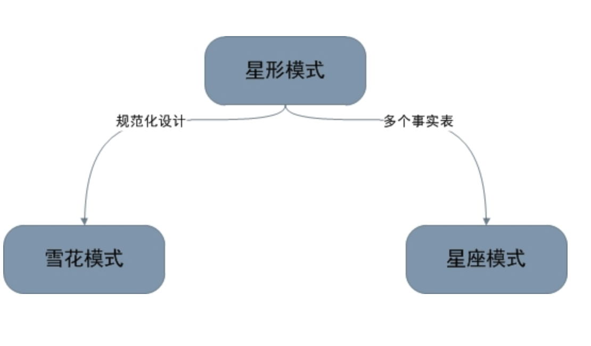

#### 实例

在进行维度建模前，首先要了解用户需求。而笔者在数据库系列的第一篇就讲过，ER建模是当前收集和可视化需求的最佳技术。因此假定和某零售公司进行多次需求PK后，得到以下ER图：

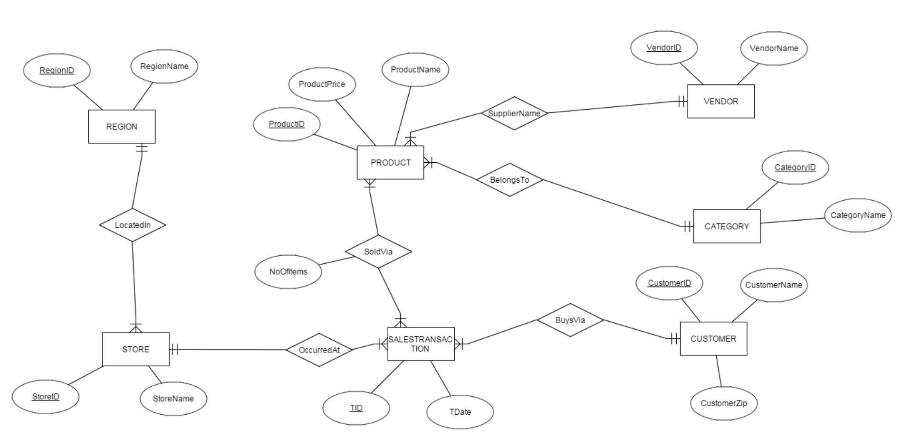

随后可利用建模工具将ER图直接映射到关系图：

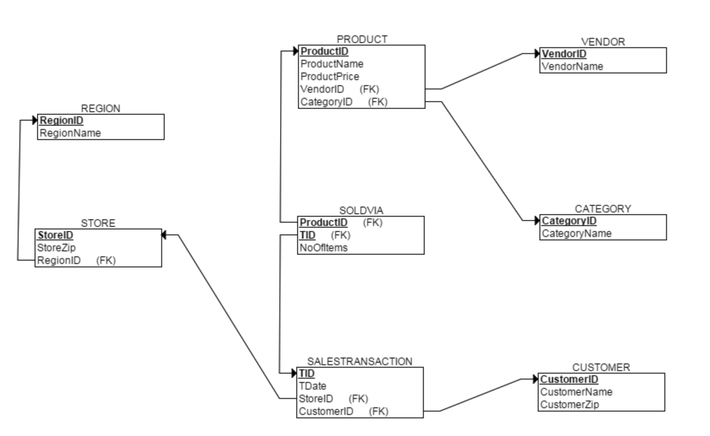

需求搜集完毕后，便可进行维度建模了。本例采用星形模型维度建模。但不论采取何种模式，维度建模的关键在于明确下面四个问题：

1.哪些维度对主题分析有用？

本例中，根据产品(PRODUCT)、顾客(CUSTOMER)、商店(STORE)、日期(DATE)对销售额进行分析是非常有帮助的；

2.如何使用现有数据生成维表？

a. 维度PRODUCT可由关系PRODUCT，关系VENDOR，关系CATEGORY连接得到；

b. 维度CUSTOMER和关系CUSTOMER相同；

c. 维度STORE可由关系STROE和关系REGION连接得到；

d. 维度CALENDAR由关系SALESTRANSACTION中的TDate列分离得到；

3.用什么指标来”度量”主题？

本例的主题是销售，而销量和销售额这两个指标最能直观反映销售情况；

4.如何使用现有数据生成事实表？

销量和销售额信息可以由关系SALESTRANSACTION和关系SOLDVIA，关系PRODUCT连接得到；

明确这四个问题后，便能轻松完成维度建模：

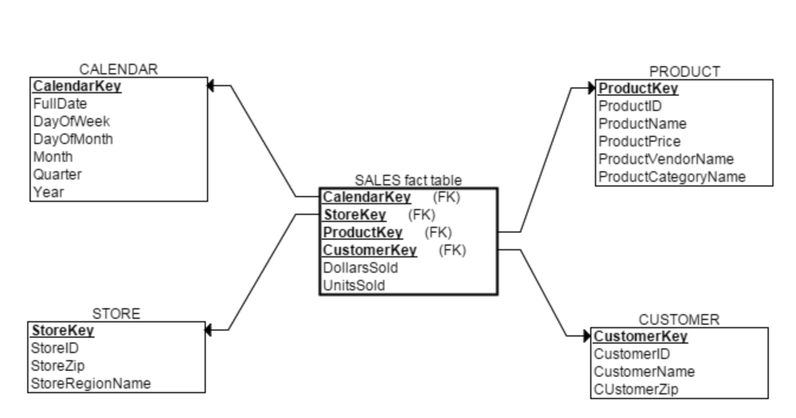

细心的读者会发现三个问题：1. 维表不满足规范化设计(不满足3NF)；2. 事实表也不满足规范化设计(1NF都不满足)； 3. 维度建模中各维度的主码由***ID变成***Key；

对于前两个问题，由于当前建模环境是数据仓库，而没有更新操作，所以不需要严格做规范化设计来消除冗余避免更新异常。

因此虽然可以以雪花模型进行维度建模，如下所示：

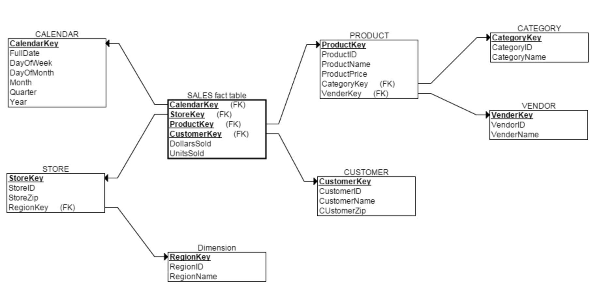

但这样会加大查询人员负担：每次查询都涉及到太多表了。因此在实际应用中，雪花模型仅是一种理论上的模型。星座模型则出现在”维度建模数据仓库”中，本文后面将会讲到。

对于第三个问题，***Key这样的字段被称为代理码(surrogate key)，它是一个通过自动分配整数生成的主码，没有任何其他意义。使用它主要是为了能够处理”缓慢变化的维度”。

#### 经典星座模型

前文已经讲过，有多个事实表的维度模型被称为星座模型。星座模型主要有以下两大作用：共享维度和设置细节/聚集事实表。下面分别对这两种情况进行分析：

共享维度
以前文提到的零售公司为例，假如该公司质量监管部门希望用分析销售主题同样的方法分析劣质产品，那么此时不需要重新维度建模，只需往模型里加入一个新的劣质产品事实表。之后新的数据仓库维度建模结果如下：

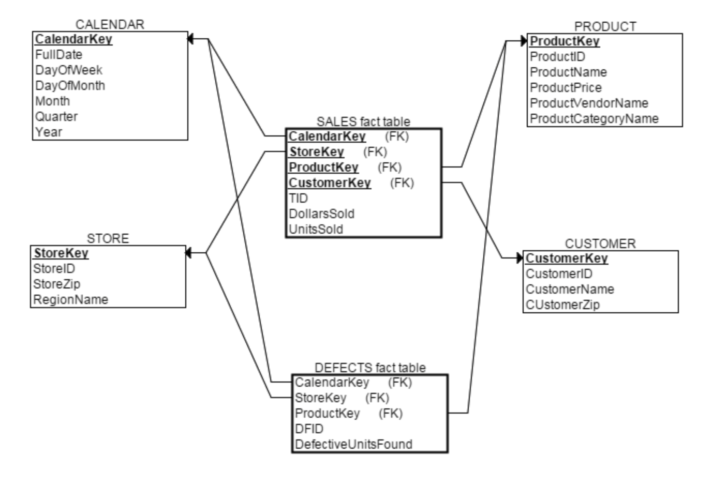

细节/聚集事实表
细节事实表(detailed fact tables)中每条记录表示单一事实，而聚集事实表(aggregated fact tables)中每条记录则聚合了多条事实。从表的字段上看，细节事实表通常有设置TID属性，而聚集事实表则无。

两种事实表各有优缺点，细节事实表查询灵活但是响应速度相对慢，而聚集事实表虽然提高了查询速度，但使查询功能受到一定限制。一个常见的做法是使用星座模型同时设置两种事实表(可含多个聚集事实表)。这种设计方法中，聚集事实表使用和细节事实表细节事实表的维度。如下维度建模方法采用星座模型综合了细节事实表和两种聚集事实表：

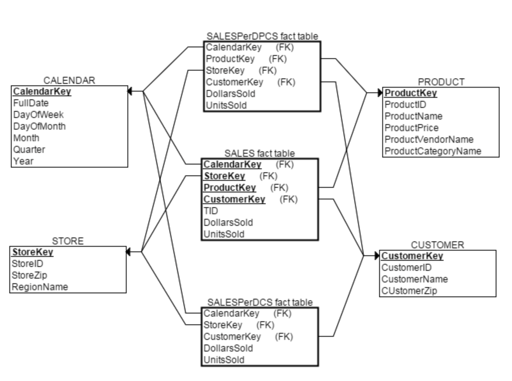

### 主题域怎么确定？

主题域需要在了解业务之后，根据业务实际情况进行相应的划分。

不同的主题域之间是相互隔离独立的，存在明显的边界。

### 主题域与主题的关系？

主题是主题域的子集，比如：电商主题域下，存在订单主题、商品主题等等。

可以理解为主题域下面的模块。

### 如何定义一个雪花模型 (有两张事实表)？

在雪花模型中，同样只能指定一张事实表。但是用户可以定义一张维表与另一张维表进行 JOIN 连结。

如果查询中包含两张事实表的 JOIN 连结，用户同样可以将一张事实表定义为维表，并不为这张较大的维表设置维表快照。

### MOLAP ROLAP HOLAP的区别和联系？

https://www.jianshu.com/p/d84307151c73

## 参考文档

[数据仓库多维数据模型设计](https://blog.csdn.net/zzq900503/article/details/78492505)

