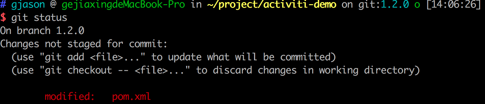
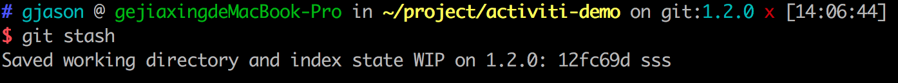
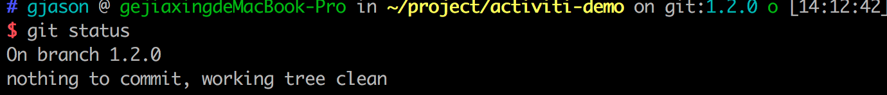
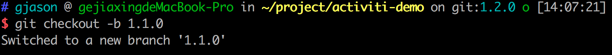
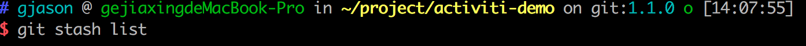
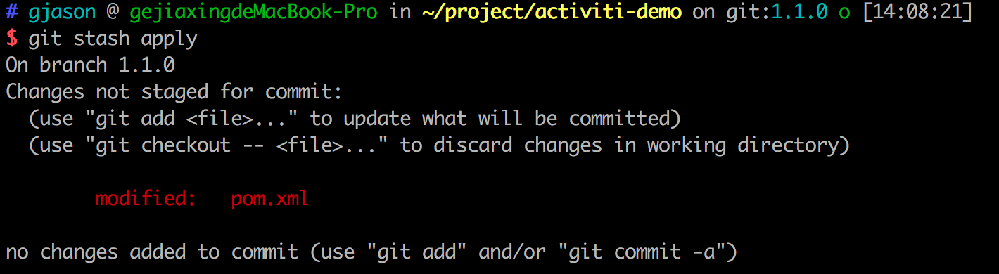
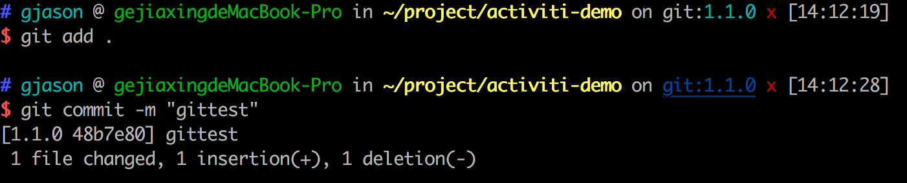

## 基础命令

Git官方文档地址：https://git-scm.com/docs/

### stash

#### git stash

将工作区中与上个commit提交点之后的修改内容，保存到暂存区，工作区恢复到与上个commit提交点一致。







```shell
# 直接保存到暂存区
git stash
# 自定义存储信息
git stash save '<message info>'
```

#### git stash list

显示保存进度的列表，`git stash` 可以执行多次

#### git stash pop

- `git stash pop` 恢复最新的记录到工作区。
- `git stash pop --index` 如果使用--index选项，则不仅恢复工作树的更改，还恢复索引的更改。当遇到冲突的时候，就会失败
- `git stash pop stash@{1}`恢复指定的记录到工作区。stash_id是通过`git stash list`命令得到的 
  通过`git stash pop`命令恢复记录后，**会删除当前记录。**

#### git stash apply

除了**不删除恢复的记录**之外，其余和`git stash pop` 命令一样。

#### git stash drop

删除一个存储的进度。如果不指定stash_id，则默认删除最新的存储进度。

```shell
git stash drop <stash_id>
```

#### git stash clear

删除所有存储的进度。

## 复杂场景实操

A用户把1.2.0分支删了，B本地拥有最新的1.2.0分支，这个时候，可以B将本地的分支代码Push到远程仓库，会自动创建1.2.0分支，同时，其他用户也可以在不修改的情况下拉取最新的1.2.0代码

- 同事在1.2.0 分支上，对其下某一文件进行修改，突然发现，自己的分支切错了，正确的分支应该是1.1.0 分支，他现在想把1.2.0下面的修改迁移到1.1.0下，而不在1.2.0下做任何提交。

我的解决方案：**使用 `git stash`**

在1.2.0分支上，将已经修改的数据使用 `git stash`，如果存在新建的文件，那么不要对其进行Git追踪，没有被Git追踪的文件在切分支的时候，会自动切过去的。


内容被存到暂存区后，我们切到 `1.1.0` 分支（注：演示中是由于`1.1.0`不存在，所以有 `-b`）



查看一下是否存在暂存信息



从暂存区恢复数据



这样就已经把数据迁移到 `1.1.0` 分支了，我们就可以在该分支下任意玩耍了



我们可以看看 `1.2.0`是否有影响，完全没有影响


**注：**

- 未被Git追踪文件，不用担心，因为Git还管不了你，直接切分支就可以了，这文件想在哪个分支提交，就在哪个分支提交
- 如果暂存区的数据需要删除

```shell
git stash drop <stash_id>
```

```shell
git stash pop <–index> <stash_id>

```

