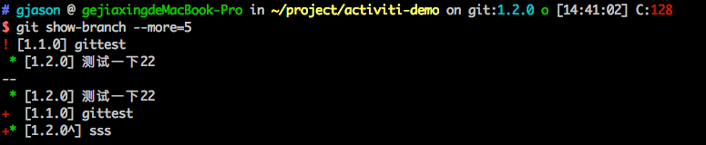
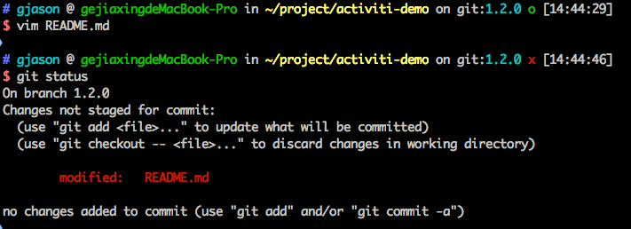
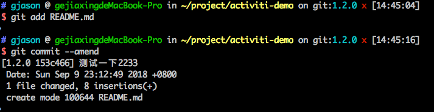
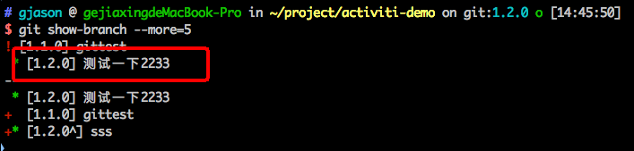

[TOC]

## Quick Start

### 初次运行Git

#### 配置提交作者信息

```shell
git config user.name [昵称或真名]
git config user.email [邮箱地址]
```

或者直接修改`.git`文件夹下的`config`文件

```shell
[user]
    name = [昵称或真名]
    email = [邮箱地址]
```

#### 配置全局提交者信息

```shell
git config --global user.name [昵称或真名]
git config --global user.email [邮箱地址]
```

#### 修改Git编辑器类型

默认是命令行工具的形式，Git也支持使用其他的编辑器方式，下面使用`VS Code`进行讲解：

1. 在`VS Code` 的命令面板中添加`code`命令支持（install code）
2. 从命令行，运行 `git config --global core.editor“code --wait”`
3. 运行 `git config --global -e` 并使用 `VS Code` 作为编辑器来配置 Git
4. 将以下内容添加到您的 Git 配置中，以使用VS Code作为比较差异的工具：

```bash
[diff]
    tool = default-difftool
[difftool "default-difftool"]
    cmd = code --wait --diff $LOCAL $REMOTE
```

可以试试以下命令，体验以下

- `git rebase HEAD~3 -i` do interactive rebase using VS Code
- `git commit` use VS Code for the commit message
- `git add -p` followed by `kbstyle(e)` for interactive add
- `git difftool <commit>^ <commit>` use VS Code as the diff editor for changes

#### 生成SSH秘钥

```shell
# github或者gitlib邮箱账户地址
ssh-keygen -t rsa -C ["邮箱地址"]
```

将电脑上的公钥与远程仓库进行绑定

本地会在上面的步骤中会生成一个id_rsa.pub（默认情况是这个名称），将该文件中的内容copy到远程仓库github或gitlib的settings的SSH配置选项中。

> Tittle名称自由发挥

#### 1、克隆工程

> 将远程的数据复制一份到本地

```shell
#【仓库copy地址】
git clone [git@rep.xx.com:zoeminghong/hello.git]
```

#### 2、本地新建Git工程

> 现在打算将本地的工程，放到Git仓库进行托管了，并且远程Git仓库已经创建了该项目的工程

```shell
#本地初始化工程，会生成一个.git文件
git init

#将本地的工程与远程仓库中的项目进行关联（不用关心项目名不一致的问题）
#此时本地工程与远程仓库已经建立了联系
git remote add origin [git@rep.xx.com:zoeminghong/hello.git]

#将本地所有文件添加到Git中，进行监管
git add .

#将内容提交 【提交注释】
git commit -m "[...]"

#将本地的内容同步到远程仓库中
git push -u origin master
```

### 关键词说明

- HEAD：代表始终指向最新提交记录点
- Index (索引)/ Stage：暂存区
- Remote：远程仓库
- 工作区：项目文件集合
- 显式引用：SHA1就代表显式引用
- 隐式引用：HEAD就代表隐式引用

## 基础命令

Git官方文档地址：https://git-scm.com/docs/

`说明`

[tag]：tag名称

[commit]：提交记录，SHA1记录点

[remote]：远程仓库名称

### add

将文件进行 Git 追踪，信息存储到暂存区

```shell
# 如果 git add .就是当前目录下的所有，包括子目录
git add [路径]
```

### commit

作为add操作的后续步骤，将数据真正意义上的被存储

```shell
git commit -m ["记录描述"]
```

**--author**：标记作者信息

```shell
git commit -m ["记录描述"] --author=["zoeminghong <617405347@qq.com>"]
```

**-a或者--all**：自动暂存所有未暂存的和未追踪的文件变化

```shell
git commit -a
```

**--amend**：修改最新提交（该提交还未push）









没有新增记录点，而是做修改

### mv

重命名文件

```shell
git mv [原文件名] [新文件名]
```

### log

查看提交信息

```shell
git log
# 查看指定文件的日志信息
git log [文件名]
# 查看提交范围中的提交信息
git log --abbrev-commit master~12..master~10
# 列举提交中所更改的文件以及每个更改的文件中有多少行做了改动
git log --stat master~12..master~10
# 显示一个提交信息
git log -1 [提交名]
# 输出提交引进的补丁或变更
git log -p [提交名]
```


```shell
# 在日志中回溯并找到内容相关联的整个历史记录
git log --follow [文件名]
```

比如：某个文件名称发生了变更，通过该命令就可以追溯原文件名的记录信息

### show

查看特定提交点的详细信息

```shell
# 显示最近一次提交点的信息
git show
# 显示指定提交点信息
git show 2b9f38ad714a191bdd854f3f2197e1b4e545a4e3
# 显示特定文件的信息
git show orgin/master:[fileName]
# 显示分支下的文件
git show [分支]:[文件名]
```


### rm

版本库中删除文件

**注：**在删除文件前，最好更新到最新，防止更新意外丢失

```shell
# 将文件从索引和工作目录中都删除
git rm [文件名]
# 由已暂存的文件转为未暂存的文件，但不会删除文件(标记为未追踪)
git rm --cached [文件名]
# 强制删除文件索引和工作目录中的文件
git rm -f [文件]
```

### reflog

可以查看所有分支的本地仓库的所有操作记录（reset操作和删除的commit记录）

**git reflog show**

显示所有的操作记录信息，是`git reflog`的默认操作。功能等同于`git log -g --abbrev-commit --pretty=oneline`

**范围限定查询**

```shell
git reflog HEAD@{2}
git reflog master@{one.week.ago}
```

**git reflog expire**

将制定日期前的所有reflog记录都移除


```shell
# 删除所有的reflog近路
git reflog expire --expire=all --all
```


**git reflog delete**

删除指定的reflog记录，与expire相似

```shell
git reflog delete master@{2}
```

**git reflog exists**

查询指定reflog记录是否存在

```shell
git reflog exists [ref]
```

### tag

我们在开发的时候，可能存在线上发布了一个版本，需要给这个版本代码打上一个标签，到时候可以方便回退到这个版本

```shell
# 创建tag 【tag名】
git tag [v1.0]
# 新建一个tag在指定commit
git tag [tag] [commit]
# 查看存在的tag
git tag
# 将tag更新到远程
git push origin --tags 
```

如果现在线上出现了一个BUG，急需回退到指定Tag节点，进行修复发布，这个时候怎么办呢

```shell
# 查看tag列表
git tag -l
# 根据tag切分支
git branch [new-branch-name] [tag-name]
```

### branch

分支

```shell
# 创建分支
git branch [1.2.1]
git branch [1.2.1] [指向指定commit SHA1]
# 查看分支
git branch
# 显示所有分支
git branch -a
# 显示远程追踪分支
git branch -r
# 删除分支
git branch -d [分支名]
# 新建一个分支，与指定的远程分支建立追踪关系
git branch --track [branch] [remote-branch]
# 建立追踪关系，在现有分支与指定的远程分支之间
git branch --set-upstream [branch] [remote-branch]
```

### checkout

切换分支

```shell
git checkout [分支名]
# 合并变更到目标分支
git checkout -m [目标分支]
# 创建并切换到新分支
git checkout -b [新分支名]
git checkout -b [1.2.1] [分支起始SHA1]
```

### diff

比较记录的内容的差异

```shell
# 工作区与索引之间的差异
$ git diff [hell.txt]

# 显示暂存区和上一个commit的差异【文件名】
$ git diff --cached [hell.txt]

# 显示工作区与当前分支最新commit之间的差异
$ git diff HEAD [hell.txt]

$ git diff [sha1] [sha2]

# 显示两次提交之间的差异【分支名】
$ git diff [first-branch]...[second-branch]
```

### stash

将当前的更新进行暂存，去做另一件事

**git stash**

将工作区中与上个commit提交点之后的修改内容，保存到暂存区，工作区恢复到与上个commit提交点一致。


```shell
# 直接保存到暂存区
git stash
# 自定义存储信息
git stash save '<message info>'
```

**git stash list**

显示保存进度的列表，`git stash` 可以执行多次

**git stash pop**

- `git stash pop` 恢复最新的记录到工作区。
- `git stash pop --index` 如果使用--index选项，则不仅恢复工作树的更改，还恢复索引的更改。当遇到冲突的时候，就会失败
- `git stash pop stash@{1}`恢复指定的记录到工作区。stash_id是通过`git stash list`命令得到的 
  通过`git stash pop`命令恢复记录后，**会删除当前记录。**

**git stash apply**

除了**不删除恢复的记录**之外，其余和`git stash pop` 命令一样。

**git stash drop**

删除一个存储的进度。如果不指定stash_id，则默认删除最新的存储进度。

```shell
git stash drop <stash_id>
```

**git stash clear**

删除所有存储的进度。

### merge

合并分支

```shell
# 如果当前分支为master，则会将dev上的数据合并到master上
git merge dev
```

> 改变的内容显示在<<<<<<<和=======之间，替代的内容在=======和>>>>>>>之间

### show-branch

提供提交历史图

```shell
# 限制显示10条记录
git show-branch --more=35 | tail -10
```

### rev-parse

将各类提交名转换为SHA1值

```shell
git rev-parse [提交名]
git rev-parse master~3
```

### blame

查看具体文件每行最新变更信息

```shell
# -L 显示行数
git blame -L 35 pom.xml
```

### bisect

当遇到数据或者提交信息被覆盖的时候，定位最近一次正常提交点的数据。先圈定出错范围，在通过二分法缩小范围。

一般当前HEAD为异常记录，通过

```shell
# 开始
git bisect start
git bisect bad
```

标记“好”

```shell
git bisect good 1.2.0-RC
# 查看已经标记的记录
git bisect log
```

最终确定位置后

```shell
# 由于bisect操作会在一个新分支上进行操作
git branch
# 切换回原先分支
git bisect reset
git branch
```

### reset

reset命令会将版本库和工作目录改变为已知的状态，只要没有人在版本库中某个分支的副本，你就可以修改该分支。**也就是提交记录只存在本地，未进行push**。

**--soft**

会将HEAD引用指向给定提交。索引和工作目录的内容保持不变。

```shell
git reset --soft HEAD
```

**--mixed**

会将HEAD引用指向给定提交。索引内容也跟着改变以符合给定提交的树结构。是`git reset` 默认模式

```shell
git reset --mixed HEAD
```

**--hard**

将HEAD引用指向给定提交。索引的内容也跟着改变以符合给定提交的树结构。此外，工作目录的内容也随之改变以反映给定提交表示的树的状态。

```shell
git reset --hard HEAD~2
```

### cherry-pick

将其他分支上的具体的commit点数据，merge到当前分支上，不修改当前已有的提交信息，只做新建。

```shell
# 将dev分支HEAD的祖父commit点，merge到当前分支
git cherry-pick dev~2

git cherrry-pick X..Z
```

> 只有指定的提交会取出并应用

### rebase

更改分支基点

```shell
git checkout topic
# master分支目前为止commit所有合并到 topic 分支，topic分支基点前移到master最新的commit
git rebase master
# 将feature分支上的与maint分支交联的地方，移植到master
git rebase --onto master maint^ feature
# 重新编排、编辑、删除、把多个提交合并为一个
git rebase -i master~3
```

### remote

远程仓库信息

```shell
# 与远程仓库进行绑定
git remote add [origin] [url]
# 查看远程仓库信息
git remote show origin
# 删除与远程仓库的绑定
git rm [origin]
# 删除你的本地版本库中哪些陈旧的远程追踪分支
git remote prune [origin]
# 更新代码
git remote update [group]
# 重命名版本库
git remote rename [origin] [new name]
# 修改远程仓库地址
git remote set-url [origin] [git url]
```

### push

推送本地更新到远程仓库

```shell
# 推送master分支
git push origin master
git push upstram new_dev
# 本地分支与远程分支绑定更新
git push upstram [local_new_dev]:[origin_new_dev]
# 删除远程仓库分支
git push upstram :[origin_dev]
git push origin --delete [branch]
```

## 场景使用

### 新建代码库

```shell
# 在当前目录新建一个Git代码库
$ git init

# 新建一个目录，将其初始化为Git代码库
$ git init [project-name]

# 下载一个项目和它的整个代码历史
$ git clone [url]
```

### 配置

Git的设置文件为`.gitconfig`，它可以在用户主目录下（全局配置），也可以在项目目录下（项目配置）。

```shell
# 显示当前的Git配置
$ git config --list

# 编辑Git配置文件
$ git config -e [--global]

# 设置提交代码时的用户信息
$ git config [--global] user.name "[name]"
$ git config [--global] user.email "[email address]"
```

### 增加/删除/重命名文件

```shell
# 添加指定文件到暂存区
$ git add [file1] [file2] ...

# 添加指定目录到暂存区，包括子目录
$ git add [dir]

# 添加当前目录的所有文件到暂存区
$ git add .

# 删除工作区文件，并且将这次删除放入暂存区
$ git rm [file1] [file2] ...

# 停止追踪指定文件，但该文件会保留在工作区
$ git rm --cached [file]

# 改名文件，并且将这个改名放入暂存区
$ git mv [file-original] [file-renamed]
```

### 代码提交

```shell
# 提交暂存区到仓库区
$ git commit -m [message]

# 提交暂存区的指定文件到仓库区
$ git commit [file1] [file2] ... -m [message]

# 提交工作区自上次commit之后的变化，直接到仓库区
$ git commit -a

# 提交时显示所有diff信息
$ git commit -v

# 使用一次新的commit，替代上一次提交# 如果代码没有任何新变化，则用来改写上一次commit的提交信息
$ git commit --amend -m [message]

# 重做上一次commit，并包括指定文件的新变化
$ git commit --amend [file1] [file2] ...
```

### 分支

```shell
# 列出所有本地分支
$ git branch

# 列出所有远程分支
$ git branch -r

# 列出所有本地分支和远程分支
$ git branch -a

# 新建一个分支，但依然停留在当前分支
$ git branch [branch-name]

# 新建一个分支，并切换到该分支
$ git checkout -b [branch]

#基于远程分支来创建分支
$ git checkout -b [branch] [remote branch]

# 新建一个分支，指向指定commit
$ git branch [branch] [commit]

# 新建一个分支，与指定的远程分支建立追踪关系
$ git branch --track [branch] [remote-branch]

# 切换到指定分支，并更新工作区
$ git checkout [branch-name]

# 建立追踪关系，在现有分支与指定的远程分支之间
$ git branch --set-upstream [branch] [remote-branch]

# 合并指定分支到当前分支
$ git merge [branch]

# 选择一个commit，合并进当前分支
$ git cherry-pick [commit]

# 删除分支
$ git branch -d [branch-name]

# 删除远程分支
$ git push origin --delete [branch-name]$ git branch -dr [remote/branch]
```

### 标签

```shell
# 列出所有tag
$ git tag

# 新建一个tag在当前commit
$ git tag [tag]

# 新建一个tag在指定commit
$ git tag [tag] [commit]

# 查看tag信息
$ git show [tag]

# 提交指定tag
$ git push [remote] [tag]

# 提交所有tag
$ git push [remote] --tags

# 新建一个分支，指向某个tag
$ git checkout -b [branch] [tag]
```

### 查看信息

```shell
# 显示有变更的文件
$ git status

# 显示当前分支的版本历史
$ git log

# 显示commit历史，以及每次commit发生变更的文件
$ git log --stat

# 显示某个文件的版本历史，包括文件改名
$ git log --follow [file]$ git whatchanged [file]

# 显示指定文件相关的每一次diff
$ git log -p [file]

# 显示指定文件是什么人在什么时间修改过
$ git blame [file]

# 显示暂存区和工作区的差异
$ git diff

# 显示暂存区和上一个commit的差异
$ git diff --cached [file]

# 显示工作区与当前分支最新commit之间的差异
$ git diff HEAD

# 显示两次提交之间的差异
$ git diff [first-branch]...[second-branch]

# 显示某次提交的元数据和内容变化
$ git show [commit]

# 显示某次提交发生变化的文件
$ git show --name-only [commit]

# 显示某次提交时，某个文件的内容
$ git show [commit]:[filename]

# 显示当前分支的最近几次提交
$ git reflog
```

### 远程同步

```shell
# 下载远程仓库的所有变动
$ git fetch [remote]

# 显示所有远程仓库
$ git remote -v

# 显示某个远程仓库的信息
$ git remote show [remote]

# 增加一个新的远程仓库，并命名
$ git remote add [shortname] [url]

# 取回远程仓库的变化，并与本地分支合并
$ git pull [remote] [branch]

# 上传本地指定分支到远程仓库
$ git push [remote] [branch]

# 强行推送当前分支到远程仓库，即使有冲突
$ git push [remote] --force

# 推送所有分支到远程仓库
$ git push [remote] --all
```

### 撤销

```shell
# 恢复暂存区的指定文件到工作区
$ git checkout [file]

# 恢复某个commit的指定文件到工作区
$ git checkout [commit] [file]

# 恢复上一个commit的所有文件到工作区
$ git checkout .

# 重置暂存区的指定文件，与上一次commit保持一致，但工作区不变
$ git reset [file]

# 重置暂存区与工作区，与上一次commit保持一致
$ git reset --hard

# 重置当前分支的指针为指定commit，同时重置暂存区，但工作区不变
$ git reset [commit]

# 重置当前分支的HEAD为指定commit，同时重置暂存区和工作区，与指定commit一致
$ git reset --hard [commit]

# 重置当前HEAD为指定commit，但保持暂存区和工作区不变
$ git reset --keep [commit]

# 新建一个commit，用来撤销指定commit# 后者的所有变化都将被前者抵消，并且应用到当前分支
$ git revert [commit]
```

### 打包

```shell
# 生成一个可供发布的压缩包
$ git archive
```

### 散列值翻译

```shell
git cat-file -p 2b9f38ad714a191bdd854f3f2197e1b4e545a4e3
```

返回当前散列值对应的数据

### 显示完整的散列

```shell
git rev-parse 3b8512d
```

使用tag也是可以的

```
git rev-parse V1.0
```

### 查看各自文件对应的散列

```shell
git ls-files --stage
```


### 配置文件

在Git中也存在配置文件的优先级层级关系，项目(--file)>全局(--global)>系统(--system)

`.git/config` > `~/.gitconfig` > `/etc/gitconfig`

设值

```shell
git config --global user.name "John"
```

查看整组配置文件

```shell
git config -l
```

移除设值

```shell
git config --global --unset user.name
```

注：低版本的Git，对`--unset`的顺序还有要求。

### 查看提交图

```shell
git log --graph --pretty=oneline --abbrev-commit
```

### 查看冲突未处理的文件列表

```shell
git ls-files -u
```

### 代码行数统计

统计某人的代码提交量，包括增加，删除：

```shell
git log --author="$(git config --get user.name)" --pretty=tformat: --numstat | gawk '{ add += $1 ; subs += $2 ; loc += $1 - $2 } END { printf "added lines: %s removed lines : %s total lines: %s\n",add,subs,loc }' -
```

统计某人一个月内的代码提交量，包括增加，删除：

```shell
git log --since=1.month.ago --author="$(git config --get user.name)" --pretty=tformat: --numstat | gawk '{ add += $1 ; subs += $2 ; loc += $1 - $2 } END { printf "added lines: %s removed lines : %s total lines: %s\n",add,subs,loc }' -
```

仓库提交者排名前 5（如果看全部，去掉 head 管道即可）：

```shell
git log --pretty='%aN' | sort | uniq -c | sort -k1 -n -r | head -n 5
```

仓库提交者（邮箱）排名前 5：这个统计可能不会太准，因为很多人有不同的邮箱，但会使用相同的名字

```shell
git log --pretty=format:%ae | gawk -- '{ ++c[$0]; } END { for(cc in c) printf "%5d %s\n",c[cc],cc; }' | sort -u -n -r | head -n 5
```

贡献者统计：

```shell
git log --pretty='%aN' | sort -u | wc -l
```

提交数统计：

```shell
git log --oneline | wc -l
```

> git log 参数说明：
>
> --author   指定作者
> --stat   显示每次更新的文件修改统计信息，会列出具体文件列表
> --shortstat    统计每个commit 的文件修改行数，包括增加，删除，但不列出文件列表：  
> --numstat   统计每个commit 的文件修改行数，包括增加，删除，并列出文件列表：
>
> -p 选项展开显示每次提交的内容差异，用 -2 则仅显示最近的两次更新
> ​       例如：git log -p  -2
> --name-only 仅在提交信息后显示已修改的文件清单
> --name-status 显示新增、修改、删除的文件清单
> --abbrev-commit 仅显示 SHA-1 的前几个字符，而非所有的 40 个字符
> --relative-date 使用较短的相对时间显示（比如，“2 weeks ago”）
> --graph 显示 ASCII 图形表示的分支合并历史
> --pretty 使用其他格式显示历史提交信息。可用的选项包括 oneline，short，full，fuller 和 format（后跟指定格式）
> ​       例如： git log --pretty=oneline ; git log --pretty=short ; git log --pretty=full ; git log --pretty=fuller
> --pretty=tformat:   可以定制要显示的记录格式，这样的输出便于后期编程提取分析
> ​       例如：git log --pretty=format:""%h - %an, %ar : %s""
> ​       下面列出了常用的格式占位符写法及其代表的意义。                   
> ​       选项       说明                  
> ​       %H      提交对象（commit）的完整哈希字串               
> ​       %h      提交对象的简短哈希字串               
> ​       %T      树对象（tree）的完整哈希字串                   
> ​       %t      树对象的简短哈希字串                    
> ​       %P      父对象（parent）的完整哈希字串               
> ​       %p      父对象的简短哈希字串                   
> ​       %an     作者（author）的名字              
> ​       %ae     作者的电子邮件地址                
> ​       %ad     作者修订日期（可以用 -date= 选项定制格式）                   
> ​       %ar     作者修订日期，按多久以前的方式显示                    
> ​       %cn     提交者(committer)的名字                
> ​       %ce     提交者的电子邮件地址                    
> ​       %cd     提交日期                
> ​       %cr     提交日期，按多久以前的方式显示              
> ​       %s      提交说明  
> --since  限制显示输出的范围，
> ​       例如： git log --since=2.weeks    显示最近两周的提交
> ​       选项 说明                
> ​       -(n)    仅显示最近的 n 条提交                    
> ​       --since, --after 仅显示指定时间之后的提交。                    
> ​       --until, --before 仅显示指定时间之前的提交。                  
> ​       --author 仅显示指定作者相关的提交。                
> ​       --committer 仅显示指定提交者相关的提交。

一些例子： git log --until=1.minute.ago // 一分钟之前的所有 log git log --since=1.day.ago //一天之内的log git log --since=1.hour.ago //一个小时之内的 log git log --since=`.month.ago --until=2.weeks.ago //一个月之前到半个月之前的log git

log --since ==2013-08.01 --until=2013-09-07 //某个时间段的 log   git blame
看看某一个文件的相关历史记录

例如：git blame index.html --date short

### 子模块

保留子组件的现有目录结构的完整性，故而git创造了类似于maven中的module一样的功能，来实现子模块的管理

打个比方：现在我有一个父工程A，其工程路径下面有五个子工程BCDEF，按照往常是要`git clone` 6个工程才可以完全下载成功，而且工程与工程之间的路径关系也不知道。现在有了gitmodules就可以直接下载A工程就可以了，其他的5个子工程都会自动下载。

文件.gitmodules存放在父工程根目录下

```xml
[submodule "others/B"]
	path = others/B
	url = https://rep.XXX.com/crm/B.git
[submodule "sources/C"]
	path = sources/C
	url = https://rep.XXX.com/crm/C.git
[submodule "sources/D"]
	path = sources/D
	url = https://rep.XXX.com/crm/D.git
.....
```

添加子模块

```shell
git submodule add [远程仓库地址] [相对于父模块的相对路径]
```

注：

直接手动更改gitmodule文件是没有用的哦

远程仓库地址要先于子模块之前准备好

子模块的名称是可以与[相对于父模块的相对路径]不一致的

创建完成以后会生成`.gitmodules`与`.gitattributes`这两个文件

`.gitmodules`和`.git/config`保存着子模块的信息

从远程仓库获取所有模块数据

```shell
#方式一
git clone --recursive [远程仓库地址]
#方式二
git clone [远程父仓库地址]
cd [父模块路径]
git submodule init
git submodule update
或者
git submodule update --init --recursive

cd [目标submodule]
git branch -a
git fetch origin [remote branch:remote branch] [new local branch:new local branch]
git checkout [new local branch]
```

删除子模块功能

先清空`.gitmodules`中的内容

再执行文件的删除

————

其他命令

```shell
# .gitmodules中子模块的内容更新到.git/config中
git submodule init
```

[gitmodules参考](https://git-scm.com/docs/gitmodules)

### 关闭issue

**格式**`Fixes #45`，45是issue的ID，在相应的issue的链接地址就有。

可以关闭issue的关键字：

- close
- closes
- closed
- fix
- fixes
- fixed
- resolve
- resolves
- resolved

**不同的仓库中关闭issue**

**格式**`close username/repository#issue_number`

**关闭多个issues**

**格式**`closes #34, closes #23, and closes example_user/example_repo#42`

### Fork&Pull Request

```shell
# 1、目标仓库A 页面 Fork
# 2、git clone 在自己仓库的Fork代码到本地
# 3、绑定数据源
git remote add upstream [fork源的远程仓库地址]
# 4、更新分支代码
git pull upstream master
# 5、commit&push到自己的仓库
git push origin master
# 6、pull request
# 7、等待对方同意
```

### git停留在writing objects

```shell
git config --global http.postBuffer 524288000
```

> http.postBuffer默认上限为1M,上面的命令是把git的配置里http.postBuffer的变量改大为500M

### 文件大,上传慢

```shell
git remote set-url origin [你的ssh地址]
```

> 把远程仓库的上传由原来的HTTPS改为SSH上传，github在国内本身就慢，还可能被dns污染 , 因此推荐使用SSH上传

### 设置别名

使用Git的过程中存在一些命令比较复杂或者说比较长的情况，Git提供了使用别名的方式帮助解决这个问题。

```shell
git config --global alias.show-graph 'log --graph --abbrev-commit --pretty=online'
```

例子中只需命令行执行`git show-graph`，即可实现 `git log --graph --abbrev-commit --pretty=online`

### 文件误删恢复

**文件索引已被删除**

```shell
git rm --cache [data]
# 文件进行追踪操作
git add [data]
```

**文件已被删除**

```shell
git rm [data]
# 恢复当前提交点中data文件
git checkout HEAD -- [data]
```

### `.gitignore`

语法说明

| 符号                    | 说明                                           | 示例     |
| ----------------------- | ---------------------------------------------- | -------- |
| #                       | 用于开头，表示注释                             | `# 说明` |
| 字面文字                | 匹配文字文件，将其排除                         |          |
| 目录名由反斜线（/）标记 | 匹配同名的目录和子目录，但不匹配文件或符号链接 |          |
| *                       | 通配符，模糊匹配                               | *.java   |
| 起始的感叹号！          | 取反作用                                       |          |

### 相对提交名

`^`符号用来选择不同的父提交。给定一个提交C，`C^1`表示第一个父提交，`C^2`表示第二个父提交

`~`符号用于返回父提交之前并选择上一代提交。给定一个提交C，`C~1`表示第一个父提交，`C~`表示第一个祖父提交，可以通过0开始计数表示，HEAD就是0，HEAD的父提交，就是1。

### 定位冲突文件

```shell
# 查看未合并的文件
git status
# 或者
git ls-files -u

#查看变更的确切来源和原因
# merge 只显示跟产生冲突的文件相关的提交
# left-right 如果提交来自合并的左边则显示<
# p 显示提交消息和每一个提交相关联的补丁
git log --merge --left-right -p [文件]
```

### 终止合并

```shell
# 把工作目录和索引都还原到git merge命令之前
git reset --hard HEAD
# 要中止或它已经结束后放弃
git reset --hard ORIG_HEAD
```

### 删除远程分支追踪

```shell
git branch -r -d origin/dev
```

## 复杂场景实操

#####A用户把1.2.0分支删了，B本地拥有最新的1.2.0分支

这个时候，可以B将本地的分支代码Push到远程仓库，会自动创建1.2.0分支，同时，其他用户也可以在不修改的情况下拉取最新的1.2.0代码

##### 同事在1.2.0 分支上，对其下某一文件进行修改，突然发现，自己的分支切错了，正确的分支应该是1.1.0 分支，他现在想把1.2.0下面的修改迁移到1.1.0下，而不在1.2.0下做任何提交。

我的解决方案：**使用 `git stash`**

在1.2.0分支上，将已经修改的数据使用 `git stash`，如果存在新建的文件，那么不要对其进行Git追踪，没有被Git追踪的文件在切分支的时候，会自动切过去的。


内容被存到暂存区后，我们切到 `1.1.0` 分支（注：演示中是由于`1.1.0`不存在，所以有 `-b`）


查看一下是否存在暂存信息


从暂存区恢复数据


这样就已经把数据迁移到 `1.1.0` 分支了，我们就可以在该分支下任意玩耍了


我们可以看看 `1.2.0`是否有影响，完全没有影响


**注：**

- 未被Git追踪文件，不用担心，因为Git还管不了你，直接切分支就可以了，这文件想在哪个分支提交，就在哪个分支提交
- 如果暂存区的数据需要删除

```shell
git stash drop [stash_id]
```

```shell
git stash pop [–index] [stash_id]
```

##### 当前`1.2.0`分支上做了修改，但是拉取代码会出现冲突问题。

**如果没有commit，**可以通过stash避免这个问题

```shell
#将当前修改进行暂存起来
git stash

#获取最新的远程仓库代码
git pull

#恢复暂存的内容
git stash pop
```

**如果已经commit**，才发现冲突问题

```shell
# 获取远端库最新信息 【分支名称】
git fetch origin [master]

# 做比较
git diff [本地分支名] origin/[远程分支名]

# 拉取最新代码，同时会让你merge冲突
git pull
```

**方法2**

```shell
# 获取最新代码到tmp分支上 [远程的分支:本地分支]
git fetch origin [master:tmp]

# 当前分支与tmp进行比较
git diff tmp

# 修改冲突部分，进行本地commit操作
git add .

git commit -m "[...]"

# 将tmp中内容合并到当前分支中
git merge tmp

# 删除分支
git branch -d tmp
```

##### 如何批量删除untracked更改

```shell
# 只删除所有untracked的文件
git clean -df
```

## Tips

- 分支下不存在`track`的内容，则该分支会被`Git`无视，无法通过 `git branch` 查到
