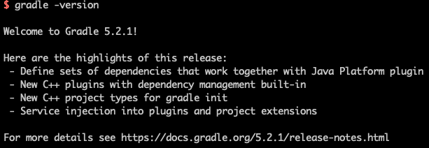

# Gradle

Gradle 是一款比 Maven 更加强大的 JVM 包管理工具。如今很多国际大公司都已经从 Maven 迁移到 Gradle，比如：Facebook、Google。

## 安装

### Mac

下载地址：https://gradle.org/releases/

1. 选择  `binary-only` ，等待下载
2. `vim .bash_profile`

```txt
JAVA_HOME=/Library/Java/JavaVirtualMachines/jdk1.8.0_121.jdk/Contents/Home
GRADLE_HOME=/Users/gjason/installapp/gradle-5.2.1
PATH=$JAVA_HOME/bin:$GRADLE_HOME/bin:$PATH
export JAVA_HOME
export GRADLE_HOME
export GRADLE_USER_HOME=/Users/gjason/.gradle
export PATH

```

3. 校验

```shell
gradle -version
```



## 使用

### Gradle Wrapper

`Gradle Wrapper` 是一个脚本文件存在于项目中。当本机没有安装相应版本的 Gradle 时，`Gradle Wrapper`  提供自动下载功能。在完成安装之后，`gradlew` 相应的命令可以正常使用了。

#### 设置 Gradle Wrapper

方法一：

```shell
gradle wrapper --gradle-version 5.2.1
```

方法二：

直接编辑`{project dir}/gradle/wrapper/gradle-wrapper.properties`文件来修改版本。

```properties
distributionBase=GRADLE_USER_HOME
distributionPath=wrapper/dists
distributionUrl=https\://services.gradle.org/distributions/gradle-5.2.1-bin.zip
zipStoreBase=GRADLE_USER_HOME
zipStorePath=wrapper/dists
```

使用 `gradlew -v` 进行确认。

## Q&A

##### 使用 `./gradlew` 命令，发现会重新下载 gradle，这是怎么回事呢？如何进行自定义呢？

使用哪个 gradle 跟 `{project dir}/gradle/wrapper/gradle-wrapper.properties` 有关。

```properties
distributionBase=GRADLE_USER_HOME
distributionPath=wrapper/dists
distributionUrl=https\://services.gradle.org/distributions/gradle-5.2.1-bin.zip
zipStoreBase=GRADLE_USER_HOME
zipStorePath=wrapper/dists
```

`distributionUrl` 就是当前项目使用的 gradle 版本，不同项目可以指定不同的 gradle 使用。

IDE 打开工程时，会先读取`gradle-wrapper.properties` 文件，确定需要的是哪个版本的 gradle  ,然后会在保存 gradle 的文件夹`GRADLE_USER_HOME`  寻找指定版本的 gradle，若不存当前版本的 gradle，会进行该版本的 gradle 下载。

**本地路径示例：**

```properties
distributionUrl=file:/Users/gjason/app/gradle-5.2.1-bin.zip
```