> 以下都是基于MacOS下的操作进行说明

## 快捷键

| 快捷键            | 说明                                                         |
| ----------------- | ------------------------------------------------------------ |
| option+F7         | 获取当前选中的方法、类、字段被用到的地方                     |
| command+E         | 最近打开的文件                                               |
| command+option+↔  | 上一次编辑的位置                                             |
| command+option+U  | 查看类或方法的继承关系                                       |
| command+N         | 生成代码（getter、setter、构造函数、hashCode/equals,toString） |
| command+option+T  | 包围代码（使用if..else, try..catch, for, synchronized等包围选中的代码） |
| command+/         | 注释/取消注释与行注释                                        |
| command+option+/  | 注释/取消注释与块注释                                        |
| shift+option+光标 | 多行编辑                                                     |
|                   |                                                              |
|                   |                                                              |

## 神奇的快捷键

### 神奇的Inject language

如果你使用IDEA在编写JSON字符串的时候，然后要一个一个\去转义双引号的话，就实在太不应该了，又烦又容易出错。在IDEA可以使用Inject language帮我们自动转义双引号。 

先将焦点定位到双引号里面，使用`option+enter`快捷键弹出`inject language`视图，并选中 **Inject language or reference**。 

选择后,切记，要直接按下enter回车键，才能弹出inject language列表。在列表中选择 json组件。 

选择完后。鼠标焦点自动会定位在双引号里面，这个时候你再次使用`option+enter`就可以看到 

选中`Edit JSON Fragment`并回车，就可以看到编辑JSON文件的视图了。

可以看到IDEA确实帮我们自动转义双引号了。如果要退出编辑JSON信息的视图，只需要使用`command+F4`快捷键即可。

### 高效添加`{}`

例如在if语句中，需要在末尾添加`{}`，这个时候手打明显不是很有效率的行为。

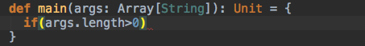

你可以试试`command+shift+enter`，奇迹就发生了

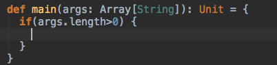

### 强大的Symbol

如果你依稀记得某个方法名字几个字母，你可以使用Symbol来帮你查找，使用`command+option+O`组合键

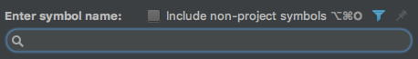

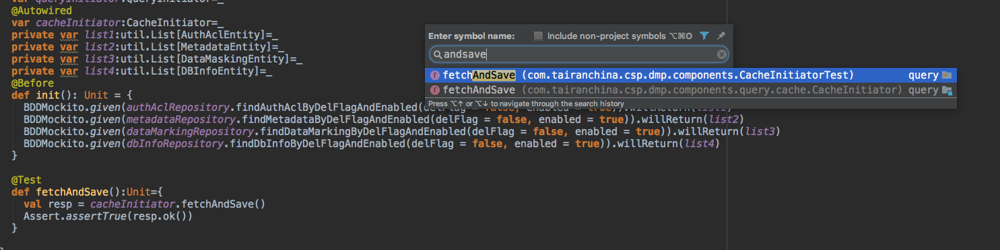

如果你记得某个业务类里面有某个方法，那也可以使用首字母找到类,然后加个`.`，再输入方法名字也是可以的

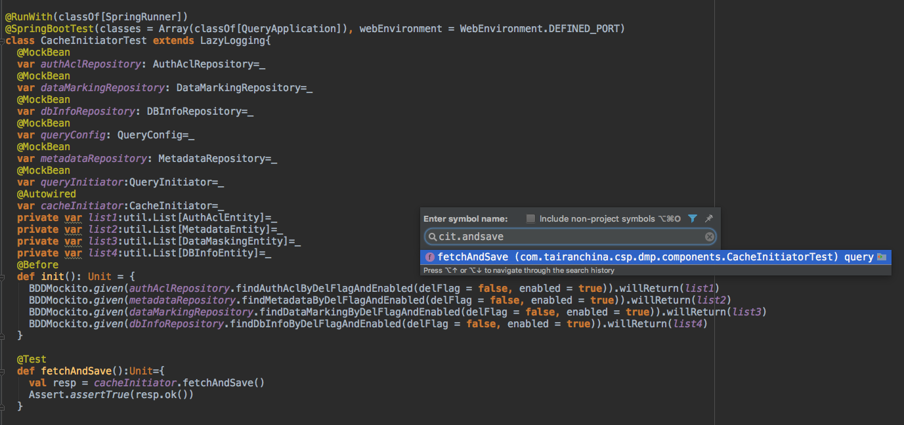

### 快速查找文件/路径

使用`command+shift+O`

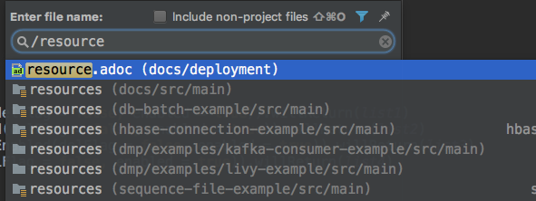

### Not Null

在if语句中一般都会遇到判断某个字段的为空场景，非空代码快速生成心法

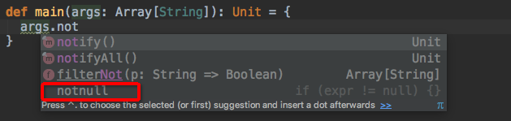

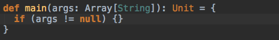

是不是觉得之前写代码的时候咋都没看到过。

### 生成单元测试类

首先需要光标选中类名，`option+enter` 

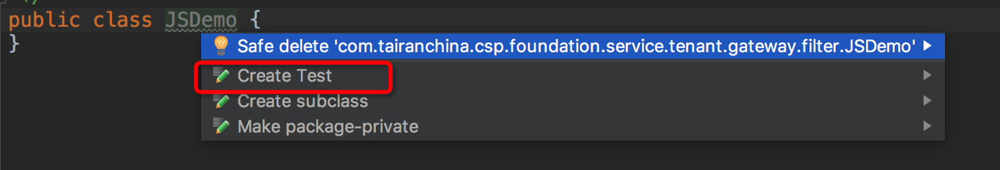

或者`option+shift+T`

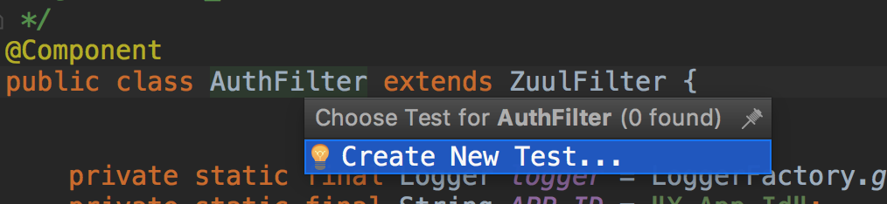

### 显示类继承关系图

选中查看的对象或类，使用`shift+option+command+U`组合键

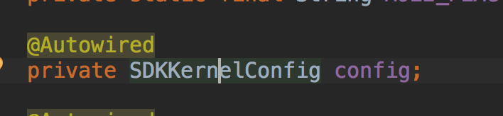

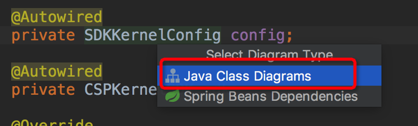

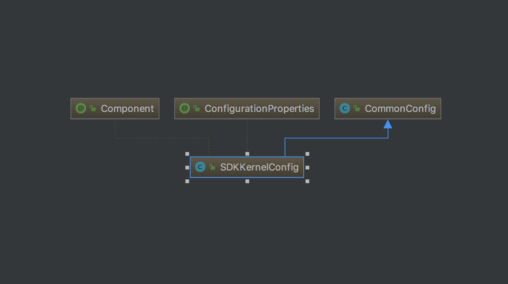

- **蓝色实线箭头**是指继承关系
- **绿色虚线箭头**是指接口实现关系

右键

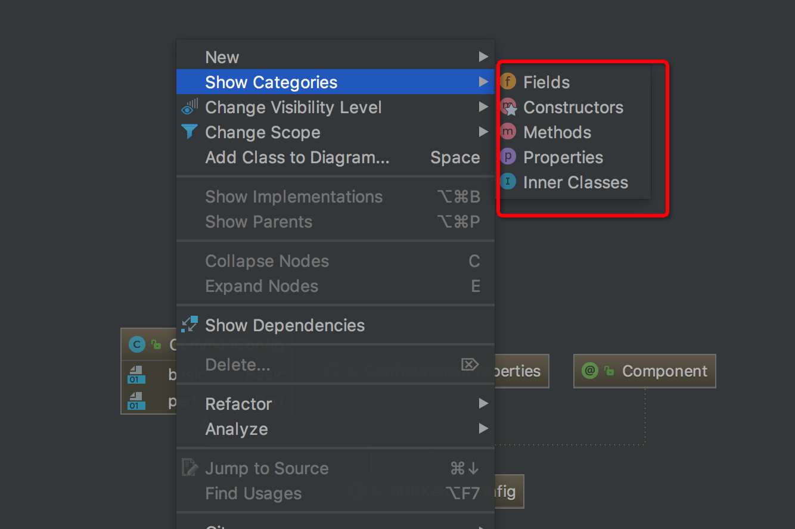

或者直接工具栏点击如下的选项

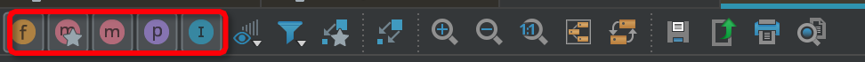

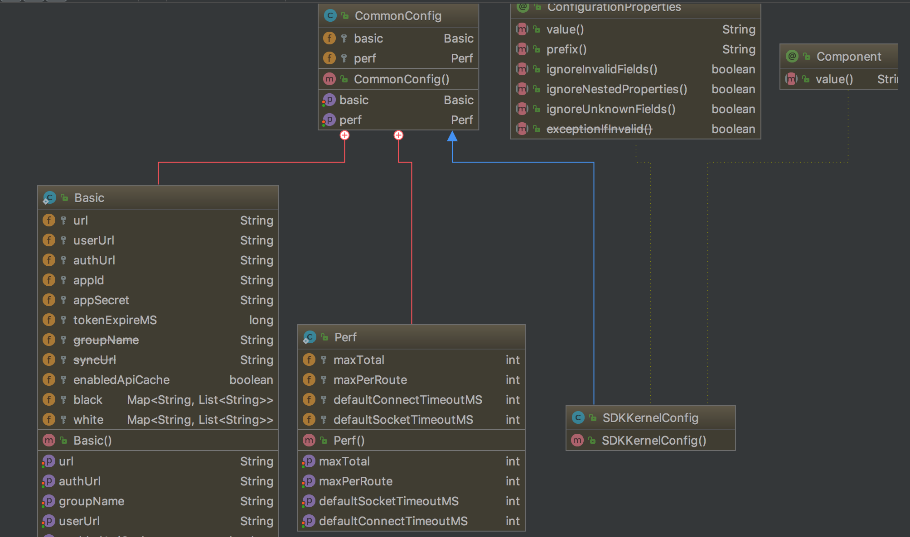

好神奇，有木有。

**拓展连接**：https://www.cnblogs.com/deng-cc/p/6927447.html