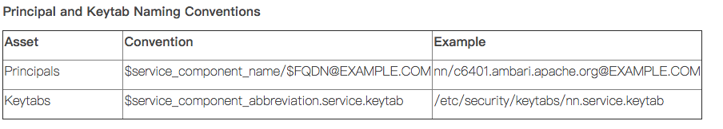

https://blog.csdn.net/wulantian/article/details/42418231

由于被Long-term Key加密的数据包不能用于网络传送，所以我们使用另一种Short-term Key来加密需要进行网络传输的数据。由于这种Key只在一段时间内有效，即使被加密的数据包被黑客截获，等他把Key计算出来的时候，这个Key早就已经过期了。

KDC维护着一个存储着该Domain中所有帐户的**Account Database**（一般地，这个Account Database由**AD**来维护），也就是说，他知道属于每个Account的名称和派生于该Account Password的**Master Key**。

而用于Client和Server相互认证的**SServer-Client**就是由KDC分发。


KDC生成Session Key规则：使用**Client的Master Key**和**自己的Master Key**对生成的Session Key进行加密

| 命令                       | 说明                                                         |
| -------------------------- | ------------------------------------------------------------ |
| `/usr/bin/ftp`             | 文件传输协议程序                                             |
| `/usr/bin/kdestroy`        | 销毁 Kerberos 票证                                           |
| `/usr/bin/kinit`           | 获取并缓存 Kerberos 票证授予票证                             |
| `/usr/bin/klist`           | 显示当前的 Kerberos 票证                                     |
| `/usr/bin/kpasswd`         | 更改 Kerberos 口令                                           |
| `/usr/bin/ktutil`          | 管理 Kerberos 密钥表文件                                     |
| `/usr/bin/rcp`             | 远程文件复制程序                                             |
| `/usr/bin/rdist`           | 远程文件分发程序                                             |
| `/usr/bin/rlogin`          | 远程登录程序                                                 |
| `/usr/bin/rsh`             | 远程 Shell 程序                                              |
| `/usr/bin/telnet`          | 基于 Kerberos 的 `telnet` 程序                               |
| `/usr/lib/krb5/kprop`      | Kerberos 数据库传播程序                                      |
| `/usr/sbin/gkadmin`        | Kerberos 数据库管理 GUI 程序，用于管理主体和策略             |
| `/usr/sbin/gsscred`        | 管理 gsscred 表项                                            |
| `/usr/sbin/kadmin`         | 远程 Kerberos 数据库管理程序（运行时需要进行 Kerberos 验证），用于管理主体、策略和密钥表文件 |
| `/usr/sbin/kadmin.local`   | 本地 Kerberos 数据库管理程序（运行时无需进行 Kerberos 验证，并且必须在主 KDC 上运行），用于管理主体、策略和密钥表文件 |
| `/usr/sbin/kclient`        | Kerberos 客户机安装脚本，有无安装配置文件皆可使用            |
| `/usr/sbin/kdb5_ldap_util` | 为 Kerberos 数据库创建 LDAP 容器                             |
| `/usr/sbin/kdb5_util`      | 创建 Kerberos 数据库和存储文件                               |
| `/usr/sbin/kgcmgr`         | 配置 Kerberos 主 KDC 和从 KDC                                |
| `/usr/sbin/kproplog`       | 列出更新日志中更新项的摘要                                   |

| 进入kadmin             | kadmin.local/kadmin                                          |
| ---------------------- | ------------------------------------------------------------ |
| 创建数据库             | kdb5_util create -r JENKIN.COM -s                            |
| 启动kdc服务            | service krb5kdc start                                        |
| 启动kadmin服务         | service kadmin start                                         |
| 修改当前密码           | kpasswd                                                      |
| 测试keytab可用性       | kinit -k -t /var/kerberos/krb5kdc/keytab/root.keytab root/master1@JENKIN.COM |
| 查看keytab             | klist -e -k -t /etc/krb5.keytab                              |
| 清除缓存               | kdestroy                                                     |
| 通过keytab文件认证登录 | kinit -kt /var/run/cloudera-scm-agent/process/***-HIVESERVER2/hive.keytab hive/node2 |
|                        |                                                              |
| kadmin模式下：         |                                                              |
| 生成随机key的principal | addprinc -randkey root/master1@JENKIN.COM                    |
| 生成指定key的principal | Addprinc -pw **** admin/admin@JENKIN.COM                     |
| 查看principal          | listprincs                                                   |
| 修改admin/admin的密码  | cpw -pw xxxx admin/admin                                     |
| 添加/删除principle     | addprinc/delprinc admin/admin                                |
| 直接生成到keytab       | ktadd -k /etc/krb5.keytab host/master1@JENKIN.COM            |
| 设置密码策略(policy)   | addpol -maxlife "90 days" -minlife "75 days" -minlength 8 -minclasses 3 -maxfailure 10 -history 10 user |
| 添加带有密码策略的用户 | addprinc -policy user hello/admin@HADOOP.COM                 |
| 修改用户的密码策略     | modprinc -policy user1 hello/admin@HADOOP.COM                |
| 删除密码策略           | delpol [-force] user                                         |
| 修改密码策略           | modpol -maxlife "90 days" -minlife "75 days" -minlength 8 -minclasses 3 -maxfailure 10 user |



[Kerberos定制化模版](https://docs.hortonworks.com/HDPDocuments/Ambari-2.5.0.3/bk_ambari-security/content/customizing_the_attribute_template.html)

[管理管理员凭证](https://docs.hortonworks.com/HDPDocuments/Ambari-2.5.0.3/bk_ambari-security/content/managing_admin_credentials.html)


### KDC服务器命令

- 在 KDC 服务器上作为 root 用户启动 kadmin 工具。

```shell
#/usr/krb5/sbin/kadmin.local
kadmin.local:
```

- 为 LDAP 服务器创建 ldap/*serverhostname* 主体。*serverhostname* 是将运行 LDAP 服务器的标准 DNS 主机。

```shell
kadmin.local: addprinc ldap/plankton.austin.ibm.com
WARNING: no policy specified for "ldap/plankton.austin.ibm.com@ud3a.austin.ibm.com":
Re-enter password for principal "ldap/plankton.austin.ibm.com@ud3a.austin.ibm.com":
Principal "ldap/plankton.austin.ibm.com@ud3a.austin.ibm.com" created.
kadmin.local:
```

- 为已创建的服务器主体创建密钥表。LDAP 服务器将在服务器启动期间使用该密钥。要创建名为 slapd_krb5.keytab 的密钥表：

```shell
kadmin.local: ktadd -k /etc/security/slapd_krb5.keytab ldap/plankton.austin.ibm.com
Entry for principal ldap/plankton.austin.ibm.com with kvno 2,
encryption type Triple DES cbc mode with HMAC/sha1 added to keytab
WRFILE:/etc/security/slapd_krb5.keytab.
Entry for principal ldap/plankton.austin.ibm.com with kvno 2,
encryption type ArcFour with HMAC/md5 added to keytab WRFILE:/etc/security/slapd_krb5.keytab.
Entry for principal ldap/plankton.austin.ibm.com with kvno 2,
encryption type AES-256 CTS mode with 96-bit SHA-1 HMAC added to keytab
WRFILE:/etc/security/slapd_krb5.keytab.
Entry for principal ldap/plankton.austin.ibm.com with kvno 2,
encryption type DES cbc mode with RSA-MD5 added to keytab WRFILE:/etc/security/slapd_krb5.keytab.
kadmin.local:
```

https://www.ibm.com/support/knowledgecenter/zh/ssw_aix_71/com.ibm.aix.security/krb_bind_principal.htm


`krb5.conf`

```
[libdefaults]
     default_realm = YOUR_DOMAIN.COM
     default_tkt_enctypes = DES-CBC-CRC
     default_tgs_enctypes = DES-CBC-CRC
     ccache_type = 2
[realms]
     YOUR_DOMAIN.COM = {
     kdc = kdc.your_domain.com:88
     admin_server = admin.your_domain.com:749
     }
[domain_realm]
     .your_domain.com = YOUR_DOMAIN.COM
     your_domain.com = YOUR_DOMAIN.COM
[logging]
     kdc = FILE:/var/adm/krb5kdc.log
     admin_server = FILE:/var/log/kadmin.log
     default = FILE:/var/log/krb5lib.log
$>cat /var/kerberos/krb5kdc/kdc.conf
[kdcdefaults]
    kdc_ports = 88
    kdc_tcp_ports = 88

[realms]
    YOUR_DOMAIN.COM = {
        kdc_ports = 88
        admin_keytab = /etc/kadm5.keytab
        database_name = /var/kerberos/krb5kdc/principal
        acl_file = /var/kerberos/krb5kdc/kadm5.acl
        key_stash_file = /var/kerberos/krb5kdc/stash
        max_life = 10h 0m 0s
        max_renewable_life = 7d 0h 0m 0s
        master_key_type = des3-hmac-sha1
        supported_enctypes = arcfour-hmac:normal des3-hmac-sha1:normal 
des-cbc-crc:normal des:normal des:v4 des:norealm des:onlyrealm des:afs3
        default_principal_flags = +preauth
    }
```

Krb5.conf文件会被复制到集群的各个节点

`kadm5.acl`

```
*/admin@YOUR_DOMAIN.COM  *
```