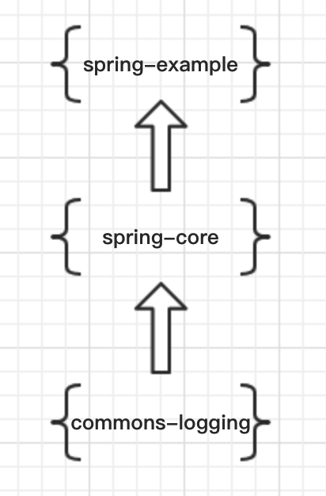
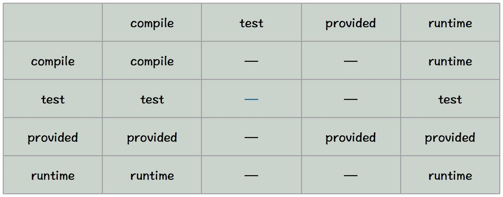

# Maven

Java、Scala编程语言的包管理工具。

## 包信息

下方是一个简单的pom文件包信息

```xml
<groupId>org.son.nexus</groupId> // 项目隶属的实际项目名
<artifactId>nexus-indexer</artifactId> // 实际项目中的一个maven项目模块名称
<version>2.0.0</version> // 版本号
<packaging>jar</packaging> // 当前maven项目打包的方式，默认为jar
```
groupId、artifactId、version为基本坐标，packaging为打包结果文件类型。

> 以上的配置将会获得一个`<artifactId>-<version>.<packaging>`格式的包//nexus-indexer-2.0.0.jar。jar包在仓库中的路径规律：artifactId/groupId/version/artifactId-version.packaging

packaging常用如下三种：

- jar：文件格式为jar
- war：文件格式为war
- pom：文件格式为pom，一般用作依赖父工程或者构建工程信息

### classifier

用于定义构建输出的一些附属的构建，classifier是不能直接定义的，只能存在附加的构件（插件）时，才能（必须）添加。在包名上也会有所体现（e.g.`nexus-indexer-2.0.0-javadoc.jar`）

**e.g.**

```xml
 <dependency>
     <groupId>org.apache.phoenix</groupId>
     <artifactId>phoenix-client</artifactId>
     <classifier>client</classifier>
 </dependency>
```

### 传递性依赖

依赖的传递性，类似于Java中的继承，Maven默认就是支持的。

**什么是传递性依赖？**




比如一个`spring-example`项目为例，`spring-example`有一个`compile`范围的`spring-core`依赖，`spring-core`有一个`compile`范围的`commons-logging`依赖，那么`commons-logging`也会被作为`spring-example`的`compile`的范围依赖，`commons-logging`是`spring-example`的一个传递性

> scope最好设为compile

**传递性依赖存在一个问题：**工程中同时存在相同名称的不同版本依赖，就可能出现依赖冲突问题。

#### 可选依赖（optional）

继续上图的例子，如果`spring-core`不希望其`commons-logging`依赖不被`spring-example`使用，那么就可以使用`optional`实现。

true 不会传递，false会传递（默认）

```xml
<dependency>
    <groupId>mysql</groupId>
    <artifactId>mysql-connector-java</artifactId>
    <version>5.1.10</version>
    <optional>true</optional>
</dependency>
```

**思考：**

- 与dependencyManage的区别？

- 与exclusion的区别？

### 依赖范围（scope）

- **compile:**编译依赖范围。如果没有指定，就会默认使用该依赖范围。使用此依赖范围的Maven依赖，对于编译、测试、运行三种classpath都有效。典型的例子是spring-core,在编译、测试和运行的时候都需要使用该依赖。 
- **test:** 测试依赖范围。使用次依赖范围的Maven依赖，只对于测试classpath有效，在编译主代码或者运行项目的使用时将无法使用此依赖。典型的例子是Jnuit,它只有在编译测试代码及运行测试的时候才需要，该依赖范围是不可传递的。
- **provided:**已提供依赖范围。使用此依赖范围的Maven依赖，对于编译和测试classpath有效，但在运行时候无效。典型的例子是servlet-api,编译和测试项目的时候需要该依赖，但在运行项目的时候，由于容器以及提供，就不需要Maven重复地引入一遍，该依赖范围是不可传递的。 
- **runtime:**运行时依赖范围。使用此依赖范围的Maven依赖，对于测试和运行classpath有效，但在编译主代码时无效。典型的例子是JDBC驱动实现，项目主代码的编译只需要JDK提供的JDBC接口，只有在执行测试或者运行项目的时候才需要实现上述接口的具体JDBC驱动。
-  **system:**系统依赖范围。该依赖与三种classpath的关系，和provided依赖范围完全一致，但是，使用system范围的依赖时必须通过systemPath元素显示地指定依赖文件的路径。由于此类依赖不是通过Maven仓库解析的，而且往往与本机系统绑定，可能构成构建的不可移植，因此应该谨慎使用。systemPath元素可以引用环境变量

 ```xml
<systemPath>${java.home}/lib/rt.jar</systemPath> 
<scope>system</scope>
 ```



从上图中，我们可以发现这样的规律：

- 当第二直接依赖的范围是compile的时候，传递性依赖的范围与第一直接依赖的范围一致； 
- 当第二直接依赖的范围是test的时候，依赖不会得以传递； 
- 当第二直接依赖的范围是provided的时候，只传递第一直接依赖范围也为provided的依赖，切传递依赖的范围同样为provided; 
- 当第二直接依赖的范围是runtime的时候，传递性依赖的范围与第一直接依赖的范围一致，但compile列外，此时传递性依赖范围为runtime.

### 排除依赖（exclusion）

在依赖传递的时候，会存在相同的文件不同版本的存在，从而导致多个依赖冲突，为了解决这个问题，需要去除其中某一个版本的依赖。或者应用中存在某一个版本的依赖存在BUG，需要通过升级的方式解决，那也可以通过，排除旧版本依赖，从而再添加新版本的依赖。

```xml
<dependencies>
    <dependency>
        <groupId>com.juv</groupId>
        <artifactId>project-b</artifactId>
        <version>1.0.0</version>
        <exclusions>
            <exclusion>//可以有多个
                <groupId>com.juv</groupId>
                <artifactId>project-c</artifactId>
            </exclusion>
        </exclusions>
    </dependency>
    <dependency>
        <groupId>com.juv</groupId>
        <artifactId>project-c</artifactId>
        <version>1.1.0</version>
    </dependency>
</dependencies>
```

该例子的意思：不想使用`project-b`中版本的`project-c`依赖包，而将其换为`1.1.0`的`project-c`包

> exclusion不需要指定版本号

### 依赖调解

有时候，当传递性依赖造成为题的时候，就需要清楚地知道该传递性依赖是从哪条依赖路径引入的。这就是依赖调解的作用，依赖调解有两大原则：

1. **路径最近者优先** 比如项目有A有这样的依赖关系：`A->B->C->X(1.0)、A->D->X(2.0)`，X是A的传递性依赖，但是两条依赖路径上有两个版本的X，所以根据第一原则，`A->D->X(2.0)`路径短，所以X(2.0)会被解析使用 
2. **第一声明者优先** 如果路径都一样长的话，第一原则就不行了，比如 `A->B->Y(1.0)、A->C->Y(2.0),Y(1.0)`和`Y(2.0)`的路径一样，所以这时候根据第二原则，先声明的被解析。

### 归类依赖

存在一群版本号一致的依赖，对其版本号的统一管理，降低之后版本变更的成本。

```xml
<properties>
    <spring.version>2.5.6</spring.version>
</properties>
```

**调用方式**

```xml
<version>${spring.version}</version>
```
## Maven仓库地址配置
### 仓库地址配置

可以同时配置多个，还可以单独配置插件仓库地址

```xml
<pluginRepositories>
    <pluginRepository>
        <id>inner-repo</id>        <url>http://121.41.17.205:18081/nexus/content/repositories/public/</url>
    </pluginRepository>
</pluginRepositories>

<repositories>
    <repository>
        <id>inner-repo</id>       <url>http://121.41.17.205:18081/nexus/content/repositories/public/</url>
    </repository>
    <repository>
        <id>oss</id>      <url>https://oss.sonatype.org/service/local/staging/deploy/maven2/</url>
    </repository>
</repositories>
```
### 认证信息配置

本地的代码需要发布到私服的时候，就需要用到账密信息，可以在`Setting`文件中进行统一配置，由于`Setting`文件保存在自己的本地，也相对安全一点。其id要与仓库信息的id一致。

```xml
<servers>
    <server>
    	<id>nexus-releases</id>
    	<username>deployment</username>
    	<password>deployment123</password>
    </server>
</servers>

<profiles>
	<profile>
		<id>nexus</id>
		<repositories>
			<repository>
				<id>nexus-releases</id>
                <url>http://nexus-releases</url>
				<releases>
					<enabled>true</enabled>
				</releases>
				<snapshots>
					<enabled>true</enabled>
				</snapshots>
			</repository>
        </repositorys>
	<profile>
<profiles>

<activeProfiles>
	<activeProfile>nexus</activeProfile>
</activeProfiles>
```

### 部署至远程仓库

修改工程中的pom文件

```xml
<project>
    ....
    <distributionManagement>
     	<repository>  //发布版本构件的仓库
            <id></id>  //远程仓库的唯一标识
            <name></name>   //自定义
            <url></url>   //该仓库地址
        </repository>
     	<snapshotRepository>//快照版本的设置
            <id></id>
            <name></name>
            <url></url>   
        </snapshotRepository>
    </distributionManagement>
    ....
</project>
```

如果需要认证，则在setting.xml文件中增加一个<server>元素进行配置

```xml
<servers>
    <server>
    	<id>releases</id>
    	<username>username</username>
    	<password>password</password>
    </server>
</servers>
```

在配置完成后，执行mvn clean deploy 就会根据当前版本类型，发布到相应的仓库中

**快照版本**

快照不是正式版本，当设为带有SNAPSHOT的version时，即为快照版本，每次向仓库部署是，会自动打上时间戳，其他引用快照相同版本时会自动下载更新

例如：2.1-SNAPSHOT时，则会下载2.1-20091214之类的构件

在maven本地仓库的groupId/artifactId/version文件路径下会存在maven-metadata.xml文件，会记录版本信息

```xml
<?xml version="1.0" encoding="UTF-8"?>
<metadata>
  <groupId>com.android.support</groupId>
  <artifactId>multidex</artifactId>
  <version>1.0.0</version>
  <versioning>
    <versions>
      <version>1.0.0</version>
      <version>1.0.1</version>
    </versions>
    <lastUpdated>20141209014044</lastUpdated>
  </versioning>
</metadata>

```

### maven生命周期

maven的生命周期是抽象的，其实际行为都是由插件来完成的。

maven的生命周期是不做任何实际工作，实际任务都由插件完成。

maven具有三个独立的生命周期：clean、defeat、site

1、clean生命周期：清理项目，包含三个phase。

> 1）pre-clean：执行清理前需要完成的工作
>
> 2）clean：清理上一次构建生成的文件
>
> 3）post-clean：执行清理后需要完成的工作
>

2、default生命周期：构建项目，重要的phase如下。

> 1）validate：验证工程是否正确，所有需要的资源是否可用。
> 2）compile：编译项目的源代码。  
> 3）test：使用合适的单元测试框架来测试已编译的源代码。这些测试不需要已打包和布署。
> 4）Package：把已编译的代码打包成可发布的格式，比如jar。
> 5）integration-test：如有需要，将包处理和发布到一个能够进行集成测试的环境。
> 6）verify：运行所有检查，验证包是否有效且达到质量标准。
> 7）install：把包安装到maven本地仓库，可以被其他工程作为依赖来使用。
> 8）Deploy：在集成或者发布环境下执行，将最终版本的包拷贝到远程的repository，使得其他的开发者或者工程可以共享。
>

3、site生命周期：建立和发布项目站点，phase如下

> 1）pre-site：生成项目站点之前需要完成的工作
>
> 2）site：生成项目站点文档
>
> 3）post-site：生成项目站点之后需要完成的工作
>
> 4）site-deploy：将项目站点发布到服务器

命令行输入：$mvn clean 其实调用的是clean生命周期的clean阶段，执行了pre-clean和clean

而这些命令其实是由插件提供功能的。

### 自定义绑定插件

```xml
<build>
    <plugins>
        <plugin>
            <groupId>org.apache.maven.plugins</groupId>//maven官方，官方的可以省略该标签
            <artifactId>maven-source-plugin</artifactId>//插件
            <version>2.1.1</version>//没有version时，会默认下载最新的release版本
          <executions>//配置执行n个任务
                <execution>
                   	<id>attach-sources</id>//可以任意
                   	<phase>verify</phase>//绑定到verify生命周期，在此时才会起作用
                    <goals>
                       	<goal>jar-no-fork</goal>//启用该插件的jar-no-fork功能
                    </goals>
                </execution>
            </executions>
        </plugin>
    </plugins>
</build>
```

因为一个插件可能存在多个功能，但我们并不一定所有的功能都需要，所以设定goal标签，表示我们要实现的功能。

### 插件配置

命令行配置：$mvn install -Dt 插件相关参数  //适用于当每次运行时，这个插件的配置都会变的情况

pom中全局配置：

```xml
<build>
    <plugins>
        <plugin>
            <artifactId>maven-compiler-plugin</artifactId>
            <version>3.1</version>
            <configuration>
              <source>1.7</source>  //jdk1.7
              <target>1.7</target> //编译后jdk1.7
            </configuration>
        </plugin>
    </plugins>
</build>
```

### 聚合（多模块）

意义：一次构建所有想要构建的项目

```xml
<project>
    <modelVersion>4.0.0</modelVersion>
    <groupId>org.son.nexus</groupId>
    <artifactId>nexus-indexer</artifactId>
    <version>2.0.0</version>
    <packaging>pom</packaging>//本身也是一个maven工程
    <modules>
      	<module>account-email</module>//想要构建的项目，这里写的是当前pom文件下的相对路径地址
        <module>account-persilist</module>
    </modules>
</project>
```

聚合pom文件的packaging标签一定要是pom，其工程就只是一个pom文件，没有其他的实现代码

一般来说模块处的目录名应与其artifactId一致

聚合模块与其他模块的目录结构并非一定要父子关系

### 继承

父pom

```xml
<project>
    <modelVersion>4.0.0</modelVersion>
    <groupId>org.son.nexus</groupId>
    <artifactId>nexus-indexer</artifactId>
    <version>2.0.0</version>
    <packaging>pom</packaging>//本身也是一个maven工程
 	<dependencies>
        <dependency>
            <groupId>com.juv</groupId>
            <artifactId>project-B</artifactId>
            <version>1.0.0</version>
            <exclusions>
                <exclusion>
                    <groupId>com.juv</groupId>
                    <artifactId>project-C</artifactId>
                </exclusion>
            </exclusions>
        </dependency>
        <dependency>
            <groupId>com.juv</groupId>
            <artifactId>project-B</artifactId>
            <version>1.1.0</version>
        </dependency>
	</dependencies>
</project>
```

父pom的packaging也是pom

子pom

```xml
<project>
	<modelVersion>4.0.0</modelVersion>
    <groupId>org.son.nexus</groupId>
    <artifactId>nexus-B</artifactId>
    <version>2.0.0</version>
    <packaging>jar</packaging>
	<parent>
		<groupId>org.son.nexus</groupId>
		<artifactId>nexus-C</artifactId>
		<version>1.0.0-SNAPSHOT</version>
        <relativePath>../pom.xml</relativePath>//相对路径,先从本地查找，如果本地路径下找不到，则会去maven仓库下载
	</parent>
</project>	
```

子pom的packaging则不一定要是pom，但一定有parent标签

子类的groupId和version也可以继承与父pom文件

### <dependencyManagement>标签

作用：当子类不需要父pom中的某些依赖的时，就可以使用。

父pom

```xml
<dependencyManagement>
	<dependencies>
		<dependency>
			<artifactId>spring-core</artifactId>
			<groupId>org.springframework</groupId>
			<version>3.1.1.RELEASE</version>
		</dependency>
     </dependencies>
</dependencyManagement>
```

被<dependencyManagement>标签所包裹的依赖是不会主动被加载进入子pom中，只有子pom中显式再次声明的时候才会被依赖

子pom

```xml
<dependencies>
    <dependency>
        <artifactId>spring-core</artifactId>
        <groupId>org.springframework</groupId>
    </dependency>
</dependencies>
```

可以省略version等其他配置，因为父pom中已经配置过了

若想获取父pom中所有的dependencyManagement中的构件配置，则在子pom中如下配置

```xml
<dependencyManagement>
	<dependencies>
		<dependency>
			<artifactId>account-parent</artifactId>
			<groupId>com.juvenxu.accout</groupId>
			<version>3.1.1.RELEASE</version>
			<type>pom</type>
			<scope>import</scope>
		</dependency>
     </dependencies>
</dependencyManagement>
```

配置父pom的一些信息

### 插件管理

父pom中的插件不想在子类中默认使用

跟依赖管理一样，被<pluginManagement>包裹的插件配置不会被子pom主动获取，只有当子pom中声明了该插件的groupId和artifactId后，才会被继承

一个pom文件既可以是聚合也可以是父pom

### 反应堆

在聚合构建时，构件模块的先后顺序的排列。

按书写的先后顺序进行构建

### 加料区

如果同一个项目中存在多个模块相互依赖时候，version和groupId可以使用\${project.groupId}（当前模块的groupId）和${project.verison}，这样就不用不断的更改了。

<finalName>标签用来确定最终包名

### 常见问题

- **祖父工程中的依赖与子工程中的版本号不一致，出现打包的时候，一直使用的是父工程的依赖数据。**

可以在父工程的<dependenceManagement>中添加子工程中的依赖版本，进行覆写

---

### Spring中的Maven
spring-boot-maven-plugin是用于spring boot工程打包，如果不是spring boot工程导入该插件会存在问题，原因就在【心路历程】中。
心路历程
如果指定了main-class之后，其会去寻找main-class指定的main方法路径，如果没有指定，则会去寻找工程下面的main方法
```xml
                <plugin>
                    <groupId>org.springframework.boot</groupId>
                    <artifactId>spring-boot-maven-plugin</artifactId>
                    <executions>
                        <execution>
                            <goals>
                                <goal>repackage</goal>
                            </goals>
                        </execution>
                    </executions>
                    <configuration>
                        <mainClass>com.test.Application</mainClass>
                        <finalName>${project.artifactId}</finalName>
						   <layout>ZIP</layout>
                    </configuration>
                </plugin>
```
**goal**
Help：显示关于spring-boot-maven-plugin插件的功能信息，使用`mvn spring-boot:help -Ddetail=true -Dgoal=<goal-name>`命令获取
Repackage：在打包时，二次打包，这次打包会根据其配置，进行自定义打包，比如剔除一些依赖jar和包名自定义之类的
Start：启动一个spring程序，其不是阻塞的，允许其他的goal进行操作程序
Stop：停止start的程序
Run：运行可执行的应用
classifier
```xml
    <plugins>
      ...
      <plugin>
        <groupId>org.springframework.boot</groupId>
        <artifactId>spring-boot-maven-plugin</artifactId>
        <version>1.3.0.BUILD-SNAPSHOT</version>
        <executions>
          <execution>
            <goals>
              <goal>repackage</goal>
            </goals>
            <configuration>
              <classifier>exec</classifier>
            </configuration>
          </execution>
        </executions>
        ...
      </plugin>
```
正常情况是repackage会替换之前的artifact，但如果想要共存的话，就使用classifier就可以实现，其会成一个【包名-exec.jar】，当别的工程中需要引入该包的时候，dependency中需要加上`<classifier>`，否则是无法下载该版本的jar。
**剔除依赖jar**
```xml
<plugin>
        <groupId>org.springframework.boot</groupId>
        <artifactId>spring-boot-maven-plugin</artifactId>
        <version>1.3.0.BUILD-SNAPSHOT</version>
        <configuration>
          <excludes>
            <exclude>
              <groupId>com.foo</groupId>
              <artifactId>bar</artifactId>
            </exclude>
          </excludes>
        </configuration>
        ...
      </plugin>

```
除了例子中的方式外，还可以使用`<excludeArtifactIds>和<excludeGroupIds>`
**远程debug**
```xml
<plugin>
        <groupId>org.springframework.boot</groupId>
        <artifactId>spring-boot-maven-plugin</artifactId>
        <version>1.3.0.BUILD-SNAPSHOT</version>
        <executions>
           <execution>
               <goals>
                  <goal>run</goal>
                </goals>
            </execution>
          </executions>
        <configuration>
          <jvmArguments>
            -Xdebug -Xrunjdwp:transport=dt_socket,server=y,suspend=y,address=5005
          </jvmArguments>
        </configuration>

        ...
</plugin>

```
正常情况下run只会有一个进程，如果要有分叉进程，就需要配置jvmArguments，如果需要远程debug这是参数是必须的。执行下面的命令是也能达到效果
```shell
mvn spring-boot:run -Drun.jvmArguments="-Xdebug -Xrunjdwp:transport=dt_socket,server=y,suspend=y,address=5005"
```
**指定profile**
```xml
    <plugins>
      ...
      <plugin>
        <groupId>org.springframework.boot</groupId>
        <artifactId>spring-boot-maven-plugin</artifactId>
        <version>1.3.0.BUILD-SNAPSHOT</version>
        <configuration>
          <profiles>
            <profile>foo</profile>
            <profile>bar</profile>
          </profiles>
        </configuration>
        ...
      </plugin>
```
使用foo，bar两个配置
也可以使用
```shell
mvn spring-boot:run -Drun.profiles=foo,bar
```

**上传javadoc和source到maven仓库**

```xml
<plugin>
				<artifactId>maven-source-plugin</artifactId>
				<executions>
					<execution>
						<id>attach-sources</id>
						<phase>deploy</phase>
					</execution>
				</executions>
			</plugin>
			<plugin>
				<artifactId>maven-javadoc-plugin</artifactId>
				<executions>
					<execution>
						<id>attach-javadocs</id>
						<phase>deploy</phase>
					</execution>
				</executions>
			</plugin>
			<plugin>
				<!-- explicitly define maven-deploy-plugin after other to force exec 
					order -->
				<artifactId>maven-deploy-plugin</artifactId>
				<executions>
					<execution>
						<id>deploy</id>
						<phase>deploy</phase>
						<goals>
							<goal>deploy</goal>
						</goals>
					</execution>
				</executions>
			</plugin>
```

**[fatjar] maven打包生成可执行jar文件**

```xml
<plugin>
    <groupId>org.apache.maven.plugins</groupId>
    <artifactId>maven-shade-plugin</artifactId>
    <version>2.4.2</version>
    <executions>
        <execution>
            <phase>package</phase>
            <goals>
                <goal>shade</goal>
            </goals>
            <configuration>
                <transformers>
                    <transformer implementation="org.apache.maven.plugins.shade.resource.ManifestResourceTransformer">
                        <manifestEntries>
                            <Main-Class>${main.class}</Main-Class>
                        </manifestEntries>
                    </transformer>
                </transformers>
                <artifactSet />
                <outputFile>${project.build.directory}/${project.artifactId}-${project.version}-prod.jar</outputFile>
            </configuration>
        </execution>
    </executions>
</plugin>
```
打包命令：`mvn clean package -P fatjar`

**Maven打包生成包含所有依赖的jar包**

```xml
<plugin>
    <artifactId>maven-assembly-plugin</artifactId>
    <configuration>
        <!--这部分可有可无,加上的话则直接生成可运行jar包-->
        <!--<archive>-->
            <!--<manifest>-->
                <!--<mainClass>${exec.mainClass}</mainClass>-->
            <!--</manifest>-->
        <!--</archive>-->
        <descriptorRefs>
            <descriptorRef>jar-with-dependencies</descriptorRef>
        </descriptorRefs>
    </configuration>
</plugin>

```
打包命令：`mvn assembly:assembly`

**编译JDK**
```xml
<plugin>
    <groupId>org.apache.maven.plugins</groupId>
    <artifactId>maven-compiler-plugin</artifactId>
    <configuration>
       <source>1.5</source>
       <target>1.5</target>
    </configuration>
</plugin>
```

**用于跳过Unit Test**
```xml
<plugin>
      <artifactId>maven-surefire-plugin</artifactId>
      <version>2.6</version>
      <configuration>
          <skip>true</skip>
      </configuration>
</plugin>
```
> -Dskiptests是surefire特有的环境参数，而 -Dmaven.test.skip是maven built-in的环境变量

**创建一个包含脚本、配置文件以及所有运行时所依赖的元素（jar）Assembly插件能帮你构建一个完整的发布包**
```xml
<plugin>//插件
    <groupId>org.apache.maven.plugins</groupId>
    <artifactId>maven-assembly-plugin</artifactId>
    <version>2.4</version>
    <configuration> //配置文件包含
        <descriptors>
            <descriptor>src/main/assembly/assembly.xml</descriptor>
        </descriptors>
    </configuration>
    <executions>
        <!-- mvn package -->
        <execution> //设置插件使用的目标场景
            <id>make-assembly</id>//标识符
            <phase>package</phase>//goals执行的时期
            <goals>
                <goal>single</goal>//只执行一次
            </goals>
        </execution>
    </executions>
</plugin>
```

**打包名称**
```xml
<build>
    <finalName>${warName}</finalName>
</build>
```


### 常见变量

- project.build.directory
- project.artifactId
- project.version