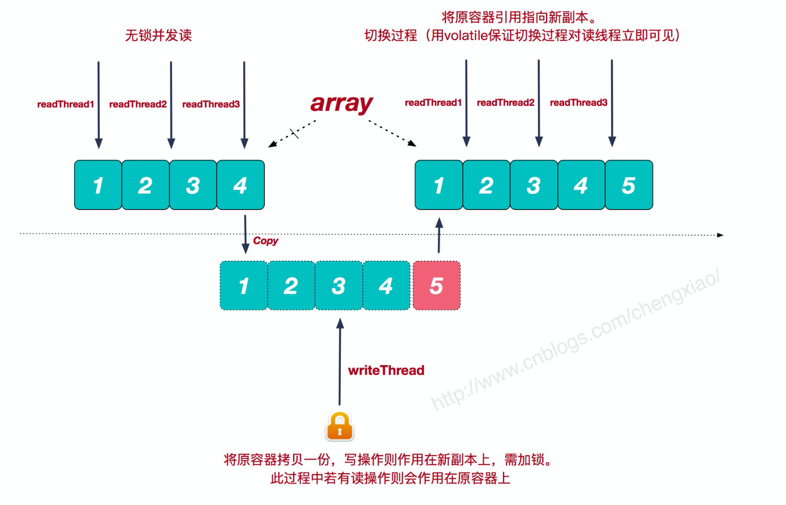
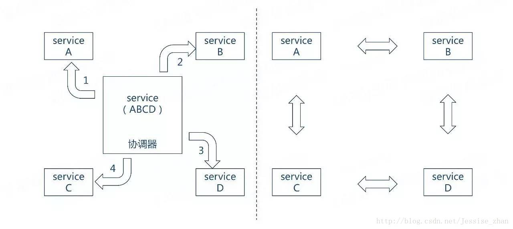

[https://youyou-tech.com/2019/10/07/%E9%9D%A2%E8%AF%956%E5%AE%B6%E5%85%AC%E5%8F%B8%EF%BC%8C%E8%80%97%E6%97%B618%E5%A4%A9%EF%BC%8C%E4%B8%80%E4%B8%BE%E6%8B%BF%E4%B8%8B%E9%98%BF%E9%87%8C%E3%80%81/](https://youyou-tech.com/2019/10/07/面试6家公司，耗时18天，一举拿下阿里、/)

# 面试准备题

https://github.com/lengyue1024/BAT_interviews/blob/master/Java%E9%9D%A2%E8%AF%95%E9%A2%98%E5%8F%8A%E7%AD%94%E6%A1%88.md

https://github.com/SwordfallYeung/Interview_BigData

https://github.com/CheckChe0803/BigData-Interview

[https://github.com/Snailclimb/JavaGuide/blob/master/docs/java/Java%E5%9F%BA%E7%A1%80%E7%9F%A5%E8%AF%86.md](https://github.com/Snailclimb/JavaGuide/blob/master/docs/java/Java基础知识.md)

## 问题

https://mp.weixin.qq.com/s/gjesvqvINucCSNaXZo7Kmw

[https://youyou-tech.com/2019/10/07/%E9%9D%A2%E8%AF%956%E5%AE%B6%E5%85%AC%E5%8F%B8%EF%BC%8C%E8%80%97%E6%97%B618%E5%A4%A9%EF%BC%8C%E4%B8%80%E4%B8%BE%E6%8B%BF%E4%B8%8B%E9%98%BF%E9%87%8C%E3%80%81/](https://youyou-tech.com/2019/10/07/面试6家公司，耗时18天，一举拿下阿里、/)

## MySQL

1. InnoDB 存储引擎中存储逻辑单位有哪些？
2. InnoDB 存储引擎中最小物理存储单位？
3. 在 InnoDB 存储引擎中 区、页之间的关系？
4.  InnoDB 使用 Compact 或者 Redundant 格式存储与Compressed 或者 Dynamic 格式的存储的不同？
5. B-Tree 特点讲一下？
6. InnoDB 存在哪些索引，有什么不同？
7. 意向锁存在什么价值？
8. 简单说说 Record Lock、Gap Lock 和 Next-Key Lock。 
9.  Next-Key Lock 怎么解决幻读的？
10. 简单说说隔离级别？MySQL默认是那种？
11. MySQL 事务是如何实现的？

- 事务的原子性是通过 undo log 来实现的
- 事务的持久性性是通过 redo log 来实现的
- 事务的隔离性是通过 (读写锁+MVCC)来实现的

https://draveness.me/mysql-innodb

12、讲一讲MySQL的索引结构？

13、你设计的数据库遵循的范式？

https://lovojava.github.io/2017/11/01/20171101/

## 多线程

1. 聊聊 JMM 是做什么的？
2. 聊聊 volatile？
3. CAS 是做什么的？
4. 公平锁和非公平锁之间的区别？
5. 讲一下 CountDownLatch 、CyclicBarrier、Semaphore 作用与区别？
6. Synchronized 和 Lock 的区别？
7. 线程池 ThreadPoolExecutor 参数意义和拒绝策略说明？
8. 聊聊产生死锁的原因和死锁的表象？

https://juejin.im/post/5cb4551ef265da03b858443d

https://segmentfault.com/a/1190000009828216

ReetrantLock和synchronized的区别？

API层面：对于Synchronized来说，它是java语言的关键字，是原生语法层面的互斥，需要jvm实现。而ReentrantLock它是JDK 1.5之后提供的API层面的互斥锁，需要lock()和unlock()方法配合try/finally语句块来完成。

等待可中断：synchronized 不能被中断，ReentrantLock 可以中断等待，转而去做别的事情。

公平锁：synchronized的锁是非公平锁，ReentrantLock默认情况下也是非公平锁，但可以通过带布尔值的构造函数要求使用公平锁。

锁绑定多个条件：ReentrantLock可以同时绑定多个Condition对象，只需多次调用new Condition方法即可。synchronized中，锁对象的wait()和notify()或notifyAll()方法可以实现一个隐含的条件。但如果要和多于一个的条件关联的时候，就不得不额外添加一个锁。

公平锁与非公平锁？

公平锁是指多个线程在等待同一个锁时，必须按照申请的时间顺序来依次获得锁；而非公平锁则不能保证这一点。非公平锁在锁被释放时，任何一个等待锁的线程都有机会获得锁。

线程池的参数？

深入问了乐观锁，悲观锁及其实现？

## 大数据

1. MR和spark对比？

   MR 存在 Map 和 reduce 两个过程，map是将任务分发到各个节点上进行计算，有 reduce 将结果进行聚合，这个过程中的中间数据都会**持久化到硬盘上**，如果计算复杂度比较高，这样的**IO和网络带宽消耗会非常大**，spark 也存在 Map 和 reduce 的过程，中间数据通过内存方式进行中转，大大的提高的效率和降低了IO和网络的消耗。

   MR 只允许一个MapReduce 只能有一个 Map 和 reduce，而 spark 在这方面是没有限制的

## 算法

什么是 Hash 一致性算法

https://zhuanlan.zhihu.com/p/34985026

b树和b+树的区别

https://blog.csdn.net/login_sonata/article/details/75268075

常见排序算法

冒泡、插入、选择、希尔、堆排序、归并、快排

https://www.cnblogs.com/alsf/p/6606287.html

## Java 基础

Java基础 ArrayList与LinkedList区别

1、ArrayList和LinkedList都是实现了List接口的类，两者都是线程不安全的

2、ArrayList：内部使用数组的形式实现了存储，随机查询速度特别快，但存在扩容问题，LinkedList：内部使用双向链表的结构实现存储，插入和删除效率较高，不存在扩容问题

https://www.jianshu.com/p/30a8195f0b81

Vector与ArrayList区别？

Vector与ArrayList一样，也是通过数组实现的，不同的是它支持线程的同步，即某一时刻只有一个线程能够写Vector，避免多线程同时写而引起的不一致性，但实现同步需要很高的花费，因此，访问它比访问ArrayList慢。Vector 线程安全。

HashMap 和 HashTable 区别？

HashMap 是线程安全的，HashTable 是非线程安全，两者数据结构都一致，都使用hash计算，HashMap扩容的时候是乘以二，HashTable 是2n+1，从而使得HashMap查询效率比较高，HashTable 查询效率比较低。

https://www.cnblogs.com/xinzhao/p/5644175.html

CopyOnWriteArrayList实现原理

**CopyOnWriteArrayList**是Java并发包中提供的一个并发容器，它是个**线程安全且读操作无锁的ArrayList**，写操作则通过创建底层数组的新副本来实现，是一种**读写分离**的并发策略。

很多时候，我们的系统应对的都是**读多写少**的并发场景。CopyOnWriteArrayList容器允许并发读，读操作是无锁的，性能较高。至于写操作，比如向容器中添加一个元素，**则首先将当前容器复制一份，然后在新副本上执行写操作，结束之后再将原容器的引用指向新容器。**

缺点也很明显，**一是内存占用问题**，毕竟每次执行写操作都要将原容器拷贝一份，数据量大时，对内存压力较大，可能会引起频繁GC；**二是无法保证实时性**，Vector对于读写操作均加锁同步，可以保证读和写的强一致性。而CopyOnWriteArrayList由于其实现策略的原因，写和读分别作用在新老不同容器上，在写操作执行过程中，读不会阻塞但读取到的却是老容器的数据。

如何才能得到一个线程安全的HashMap？

- Hashtable
- ConcurrentHashMap
- Synchronized Map

讲一下JVM常用垃圾回收器？

Java有哪些队列？

ArrayBlockingQueue： 基于数组的有界队列
LinkedBlockingQueue： 基于链表的无界队列
ProiporityBlockingQueue：基于优先次序的无界队列
DelayQueue：基于时间优先级的队列
SynchronousQueue：内部没有容器的队列 较特别 --其独有的线程一一配对通信机制

https://www.jianshu.com/p/065b7c5e820b

死锁的条件？

（1） 互斥条件：一个资源每次只能被一个进程使用。
（2） 占有且等待：一个进程因请求资源而阻塞时，对已获得的资源保持不放。
（3）不可强行占有:进程已获得的资源，在末使用完之前，不能强行剥夺。
（4） 循环等待条件:若干进程之间形成一种头尾相接的循环等待资源关系。

## Redis

讲一下redis的数据结构？

当然，`Redis`本身也是有自己的数据结构的，比如我们上面提到的五种对象，其实他们也是基于某些数据结构来实现的，具体包括:
简单动态字符串(SDS)、链表、字典、跳跃表、整数集合、压缩列表。而这些数据结构，也就是我们所使用的五种对象的构建基础。当然，每种对象所使用的数据结构可能不止一种。

https://www.hellonine.top/index.php/archives/56/

redis分布式锁？

https://juejin.im/post/5cc165816fb9a03202221dd5

为什么要用redis做缓存？

速度快，完全基于内存，使用C语言实现，网络层使用epoll解决高并发问题，单线程模型避免了不必要的上下文切换及竞争条件；

丰富的数据类型，当然常用的主要是 String、Hash、List、Set、 SortSet 这5种类型。

Redis还提供了像慢查询分析、性能测试、Pipeline、事务、Lua自定义命令、Bitmaps、HyperLogLog、发布/订阅、Geo等个性化功能。

Redis的代码开源在GitHub，代码非常简单优雅，任何人都能够吃透它的源码。

https://juejin.im/post/5b516dc75188251af363492d

## ES

elasticsearch为什么检索快，它的底层数据结构是怎么样的？

https://www.infoq.cn/article/UotLIglvj6TcUE2vxC5X

## Netty

netty应用在哪些中间件和框架中呢？

https://juejin.im/post/5c75cbabe51d453ecf7d6f3f

## Spring

了解Springboot吗？那讲一下Springboot的启动流程吧？

https://juejin.im/post/5b8f05a5f265da43296c6102

如何解决bean的循环依赖问题？

https://blog.csdn.net/u010853261/article/details/77940767

讲一讲Spring和Springboot的区别？

https://www.jianshu.com/p/ffe5ebe17c3a

## 网络

TCP三次握手，四次挥手。

https://hit-alibaba.github.io/interview/basic/network/TCP.html

## 架构

**谈谈服务编排和服务编制的理解？**

服务编制存在一个指令者，由它进行决定服务之间的协作关系，服务编制则没有指令者，服务之间相互根据彼此的状态，做出自己的行为或者响应。

https://blog.csdn.net/zhangjunli/article/details/88656584

**RPC**

[https://ketao1989.github.io/2016/12/10/rpc-theory-in-action/#rpc%E6%8A%80%E6%9C%AF%E6%B7%B1%E5%85%A5](https://ketao1989.github.io/2016/12/10/rpc-theory-in-action/#rpc技术深入)