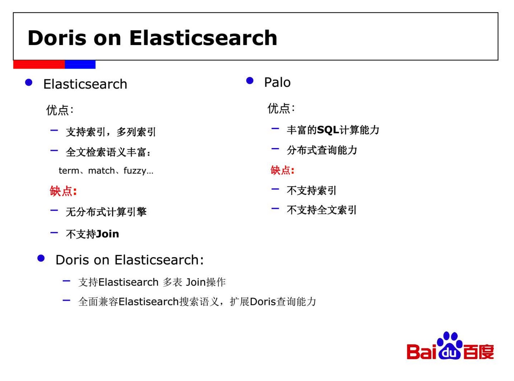
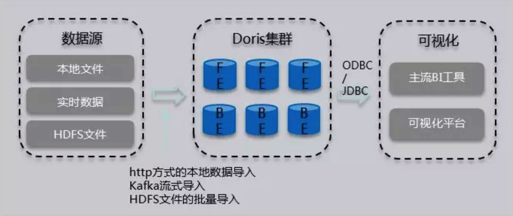

# Doris

Doris 这类 MPP 架构的 OLAP 数据库，通常都是通过提高并发，来处理大量数据的。本质上，Doris 的数据存储在类似 SSTable（Sorted String Table）的数据结构中。该结构是一种有序的数据结构，可以按照指定的列进行排序存储。在这种数据结构上，**以排序列作为条件进行查找，会非常的高效。**

## 限制

- 在 `Count(*)` 语法方面，原生的方式性能不是特别高，需要自行优化（http://doris.apache.org/documentation/cn/getting-started/data-model-rollup.html）
- 不存在除了维度和指标之外的字段类型存在，如果需要实现多种需求场景，需要创建多种表类型来冗余数据方式实现

### 数据存储结构

在 Doris 中，数据以表（Table）的形式进行逻辑上的描述。一张表包括行（Row）和列（Column）。Row 即用户的一行数据。Column 用于描述一行数据中不同的字段。

Column 可以分为两大类：Key 和 Value。从业务角度看，Key 和 Value 可以分别对应维度列和指标列。

Doris 的数据模型主要分为3类:

- Aggregate
- Uniq
- Duplicate

#### Aggregate 模型

在 Doris 通过 key 来来决定 value 的聚合粒度大小。

```
CREATE TABLE IF NOT EXISTS example_db.expamle_tbl
(
    `user_id` LARGEINT NOT NULL COMMENT "用户id",
    `date` DATE NOT NULL COMMENT "数据灌入日期时间",
    `city` VARCHAR(20) COMMENT "用户所在城市",
    `age` SMALLINT COMMENT "用户年龄",
    `sex` TINYINT COMMENT "用户性别",
    `last_visit_date` DATETIME REPLACE DEFAULT "1970-01-01 00:00:00" COMMENT "用户最后一次访问时间",
    `cost` BIGINT SUM DEFAULT "0" COMMENT "用户总消费",
    `max_dwell_time` INT MAX DEFAULT "0" COMMENT "用户最大停留时间",
    `min_dwell_time` INT MIN DEFAULT "99999" COMMENT "用户最小停留时间",
)
AGGREGATE KEY(`user_id`, `date`, `timestamp`, `city`, `age`, `sex`)
... /* 省略 Partition 和 Distribution 信息 */
；
```

像带有 REPLACE、SUM、MAX、MIN 这种标记的字段都是属于 value，`user_id`, `date`, `timestamp`, `city`, `age`, `sex` 则为key。

#### Uniq模型

这类数据没有聚合需求，只需保证主键唯一性。

```
CREATE TABLE IF NOT EXISTS example_db.expamle_tbl
(
    `user_id` LARGEINT NOT NULL COMMENT "用户id",
    `username` VARCHAR(50) NOT NULL COMMENT "用户昵称",
    `city` VARCHAR(20) COMMENT "用户所在城市",
    `age` SMALLINT COMMENT "用户年龄",
    `sex` TINYINT COMMENT "用户性别",
    `phone` LARGEINT COMMENT "用户电话",
    `address` VARCHAR(500) COMMENT "用户地址",
    `register_time` DATETIME COMMENT "用户注册时间"
)
UNIQUE KEY(`user_id`, `user_name`)
... /* 省略 Partition 和 Distribution 信息 */
；
```

#### Duplicate 模型

在某些多维分析场景下，数据既没有主键，也没有聚合需求。因此，我们引入 Duplicate 数据模型来满足这类需求。

这种数据模型区别于 Aggregate 和 Uniq 模型。数据完全按照导入文件中的数据进行存储，不会有任何聚合。即使两行数据完全相同，也都会保留。 而在建表语句中指定的 DUPLICATE KEY，只是用来指明底层数据按照那些列**进行排序**。

在 DUPLICATE KEY 的选择上，我们建议适当的选择前 2-4 列就可以。

```
CREATE TABLE IF NOT EXISTS example_db.expamle_tbl
(
    `timestamp` DATETIME NOT NULL COMMENT "日志时间",
    `type` INT NOT NULL COMMENT "日志类型",
    `error_code` INT COMMENT "错误码",
    `error_msg` VARCHAR(1024) COMMENT "错误详细信息",
    `op_id` BIGINT COMMENT "负责人id",
    `op_time` DATETIME COMMENT "处理时间"
)
DUPLICATE KEY(`timestamp`, `type`)
... /* 省略 Partition 和 Distribution 信息 */
；
```

#### 数据模型的选择建议

因为数据模型在建表时就已经确定，且**无法修改**。所以，选择一个合适的数据模型**非常重要**。

1. Aggregate 模型可以通过预聚合，极大地降低聚合查询时所需扫描的数据量和查询的计算量，非常适合有固定模式的报表类查询场景。但是该模型对 count(*) 查询很不友好。同时因为固定了 Value 列上的聚合方式，在进行其他类型的聚合查询时，需要考虑语意正确性。
2. Uniq 模型针对需要唯一主键约束的场景，可以保证主键唯一性约束。但是无法利用 ROLLUP 等预聚合带来的查询优势（因为本质是 REPLACE，没有 SUM 这种聚合方式）。
3. Duplicate 适合任意维度的 Ad-hoc 查询。虽然同样无法利用预聚合的特性，但是不受聚合模型的约束，可以发挥列存模型的优势（只读取相关列，而不需要读取所有 Key 列）。

### 前缀索引

在 Aggregate、Uniq 和 Duplicate 三种数据模型中。底层的数据存储，是按照各自建表语句中，AGGREGATE KEY、UNIQ KEY 和 DUPLICATE KEY 中指定的列进行排序存储的。

而前缀索引，即在排序的基础上，实现的一种根据给定前缀列，快速查询数据的索引方式。

我们将一行数据的前 **36 个字节** 作为这行数据的前缀索引。当遇到 VARCHAR 类型时，前缀索引会直接截断。我们举例说明：

1. 以下表结构的前缀索引为 user_id(8Byte) + age(4Bytes) + message(prefix 24 Bytes)。

| ColumnName     | Type         |
| -------------- | ------------ |
| user_id        | BIGINT       |
| age            | INT          |
| message        | VARCHAR(100) |
| max_dwell_time | DATETIME     |
| min_dwell_time | DATETIME     |

1. 以下表结构的前缀索引为 user_name(20 Bytes)。即使没有达到 36 个字节，因为遇到 VARCHAR，所以直接截断，不再往后继续。

| ColumnName     | Type         |
| -------------- | ------------ |
| user_name      | VARCHAR(20)  |
| age            | INT          |
| message        | VARCHAR(100) |
| max_dwell_time | DATETIME     |
| min_dwell_time | DATETIME     |

当我们的查询条件，是**前缀索引的前缀**时，可以极大的加快查询速度。比如在第一个例子中，我们执行如下查询：

```
SELECT * FROM table WHERE user_id=1829239 and age=20；
```

该查询的效率会**远高于**如下查询：

```
SELECT * FROM table WHERE age=20；
```

所以在建表时，**正确的选择列顺序，能够极大地提高查询效率**。

### 物化视图（rollup）

ROLLUP 在多维分析中是“上卷”的意思，即将数据按某种指定的粒度进行进一步聚合。

在 Doris 中，我们将用户通过建表语句创建出来的表成为 Base 表（Base Table）。Base 表中保存着按用户建表语句指定的方式存储的基础数据。

在 Base 表之上，我们可以创建任意多个 ROLLUP 表。这些 ROLLUP 的数据是基于 Base 表产生的，并且在物理上是**独立存储**的。

ROLLUP 表的基本作用，在于在 Base 表的基础上，**获得更粗粒度的聚合数据**。

Rollup 本质上可以理解为原始表(Base Table)的一个物化索引。建立 Rollup 时可只选取 Base Table 中的部分列作为 Schema。Schema 中的字段顺序也可与 Base Table 不同。

ROLLUP 创建完成之后的触发是程序自动的，不需要任何其他指定或者配置。

例如：创建了 user_id （key），cost（value）格式的 rollup 时，当执行下方语句时，就会触发。

```
SELECT user_id, sum(cost) FROM table GROUP BY user_id;
```

> Aggregate 和 Uniq 两种数据存储格式时，使用 rollup 会改变聚合数据的粒度，但对于 Duplicate 只是调整前缀索引。

因为建表时已经指定了列顺序，所以一个表只有一种前缀索引。这对于使用其他不能命中前缀索引的列作为条件进行的查询来说，效率上可能无法满足需求。因此，我们可以通过创建 ROLLUP 来人为的调整列顺序。举例说明。

Base 表结构如下：

| ColumnName     | Type         |
| -------------- | ------------ |
| user_id        | BIGINT       |
| age            | INT          |
| message        | VARCHAR(100) |
| max_dwell_time | DATETIME     |
| min_dwell_time | DATETIME     |

我们可以在此基础上创建一个 ROLLUP 表：

| ColumnName     | Type         |
| -------------- | ------------ |
| age            | INT          |
| user_id        | BIGINT       |
| message        | VARCHAR(100) |
| max_dwell_time | DATETIME     |
| min_dwell_time | DATETIME     |

可以看到，ROLLUP 和 Base 表的列完全一样，只是将 user_id 和 age 的顺序调换了。那么当我们进行如下查询时：

```
SELECT * FROM table where age=20 and massage LIKE "%error%";
```

会优先选择 ROLLUP 表，因为 ROLLUP 的前缀索引匹配度更高。

**创建 rollup 语法**

```
ALTER TABLE table1 ADD ROLLUP rollup_city(citycode, pv);
# 取消正在执行的作业
CANCEL ALTER TABLE ROLLUP FROM table1;
```

#### ROLLUP 调整前缀索引

因为建表时已经指定了列顺序，所以一个表只有一种前缀索引。这对于使用其他不能命中前缀索引的列作为条件进行的查询来说，效率上可能无法满足需求。因此，我们可以通过创建 ROLLUP 来人为的调整列顺序。

#### ROLLUP 的几点说明

- ROLLUP 最根本的作用是提高某些查询的查询效率（无论是通过聚合来减少数据量，还是修改列顺序以匹配前缀索引）。因此 ROLLUP 的含义已经超出了 “上卷” 的范围。这也是为什么我们在源代码中，将其命名为 Materized Index（物化索引）的原因。
- ROLLUP 是附属于 Base 表的，可以看做是 Base 表的一种辅助数据结构。用户可以在 Base 表的基础上，创建或删除 ROLLUP，但是不能在查询中显式的指定查询某 ROLLUP。是否命中 ROLLUP 完全由 Doris 系统自动决定。
- ROLLUP 的数据是独立物理存储的。因此，**创建的 ROLLUP 越多，占用的磁盘空间也就越大。同时对导入速度也会有影响（导入的ETL阶段会自动产生所有 ROLLUP 的数据），但是不会降低查询效率（只会更好）**。
- ROLLUP 的数据更新与 Base 表示完全同步的。用户无需关心这个问题。
- ROLLUP 中列的聚合方式，与 Base 表完全相同。在创建 ROLLUP 无需指定，也不能修改。
- 查询能否命中 ROLLUP 的一个必要条件（非充分条件）是，查询所涉及的**所有列**（包括 select list 和 where 中的查询条件列等）都存在于该 ROLLUP 的列中。否则，查询只能命中 Base 表。
- 某些类型的查询（如 count(*)）在任何条件下，都无法命中 ROLLUP。
- 可以通过 `EXPLAIN your_sql;` 命令获得查询执行计划，在执行计划中，查看是否命中 ROLLUP。
- 可以通过 `DESC tbl_name ALL;` 语句显示 Base 表和所有已创建完成的 ROLLUP。

> rollup 数量没有限制，但数量越多会消耗比较多的内存。支持 SQL 方式变更 rollup 字段数量。

### 分区和分桶

Doris 支持两级分区存储, 第一层为 RANGE 分区(partition), 第二层为 HASH 分桶(bucket)。

1.3.1. RANGE分区(partition)

```
RANGE分区用于将数据划分成不同区间, 逻辑上可以理解为将原始表划分成了多个子表。业务上，多数用户会选择采用按时间进行partition, 让时间进行partition有以下好处：

* 可区分冷热数据
* 可用上Doris分级存储(SSD + SATA)的功能
* 按分区删除数据时，更加迅速
```

1.3.2. HASH分桶(bucket)

```
根据hash值将数据划分成不同的 bucket。

* 建议采用区分度大的列做分桶, 避免出现数据倾斜
* 为方便数据恢复, 建议单个 bucket 的 size 不要太大, 保持在 10GB 以内, 所以建表或增加 partition 时请合理考虑 bucket 数目, 其中不同 partition 可指定不同的 buckets 数。
```

### 稀疏索引和 Bloom Filter

Doris对数据进行有序存储, 在数据有序的基础上为其建立稀疏索引,索引粒度为 block(1024行)。

稀疏索引选取 schema 中固定长度的前缀作为索引内容, 目前 Doris 选取 36 个字节的前缀作为索引。

- 建表时建议将查询中常见的过滤字段放在 Schema 的前面, 区分度越大，频次越高的查询字段越往前放。
- 这其中有一个特殊的地方,就是 varchar 类型的字段。varchar 类型字段只能作为稀疏索引的最后一个字段。索引会在 varchar 处截断, 因此 varchar 如果出现在前面，可能索引的长度可能不足 36 个字节。具体可以参阅 [数据模型、ROLLUP 及前缀索引](http://doris.apache.org/documentation/cn/getting-started/data-model-rollup.html)。
- 除稀疏索引之外, Doris还提供bloomfilter索引, bloomfilter索引对区分度比较大的列过滤效果明显。 如果考虑到varchar不能放在稀疏索引中, 可以建立bloomfilter索引。

### Broadcast/Shuffle Join

系统默认实现 Join 的方式，是将小表进行条件过滤后，将其广播到大表所在的各个节点上，形成一个内存 Hash 表，然后流式读出大表的数据进行Hash Join。但是如果当小表过滤后的数据量无法放入内存的话，此时 Join 将无法完成，通常的报错应该是首先造成内存超限。

如果遇到上述情况，建议使用 Shuffle Join 的方式，也被称作 Partitioned Join。即将小表和大表都按照 Join 的 key 进行 Hash，然后进行分布式的 Join。**这个对内存的消耗就会分摊到集群的所有计算节点上**。

## 问题

1. 在已经创建的表基础上进行表结构字段的变更和 rollup 索引的变更？

支持，但数据模式一旦表创建就无法变更。

2. rollup 是否存在数量的限制？

不存在，但越多的 rollup 内存资源会消耗更多，同时，导入数据会比较慢。

3. （A，B，C）构成的索引是否支持仅 A 字段作为查询条件查询？

支持，但要有顺序要求。

## 总结

Doris 表结构由 key 和 value 构成，key 为维度，value 为统计指标。适合做简单的聚合计算和维度计算，使用比较低的硬件条件拥有比较高的性能。

- 查询：满足 MySQL 语法
- 提升查询性能：使用前缀索引+rollup 或者使用 partition、bloom 过滤器。
- 提升 join 方式查询性能：Shuffle Join。
- 表结构和索引都支持变更，但数据模式不支持变更。

Doris 官方还推出了 Docker 的 Dev 版本进行特性试用。https://hub.docker.com/r/apachedoris/doris-dev



https://www.jishuwen.com/d/2T9h



