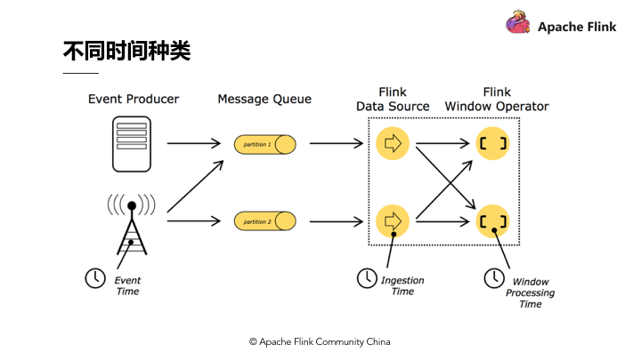
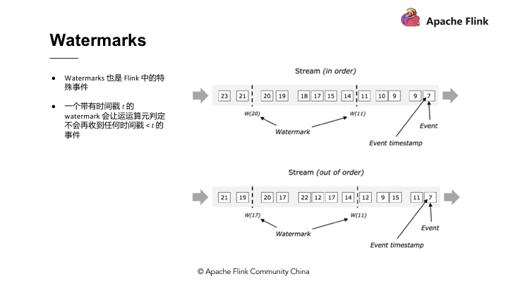

# Flink

## 什么是 Flink

Apache Flink 是一个分布式大数据处理引擎，可对有限数据流和无限数据流进行有状态或无状态的计算，能够部署在各种集群环境，对各种规模大小的数据进行快速计算。

通过 Checkpoint 方式，实现容错，保证数据的 Exactly Once。

### 状态维护

- ** JVM Heap 状态后端**，适合数量较小的状态，当状态量不大时就可以采用 JVM Heap 的状态后端。JVM Heap 状态后端会在每一次运算值需要读取状态时，用 Java object read / writes 进行读或写，不会产生较大代价，但当 Checkpoint 需要将每一个运算值的本地状态放入 Distributed Snapshots 的时候，就需要进行序列化了。

- **RocksDB 状态后端**，它是一种 out of core 的状态后端。在 Runtime 的本地状态后端让使用者去读取状态的时候会经过磁盘，相当于将状态维护在磁盘里，与之对应的代价可能就是每次读取状态时，都需要经过序列化和反序列化的过程。当需要进行快照时只将应用序列化即可，序列化后的数据直接传输到中央的共享 DFS 中。

Flink 目前支持以上两种状态后端，一种是**纯 memory** 的状态后端，另一种是**有资源磁盘的状态后端**，在维护状态时可以根据状态的数量选择相应的状态后端。

### Event - Time

在 Flink 及其他进阶的流式处理引擎出现之前，大数据处理引擎一直只支持 Processing-time 的处理。假设定义一个运算 windows 的窗口，windows 运算设定每小时进行结算。以 Processing-time 进行运算时可以发现数据引擎将 3 点至 4 点间收到的数据做结算。实际上在做报表或者分析结果时是**想了解真实世界中 3 点至 4 点之间实际产生数据的输出结果**，了解实际数据的输出结果就必须采用 Event – Time 了。

需要从事件发生的那个时间点进行计算，那么就需要用到 Event-Time，如图，Event - Time 相当于事件，它在数据最源头产生时带有时间戳，后面都需要用时间戳来进行运算。用图来表示，最开始的队列收到数据，每小时对数据划分一个批次，这就是 Event - Time Process 在做的事情。

**Event - Time 是如何知道是否已经收到全部的3点到4点所有数据呢？**

### Watermarks

Flink 实际上是用 watermarks 来实现 Event - Time 的功能。Watermarks 在 Flink 中也属于特殊事件，其精髓在于当某个运算值收到带有时间戳“ T ”的 watermarks 时就意味着它不会接收到新的数据了。使用 watermarks 的好处在于可以准确预估收到数据的截止时间。举例，假设预期收到数据时间与输出结果时间的时间差延迟 5 分钟，那么 Flink 中所有的 windows Operator 搜索 3 点至 4 点的数据，但因为存在延迟需要再多等 5 分钟直至收集完 4：05 分的数据，此时方能判定 4 点钟的资料收集完成了，然后才会产出 3 点至 4 点的数据结果。这个时间段的结果对应的就是 watermarks 的部分。

### 保存点（Savepoint）

Checkpoint 完美符合以上需求，不过 Flink 中还有另外一个名词保存点（Savepoint），当手动产生一个 Checkpoint 的时候，就叫做一个 Savepoint。Savepoint 跟 Checkpoint 的差别在于检查点是 Flink 对于一个有状态应用在运行中利用分布式快照持续周期性的产生 Checkpoint，而 Savepoint 则是**手动产生的 Checkpoint**，Savepoint 记录着流式应用中所有运算元的状态。

Savepoint 和 Checkpoint 的区别（[详见文档](https://www.ververica.com/blog/differences-between-savepoints-and-checkpoints-in-flink)）：

- Checkpoint 是增量做的，每次的时间较短，数据量较小，只要在程序里面启用后会自动触发，用户无须感知；Checkpoint 是作业 failover 的时候自动使用，不需要用户指定。
- Savepoint 是全量做的，每次的时间较长，数据量较大，需要用户主动去触发。Savepoint 一般用于程序的版本更新（[详见文档](https://ci.apache.org/projects/flink/flink-docs-stable/ops/upgrading.html#step-1-take-a-savepoint-in-the-old-flink-version)），Bug 修复，A/B Test 等场景，需要用户指定。

## 入门教程

https://www.infoq.cn/theme/28

