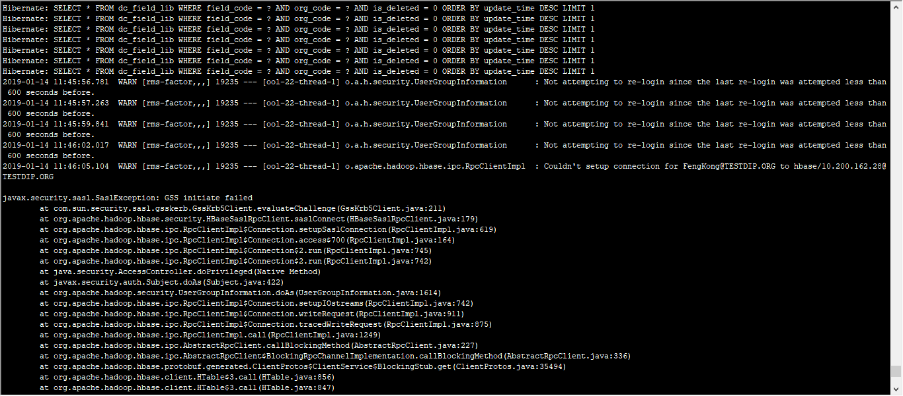

# 记一次HDFS Delegation Token失效问题

由于我们团队是最近上的 `Kerberos` ，免不了会出现一些问题，现阶段还处于踩坑阶段。希望通过我们的填坑的经历，帮助到同样身处坑内的伙伴。我们使用的 `Hortonworks-HDP` 环境。

`HDFS Delegation Token` 问题被发现于一个 Long Running 的 Spark 应用。由于发布周期原因，部分应用超过了 7 天的有效期时间，突然在同一时间，爆发出来。当时觉得很诡异，在查看日志之后，还没有往有效时间方面考虑，还以为是环境问题。遇到的错误信息如下：

```shell
org.apache.hadoop.ipc.RemoteException(org.apache.hadoop.security.token.SecretManager$InvalidToken): token (token for dmp: HDFS_DELEGATION_TOKEN owner=dmp, renewer=yarn, realUser=livy/test-dmp7.example.org@TESTDIP.ORG, issueDate=1547640792209, maxDate=1547641392209, sequenceNumber=4439, masterKeyId=172) is expired, current time: 2019-01-16 20:21:06,530+0800 expected renewal time: 2019-01-16 20:16:18,863+0800
Caused by: org.apache.hadoop.ipc.RemoteException(org.apache.hadoop.security.token.SecretManager$InvalidToken): token (token for dmp: HDFS_DELEGATION_TOKEN owner=dmp, renewer=yarn, realUser=livy/test-dmp7.example.org@TESTDIP.ORG, issueDate=1547640792209, maxDate=1547641392209, sequenceNumber=4439, masterKeyId=172) is expired, current time: 2019-01-16 20:21:06,530+0800 expected renewal time: 2019-01-16 20:16:18,863+0800
```

无巧不成书，另一个团队在使用我们团队的 HBASE ，因而，他们需要使用 Kerberos 认证，在他们的应用上出现了，如下图错误：



出现的场景，简单描述一下，不是这篇的重点。应用为 `Spring Boot` 项目，使用 `ZK` 方式进行认证，在运行时间大于 1 天 之后就会出现该错误。后来问题定位到 Kerberos 中的认证有效期问题。

缘该问题的出现，联想到是否 `HDFS Delegation Token` 也是 Kerberos 导致的问题呢。故而团队小伙伴进行了论证，先是修改 KDC 有效时间，为了快速论证，将 `ticket_lifetime 和 renew_lifetime` 都进行了调小处理，使用 `Livy Spengo` 方式进行提交 Spark 应用，发现在调小之后的 `renew_lifetime` 时间范围内，没有出现 `HDFS Delegation Token` 错误信息，结果与预想的出现了偏差，结合线上的问题现象为 7 天过期结果，猜测是否存在另一种配置项，在影响着。

在一篇 [hdfs delegation token 过期问题分析](https://www.jianshu.com/p/2904334ae404) 文章中看到了另一种可能性，Hadoop 自身存在一种轻量级认证方式。故而，在 Hadoop 官网 [hdfs-default](https://hadoop.apache.org/docs/r2.7.1/hadoop-project-dist/hadoop-hdfs/hdfs-default.xml) 找到了如下的配置项：


| 配置项  | 默认值  | 说明 |
| -------------------------------------------- | --------- | ------------------------------------------------------------ |
| dfs.namenode.delegation.key.update-interval  | 86400000  | The update interval for master key for delegation tokens in the namenode in milliseconds. |
| dfs.namenode.delegation.token.max-lifetime   | 604800000 | The maximum lifetime in milliseconds for which a delegation token is valid. |
| dfs.namenode.delegation.token.renew-interval | 86400000  | The renewal interval for delegation token in milliseconds.   |

从默认值看，似乎可以解释现象，一切通过实践出真知。也是通过对这三个参数进行相应的调小操作，结果现象跟猜测的是一致的。所以有理由相信，通过调大上面的这三个参数就可以解决问题。但是，出于安全的考虑，还是希望有不同的解决方案。

如果能在过期的时候，主动进行续租或者重新认证，那应该是最好的解决方法。在 Spark 官网 [security](http://spark.apache.org/docs/latest/security.html#long-running-applications) 下有一段话是这样的写的：

> ## Long-Running Applications
>
> Long-running applications may run into issues if their run time exceeds the maximum delegation token lifetime configured in services it needs to access.
>
> Spark supports automatically creating new tokens for these applications when running in YARN mode. Kerberos credentials need to be provided to the Spark application via the `spark-submit` command, using the `--principal` and `--keytab` parameters.
>
> The provided keytab will be copied over to the machine running the Application Master via the Hadoop Distributed Cache. For this reason, it’s strongly recommended that both YARN and HDFS be secured with encryption, at least.
>
> The Kerberos login will be periodically renewed using the provided credentials, and new delegation tokens for supported will be created.

`--principal, --keytab` 这两个参数，在上文中提到，我们团队使用的是 Livy 方式提交应用，而这里是 `spark-submit` ，Anyway，先进行测试再说，跟官网文档进行实践  `spark-submit`  方式进行。例子：

```bash
./bin/spark-submit \
  --class <main-class> \
  --master <master-url> \
  --deploy-mode <deploy-mode> \
  --conf <key>=<value> \
  --principal <value> \
  --keytab <value> \
  <application-jar> \
  [application-arguments]
```

还是重重的受到打击，依旧无法自动续租。

在此之后，Google 一番，发现存在 `hdfs delegation token` 和 Livy 无法正常续租问题大量存在：

- [HDFS-5322](https://issues.apache.org/jira/browse/HDFS-5322)
- [LIVY-44](https://issues.cloudera.org/browse/LIVY-44?jql=labels%20%3D%20Hue)
- [Hadoop安全实践](https://tech.meituan.com/2014/03/24/hadoop-security-practice.html)
- [SPARK-14743](https://jira.apache.org/jira/browse/SPARK-14743)
- [park jobs failed with delegation token renewal error](https://www.ericlin.me/2017/01/spark-jobs-failed-with-delegation-token-renewal-error/)

也尝试了这些文中所说的方式方法，比如：`–conf spark.hadoop.fs.hdfs.impl.disable.cache=true` 之类的。尝试了 `livy 和 spark-submit` 都失败告终。

在发现 [Spark踩坑之Streaming在Kerberos的hadoop中renew失败](http://flume.cn/2016/11/24/Spark%E8%B8%A9%E5%9D%91%E4%B9%8BStreaming%E5%9C%A8Kerberos%E7%9A%84hadoop%E4%B8%ADrenew%E5%A4%B1%E8%B4%A5/) 该文，里面有这样的配置：

~~~xml
<property>
    <name>yarn.resourcemanager.proxy-user-privileges.enabled</name>
    <value>true</value>
</property>
``` xml core-site.xml
<property>
    <name>hadoop.proxyuser.yarn.hosts</name>
    <value>*</value>
</property>
<property>
    <name>hadoop.proxyuser.yarn.groups</name>
    <value>*</value>
</property>
~~~

在与自己的环境的配置做对比之后，发现唯一不同的地方是 `hadoop.proxyuser.yarn.hosts` 的值，我们的配置是 host 地址，已经是死马当活马医的心态，进行尝试，发现在 `spark-submit` 方式成功了，但 Livy 方式还是以失败告终。但似乎更加相信 Livy 是可以实现的。

尝试使用在 livy 中添加 `--keytab 和 --principal` 方式提交，在日志中会有 `--proxy-user or --principal` 的错误信息。`livy spengo` 是一种代理的方式进行提交。如若添加  `--principal` 是不支持的。对应的是 `spark.yarn.keytab` 和 `spark.yarn.principal`。

同时，也检查了 `hadoop.proxyuser.livy.hosts` 配置是*。貌似问题是 Livy 方式无法将keytab 信息透传到 Yarn 中。希望有碰到相关问题的伙伴，能进行留言进行相应的讨论，以帮助更多的人。

