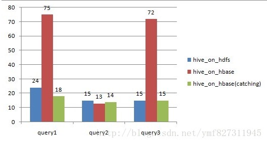
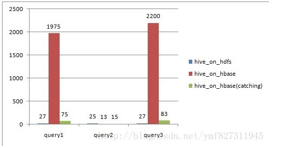

# HBase On Hive

## 快速开始

### 配置

配置 `hive-site.xml` 

```
<property>  
　　<name>hive.aux.jars.path</name>  
　　<value>
　　　　  $HIVE_HOME/lib/hive-hbase-handler-1.2.0.jar,
　　　　  $HIVE_HOME/lib/hbase-0.92.0.jar,
　　　　  $HIVE_HOME/lib/zookeeper-3.3.4.jar,
　　　　  $HIVE_HOME/lib/guava-r09.jar
　　</value>  
</property> 
 
<property>  
　　<name>hive.zookeeper.quorum</name>  
　　<value>www.iteblog.com</value>  
</property>
```

重启 Hive 服务

### 创建第一张表

在 `hive shell` 下进行操作：

```shell
CREATE EXTERNAL TABLE hbase_table_2(key int, value string) 
STORED BY 'org.apache.hadoop.hive.hbase.HBaseStorageHandler'
WITH SERDEPROPERTIES ("hbase.columns.mapping" = "cf1:val")
TBLPROPERTIES("hbase.table.name" = "some_existing_table", "hbase.mapred.output.outputtable" = "some_existing_table");
```

> 使用 hive 用户进行相应操作。如果存在权限问题，使用 Ranger 进行相应配置。

## 映射

```shell
CREATE EXTERNAL TABLE hbase_table_2(key int, value string) 
STORED BY 'org.apache.hadoop.hive.hbase.HBaseStorageHandler'
WITH SERDEPROPERTIES ("hbase.columns.mapping" = "cf1:val")
TBLPROPERTIES("hbase.table.name" = "some_existing_table", "hbase.mapred.output.outputtable" = "some_existing_table");
```

`CREATE TABLE iteblog(key int, value string)`  Hive 表结构信息

 `WITH SERDEPROPERTIES ("hbase.columns.mapping" = "cf1:val")`  Hive 与 HBase 表中 列族与列之间的映射关系，`hbase.columns.mapping" = ":key,cf1:val"`  可能存在这样的语法，建表或映射表的时候如果没有指定:key则第一个列默认就是行键。

`"hbase.table.name" = "some_existing_table"` 是 HBase 中的表名。

`"hbase.mapred.output.outputtable" = "some_existing_table"` 指定插入数据时写入的表，如果以后需要往该表插入数据就需要指定该值。

### Hive 命令

```shell
# 查询
select * from 表名
# 插入数据
INSERT OVERWRITE TABLE iteblog SELECT map(bar, foo), foo FROM pokes 
WHERE foo=98 OR foo=100;
# 删除表
drop table 表名
```

## 工具

Mac DbVisualizer图形化

## 性能

查询性能比较 

query1:

```
select count(1) from on_hdfs;
select count(1) from on_hbase;
```

query2(根据key过滤)

```
select * from on_hdfs
where key = ‘13400000064_1388056783_460095106148962′;
select * from on_hbase
where key = ‘13400000064_1388056783_460095106148962′;
```

query3(根据value过滤)

```
select * from on_hdfs where value = ‘XXX';
select * from on_hbase where value = ‘XXX';
```

on_hdfs (20万记录，150M，TextFile on HDFS) 
on_hbase(20万记录，160M，HFile on HDFS) 



on_hdfs (2500万记录，2.7G，TextFile on HDFS) 
on_hbase(2500万记录，3G，HFile on HDFS) 



> 对于全表扫描，hive_on_hbase查询时候如果不设置catching，性能远远不及hive_on_hdfs； 根据rowkey过滤，hive_on_hbase性能上略好于hive_on_hdfs，特别是数据量大的时候； 设置了caching之后，尽管比不设caching好很多，但还是略逊于hive_on_hdfs；

https://www.iteblog.com/archives/1718.html

https://www.cnblogs.com/xuwujing/p/8059079.html

https://blog.csdn.net/ymf827311945/article/details/73690927

https://cwiki.apache.org/confluence/display/Hive/HBaseIntegration

[版本兼容性问题](https://blog.csdn.net/u010376788/article/details/50890622)

