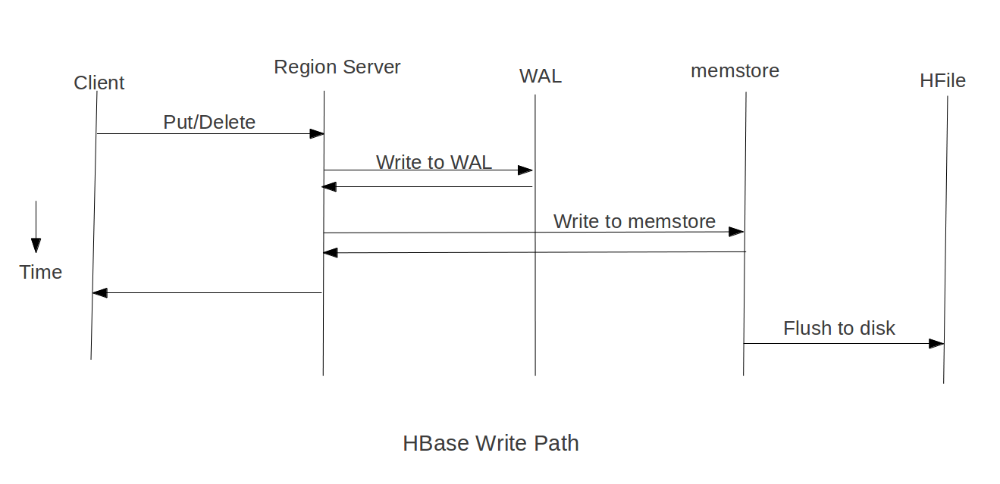
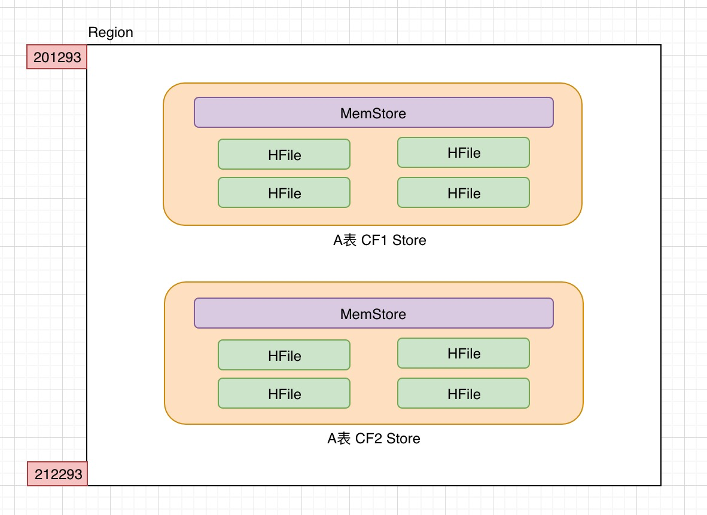
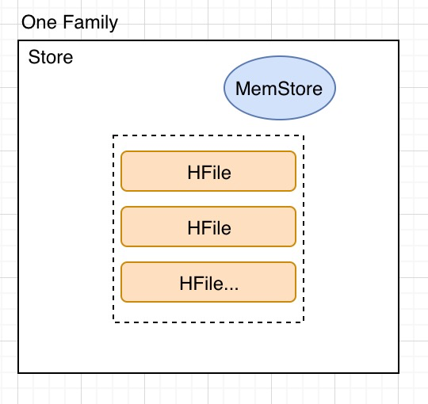

# HBase 写入

Apache [HBase](https://www.iteblog.com/archives/tag/hbase/) 是构建在 HDFS 之上的数据库，使用 [HBase](https://www.iteblog.com/archives/tag/hbase/) 我们可以随机读写存储在 HDFS 上的数据，但是我们都知道，HDFS 上的文件**仅仅只支持追加（Append）**，其默认是不支持修改已经写好的文件。所以很多人就会问，[HBase](https://www.iteblog.com/archives/tag/hbase/)是如何实现低延迟的读写能力呢？文本将试图介绍 HBase 写数据的过程。

其实 HBase 写数据包括 put 和 delete 操作，在 HBase 里面**添加数据和更新数据其实就是一个 put** 操作；**而 delete 数据并不是把原有的数据立即删除**，而仅仅是做一个标记操作，真实的数据会在后面的 `Major Compaction` 过程中删除的。我们往 HBase 里面写数据，首先是经过 HBase Client 的，然后到 RegionServer，最后数据被写到对应的 HFile 里面。

每张 HBase 的表都是由以下三种类型的服务器托管和元数据管理：

- 一个活动（Active）的 master server
- 一个备（backup） master server
- 许多 RegionServer

最终的表数据其实是由 RegionServer 管理的。由于 HBase 表的数据往往很大，这些数据进一步分成许多的 Regions，每个 RegionServer 管理一个或多个 Region。需要注意的是，因为表的数据只有 RegionServer 管理的，所以 master 节点挂掉并不会导致我们数据的丢失。

从整体上看，HBase 的数据就像是一个巨大的有序 map，所有的数据都是按照 RowKey 进行字典排序的，这些排序好的数据被进一步划分成分片或 Region。在默认情况下，当客户端发出插入或更新操作，这些请求被立即发送到对应的 RegionServer。但是为了提高吞吐量，一般我们会将数据缓存（通过关闭 autoflush 选项）在客户端，然后再以批处理的形式提交到 HBase。当 autoflush 被关闭，我们可以通过调用 flush 来提交更新请求，或者通过 **`hbase.client.write.buffer` 参数配置缓存的大小**，当缓存满了也会触发程序提交更新请求。

前面我们说到 HBase 整张表的数据都是有序的，所以我们可以通过 RowKey 来定位到对应的 RegionServer。当客户端对某个 RowKey 进行更新时，其会到 **Zookeeper 里面找到 HBase 的 meta 信息表存储的 RegionServer**。然后到这个 RegionServer 里面查找对应表的某个 RowKey 是由哪个 RegionServer 管理的。最后到这个 RegionServer 里面更新数据。细心的同学可能就发现，如果每次都经过这几步操作的话，那么会大大影响我们写数据的效率；而且这也会大大增加 Zookeeper 的负载。**所以 HBase 客户端会缓存这些元数据**，只有在元数据失效或无元数据的时候才会按照上面的流程定位到对应的 RegionServer。

当更新达到对应的 RegionServer 时，更新并不是直接写到 HFile 里面，因为 HFile 里面的数据是按照 RowKey 排序的，这有助于提升随机读的效率。而且 HFile 是存储在 HDFS 上的，并不支持直接修改。所以如果真要写到 HFile 里面，只能写到新的文件里面。但是如果每次更新都写到一个新文件，那么 HDFS 上会产生大量的小文件！所以这种方式是不支持高效扩展，并且效率极低。所以每次更新操作并不是直接写到 HFile 文件里面的。

事实上，HBase 使用一种称为 memStore 的内存结构来存储来自客户端的更新操作，因为是存储在内存，所以直接在 MemStore 里面进行随机写是非常高效的。同时，存储在 MemStore 里面的数据也是按照 RowKey 进行排序的，这个和 HFile 的组织形式一样。当 MemStore 触发了 Flush 操作的时候，存储在 MemStore 里面的数据就直接写到一个 HFile 里面，因为 MemStore 里面往往存储了很多数据，所以这个操作很高效，并能够充分展示 HDFS 的优势。需要注意的是，每个 HBase 表的每个列族对应一个 MemStore，**同一个 Region 里面可能会包含多个 MemStore**。



虽然按照这种方式使得我们可以快速的将数据写入到 HBase 对应的 RegionServer。但是毕竟 MemStore 是存储在内存的，所以如果对应的 RegionServer 突然挂掉了，那么没有 Flush 的数据就被丢失了，这肯定不是我们想要的。为了解决这个问题，HBase 引入了 WAL（write-ahead-log）机制，所有的更新在写入 MemStore 之前先写到 WAL 里面。而且 WAL 是直接存储在 HDFS 上的，所以通过这种机制，即使对应的 RegionServer 挂了，但是由于 WAL 的存在，数据还是可以恢复的。

在默认情况下，WAL 功能是启用的，在将 WAL 文件写入到磁盘的过程中是需要消耗一些资源的。如果数据丢失对应用程序来说不重要，那么我们是可以关掉 WAL 功能的。

WAL 文件里面的数据组织形式和 HFile 里面的是完全不一样的。WAL 文件里面包含一系列的修改，每条修改代表单个 put 或 delete。这些编辑数据包含当前修改是对应哪个 Region 的。**编辑数据是按照时间编写的**，因此所有的修改都是以**追加**的形式写到 WAL 文件的末尾。由于 WAL 里面的数据是按照修改时间编写的，所以写 WAL 文件不会发生随机写，这样可以大大提高写 WAL 的操作。

当 WAL 文件越来越大，这个文件最终是会被关闭的，然后再创建一个新的 active WAL 文件用于存储后面的更新。这个操作称为 rolling WAL 文件。一旦 WAL 文件发生了 Rolled，这个文件就不会再发生修改。

默认情况下，WAL 文件的大小达到了 HDFS 块大小的 50%（HBase 2.0.0 之前是 95%，详见 [HBASE-19148](https://www.iteblog.com/redirect.php?url=aHR0cHM6Ly9pc3N1ZXMuYXBhY2hlLm9yZy9qaXJhL2Jyb3dzZS9IQkFTRS0xOTE0OA==&article=true)），这个 WAL 文件就会发生 roll 操作。 我们可以通过 `hbase.regionserver.logroll.multiplier` 参数控制达到块大小的多少百分比就发生 roll。我们也可以通过 `hbase.regionserver.hlog.blocksize` 参数来控制块大小（注意，这个块大小不是 HDFS 的块大小）。除了文件大小能触发 rolling，HBase 也会定时去 Rolling WAL 文件，这个时间是通过 `hbase.regionserver.logroll.period` 参数实现的，默认是一小时。这两个策略满足一个就可以出发 WAL 的 Rolling 操作。

WAL 文件的大小对于 HBase 恢复是有影响的，因为 HBase 在使用 WAL 文件恢复数据的时候，对应的 Region 是无法提供服务的，所以**尽量保持少一些的 WAL 文件**。

一个 RegionServer 会包含多个 Region 的，HBase 并不为每个 Region 使用一个 WAL，而是整个 RegionServer 里面的 Regions 共用一个 WAL 日志。同时，**只有一个 WAL 文件处于 active 状态**。WAL 在 HDFS 上的目录格式和文件名称如下：

```
//WAL 目录格式
 
/hbase/WALs/<host>,<port>,<startcode> 
/hbase/WALs/192.168.1.103,16020,1542292581331
 
//WAL 文件名称格式
/hbase/WALs/<host>,<port>,<startcode>/<host>%2C<port>%2C<startcode>.<timestamp>
/hbase/WALs/192.168.1.103,16020,1542292581331/192.168.1.103%2C16021%2C1547646103879.1547646379202
```

> 文中内容基于 https://www.iteblog.com/archives/2502.html 修改。

## Region



region 是 HBase 集群分布数据的最小单位。一张表可以有多个 Region，一个 Region 对应一张表。在表被创建时，会初始化一个 没有 startKey 的 region。

每个 region 有三个主要要素:

- 它所属于哪张表

- 它所包含的的第一行(第一个 region 没有首行，StartKey)

- 它所包含的最后一行(末一个 region 没有末行，EndKey)

### HBase 启动时 Region 初始化

Master启动时调用 AssignmentManager。

AssignmentManager 查看 `hbase:meta` 中已经分配好的 Region

如果 Region 的分配依然有效的话 (如果 RegionServer 仍然在线的话) 维持当前分配

如果分配失效，LoadBalancerFactory 会被调用来分配 region。负载均衡器(HBase 1.0 默认使用 StochasticLoadBalancer ) 分配任务到 Region Server 中

如果需要的话，Region Server 分配信息会更新到 `hbase:meta `中。RegionServer 启动时调用启动代码来启动 region。

### Region 分裂

当表初写数据时，此时表只有一个 region ，当随着数据的增多，region 开始变大，等到它达到限定的阀值大小时，变化把 region 分裂为两个大小基本相同的 region。分裂操作由 RegionServer 单独执行，Master 并不参与，当执行完成之后，将信息同步到 `hbase:meta` 表和 Master。

而这个阀值就是 storefile 的设定大小（参数：`hbase.hregion.max.filesize` 新版本默认10G），在第一次分裂 region之前，所有加载的数据都放在原始区域的那台服务器上，随着表的变大。

Region 太大会导致读取效率太低，遍历时间太长，通过将大数据拆分到不同机器上，分别查询再聚合，HBase 也被人称为“一个会自动分片的数据库”。 

切分策略配置：

```xml
<property>
  <name>hbase.regionserver.region.split.policy</name>
  <value>org.apache.hadoop.hbase.regionserver.IncreasingToUpperBoundRegionSplitPolicy</value></property>
```

HBase 支持手动触发分裂操作。

### Region 合并

有时候存在乐观预估，为表提前创建多个空 Region（预分区）以避免 Region 分裂的性能开销。减少 Region 可以节约资源，空 Region 也是消耗资源的。

步骤：

1. 客户端发送指令给 Master
2. Master 收到指令后将要合并的 region 移动到指定的 RegionServer
3. Master 发送 Merge 请求给指定的 RegionServer 执行合并操作
4. 最后将被合并的 regions 从 `hbase:meta` 中删除并添加合并后的 region

划重点：

- 支持跨 RegionServer

### Region Balance

- HMaster 要花大量的时间来分配和移动 Region

- 过多 Region 会增加 ZooKeeper的负担

- 每个 Region 会对应一个 MapReduce 任务，过多 Region 会产生太多任务

当 region 分裂之后，RegionServer 之间的region数量差距变大时，HMaster 便会执行负载均衡来调整部分 region 的位置，使得每个 RegionServer 的 region 数量保持在合理范围之内，负载均衡会引起 region 的重新定位，使得涉及的 region 不具备数据本地性，即 HFile 和 region 不在同一个 DataNode。这种情况会在 major compaction 之后得到解决。

### Region 迁移

当 RegionServer 发生宕机时，会出现 Region 迁移操作，以保障服务的正常。

1. Region Server挂掉后它上面的regions变得不可用。
2. Master检测到Region Server挂掉了。
3. 失效Region Server上的region分配会被认为无效并采用跟启动时同样顺序的步骤分配region
4. 正在进行的查询操作会重新执行，不会丢失
5. 切换动作要在以下时间内完成：
`ZooKeeper session timeout + split time + assignment/replay time`

### Region的位置选择

Region 位置选择通过 HDFS 的复制机制完成。一般部署 HBase 时，推荐 RegionServer 所在节点同时是` HDFS DataNode` ，可以减少 IO 的消耗。

步骤：

1. 第一个副本写在本地节点

2. 第二副本写到另一个机上任意节点

3. 第三个副本写到跟第二副本相同机架不同节点的其他节点

4. 后面的副本将写到集群中的任意节点中。

> 选址是在 flush 或者 compaction 之后执行。

当 RegionServer 失效后，其上的 Region 被转移到其他的 RegionServer，那么此时被转移的 Region 不具备数据本地性，直到下一次 compaction 执行之后才重新具备数据本地性。

## Store



Store 以列族为单元，即对应表中每个 region 中一个列族，包含一个 MemStore 和 0 到多个 StoreFile（HFile）

### MemStore

MemStore 将数据信息缓存在内存中，**HDFS 文件只允许 Append ，不允许修改，MemStore 会根据 RowKey 进行排序后，再将数据 flush 到 HDFS**， 当 flush 触发时，MemStore 会生成快照保存起来，新的MemStore会继续接收修改信息，指导 flush 完成之后快照会被删除，当一个 MemStore flush 发生时，**属于同一个 region 的 memStore 会一起 flush** 。

好处：

- 在持久化写入之前，在内存中对 Rows/Cells 可以做某些优化。比如，当数据的 version 被设为1的时候，对于某些 CF 的一些数据，Memstore 缓存了数个对该 Cell 的更新，在写入 HFile 的时候，仅需要保存一个最新的版本就好了，其他的都可以直接抛弃。

### MemStore Flush 触发情况

- MemStore 的大小达到单个 MemStore 阀值 

- RegionServer 中所有 MemStore 使用率超过 RegionServer 中 MemStore 上限值，**该 Server 上所有 MemStore 会执行 flush** ，从资源占用最大的 MemStore 开始 flush，直到完成或者小于 RegionServer 中 MemStore 安全值

- RegionServer 中WAL 超过 WAL 阀值

相关配置：

- 单个MemStore阀值：`hbase.hregion.memstore.flush.size`
- RS中MemStore上限值：`hbase.regionserver.global.memstore.upperLimit`
- RS中MemStore安全值：`hbase.regionserver.global.memstore.lowerLimit`
- WAL阀值：`hbase.regionserver.max.logs`

#### 频繁 Flush

要避免“写阻塞”，貌似让 Flush 操作尽量的早于达到触发“写操作”的阈值为宜。但是，这将导致频繁的Flush操作，而由此带来的后果便是**读性能下降以及额外的负载**。

每次的 `Memstore Flush `都会为每个 CF 创建一个 HFile。频繁的 Flush 就会创建大量的 HFile。这样 HBase 在检索的时候，就不得不读取大量的 HFile，读性能会受很大影响。

为预防打开过多HFile及避免读性能恶化，HBase 有专门的 HFile 合并处理 (HFile Compaction Process)。HBase 会周期性的合并数个小HFile为一个大的 HFile。明显的，有 Memstore Flush 产生的 HFile 越多，集群系统就要做更多的合并操作(额外负载)。更糟糕的是：Compaction 处理是跟集群上的其他请求并行进行的。当 HBase 不能够跟上 Compaction 的时候(同样有阈值设置项)，会在 RS 上出现“写阻塞”。像上面说到的，这是最最不希望的。