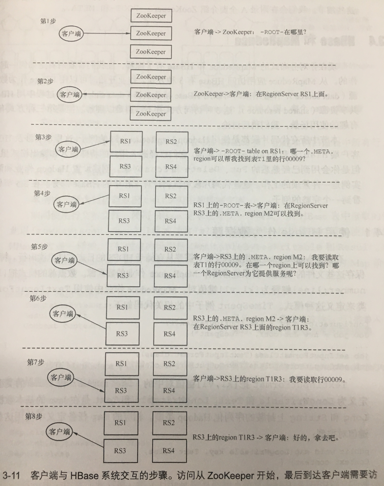

# HBase

[了解HBase](https://mp.weixin.qq.com/s/XNeOceRbpPAUz5_IWLRsyw)

[HBase Shell Command](https://learnhbase.net/2013/03/02/hbase-shell-commands/)

HBase不适合做批量扫描数据分析的原因

HBase本身的设计并不适合批量获取数据,都说HBase是列式数据库，其实从底层存储的角度来说它并不是列式的，获取指定列数据时是会读到其他列数据的。相对HBase而言,Parquet格式针对分析场景就做了很多优化。HBase是LSM-Tree架构的数据库，这导致了HBase读取数据路径比较长，从内存到磁盘，可能还需要读多个HFile文件做版本合并。LSM 的中心思想就是将随机写转换为顺序写来大幅提高写入操作的性能，但是牺牲了部分读的性能。

## HBase Master

HMaster服务器控制HBase集群。您可以启动最多9个备用HMaster服务器，这使得10个HMaster服务器成为主服务器。要启动备份HMaster，请使用`local-master-backup.sh`。对于要启动的每个备份主站，添加一个表示该主站的端口偏移量的参数。每个HMaster使用两个端口（默认为16000和16010）。端口偏移量将添加到这些端口，因此使用偏移量2，备份HMaster将使用端口16002和16012.以下命令使用端口16002 / 16012,16003 / 16013和16005/16015启动3个备份服务器。

```shell
./bin/local-master-backup.sh start 2 3 5
```

文件打开数

```
(StoreFiles per ColumnFamily) x (regions per RegionServer)
```

在大多数情况下都可以通过减小StoreFiles的大小来提高性能，从而减少I / O.

HBase使用[wal](https://hbase.apache.org/book.html#wal)来恢复在RS出现故障时尚未刷新到磁盘的memstore数据。这些WAL文件应配置为略小于HDFS块（默认情况下，HDFS块为64Mb，WAL文件为~60Mb）。

## HStore

HStore由一个Memstore及一系列HFile组成。

### MemStore

每个列族都有一个 MemStore，存在于内存之中。

当 RS 处理写请求的时候，数据首先写入到 Memstore，然后当到达一定的阀值的时候，Memstore 中的数据会被刷到 HFile 中。

## HBase 查数据



## 热点问题

以时间戳作为行键，当大量的同一时间的数据执行插入操作时，负责处理该批数据的 Region 就会成为一个热点，写入的性能取决于单个 Region 的吞吐能力，并且也使该 Region 所在的服务器受到了风险。

## 列族

只有不同的列族同时被查询的可能性比较低的时候，才使用多列族。


## HFile

HFile 由多个数据块组成。数据块索引记录着每个数据块的起始键。数据块越小，索引越大，因而占用的内存空间越大，加载进内存的数据块更小，随机查询性能更好。

```
# 默认 65536 Bytes ,64KB
create 'mytable',{NAME => 'clofam1',BLOCKSIZE=>'65536'}
```

顺序扫描访问的时候，可以考虑将缓存关闭，释放资源给其他的表或者同一个表的不同列族。**顺序扫描会多次倒腾缓存，导致应该通过缓存优化查询性能的数据被排挤。**

```
# 默认打开的
create 'mytable',{NAME => 'clofam1',BLOCKSIZE=>'false'}
```

## flush时机（触发条件） 

- MemStore级别限制

   Region中任意一个MemStore的大小超过上限（hbase.hregion.memstore.flush.size，默认128MB），会触发MemStore刷新

- HRegion 级别限制

   当Region中所有的MemStore的总和大小超过上限（hbase.hregion.memstore.block.multiplier * hbase.hregion.memstore.flush.size，默认 2* 128M = 256M），会触发MemStore刷新

- HRegion Server级别限制

   当一个Regoin server中的所有MemStore的总和大小超过上限（hbase.regionserver.global.memstore.upperLimit * hbase_heapsize，默认40%的JVM内存使用量）回触发**部分MemStore**刷新。刷新的顺序是按照MemStore的大小排序，先刷新最大的MemStore所在的Region，再刷新次大的，直至总体Memstore内存使用量低于阈值（hbase.regionserver.global.memstore.lowerLimit * hbase_heapsize，默认38%的JVM内存使用量）。

- HRegion Server log限制

​       当一个Region Server中HLog数量达到上限（可通过参数hbase.regionserver.maxlogs配置）时，系统会选取最早的一个 HLog对应的一个或多个Region进行flush

- MemStore 定时flush

   默认周期为1小时，确保Memstore不会长时间没有持久化。为避免所有的MemStore在同一时间都进行flush导致的问题，定期的flush操作有20000左右的随机延时。

- client手动flush

​        用户可以通过shell命令 flush ‘tablename’或者flush ‘region name’分别对一个表或者一个Region进行flush。

## 参数指南

**hbase.hregion.memstore.block.multiplier**

**默认值：**2
**说明**：当一个region里的memstore占用内存大小超过hbase.hregion.memstore.flush.size两倍的大小时，block该region的所有请求，进行flush，释放内存。
虽然我们设置了region所占用的memstores总内存大小，比如64M，但想象一下，在最后63.9M的时候，我Put了一个200M的数据，此时memstore的大小会瞬间暴涨到超过预期的hbase.hregion.memstore.flush.size的几倍。这个参数的作用是当memstore的大小增至超过hbase.hregion.memstore.flush.size 2倍时，block所有请求，遏制风险进一步扩大。
**调优**： 这个参数的默认值还是比较靠谱的。如果你预估你的正常应用场景（不包括异常）不会出现突发写或写的量可控，那么保持默认值即可。如果正常情况下，你的写请求量就会经常暴长到正常的几倍，那么你应该调大这个倍数并调整其他参数值，比如hfile.block.cache.size和hbase.regionserver.global.memstore.upperLimit/lowerLimit，以预留更多内存，防止HBase server OOM。

## 锁表恢复

1.获取表的状态
get 'hbase:meta','DMP:DS_TRMALL_ORDER_GOOD','table:state'
2.disable
 put 'hbase:meta','DMP:DS_TRMALL_ORDER_GOOD','table:state',"\b\1"
3.确保表锁了
 is_disabled 'DMP:DS_TRMALL_ORDER_GOOD'
4.备份表
 snapshot 'DMP:DS_TRMALL_ORDER_GOOD', 'cata_tableSnapshot'
5.查看快照，确保有快照内容
 list_snapshots
6.还原表
 restore_snapshot 'cata_tableSnapshot'
7.重启master
8.enbale 表
enable 'DMP:DS_TRMALL_ORDER_GOOD'