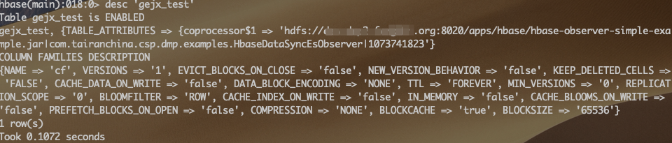
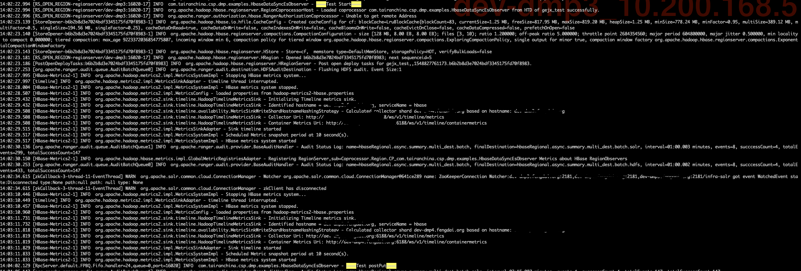
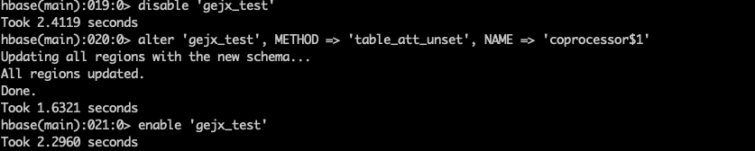
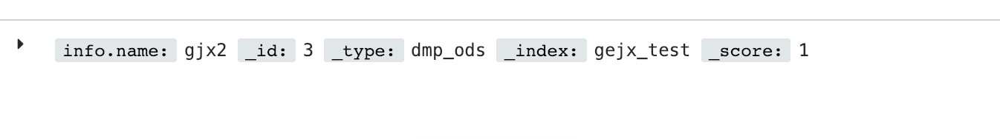

# HBase 2.0 协处理器实现 ES 数据同步

在正式进行讲述实现之前，我觉得有必要说一下出发点。团队期初数据都是基于 `HBase+Phoenix` 这样架构进行持久化。随着业务的复杂性增加，对部分表的查询效率和查询条件多样性，提出了更高的要求。`HBase+Phoenix` 就会出现索引滥用。变更索引变的特别的频繁，同时一些数据客观的表，变更索引的代价是非常大的。

在海量数据的查询方面，[Elasticsearch](https://www.elastic.co/) 具有出色的性能。如果 `HBase+ES` 是不是会是更好的解决方法呢？其实，这个时候会有一个思考点，Phoenix 是如何实现二级索引的？**HBase 协处理器（Coprocessor）** 。

我的实现过程比较曲折，后文中也会提到，以帮助大家避免这些坑。在过程中，还尝试了另一种实现方案。存放两份数据，一份 HBase，一份 ES。该方案需要解决的一个问题——**数据一致性问题**，但这个问题协处理器可以解决。在此过程中，由于不当操作，把 HBase 服务宕机了，现象是 `REGION SERVERS` 无法启动，只有通过硬删的方式解决。

出于不死心，在经历重装 HBase 之后。内心又开始蠢蠢欲动。首先要声明一下，我们团队的环境是 `HDP 3.0、HBase 2.0` ，网上很多教程都是基于 `1.X`，`2.X 与 1.X` 区别还是挺大的。`RegionObserver` 从继承方式改为了面向接口编程。

## 协处理器

没有选择协处理情况下，HBase 实现 RDBMS SQL 方式查询数据，大量的 Filter 需要在客户端进行编码完成，代码的臃肿，可维护性大大降低。如果这部分操作在服务器端完成，是否是更好的选择呢。协处理就能帮助实现该设想，由于在服务端完成，可以集中式优化查询，降低请求的带宽和提高查询效率。当然，对 HBase 性能产生了一定影响。

### 类型

- Observer
- Endpoint 

#### Observer

Observer 协处理器类似于 RDBMS 中的触发器，当事件触发的时候该类协处理器会被 Server 端调用。

#### Endpoint

Endpoint 协处理器类似传统数据库中的存储过程，完成一些聚合操作。

## 实现

### 基础尝试

避免 ES 连接操作、代码复杂性导致的 Bug，在最初只通过打日志的方式来验证协处理方式。

#### 代码实现概览

`HbaseDataSyncEsObserver.java`

```java
package com.tairanchina.csp.dmp.examples;

import org.apache.hadoop.hbase.CoprocessorEnvironment;
import org.apache.hadoop.hbase.client.Delete;
import org.apache.hadoop.hbase.client.Durability;
import org.apache.hadoop.hbase.client.Put;
import org.apache.hadoop.hbase.coprocessor.ObserverContext;
import org.apache.hadoop.hbase.coprocessor.RegionCoprocessor;
import org.apache.hadoop.hbase.coprocessor.RegionCoprocessorEnvironment;
import org.apache.hadoop.hbase.coprocessor.RegionObserver;
import org.apache.hadoop.hbase.wal.WALEdit;
import org.apache.log4j.Logger;

import java.io.IOException;
import java.util.Optional;

public class HbaseDataSyncEsObserver implements RegionObserver, RegionCoprocessor {

    private static final Logger LOG = Logger.getLogger(HbaseDataSyncEsObserver.class);

    public Optional<RegionObserver> getRegionObserver() {
        return Optional.of(this);
    }

    public void start(CoprocessorEnvironment env) throws IOException {
        LOG.info("====Test Start====");
    }

    public void stop(CoprocessorEnvironment env) throws IOException {
        LOG.info("====Test End====");
    }

    public void postPut(ObserverContext<RegionCoprocessorEnvironment> e, Put put, WALEdit edit, Durability durability) throws IOException {
        LOG.info("====Test postPut====");
    }
    public void postDelete(ObserverContext<RegionCoprocessorEnvironment> e, Delete delete, WALEdit edit, Durability durability) throws IOException {
        LOG.info("====Test postDelete====");
    }
}

```

`pom.xml`

```xml
<?xml version="1.0" encoding="UTF-8"?>
<project xmlns="http://maven.apache.org/POM/4.0.0"
         xmlns:xsi="http://www.w3.org/2001/XMLSchema-instance"
         xsi:schemaLocation="http://maven.apache.org/POM/4.0.0 http://maven.apache.org/xsd/maven-4.0.0.xsd">
    <modelVersion>4.0.0</modelVersion>
    <groupId>com.tairanchina.csp.dmp</groupId>
    <artifactId>hbase-observer-simple-example</artifactId>
    <version>1.0.0-SNAPSHOT</version>
    <packaging>jar</packaging>
    <name>HBase Observer Simple 用例</name>

    <properties>
        <hbase.version>2.0.0</hbase.version>
        <java.version>1.8</java.version>
        <project.build.sourceEncoding>UTF-8</project.build.sourceEncoding>
        <maven.deploy.skip>true</maven.deploy.skip>
        <maven.install.skip>true</maven.install.skip>
    </properties>

    <dependencies>
        <dependency>
            <groupId>org.apache.hbase</groupId>
            <artifactId>hbase-client</artifactId>
            <version>${hbase.version}</version>
            <exclusions>
                <exclusion>
                    <artifactId>jetty-servlet</artifactId>
                    <groupId>org.eclipse.jetty</groupId>
                </exclusion>
            </exclusions>
        </dependency>
        <dependency>
            <groupId>org.apache.hadoop</groupId>
            <artifactId>hadoop-hdfs-client</artifactId>
            <version>3.1.0</version>
        </dependency>
        <dependency>
            <groupId>org.apache.hbase</groupId>
            <artifactId>hbase-server</artifactId>
            <version>${hbase.version}</version>
            <exclusions>
                <exclusion>
                    <artifactId>javax.servlet.jsp</artifactId>
                    <groupId>org.glassfish.web</groupId>
                </exclusion>
            </exclusions>
        </dependency>
    </dependencies>
    <build>
        <plugins>
            <plugin>
                <groupId>org.apache.maven.plugins</groupId>
                <artifactId>maven-compiler-plugin</artifactId>
                <configuration>
                    <source>${java.version}</source>
                    <target>${java.version}</target>
                    <encoding>${project.build.sourceEncoding}</encoding>
                </configuration>
            </plugin>
            <plugin>
                <artifactId>maven-assembly-plugin</artifactId>
                <configuration>
                    <descriptorRefs>
                        <descriptorRef>jar-with-dependencies</descriptorRef>
                    </descriptorRefs>
                    <archive>
                        <manifest>
                            <mainClass></mainClass>
                        </manifest>
                    </archive>
                </configuration>
                <executions>
                    <execution>
                        <id>make-assembly</id>
                        <phase>package</phase>
                        <goals>
                            <goal>single</goal>
                        </goals>
                    </execution>
                </executions>
            </plugin>
        </plugins>
    </build>

</project>
```

#### 包处理

打包

```shell
mvn clean assembly:assembly -Dmaven.test.skip=true
```

> 这里 package 得到的包必须是将依赖都包含在内的，否则，会报类找不到之类的错误。

上传包的时候，需要上传到 HDFS 下，同时，要给 hbase 用户授予权限，因而，我在测试的过程中，将其上传到 `/apps/hbase`  下（HDP 环境）。由于包名太长，这里对包名进行了重命名。


#### 装载协处理器

```shell
# 创建测试表
create 'gejx_test','cf'
# 停用测试表
disable 'gejx_test'
# 表与协处理器建立关系
alter 'gejx_test' , METHOD =>'table_att','coprocessor'=>'hdfs://dev-dmp2.fengdai.org:8020/apps/hbase/hbase-observer-simple-example.jar|com.tairanchina.csp.dmp.examples.HbaseDataSyncEsObserver|1073741823'
# 启用表
enable 'gejx_test'
# 查看表信息
desc 'gejx_test'
```



#### 测试

```shell
put 'gejx_test', '2','cf:name','gjx1'
delete 'gejx_test', '2','cf:name'
```




查看日志要先在 `HBase Master UI` 界面下，确定数据存储在哪个节点上，再到相应的节点下面的 `/var/log/hbase` 下查看日志

```shell
tail -100f hbase-hbase-regionserver-test.example.org.out
```

#### 卸载协处理器

```shell
disable 'gejx_test'
alter 'gejx_test', METHOD => 'table_att_unset', NAME => 'coprocessor$1'
enable 'gejx_test'
```



以上，已经完成最基础的协处理器实现。接下来进行讲述 ES 的一种实现方案。

### HBase+ES

> 这里为了快速论证结果，在编码方面采用了硬编码方式，希望理解。

#### 代码实现概览

`ElasticSearchBulkOperator.java`

```java
package com.tairanchina.csp.dmp.examples;

import org.apache.commons.logging.Log;
import org.apache.commons.logging.LogFactory;
import org.elasticsearch.action.bulk.BulkRequestBuilder;
import org.elasticsearch.action.bulk.BulkResponse;
import org.elasticsearch.action.delete.DeleteRequestBuilder;
import org.elasticsearch.action.support.WriteRequest;
import org.elasticsearch.action.update.UpdateRequestBuilder;

import java.util.concurrent.Executors;
import java.util.concurrent.ScheduledExecutorService;
import java.util.concurrent.TimeUnit;
import java.util.concurrent.locks.Lock;
import java.util.concurrent.locks.ReentrantLock;

/**
 * Created on 2019/1/11.
 *
 * @author 迹_Jason
 */
public class ElasticSearchBulkOperator {

    private static final Log LOG = LogFactory.getLog(ElasticSearchBulkOperator.class);

    private static final int MAX_BULK_COUNT = 10000;

    private static BulkRequestBuilder bulkRequestBuilder = null;

    private static final Lock commitLock = new ReentrantLock();

    private static ScheduledExecutorService scheduledExecutorService = null;
    static {
        // init es bulkRequestBuilder
        bulkRequestBuilder = ESClient.client.prepareBulk();
        bulkRequestBuilder.setRefreshPolicy(WriteRequest.RefreshPolicy.IMMEDIATE);

        // init thread pool and set size 1
        scheduledExecutorService = Executors.newScheduledThreadPool(1);

        // create beeper thread( it will be sync data to ES cluster)
        // use a commitLock to protected bulk es as thread-save
        final Runnable beeper = () -> {
            commitLock.lock();
            try {
                bulkRequest(0);
            } catch (Exception ex) {
                System.out.println(ex.getMessage());
            } finally {
                commitLock.unlock();
            }
        };

        // set time bulk task
        // set beeper thread(10 second to delay first execution , 30 second period between successive executions)
        scheduledExecutorService.scheduleAtFixedRate(beeper, 10, 30, TimeUnit.SECONDS);

    }
    public static void shutdownScheduEx() {
        if (null != scheduledExecutorService && !scheduledExecutorService.isShutdown()) {
            scheduledExecutorService.shutdown();
        }
    }
    private static void bulkRequest(int threshold) {
        if (bulkRequestBuilder.numberOfActions() > threshold) {
            BulkResponse bulkItemResponse = bulkRequestBuilder.execute().actionGet();
            if (!bulkItemResponse.hasFailures()) {
                bulkRequestBuilder = ESClient.client.prepareBulk();
            }
        }
    }

    /**
     * add update builder to bulk
     * use commitLock to protected bulk as thread-save
     * @param builder
     */
    public static void addUpdateBuilderToBulk(UpdateRequestBuilder builder) {
        commitLock.lock();
        try {
            bulkRequestBuilder.add(builder);
            bulkRequest(MAX_BULK_COUNT);
        } catch (Exception ex) {
            LOG.error(" update Bulk " + "gejx_test" + " index error : " + ex.getMessage());
        } finally {
            commitLock.unlock();
        }
    }

    /**
     * add delete builder to bulk
     * use commitLock to protected bulk as thread-save
     *
     * @param builder
     */
    public static void addDeleteBuilderToBulk(DeleteRequestBuilder builder) {
        commitLock.lock();
        try {
            bulkRequestBuilder.add(builder);
            bulkRequest(MAX_BULK_COUNT);
        } catch (Exception ex) {
            LOG.error(" delete Bulk " + "gejx_test" + " index error : " + ex.getMessage());
        } finally {
            commitLock.unlock();
        }
    }
}
```

`ESClient.java`

```java
package com.tairanchina.csp.dmp.examples;

/**
 * Created on 2019/1/10.
 *
 * @author 迹_Jason
 */

import org.elasticsearch.client.Client;
import org.elasticsearch.common.settings.Settings;
import org.elasticsearch.common.transport.TransportAddress;
import org.elasticsearch.transport.client.PreBuiltTransportClient;

import java.net.InetAddress;
import java.net.UnknownHostException;

/**
 * ES Cleint class
 */
public class ESClient {
    
    public static Client client;
    
    /**
     * init ES client
     */
    public static void initEsClient() throws UnknownHostException {
        System.setProperty("es.set.netty.runtime.available.processors", "false");
        Settings esSettings = Settings.builder().put("cluster.name", "elasticsearch").build();//设置ES实例的名称
        client = new PreBuiltTransportClient(esSettings).addTransportAddress(new TransportAddress(InetAddress.getByName("localhost"), 9300));

    }

    /**
     * Close ES client
     */
    public static void closeEsClient() {
        client.close();
    }
}
```

`HbaseDataSyncEsObserver.java`

```java
package com.tairanchina.csp.dmp.examples;

import org.apache.hadoop.hbase.Cell;
import org.apache.hadoop.hbase.CellUtil;
import org.apache.hadoop.hbase.CoprocessorEnvironment;
import org.apache.hadoop.hbase.client.Delete;
import org.apache.hadoop.hbase.client.Durability;
import org.apache.hadoop.hbase.client.Put;
import org.apache.hadoop.hbase.coprocessor.ObserverContext;
import org.apache.hadoop.hbase.coprocessor.RegionCoprocessor;
import org.apache.hadoop.hbase.coprocessor.RegionCoprocessorEnvironment;
import org.apache.hadoop.hbase.coprocessor.RegionObserver;
import org.apache.hadoop.hbase.util.Bytes;
import org.apache.hadoop.hbase.wal.WALEdit;
import org.apache.log4j.Logger;

import java.io.IOException;
import java.util.*;

/**
 * Created on 2019/1/10.
 *
 * @author 迹_Jason
 */
public class HbaseDataSyncEsObserver implements RegionObserver , RegionCoprocessor {

    private static final Logger LOG = Logger.getLogger(HbaseDataSyncEsObserver.class);

    public Optional<RegionObserver> getRegionObserver() {
        return Optional.of(this);
    }

    @Override
    public void start(CoprocessorEnvironment env) throws IOException {
        // init ES client
        ESClient.initEsClient();
        LOG.info("****init start*****");
    }

    @Override
    public void stop(CoprocessorEnvironment env) throws IOException {
        ESClient.closeEsClient();
        // shutdown time task
        ElasticSearchBulkOperator.shutdownScheduEx();
        LOG.info("****end*****");
    }

    @Override
    public void postPut(ObserverContext<RegionCoprocessorEnvironment> e, Put put, WALEdit edit, Durability durability) throws IOException {
        String indexId = new String(put.getRow());
        try {
            NavigableMap<byte[], List<Cell>> familyMap = put.getFamilyCellMap();
            Map<String, Object> infoJson = new HashMap<>();
            Map<String, Object> json = new HashMap<>();
            for (Map.Entry<byte[], List<Cell>> entry : familyMap.entrySet()) {
                for (Cell cell : entry.getValue()) {
                    String key = Bytes.toString(CellUtil.cloneQualifier(cell));
                    String value = Bytes.toString(CellUtil.cloneValue(cell));
                    json.put(key, value);
                }
            }
            // set hbase family to es
            infoJson.put("info", json);
            LOG.info(json.toString());
            ElasticSearchBulkOperator.addUpdateBuilderToBulk(ESClient.client.prepareUpdate("gejx_test","dmp_ods", indexId).setDocAsUpsert(true).setDoc(json));
            LOG.info("**** postPut success*****");
        } catch (Exception ex) {
            LOG.error("observer put  a doc, index [ " + "gejx_test" + " ]" + "indexId [" + indexId + "] error : " + ex.getMessage());
        }
    }
    @Override
    public void postDelete(ObserverContext<RegionCoprocessorEnvironment> e, Delete delete, WALEdit edit, Durability durability) throws IOException {
        String indexId = new String(delete.getRow());
        try {
            ElasticSearchBulkOperator.addDeleteBuilderToBulk(ESClient.client.prepareDelete("gejx_test", "dmp_ods", indexId));
            LOG.info("**** postDelete success*****");
        } catch (Exception ex) {
            LOG.error(ex);
            LOG.error("observer delete  a doc, index [ " + "gejx_test" + " ]" + "indexId [" + indexId + "] error : " + ex.getMessage());

        }
    }
}
```

其他方面的操作与上文操作类似，这里不再进行缀诉，直接看 Kibana 结果。



## 讲在最后

上文中 `HBase+ES` 实现方案是在 `HBase 和 ES` 各自存放一份数据，使用协处理器达到数据一致性。这种方案存在数据冗余问题，在 ES 这边需要准备大量的存储空间。

还有一种方案也是比较流行的。使用 ES 作为二级索引的实现。使用协处理将需要查询的表查询字段与 RowKey 关系保存到 ES，查询数据的时候，先根据条件查询 ES 得到 RowKey，通过得到的 RowKey 查询 HBase 数据。以提高查询的效率。

Anyway，这两种方案都需要解决历史数据的问题和还有需要注意数据更新操作。

### Q&A

- 遇到 `None of the configured nodes are available` 错误信息？

  请检查一下 ES 的 `cluster.name` 配置是否错误。

- 为什么`Hbase 2.0 Observer` 未生效？

  `HBase 2.0` 中 observer 接口有变化。你需要实现 `RegionCoprocessor` 的 `getRegionObserver` 接口。

- 发现已经更新包，协处理器还是在执行历史代码？

  当更新包的时候，要进行包名的变更，否则，可能会出现类似于缓存的现象问题。

- HDFS NameNode 存在多节点的场景，那么怎么保证动态切换呢？

  在 `coprocessor` 参数下不使用 `hdfs url`

  ```
  /apps/hbase/hbase-observer-simple-example-v2.jar|com.tairanchina.csp.dmp.examples.HbaseDataSyncEsObserver|1073741823
  ```

- 使用协处理这种方式的时候，遇到 HBase 服务宕机问题

  `Hbase-site.xml` 添加 `hbase.coprocessor.abortonerror = false` ，默认是 true

- `java.lang.LinkageError: org/apache/hadoop/conf/Configuration` 错误解决

  原因是包冲突导致的。

- ```xml
  <dependencies>
          <dependency>
              <groupId>org.apache.hbase</groupId>
              <artifactId>hbase-client</artifactId>
              <version>2.0.0</version>
              <exclusions>
                  <exclusion>
                      <artifactId>jetty-servlet</artifactId>
                      <groupId>org.eclipse.jetty</groupId>
                  </exclusion>
                  <exclusion>
                      <artifactId>hadoop-common</artifactId>
                      <groupId>org.apache.hadoop</groupId>
                  </exclusion>
                  <exclusion>
                      <artifactId>commons-lang</artifactId>
                      <groupId>commons-lang</groupId>
                  </exclusion>
                  <exclusion>
                      <artifactId>commons-logging</artifactId>
                      <groupId>commons-logging</groupId>
                  </exclusion>
                  <exclusion>
                      <artifactId>log4j</artifactId>
                      <groupId>log4j</groupId>
                  </exclusion>
                  <exclusion>
                      <artifactId>commons-math3</artifactId>
                      <groupId>org.apache.commons</groupId>
                  </exclusion>
                  <exclusion>
                      <artifactId>zookeeper</artifactId>
                      <groupId>org.apache.zookeeper</groupId>
                  </exclusion>
                  <exclusion>
                      <artifactId>jackson-core-asl</artifactId>
                      <groupId>org.codehaus.jackson</groupId>
                  </exclusion>
                  <exclusion>
                      <artifactId>jackson-mapper-asl</artifactId>
                      <groupId>org.codehaus.jackson</groupId>
                  </exclusion>
                  <exclusion>
                      <artifactId>slf4j-api</artifactId>
                      <groupId>org.slf4j</groupId>
                  </exclusion>
                  <exclusion>
                      <artifactId>slf4j-log4j12</artifactId>
                      <groupId>org.slf4j</groupId>
                  </exclusion>
              </exclusions>
          </dependency>
          <dependency>
              <groupId>org.apache.hadoop</groupId>
              <artifactId>hadoop-hdfs-client</artifactId>
              <version>3.1.0</version>
          </dependency>
          <dependency>
              <groupId>org.apache.hbase</groupId>
              <artifactId>hbase-server</artifactId>
              <version>2.0.0</version>
              <exclusions>
                  <exclusion>
                      <artifactId>javax.servlet.jsp</artifactId>
                      <groupId>org.glassfish.web</groupId>
                  </exclusion>
              </exclusions>
              <scope>provided</scope>
          </dependency>
      </dependencies>
  ```

- `ERROR: org.apache.hadoop.hbase.DoNotRetryIOException: error in opening zip file Set hbase.table.sanity.checks to false at conf or table descriptor if you want to bypass sanity checks`

- ```xml
  //hbase-site.xml
  <property>
    <name>hbase.table.sanity.checks</name>
    <value>false</value>
  </property>
  ```

### 待确认

- [ ] 未停用的情况下，更新 jar（已测试未操作表的时候，支持更新）
- [ ] 测试多张表公用同一个 jar

### 引文

[使用Hbase协作器(Coprocessor)同步数据到ElasticSearch](https://blog.csdn.net/fxsdbt520/article/details/53884338)

[面向高稳定，高性能之-Hbase数据实时同步到ElasticSearch(之二)](https://blog.csdn.net/zhulangfly/article/details/73604449)

[使用HBase Coprocessor](http://www.zhyea.com/2017/04/13/using-hbase-coprocessor.html)

[HBase 源码](https://github.com/apache/hbase/blob/master/hbase-examples/src/main/java/org/apache/hadoop/hbase/coprocessor/example/ExampleRegionObserverWithMetrics.java)

[HBase Coprpcesspr](https://hbase.apache.org/2.0/book.html#cp)

[协处理 Demo](https://www.programcreek.com/java-api-examples/?class=org.apache.hadoop.hbase.CoprocessorEnvironment&method=getConfiguration)

[Hbase coprocessor 初涉](https://juejin.im/post/5c40844f6fb9a049aa6f5dad)