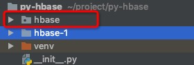

# HBase Thrift with Python

**说在文前**

本文内容是基于 `Centos 7、HDP 3.0.0、HBase 2.0.0、Python 2.7` 环境下，其他环境的童鞋选择性进行参考。

Thrift 安装在 HBase 服务节点上即可。

HBase 实现了两套Thrift Server服务，有两种 Thrift IDL 文件，提供了两套数据结构:

- 第一套有 TCell， ColumnDescriptor，TRegionInfo 等，它的 API 比较全，它不仅有读写 API，同时也有创建删除等 API；
- 第二套有 TTimeRange, TColumn, TColumnValue 等，它更加接近 HBase Java API 的调用方式，但是它的 API 比较少，只有读写表的API），它们最后都是通过 HBase Client 的 Java  API 来完成操作。

## 安装 Thrift

### 安装依赖包

```
yum install -y automake libtool flex bison pkgconfig gcc-c++ libevent-devel zlib-devel python-devel ruby-devel openssl-devel
```

### 安装 boost (CentOS 7 必做)

```
wget https://dl.bintray.com/boostorg/release/1.64.0/source/boost_1_64_0.tar.gz
tar zxvf boost_1_64_0.tar.gz
cd boost_1_64_0
./bootstrap.sh
./b2 install
```

### 下载 Thrift

```
wget https://archive.apache.org/dist/thrift/0.10.0/thrift-0.10.0.tar.gz
tar zxvf thrift-0.10.0.tar.gz
cd thrift-0.10.0/
./configure  或者 ./configure --with-boost=/usr/local  --without-java --without-php
make
make install
# 进行确认安装成功
thrift -help
```

> 0.10.0 版本之前的不支持 python 3.5

生成 `hbase.thrift`

`HDP` 下 HBase 相应的安装目录下本身就已经存在 `hbase.thrift` 文件了，所以我们不需要自行创建了。

生成指定语言的代码

```
# hdp hbase.thrift 文件路径
cd /usr/hdp/3.0.0.0-1634/hbase/include/thrift/
# 生成 python
# 该路径下存在 thrift1 和 thrift2 两种，可以自行选择
thrift -gen py hbase1.thrift 或 thrift -gen py hbase2.thrift
```

执行完该命令之后，会生成一个 gen-py 目录，将该目录下 hbase 文件下载到本地项目中。(hbase-1 请忽略)



### 启动 Thrift 服务

```
cd /usr/hdp/3.0.0.0-1634/hbase/bin/
./hbase-daemon.sh start thrift -p 9090 --infoport 8086
```

> 日志路径为 /var/log/hbase/

**使用 Thrift 2 模式**

```
./hbase-daemon.sh start thrift2 -p 9090 --infoport 8086
./hbase-daemon.sh stop thrift
```

### Python 方式连接

#### Thrift_1 模式

```python
from thrift.transport.TSocket import TSocket
from thrift.transport.TTransport import TBufferedTransport
from thrift.protocol import TBinaryProtocol
from hbase import Hbase

if __name__ == '__main__':
    transport = TBufferedTransport(TSocket('10.200.168.18', 9090))
    transport.open()
    protocol = TBinaryProtocol.TBinaryProtocol(transport)
    client = Hbase.Client(protocol)
    client.get()
    print(client.getTableNames())
```

> hbase 源于 上文中 hbase 目录文件包

#### Thrift_2 模式

```python
from thrift.transport.TSocket import TSocket
from thrift.transport.TTransport import TBufferedTransport
from thrift.protocol import TBinaryProtocol
from hbase import THBaseService
from hbase.ttypes import TGet
import logging
if __name__ == '__main__':
    logging.basicConfig(level=logging.DEBUG)
    transport = TBufferedTransport(TSocket('10.200.168.18', 9090))
    transport.open()
    protocol = TBinaryProtocol.TBinaryProtocol(transport)
    client = THBaseService.Client(protocol)
    tget = TGet(row = '321ahah')
    tresult = client.get('shop', tget)
    for col in tresult.columnValues:
        print(col.qualifier, '=', col.value)
    print(client.send_get())
    transport.close()
```

## Kerberos On Thrift

### 服务配置

`core-site.xml`

```
hadoop.proxyuser.hbase.groups=*
hadoop.proxyuser.hbase.hosts=*
```

`hbase-site.xml`

```
hbase.thrift.security.qop=auth
hbase.thrift.support.proxyuser=true
hbase.regionserver.thrift.http=false  # 使用http方式设为 true，binary 方式设为 false
hbase.thrift.keytab.file=/etc/security/keytabs/hbase.service.keytab 
hbase.thrift.kerberos.principal=hbase/_HOST@DEVDIP.COM 
hbase.security.authentication.spnego.kerberos.keytab=/etc/security/keytabs/spnego.service.keytab 
hbase.security.authentication.spnego.kerberos.principal=HTTP/_HOST@DEVDIP.COM 
```

> 重启 HDFS 和 HBase

### 重启 Thrift 服务

```
# 停止
./hbase-daemon.sh stop thrift
# 启动
kinit -kt /etc/security/keytabs/hbase.headless.keytab hbase-dev_dmp & /usr/hdp/3.0.0.0-1634/hbase/bin/hbase-daemon.sh start thrift -p 9090 --infoport 8086
# To test the thrift server in http mode the syntax is:
hbase org.apache.hadoop.hbase.thrift.HttpDoAsClient DEVDIP.ORG 9090 hbase true
# to test in binary mode the syntax is:
hbase org.apache.hadoop.hbase.thrift.DemoClient DEVDIP.ORG 9090 true
```

示例


`/var/log/hbase`


[参考文章](https://community.hortonworks.com/articles/87655/start-and-test-hbase-thrift-server-in-a-kerberised.html)

### Python 方式连接

#### Thrift_1 模式

```python
#!/usr/bin/env python
from thrift.transport import TSocket
from thrift.protocol import TBinaryProtocol
from thrift.transport import TTransport
from hbase import Hbase

# Apache HBase Thrift server coordinates (network location)
thriftServer = "dev-dmp5.fengdai.org"
thriftPort = 9090
# The service name is the "primary" component of the Kerberos principal the
# Thrift server uses.
# See: http://web.mit.edu/kerberos/krb5-1.5/krb5-1.5.4/doc/krb5-user/What-is-a-Kerberos-Principal_003f.html
# e.g. For a server principal of 'hbase/localhost@EXAMPLE.COM', the primary is "hbase"
saslServiceName = "hbase"

# HBase table and data information
tableName = 'demo_table'
row = 'test2'
colName = "cf:name"

if __name__ == '__main__':
    # Open a socket to the server
    sock = TSocket.TSocket(thriftServer, thriftPort)
    # Set up a SASL transport.
    transport = TTransport.TSaslClientTransport(sock, thriftServer, saslServiceName)
    transport.open()
    # Use the Binary protocol (must match your Thrift server's expected protocol)
    protocol = TBinaryProtocol.TBinaryProtocol(transport)

    client = Hbase.Client(protocol)
    # Pass the above to the generated HBase clietn

    # Fetch a row from HBase
    print "Row=>%s" % (client.getRow(tableName, row, {}))

    # Cleanup
    transport.close()
```

#### Thrift_2 模式

```python
#!/usr/bin/env python
from thrift.protocol import TBinaryProtocol
from thrift.transport import TSocket

from hbase import THBaseService
from hbase.ttypes import *

# Apache HBase Thrift server coordinates (network location)
thriftServer = "dev-dmp5.fengdai.org"
thriftPort = 9090
# The service name is the "primary" component of the Kerberos principal the
# Thrift server uses.
# See: http://web.mit.edu/kerberos/krb5-1.5/krb5-1.5.4/doc/krb5-user/What-is-a-Kerberos-Principal_003f.html
# e.g. For a server principal of 'hbase/localhost@EXAMPLE.COM', the primary is "hbase"
saslServiceName = 'hbase'

# HBase table and data information
tableName = 'DMP:demo'
row = 'test2'
coulumnValue1 = TColumnValue('cf', 'name')
coulumnValues = [coulumnValue1]
if __name__ == '__main__':
    socket = TSocket.TSocket(thriftServer, thriftPort)
    transport = TTransport.TSaslClientTransport(socket,host=thriftServer,service=saslServiceName,mechanism='GSSAPI')
    protocol = TBinaryProtocol.TBinaryProtocol(transport)
    client = THBaseService.Client(protocol)
    transport.open()
    #get
    get = TGet(row=row, columns=coulumnValues)
    result = client.get(tableName,get)
    print  result

```

## 问题

1、找不到libboost_unit_test_framework.a

使用源码本地编译 boos t安装；由于默认认为是 32 位，在 `/usr/lib64/libboost_unit_test_framework.a ` 下是找不到的。可以通过 `find libboost_unit_test_framework.a` 定位文件真实路径，进行创建软连接。

```
find / -name libboost_unit_test_framework.a
ln -s /usr/local/lib/libboost_unit_test_framework.a /usr/lib64/libboost_unit_test_framework.a
```

2、kerberos.GSSError: ((' Miscellaneous failure (see text)', 851968), ('Error from KDC: UNKNOWN_SERVER', -1765328377))

```
# 日志信息
2019-05-08 20:36:10,529 WARN  [qtp176041373-47] http.HttpParser: Illegal character 0x1 in state=START for buffer HeapByteBuffer@28800d32[p=1,l=11,c=8192,r=10]={\x01<<<\x00\x00\x00\x06GSSAPI>>>\x02\x00\x00\x03P`\x82\x03L\x06\t*\x86H\x86\xF7\x12...\x00\x00\x00\x00\x00\x00\x00\x00\x00\x00\x00\x00\x00\x00\x00}
2019-05-08 20:36:10,530 WARN  [qtp176041373-47] http.HttpParser: bad HTTP parsed: 400 Illegal character 0x1 for HttpChannelOverHttp@24c343ea{r=0,c=false,a=IDLE,uri=null}
```

```
thriftServer = "10.200.168.7"
改为
thriftServer = "dev-dmp5.fengdai.org"
应该跟hbase/localhost@EXAMPLE.COM => hbase/dev-dmp5.fengdai.org@DEVDIP.ORG
```

3、thrift.transport.TTransport.TTransportException: TSocket read 0 bytes

访问其实已经是通了，一直以为是客户端的问题，由于代码是通过 binary 方式访问，`hbase.regionserver.thrift.http=false ` 应该设置为 false。

4、out 日志中查看到错误信息是认证的问题？

`hbase.thrift.kerberos.principal` 肯定是配置错误了

## 高级拓展

### 启动方式选择

Thrift服务启动有两种方式： 
1. 每个节点上启动thrift服务

```
./bin/hbase-daemon.sh start thrift
```

2. 仅在Master上启动线程池服务

```
./bin/hbase thrift start -threadpool
```

由于系统Hbase集群节点数很多，第二种方式更简单些

### 优化配置项

`Hbase-site.xml`

```xml
<property>
        <name>hbase.regionserver.handler.count</name>
        <value>400</value>
    </property>
    <property>
            <name>hbase.thrift.minWorkerThreads</name>
                <value>1000</value>
        </property>
    <property>
            <name>hbase.thrift.maxWorkerThreads</name>
                <value>2000</value>
        </property>
    <property>
             <name>hbase.thrift.server.socket.read.timeout</name>
             <value>6000000</value>
             <description>eg:milisecond</description>
     </property>
    <property>
             <name>hbase.regionserver.thrift.maxreadlength</name>
             <value>0</value>
             <description>0:not check data length</description>
     </property>

```

## 相关文章

- [HBase ThriftServer Kerberos认证](https://yq.aliyun.com/articles/335976)
- [Connecting HBase with Python Application using Thrift Server](https://acadgild.com/blog/connecting-hbase-with-python-application-using-thrift-server)
- [Python Access Secured Hadoop Cluster Through Thrift API - 程序园](http://www.voidcn.com/article/p-eyhhmnon-bpk.html)
- [使用 Python 和 Thrift 连接 HBase | 张吉的博客](http://shzhangji.com/cnblogs/2018/04/22/connect-hbase-with-python-and-thrift/)
- [hbase-thrift-server-in-a-kerberised.html](https://community.hortonworks.com/articles/87655/start-and-test-hbase-thrift-server-in-a-kerberised.html)
- [Start the HBase Thrift and REST Servers - Hortonworks Data Platform](https://docs.hortonworks.com/HDPDocuments/HDP2/HDP-2.4.3/bk_installing_manually_book/content/ref-2a6efe32-d0e1-4e84-9068-4361b8c36dc8.1.html)
- [Python HBase Kerberos Example](https://github.com/yxfff/HBase-Thrift-Kerberos/blob/master/thrift/thrift1_hbase.py) 