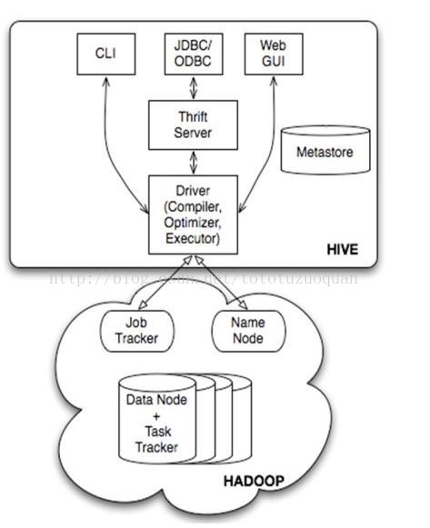
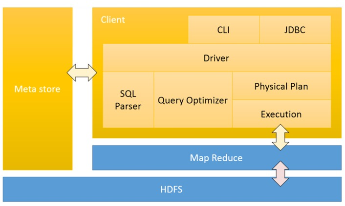

# Hive 设计原理

## 为什么使用Hive

**之前：**

- 直接使用hadoop所面临的问题
- 人员学习成本太高
- 项目周期要求太短
- MapReduce实现复杂查询逻辑开发难度太大

**使用 HIve ：**

- 操作接口采用类SQL语法，提供快速开发的能力。
- 避免了去写MapReduce，减少开发人员的学习成本。
- 功能扩展很方便。

### 适应场景

- 读多写少
- 对实时性要求低
- 离线计算

## Hive的特点

可扩展

Hive可以自由的扩展集群的规模，一般情况下不需要重启服务。 

延展性

Hive支持用户自定义函数，用户可以根据自己的需求来实现自己的函数。 

容错

良好的容错性，节点出现问题SQL仍可完成执行。

### Hive 与传统数据库（RDBMS）比较

Hive 是通过时间换空间的思想，Hive 执行一个 HQL 需要耗时很长，远远长于 RDBMS，但其可以处理的数据是非常大的。

### 支持的功能

- SQL 化查询
- 支持位图索引（0.8之后）

## 架构

用户接口主要由三个：CLI、JDBC/ODBC和WebGUI。其中，CLI为shell命令行；JDBC/ODBC是Hive的JAVA实现，与传统数据库JDBC类似；WebGUI是通过浏览器访问Hive。

元数据：支持使用 derby（默认）、MySQL（推荐） 数据库进行表的名字，表的列和分区及其属性，表的属性（是否为外部表等），表的数据所在目录等存储。

解释器、编译器、优化器完成 HQL 查询语句从词法分析、语法分析、编译、优化以及查询计划的生成。生成的查询计划存储在HDFS 中，并在随后有 MapReduce 调用执行。

- 解析器：将SQL字符串转换成抽象语法树AST，这一步一般都用第三方工 具库完成，比如antlr；对AST进行语法分析，比如表是否存在、字段是否 存在、SQL语义是否有误(比如select中被判定为聚合的字段在group by中是 否有出现)；
- 编译器：将AST编译生成逻辑执行计划； 
- 优化器：对逻辑执行计划进行优化；
- 执行器：把逻辑执行计划转换成可以运行的物理计划。对于Hive来说，就
- 是MR/TEZ/Spark；

### 数据存储

- Hive中所有的数据都存储在 HDFS 中，没有专门的数据存储格式（可支持Text，SequenceFile，ParquetFile，RCFILE等）

- 只需要在创建表的时候告诉 Hive 数据中的列分隔符和行分隔符，Hive 就可以解析数据。

- Hive 中包含以下数据模型：DB、Table，External Table，Partition，Bucket。
  - db：在hdfs中表现为`${hive.metastore.warehouse.dir}`目录下一个文件夹
  - table：在hdfs中表现所属db目录下一个文件夹
  - external table：与table类似，不过其数据存放位置可以在任意指定路径
  - partition：在hdfs中表现为table目录下的子目录
  - bucket：在hdfs中表现为同一个表目录下根据hash散列之后的多个文件

Hive 中没有定义专门的数据格式，数据格式可以由用户指定，用户定义数据格式需要指定三个属性：列分隔符（通常为空格、”\t”、”\x001″）、行分隔符（”\n”）以及读取文件数据的方法（Hive 中默认有三个文件格式 TextFile，SequenceFile 以及 RCFile）。由于在加载数据的过程中，不需要从用户数据格式到 Hive 定义的数据格式的转换，因此，Hive 在加载的过程中不会对数据本身进行任何修改，而只是将数据内容复制或者移动到相应的 HDFS 目录中。而在数据库中，不同的数据库有不同的存储引擎，定义了自己的数据格式。所有数据都会按照一定的组织存储，因此，数据库加载数据的过程会比较耗时。

### 数据更新

由于 Hive 是针对数据仓库应用设计的，而数据仓库的内容是**读多写少**的。因此，**Hive 中不支持对数据的改写和添加**，所有的数据都是在加载的时候中确定好的。而数据库中的数据通常是需要经常进行修改的，因此可以使用 INSERT INTO ...  VALUES 添加数据，使用 UPDATE... SET 修改数据。

> Hive 中的数据是静态的，不支持修改数据，如果需要新增/修改数据，需要执行命令手动执行。

## 事务

意义：

- 流式数据处理：如Flume, Storm和Kafka，数据进入即可见 
- 不常变化的维表：如在维表中增加或者删除一个维度 
- 数据订正：INSERT／UPDATE／DELETE

条件：

- 表必须是Bucket表 
- 可以只有一个Bucket，但性能会比单机还差 
- 表上必须有transactional=true的标记 
- TBLPROPERTIES( transactional = true)

https://www.cnblogs.com/yaohaitao/p/6588922.html

https://blog.csdn.net/wzq6578702/article/details/72802151

## 流处理

2.0.0：https://cwiki.apache.org/confluence/display/Hive/HCatalog+Streaming+Mutation+API

0.15：https://cwiki.apache.org/confluence/display/Hive/Streaming+Data+Ingest