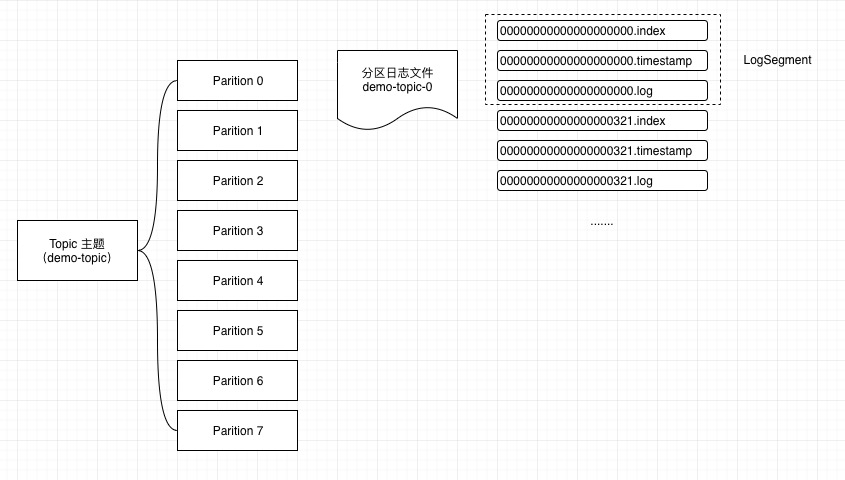
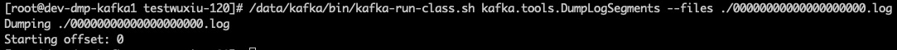
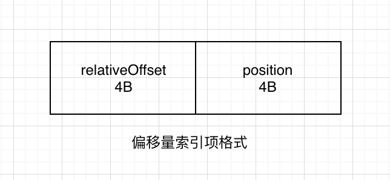
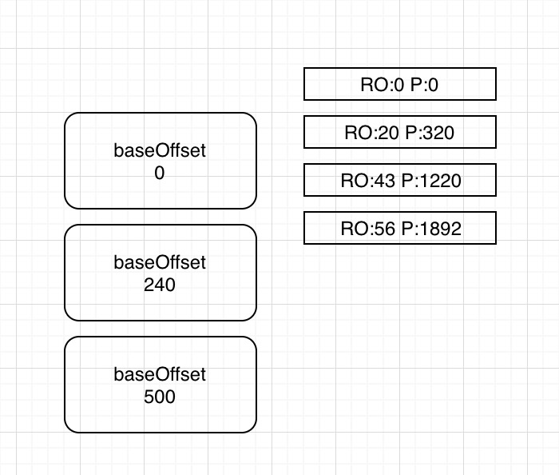
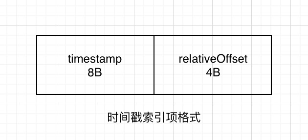
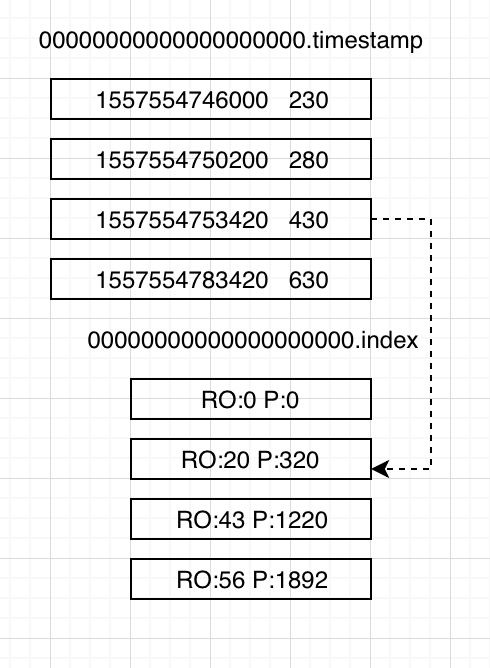
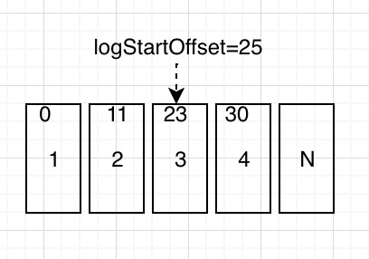

## Kafka 日志存储

在进行详解之前，我想先声明一下，本次我们进行讲解说明的是 Kafka 消息存储的信息文件内容，不是所谓的 Kafka 服务器运行产生的日志文件，这一点希望大家清楚。

Kafka 消息是以主题为单位进行归类，各个主题之间是彼此独立的，互不影响。每个主题又可以分为一个或多个分区。每个分区各自存在一个记录消息数据的日志文件。也就是该文要着重关注的内容。我们根据如下的图进行进一步说明：



图中，创建了一个 `demo-topic` 主题，其存在 7 个 Parition，对应的每个 Parition 下存在一个 `[Topic-Parition]` 命名的消息日志文件。在理想情况下，数据流量分摊到各个 Parition 中，实现了负载均衡的效果。在分区日志文件中，你会发现很多类型的文件，比如：`.index、.timestamp、.log、.snapshot` 等，其中，文件名一致的文件集合就称为 LogSement。我们先留有这样的一个整体的日志结构概念，接下来我们一一的进行详细的说明其中的设计。

## LogSegment

我们已经知道分区日志文件中包含很多的 LogSegment ，Kafka 日志追加是顺序写入的，LogSegment 可以减小日志文件的大小，进行日志删除的时候和数据查找的时候可以快速定位。同时，ActiveLogSegment 也就是活跃的日志分段拥有文件拥有写入权限，其余的 LogSegment 只有只读的权限。

日志文件存在多种后缀文件，重点需要关注 `.index、.timestamp、.log` 三种类型。其他的日志类型功能作用，请查询下面图表：

| 类别                    | 作用                          |
| ----------------------- | ----------------------------- |
| .index                  | 偏移量索引文件                |
| .timestamp              | 时间戳索引文件                |
| .log                    | 日志文件                      |
| .snaphot                | 快照文件                      |
| .deleted                |                               |
| .cleaned                | 日志清理时临时文件            |
| .swap                   | Log Compaction 之后的临时文件 |
| Leader-epoch-checkpoint |                               |

每个 LogSegment 都有一个基准偏移量，用来表示当前 LogSegment 中第一条消息的 offset。偏移量是一个 64 位的长整形数，固定是20位数字，长度未达到，用 0 进行填补，索引文件和日志文件都由该作为文件名命名规则（00000000000000000000.index、00000000000000000000.timestamp、00000000000000000000.log）。特别说明一下，如果日志文件名为 `00000000000000000121.log` ，则当前日志文件的一条数据偏移量就是 121，偏移量是从 0 开始的。

如果想要查看相应文件内容可以通过 `kafka-run-class.sh` 脚本查看 `.log` ：

```shell
/data/kafka/bin/kafka-run-class.sh kafka.tools.DumpLogSegments --files ./00000000000000000000.log
```



2.0 中可以使用 `kafka-dump-log.sh` 查 看`.index` 文件

```shell
/data/kafka/bin/kafka-dump-log.sh --files ./00000000000000000000.index
```

## 日志与索引文件

| 配置项                   | 默认值          | 说明                                                         |
| ------------------------ | --------------- | ------------------------------------------------------------ |
| log.index.interval.bytes | 4096 (4K)       | 增加索引项字节间隔密度，会影响索引文件中的区间密度和查询效率 |
| log.segment.bytes        | 1073741824 (1G) | 日志文件最大值                                               |
| log.roll.ms              |                 | 当前日志分段中消息的最大时间戳与当前系统的时间戳的差值允许的最大范围，毫秒维度 |
| log.roll.hours           | 168 (7天)       | 当前日志分段中消息的最大时间戳与当前系统的时间戳的差值允许的最大范围，小时维度 |
| log.index.size.max.bytes | 10485760 (10MB) | 触发偏移量索引文件或时间戳索引文件分段字节限额               |

偏移量索引文件用于记录消息偏移量与物理地址之间的映射关系。时间戳索引文件则根据时间戳查找对应的偏移量。

Kafka 中的索引文件是以稀疏索引的方式构造消息的索引，他并不保证每一个消息在索引文件中都有对应的索引项。每当写入一定量的消息时，偏移量索引文件和时间戳索引文件分别增加一个偏移量索引项和时间戳索引项，通过修改 `log.index.interval.bytes` 的值，改变索引项的密度。

### 切分文件

从上文中可知，日志文件和索引文件都会存在多个文件，组成多个 SegmentLog，那么其切分的规则是怎样的呢？

当满足如下几个条件中的其中之一，就会触发文件的切分：

1. 当前日志分段文件的大小超过了 broker 端参数 `log.segment.bytes` 配置的值。`log.segment.bytes` 参数的默认值为 1073741824，即 1GB。
2. 当前日志分段中消息的最大时间戳与当前系统的时间戳的差值大于 `log.roll.ms` 或 `log.roll.hours` 参数配置的值。如果同时配置了 `log.roll.ms` 和 `log.roll.hours` 参数，那么 `log.roll.ms` 的优先级高。默认情况下，只配置了 `log.roll.hours` 参数，其值为168，即 7 天。
3. 偏移量索引文件或时间戳索引文件的大小达到 broker 端参数 `log.index.size.max.bytes` 配置的值。`log.index.size.max.bytes` 的默认值为 10485760，即 10MB。
4. 追加的消息的偏移量与当前日志分段的偏移量之间的差值大于 `Integer.MAX_VALUE`，即要追加的消息的偏移量不能转变为相对偏移量。

##### 为什么是 `Integer.MAX_VALUE` ？

在偏移量索引文件中，每个索引项共占用 8 个字节，并分为两部分。相对偏移量和物理地址。

相对偏移量：表示消息相对与基准偏移量的偏移量，占 4 个字节

物理地址：消息在日志分段文件中对应的物理位置，也占 4 个字节

4 个字节刚好对应  `Integer.MAX_VALUE` ，如果大于 `Integer.MAX_VALUE` ，则不能用 4 个字节进行表示了。

##### 索引文件切分过程

索引文件会根据 `log.index.size.max.bytes` 值进行预先分配空间，即文件创建的时候就是最大值，当真正的进行索引文件切分的时候，才会将其裁剪到实际数据大小的文件。这一点是跟日志文件有所区别的地方。其意义降低了代码逻辑的复杂性。

## 查找消息

### offset 查询

偏移量索引由相对偏移量和物理地址组成。



可以通过如下命令解析`.index` 文件

```
/data/kafka/bin/kafka-dump-log.sh --files ./00000000000000000000.index
```

```
offset:0 position:0
offset:20 position:320
offset:43 position:1220
```

> 注意：offset 与 position 没有直接关系哦，由于存在数据删除和日志清理。



**e.g. 如何查看 偏移量为 23 的消息？**

Kafka 中存在一个 `ConcurrentSkipListMap` 来保存在每个日志分段，通过跳跃表方式，定位到在 `00000000000000000000.index` ，通过二分法在偏移量索引文件中找到不大于 23 的最大索引项，即 offset 20 那栏，然后从日志分段文件中的物理位置为320 开始顺序查找偏移量为 23 的消息。

### 时间戳方式查询

在上文已经有所提及，通过时间戳方式进行查找消息，需要通过查找时间戳索引和偏移量索引两个文件。

时间戳索引索引格式

、



**e.g. 查找时间戳为 1557554753430 开始的消息？**

- 将 1557554753430 和每个日志分段中最大时间戳 largestTimeStamp 逐一对比，直到找到不小于 1557554753430 所对应的日志分段。日志分段中的 largestTimeStamp 的计算是先查询该日志分段所对应时间戳索引文件，找到最后一条索引项，若最后一条索引项的时间戳字段值大于 0 ，则取该值，否则去该日志分段的最近修改时间。
- 找到相应日志分段之后，使用二分法进行定位，与偏移量索引方式类似，找到不大于 1557554753430 最大索引项，也就是 [1557554753420  430]。
- 拿着偏移量为 430 到偏移量索引文件中使用二分法找到不大于 430 最大索引项，即 [20，320] 。
- 日志文件中从 320 的物理位置开始查找不小于 1557554753430 数据。

> 注意：timestamp文件中的 offset 与 index 文件中的 relativeOffset 不是一一对应的哦。因为数据的写入是各自追加。

在偏移量索引文件中，索引数据都是顺序记录 offset ，但时间戳索引文件中每个追加的索引时间戳必须大于之前追加的索引项，否则不予追加。在 `Kafka 0.11.0.0` 以后，消息信息中存在若干的时间戳信息。如果 broker 端参数 `log.message.timestamp.type` 设置为 LogAppendTIme ，那么时间戳必定能保持单调增长。反之如果是 CreateTime 则无法保证顺序。

## 日志清理

日志清理，不是日志删除哦，这还是有所区别的，日志删除会在下文进行说明。

Kafka 提供两种日志清理策略：

日志删除：按照一定的删除策略，将不满足条件的数据进行数据删除

日志压缩：针对每个消息的 Key 进行整合，对于有相同 Key 的不同 Value 值，只保留最后一个版本。

Kafka 提供 `log.cleanup.policy` 参数进行相应配置，默认值：delete，还可以选择 compact。

**是否支持针对具体的 Topic 进行配置？**

答案是肯定的，主题级别的配置项是  `cleanup.policy` 。

### 日志删除

| 配置                            | 默认值          | 说明                          |
| ------------------------------- | --------------- | ----------------------------- |
| log.cleaner.enable              | true            | cleanup.policy=compact 不生效 |
| log.retention.check.interval.ms | 300000 (5分钟)  | 检测频率                      |
| log.retention.hours             | 168 (7天)       | 日志保留时间小时              |
| log.retention.minutes           |                 | 日志保留时间分钟              |
| log.retention.ms                |                 | 日志保留时间毫秒              |
| file.delete.delay.ms            | 60000 (1分钟)   | 延迟执行删除时间              |
| log.retention.bytes             | -1 无穷大       | 运行保留日志文件最大值        |
| log.regment.bytes               | 1073741824 (1G) | 日志文件最大值                |

Kafka 会周期性根据相应规则进行日志数据删除，保留策略有 3 种：基于时间的保留策略、基于日志大小的保留策略和基于日志其实偏移量的保留策略。这三个策略都配置的情况下，是根据谁先达到，就先执行。

支持日志删除首先要 `log.cleaner.enable=true` 。

#### 基于时间

日志删除任务会根据 `log.retention.hours/log.retention.minutes/log.retention.ms` 设定日志保留的时间节点。如果超过该设定值，就需要进行删除。默认是 7 天，`log.retention.ms` 优先级最高。

如何查找日志分段文件中已经过去的数据呢？

Kafka 依据日志分段中最大的时间戳进行定位，首先要查询该日志分段所对应的时间戳索引文件，查找时间戳索引文件中最后一条索引项，若最后一条索引项的时间戳字段值大于 0，则取该值，否则取最近修改时间。

**为什么不直接选最近修改时间呢？**

因为日志文件可以有意无意的被修改，并不能真实的反应日志分段的最大时间信息。

##### 删除过程

1. 从日志对象中所维护日志分段的跳跃表中移除待删除的日志分段，保证没有线程对这些日志分段进行读取操作。
2. 这些日志分段所有文件添加 上 `.delete` 后缀。
3. 交由一个以 `"delete-file"` 命名的延迟任务来删除这些 `.delete` 为后缀的文件。延迟执行时间可以通过 `file.delete.delay.ms` 进行设置

**如果活跃的日志分段中也存在需要删除的数据时？**

Kafka 会先切分出一个新的日志分段作为活跃日志分段，然后执行删除操作。

### 基于日志大小

日志删除任务会检查当前日志的大小是否超过设定值。设定项为 `log.retention.bytes` ，单个日志分段的大小由 `log.regment.bytes` 进行设定。

**删除过程**

1. 计算需要被删除的日志总大小 (当前日志文件大小-retention值)。
2. 从日志文件第一个 LogSegment 开始查找可删除的日志分段的文件集合。
3. 执行删除。

#### 基于日志起始偏移量

基于日志起始偏移量的保留策略的判断依据是某日志分段的下一个日志分段的起始偏移量是否大于等于日志文件的起始偏移量，若是，则可以删除此日志分段。

> 注意：日志文件的起始偏移量并不一定等于第一个日志分段的基准偏移量，存在数据删除，可能与之相等的那条数据已经被删除了。



##### 删除过程

- 从头开始变了每一个日志分段，日志分段 1 的下一个日志分段的起始偏移量为 11，小于 logStartOffset，将 日志分段 1 加入到删除队列中
- 日志分段 2 的下一个日志分段的起始偏移量为 23，小于 logStartOffset，将 日志分段 2 加入到删除队列中
- 日志分段 3 的下一个日志分段的起始偏移量为 30，大于  logStartOffset，则不进行删除。


