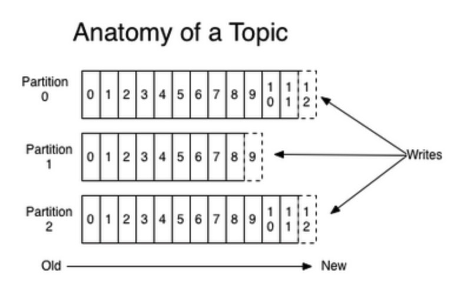
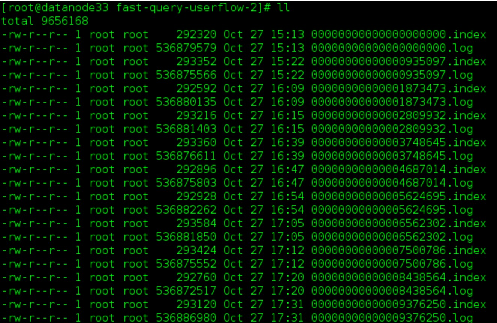
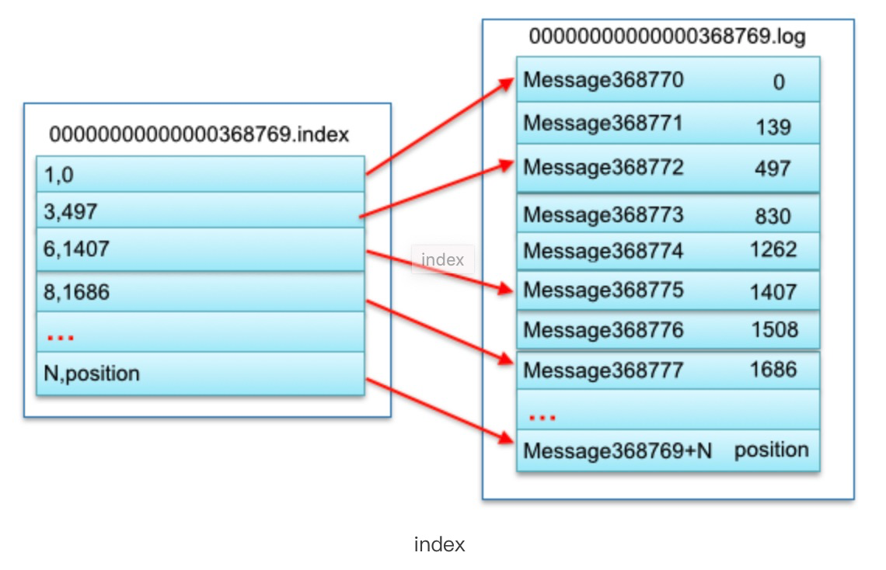
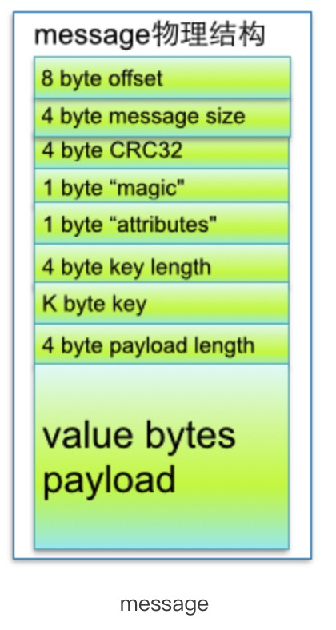

# Parition 分区

每个主题在创建的过程中，会被分成一个或多个分区，**每个分区是由一系列有序的、不可变的消息组成。**

## 意义

分区实现了负载均衡，保证 Kafka 的高吞吐。理论上来说，分区数越多，Kafka 吞吐量越高。分区保证了在同一个分区下的有序性，但不能保证跨分区的有序。

## 物理

每个分区对应一个文件夹，分区命名规则：主题名称—分区编号（从0开始）。数据在分区中是顺序写磁盘，因而效率非常高。



### Partition 存储路径

在 Kafka 代理服务下的 `server.properties` 文件中配置参数 `log.dirs=xxx/message-folder` 对数据存储路径进行设置。

例如：存在主题 foo，会存在很多相应 partiton 文件。

```
foo-0
foo-1
...
```

### 文件存储方式

- 每个partion(目录)相当于一个巨型文件被平均分配到多个大小相等segment(段)数据文件中。但每个段segment file消息数量不一定相等，这种特性方便old segment file快速被删除。

- 每个partiton只需要支持顺序读写就行了，segment文件生命周期由服务端配置参数决定。



### segment文件存储结构

- segment file 组成：由2大部分组成，分别为 index file 和 data file，此2个文件一一对应，成对出现，后缀".index"和“.log”分别表示为 segment 索引文件、数据文件.
- segment 文件命名规则：partion 全局的第一个 segment 从 0 开始，后续每个 segmen t文件名为上一个 segmen t文件最后一条消息的 offset 值。数值最大为64位long大小，19位数字字符长度，没有数字用0填充。
- 根据offset **二分查找** 文件列表，采取 **稀疏索引存储** 方式，稀疏索引为数据文件的每个对应message设置一个元数据指针,它比稠密索引节省了更多的存储空间，但查找起来需要消耗更多的时间。



**index 文件中的 2 不存在的原因，是因为数据被删除了吗？**

### message 数据结构



参数说明：

| 关键字              | 解释说明                                                     |
| ------------------- | ------------------------------------------------------------ |
| 8 byte offset       | 在parition(分区)内的每条消息都有一个有序的id号，这个id号被称为偏移(offset),它可以唯一确定每条消息在parition(分区)内的位置。即offset表示partiion的第多少message |
| 4 byte message size | message大小                                                  |
| 4 byte CRC32        | 用crc32校验message                                           |
| 1 byte “magic”      | 表示本次发布Kafka服务程序协议版本号                          |
| 1 byte “attributes” | 表示为独立版本、或标识压缩类型、或编码类型                   |
| 4 byte key length   | 表示key的长度,当key为-1时，K byte key字段不填                |
| K byte key          | 可选                                                         |
| value bytes payload | 表示实际消息数据                                             |

### 消息的有序性是如何保证的

Kafka 分布式的单位是 partition，同一个partition用一个 write ahead log 组织，所以可以保证FIFO 的顺序。

#### kafka 的 topic 多分区的情况，如何保证跨区的消息消费的顺序性

可以通过修改 message 的 key 的生成规则，促使数据可以按预先定义的规则落入到相应的分区中。

## 配置与修改

控制器负责分区的创建、删除、分区 Leader 选举、分区自动平衡、分区副本重分配的管理。

### 创建 Partition

该操作发生于创建 Topic 时，`KafkaController.onNewTopicCreation` 方法触发分区状态机，修改新增的各分区状态，触发副本状态机修改状态。

### 删除 Partition

### 分区 Leader 选举

### 分区自动平衡

分区自动平衡是通过将分区的优先副本选为分区的 Leader。发生于 Kafka 部分节点放生宕机，导致部分主题进行 Leader 选举。

遍历当前所有可用副本，轮询所有代理节点，以判断该节点的分区是否需要进行优先副本选举。判断条件是计算每个代理的分区不平衡率 imbalanceRatio 是否超过了 `leader.imbalance.per.broker.percentage` 配置的比率，默认是 10%。不平衡率是指每个代理上的分区 Leader 不是优先副本的分区总数 totalTopicPartitionsNotLedByBroker 与该代理上的分区总数的壁纸。若不平衡率超过了${leader.imbalance.per.broker.percentage}/100，且没有分区正在进行重分配和优先副本选举操作以及当前没有执行删除主题操作，则调用 onPreferredReplicaElection 方法，执行优先副本选举，让优先副本成为分区的 Leader。

### 分区副本重分配

在原来机器上的主题分区不会自动均衡到新的机器，需要使用分区重新分配工具来均衡。

当客户端执行分区重分配操作后，会在 ZK 的 `/admin` 节点下创建一个临时子节点 reassign_partitions，将分区副本重分配的分配方案写入该节点中。

主要步骤：

确定要重启分配分区的主题，新建 `topics-to-move.json`

```json
{
  "topics": [
    {"topic": "foo1"},
    {"topic": "foo2"}
  ],
  "version":1
}
// foo1 foo2 为要重新分配的主题
```

使用 `bin/kafka-reassign-partitions.sh` 重新分配工具

```shell
bin/kafka-reassign-partitions.sh --zookeeper localhost:2181 --topics-to-move-json-file topics-to-move.json --broker-list "5,6"  –generate
```

有分配规则的json语句输出到控制台，复制到新建的json文件expand-cluster-reassignment.json中，例如：

```json
{"version":1,
  "partitions":[{"topic":"foo1","partition":0,"replicas":[5,6]},
 		{"topic":"foo1","partition":1,"replicas":[5,6]},
                {"topic":"foo1","partition":2,"replicas":[5,6]},
                {"topic":"foo2","partition":0,"replicas":[5,6]},
                {"topic":"foo2","partition":1,"replicas":[5,6]},
                {"topic":"foo2","partition":2,"replicas":[5,6]}]
}
 
//描述分配之后分区的分布情况
```

执行命令，开始分区重新分配

```shell
bin/kafka-reassign-partitions.sh --zookeeper localhost:2181 --reassignment-json-file expand-cluster-reassignment.json –execute
```

验证是否完成

```shell
bin/kafka-reassign-partitions.sh --zookeeper localhost:2181 --reassignment-json-file expand-cluster-reassignment.json –verify
//当输出全部都是completed successfully表明移动已经完成.
```

Parition 的信息存放在哪里的？

BrokerChangeListener 监听 `/brokers/ids` 路径下各个代理的变换。若出现代理宕机下线、新增代理都会触发该监听器，从而调用控制器的 `ControllerContext.controllerChannelManger` 对节点变化做出响应。

可以通过 `/brokers/topics/${topic}/paritions/${paritionId}/state` 查看分区信息。

## 选举

由于每个分区 Leader 负责分区的相关操作，在 Kafka 中分区 Leader 需要尽可能的均衡分布在各个代理中，以达到性能的负载均衡。

当分区状态发生变化时，PartitionLeaderSelector 分区选举请进行分区 Leader 的选举。Kafka 提供 5 种分区选举器。Kafka 会根据不同的分区的状态变化，选用不同的选举器。

### 选举器


## 参考文章

http://matt33.com/2016/03/08/kafka-store/