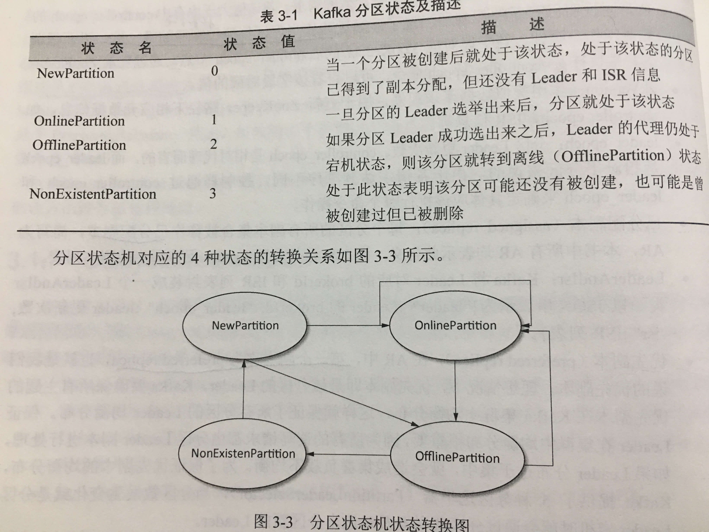
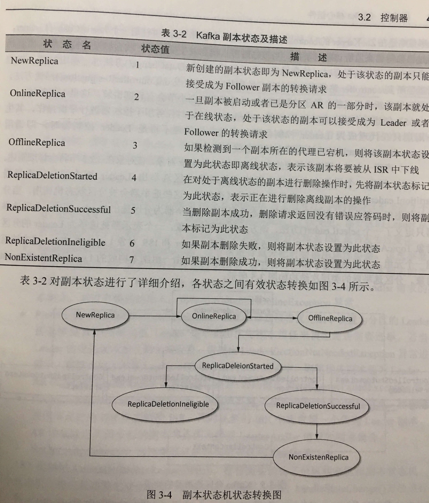
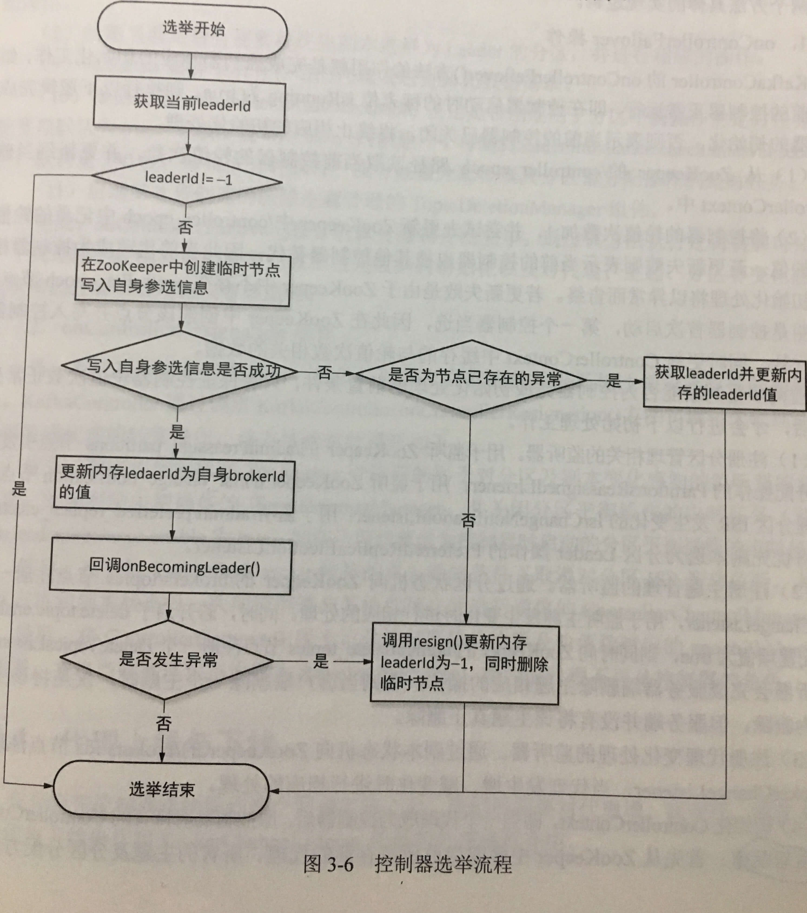

控制器选举方案？

## 控制器

Kafka在启动的时候，每个代理都会实例化一个 kafkaController，并将该代理的brokerId 注册到 Zookeeper 的相应节点当中。Kafka集群会选出一个代理作为 Leader，即 Leader 控制器。

### 功能

- 负责主题的创建与删除
- 分区的管理
- 副本的管理
- 代理故障转移处理

### 术语

**controller_epoch:** 用于记录 `Leader Controller` 的变更次数，从 0 开始。每每变更一次，就加 1，若请求的中的 controller_epoch 值与服务端值不一致，就意味着 `Leader Controller`  发生了变更。该值在 ZK 中位于 `/controller_epoch` 目录。

**zkVersion:** 更新 ZK 信息时的乐观锁。

**leader_epoch:** 分区副本 Leader 更新次数。

**assgined replica:** 已分配副本。每个分区中在线存在的副本统称为已分配副本，简写：AR。

**ISR:** 与分区的 Leader 保持同步的副本列表。

**preferred replica:** 优先副本。在 AR 列表中位于第一个的副本成为优先副本。正常情况下，优先副本就是 Leader 副本。Kafka 要尽可能的保证优先副本在代理集群中均匀分布，保证服务的负载均衡。

### 控制器初始化

kafkaController 实例化主要完成以下工作：

- 创建一个 ControllerContext 实例对象，该对象用于缓存控制器的各种对立操作所需要的数据结构。

  - epoch：控制器选举次数，初始值为0
  - zkVersion，初始值为0
  - 设置当前正常运行的代理列表，主题列表
  - 各主题对应分区与副本的 AR 列表
  - 声明 ControllerChannelManager

- 实例化用于维护和管理分区状态的状态机

  
  - TopicChangeListener 监听`/brokers/topics` 路径下子节点变化，创建主题的时候，会创建一个与主题同名的子节点
  - DeleteTopicsListener 监听 `/admin/delete_topics` 子节点的变更，删除主题时，创建一个待删除主题同名的子节点，删除`/brokers/topics`路径下的主题文件夹，同时将主题加入到 TopicDeletionManager 的待删除主题的队列当中，由其执行删除操作。

- 实例化一个对副本状态管理的状态机 ReplicaStateMachine

  

  - BrokerChangeListener 监听 `/brokers/ids` 路径下各个代理对应的 brokerId 节点变化。`ControllerContext.controllerChannelManager` 对节点变化进行相应处理。
    - 代理与 zk 会话超时时
    - 一个节点被删除或者新代理加入时

- 创建用于将当前代理选举为控制器的 ZooKeeperLeaderElector 选举器对象。控制器选举策略是在 zk的 `/controller` 路径下创建一个临时节点，并注册一个 LeaderChangeListener，来监听临时节点的变化，**当新的控制器信息被保存下来时，会触发该监听器的 handleDataChange()方法进行相应处理，当监听器监听到 `/controller` 路径下控制器信息被删除时，将触发 onControllerResignation() 回调方法，同时触发重新选举机制。**

- 创建一个独立定时任务 KafkaScheduler，**该代理为 Leader控制器期间有效。** 不再试代理的时候， 调用 onControllerResignation() 方法关闭定时器。

  - 控制器进行平衡操作

- 声明一个对主题操作管理的 TopicDeletionManager 对象。
- 创建一个用于在分区状态发生变化是为分区选举出 Leader 副本的分区选举器 PartitionLeaderSelector 。Kafka提供了5个分区选举器，这些选举器会被分区状态机调用，当分区的状态发生变化的时，根据分区所处状态选用不同的选举器为分区选出 Leader 副本。
- 实例化 ControllerBrokerRequestBatch。
- 实例化三个监听器
  - PartitionsReassignedListener：监听分区重分配
  - PreferredReplicaPartitionLeaderSelector：当分区变化时触发，将优先副本选举为Leader。
  - ISRChangeNotificationListener：监听ISR发生变化，通知zk更新操作。

### 控制器选举过程

发生选举的场景：

- kafka集群启动的时候
- 控制器所在代理发生故障
- zk 通过心跳机制感知控制器与自己的连接Session已过期时

ZooKeeperLeaderElector 进行控制器的选举，先看一下实例化入参：

- `config.brokerId`: 是候选控制器代理 brokerId
- `ZkUtils.ControllerPath:` 选举过程所依赖的 `/controller` 路径
- onControllerFailover: 当代理当选为 Leader 控制器时回调
- onControllerResignation: 注销 Leader 所拥有的权限

当代理获取 zk 的 `/controller` 节点获取 leader 信息，若得到的 leaderId 为-1，则表示 Leader 还未被选举产生，则代理封装自己的 brokerId 信息写入到 `/controller`。

### 故障转移

故障转移本质就是 Leader 重新选举的过程，与上文所说的选举过程一样。

主要说一下`onControllerFailover`和 `onControllerResignation` 操作。

#### onControllerFailover

- 从 zk 的 `/controller_epoch` 路径读取当前控制器的轮值次数。并更新到当前 ControllerContex 中
- 将控制器的轮值次数加1，并更新 `/controller_epoch`  路径的轮值次数值，若 `/controller_epoch`  路径不存在，说明控制器是首次启动，第一次当选，创建该节点，并写入控制器轮值数
- 注册 PartitionsReassignedListener、PreferredReplicaElectionListener、ISRChangeNotificationListener 三个监听器
- 注册主题管理监听器 TopicChangeListener，同时若 `delete.topic.enable=true` ，则同时注册 DeleteTopicListener 监听器。
- 注册代理变化处理的监听器 BrokerChangeListener ,对代理的增、减做出反应。
- 初始化 ControllerContext
- 启动分区状态机和副本状态机
- 从 ControllerContext 中读取所有主题，为每个主题添加，监听分区变化的 PartitionModificationListener
- 检测当前是否有分区需要触发分区重分配操作
- 检测当前是否需要将优先副本选举为 Leader 的分区
- 向 Kafka 集群中的所有存活的代理发送更新元数据请求
- 根据配置 `auto.leader.rebalance.enable=true` 决定是否创建用于分区平衡操作的定时任务，默认是300秒，也就是5min执行一次重分配检查及分区重分配操作。
- 启动删除主题管理的 TopicDeletionManager 组件

#### onControllerResignation

当一个代理不再是控制器时，需要注销控制器的相应权限及修改相应元数据的初始化信息。

- 取消分区变化感知的监听
- 取消副本变化感知的监听
- 关闭删除主题操作的 TopicDeletionManager
- 关闭分区平衡操作的定时任务
- 取消对分区ISR变化的监听
- 关闭分区状态机和副本状态机
- 关闭控制器与其他代理之间的通信的 ControllerChannelManager
- ControllerContext 中用于记录控制器轮值次数及轮值数对应的 epochZkVersion字段置为0，并将代理状态设置为 RunningAsBroker

### 代理上线

有新的代理启动时，会向 zk 的 `/brokers/id` 路径注册 brokerId 信息，此时，会触发`BrokerChangeListener` 监听器，从而做出相应的相应操作：

- 向集群当前所有代理发送 UpdateMetadatRequest 请求，所有的代理都知道有新的节点加入
- 查找出被分配到新上线节点上的副本集合
- 通过副本状态机，将副本状态修改为 OnlineReplica
- 分区状态机为 NewParition 和 OfflineParition 的分区状态转为 OnlineParition 状态
- 触发 Leader选举，确认新增的代理是否为分区的 Leader
- 轮询被分配到新上线的副本，进行分区副本重分配操作
- 恢复由于新代理上线而停止删除主题操作的线程

### 代理下线

有代理下线时，会删除所在 zk 的 `/brokers/id` 路径注册 brokerId 信息，此时，会触发`BrokerChangeListener` 监听器的 handleChildChange() 方法：

- 查找 Leader 副本所在下线节点的分区，将这些**分区**状态设置为 OfflineParition
- **分区状态机**将 OfflineParition 状态的转为 OnlineParition
  - 通过 OfflineParitionLeaderSelector 分区选举器为分区选出 Leader
  - 将 Leader 和 ISR 信息写入 zk
  - 发送 UpdateMetadataRequest 请求更新元数据信息
- 查找所有下线节点上的**副本集合**，分为两类：待删除主题的副本和正常使用的主题副本，将这些副本进行下线处理，状态由 OnlineReplica 转为 OfflineReplica，此时会将副本节点从分区的ISR结合中删除，并发送 StopReplicaRequest 请求
- 下线节点上的副本停止 Leader 副本同步数据
- 发送 UpdateMetadataRequest 请求更新元数据信息
- 分区 Leader 副本分配在下线节点的所有分群状态装换操作完成后，向集群代理发送UpdateMetadataRequest 请求更新元数据信息