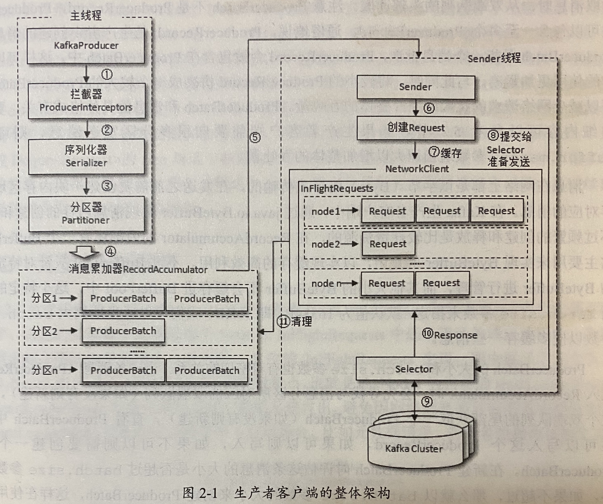

## 生产者

### KafkaProducer 

KafkaProducer 线程安全，支持多个线程共享同一个实例对象。

### ProducerRecord

```java
public class ProducerRecord<K, V> {
    private final String topic;
    private final Integer partition;
    private final Headers headers;
    private final K key;
    private final V value;
    private final Long timestamp;
}
```

timestamp 是指消息的时间戳，**它有 CreateTime 和 LogAppendTime 两种类型**，前者表示消息创建的时间，后者表示消息追加到日志文件的时间。

如果为空的消息，称为墓碑消息。

**header 消息头部有什么价值？**

消息合法性的认证、value 数据一般都是规定数据格式，而 header 可以进行多变，实现不同的个性化需求。header 数据是不会被序列化的。

### 消息的发送

发送消息的三种模式：

- 发后即忘
- 同步
- 异步

**同步的方式**可靠性最高，但性能方面会差很多，**需要阻塞等待一条消息发送完之后，才能发送下一条消息。**

异步方式，Kafka 提供了 Callback 方式来保证数据发送之后的响应操作，而且**回调函数的调用也可以保证分区有序。**

发送消息之后的返回值 RecordMetadata 对象

```
public final class RecordMetadata {   
   private final long offset;
    private final long timestamp;
    private final int serializedKeySize;
    private final int serializedValueSize;
    private final TopicPartition topicPartition;
    private volatile Long checksum;
}
```

timestamp 返回时已经是 LogAppendTime。

`KafkaProducer.send()` 方法的返回值是一个 Future 类型的对象，其提供了一个时间参数，用于实现可超时的阻塞。如果超时了，会抛异常。

#### 异常处理

KafkaProducer 分为两种类型的异常：可重试的异常和不可重试异常。

可重试的异常：NetworkException、LeaderNotAvailableException

不可重试异常：RecordTooLargeException

出现异常之后，对于可重试异常，可以通过重试的方式进行处理，Kafka 提供了相应的参数

```java
props.put(ProducerConfig.RETRIES_CONFIG,10);
```

## 整体架构



整个生产者客户端有两个线程协调运行，这两个线程分别为主线程和 Sender 线程。

### 拦截器

生产者拦截器可以用来根据某些规则对数据进行过滤操作或者前置操作。

自定义拦截器通过实现 ProducerInterceptor 接口，

```java
public interface ProducerInterceptor<K, V> extends Configurable {
public ProducerRecord<K, V> onSend(ProducerRecord<K, V> record);
public void onAcknowledgement(RecordMetadata metadata, Exception exception);
 public void close();
}
```

**KafkaProducer 会在消息被响应之前或消息发送失败时调用生产者拦截器的 onAcknowledgement 方法，优先于用户设定的 Callback 之前执行。**

#### 加载拦截器

通过 `interceptor.classes` 配置项进行配置，支持多个拦截器，使用逗号进行分隔。

### 分区器

分区器确定消息往哪里发。

- 如果消息 ProducerRecord 中指定了 partition 字段，那么就不需要分区器的作用了。
- 默认分区器会对 key 进行哈希（MurmurHash2算法，高性能和低碰撞率），这里的**分区类型为 AR**，因而可能存在发送数据失败重试的可能。
- 如果 key 为 null，那么消息会通过轮询的方式发往主体内的各个**可用的分区（ISR）**。
- 如果出现分区数量的增加的情况（Kafka 支持创建主题之后，新增分区，减少分区不支持），就很难保证key与分区之间的映射关系了。

### RecordAccumulator 消息累加器

用来缓存消息以便 Sender 线程可以批量发送，进而减少网络传输的资源损耗以提升性能。默认缓存大小由 `buffer.memory` 进行设定，默认值为 32M。

如果生产者发送消息的速度超过发送到服务器的速度，则会导致生产者空间不足，在调用 send() 方法时阻塞或者抛异常，具体根据 `max.block.ms` 设置决定，默认为 60秒。

RecordAccumulator 数据结构为双端队列（`Deque<ProducerBatch>`），从尾部追加，头部获取。

以 `ConcurrentMap<TopicPartition, Deque<ProducerBatch>>` 数据格式存储。

#### ProducerBatch

这是 ProducerRecord 集合，是指一个消息批次，这样做的好处是使字节的使用更加紧凑，减少网络传输的资源损耗以提升性能。

`linger.ms` 为消息发送停留时间，当到达该时间之后，就会往 Sender 线程发送数据。

 `batch.size` 为每个 ProducerBatch 理论最大限度（部分数据也会超过该值），当达到这个值，就会往 Sender 线程发送数据。

#### BufferPool

主要用于实现 ByteBuffer 的复用，已实现缓存的高效利用。

不过 BufferPool 只针对特定大小的 ByteBuffer 进行管理，其他大小的 ByteBuffer 不会进入 BufferPool 中缓存。

大小由 `batch.size` 参数指定，默认 16K

#### ProducerBatch 与 BufferPool 的关系

当一条消息流入 RecordAccumulator 时，会先寻找与消息分区的所对应的双端对列，在这个双端队列的尾部获取一个 ProducerBatch，如果其空间还可以允许当前数据的大小，则将其写入该 ProducerBatch，如果不可以就新建一个 ProducerBatch ，再进行写入操作，ProducerBatch 大小根据 `batch.size` 来，如果当前这条数据大小已经超过 `batch.size` ，则按照实际大小创建 ProducerBatch 对象，如果是按照  `batch.size` 创建的 ProducerBatch ，这样在使用完这段内存区域之后，可以通过 BufferPool 的管理来进行复用，如果超过，则不会再被复用。

### InFlightRequests

缓存了已经发出去但还未收到相应的请求。

数据格式为  `Map<NodeId, Deque<NetworkClient.InFlightRequest>>`

通过 `max.in.flight.requests.per.connection` 参数可以限制每个连接最多的请求数，默认为5个，最多只能缓存5个未响应的请求。

如果出现堆积，就要查看是否存在网络问题。

InFlightRequests 可以获得 leastLoadedNode，即所有 Node 中负载最小的那一个，通过将数据导到 leastLoadedNode 节点可以尽可能的发送数据。

### 元数据更新

元数据更新是通过 sender 线程完成，但主线程通过 synchronized 和 final 方式来保障数据同步。

更新的间隔时间根据 `metadata.max.age.ms` 来，默认为 5分钟。

当需要更新元数据时，会先挑选出 leastLoadedNode，然后向这个 Node 发送 MetadataRequest 请求来获取具体的元数据信息。

### 小结

InFlightRequests 中的请求不仅仅是发送消息，还有获取元数据的请求。

InFlightRequests 发送主题消息时，是根据主题 Partition 的 Leader 副本所在的 Node 发起请求。

## 参数说明

## acks

Kafka提供三种消息确认机制（acks），通过属性`request.required.acks`设置。

acks=0：生产者不用等待代理返回确认信息，而连续发送消息

acks=1：默认模式，生产者需要等待Leader副本已成功将消息写入日志文件中。一定程度上降低数据丢失的风险。在Leader副本宕机时，Follower副本没有及时同步数据，之后代理也不会再向宕机的Leader进行数据的获取，数据就出现了丢失

acks=-1：Leader副本和所有Follower列表中副本都完成数据的存储才会想生产者发生确认信息，即同步副本必须大于1，通过`min.insync.replicas`设置，当同步副本不足该配置值时，生产者会抛异常。该种模式会影响生产者的发送数据的速度以及吞吐量。

### 生产者配置说明

| 属性值                             | 默认值           | 描述                                                         |
| ---------------------------------- | ---------------- | ------------------------------------------------------------ |
| Message.send.max.retries           | 3                | 生产者在丢失该消息前进行重试次数                             |
| Retry.backoff.ms                   | 100              | 检测新的Leader是否已选举出来，更新主题的MetaData之前生产者需要等待的时间 |
| Queue.buffering.max.ms             | 1000             | 当到达该时间后消息开始批量发送，若异步模式下，同时配置了`Batch.num.messages`，则达到这两个阀值之一都将开始批量发送消息 |
| Queue.buffering.max.message        | 10000            | 在异步模式下，在生产者必须被阻塞或者数据必须丢失之前，可以缓存到队列中的未发送的最大消息条数，即初始化消息队列的长度 |
| Batch.num.messages                 | 200              | 在异步模式下每次批量发送消息的最大消息数                     |
| Request.timeout.ms                 | 1500             | 当需要acks时，生产者等待代理应答的超时时间，若该时间范围内没有应答，则会发送错误到客户端 |
| Topic.metadata.refresh.interval.ms | 5min             | 生产者定时请求更新主题元数据的时间间隔。若设置为0，则在每个消息发送后都去请求更新数据 |
| Client.id                          | Console.producer | 生产者指定的一个标识字段，在每次请求中包含该字段，用来追踪调用，根据该字段在逻辑上可以确认是哪个应用发出的请求 |
| Queue.enqueue.timeout.ms           | 2147483647       | 该值为0，标识该队列没满是直接入队，满了则立即丢弃，负数表示无条件阻塞且不丢弃，正数表示阻塞达到该值时长后抛出QueueFullException异常 |

## 问题

1. `client.id` 在 kafka 中的价值是什么？

2. KafkaProducer 是否为线程安全？

   KafkaProducer 线程安全，支持多个线程共享同一个实例对象。

3. 


生产者在 Kafka 中是必须存在的角色。在 Kafka 中 `ReplicatManager` **负责将生产者发送的消息写入到 Leader 副本、管理 Follower 副本与 Leader 副本之间的数据同步以及副本角色之间的转换。**

消息发送流程：

1. 客户端调用 `KafkaProduce.send()` 方法
2. `KafkaApis.handleProducerRequest()` 方法调用 `ReplicaManager.appendMessages()` 方法将消息追加到相应的分区的 Leader 副本中
3. 从 Leader 副本同步数据到各 Follower 副本中
4. 向生产者做出响应

在消息未被分区的所有 Follower 副本从 Leader 副本同步更新完成之前，`ProduceRequest` 的 acks 为 `-1` ，此时，无法进行下一条消息的操作。

`DelayedProduce` 其作用就是在 acks 为 -1 时，延迟回调 responseCallback 向生产者做出相应，直至所有 Follower 副本从 Leader 副本同步更新完成后，才响应生产者。

**猜想**

- 副本数太多会导致生产者的响应时间太长，TPS 下降
- 在写入数据至 Leader 和同步数据至 Follower 的过程中出现异常，会如何处理？DelayedProduce 可能出现 delayMS 超时的情况

## Follower 副本同步

在 Follower 副本进行从 Leader 副本处同步数据的时，会发起 **FetchRequest** 请求。

**FetchRequest** 是由 `KafkaApis.handleFetchRequest()` 方法处理的，在该方法中 `ReplicaManager.fetchMessage()` 方法从相应的分区的 Leader 副本拉取消息。

`ReplicaManager.fetchMessage()` 方法中会创建 **DelayedFetch** 延迟操作，用于处理拉取数据操作。

##### 为什么在拉取数据的时候需要延迟操作呢？

是为了让当前拉取获得足够的消息数据。

