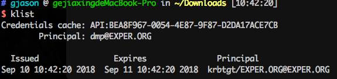
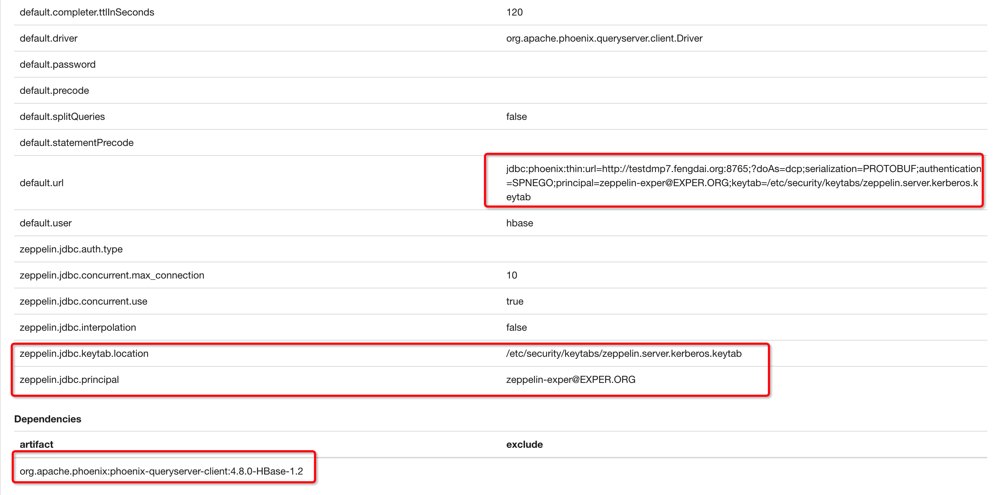
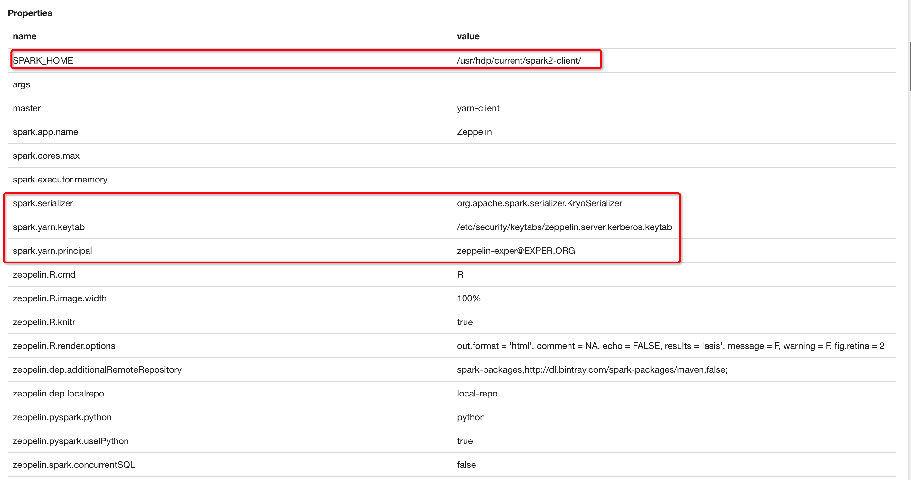
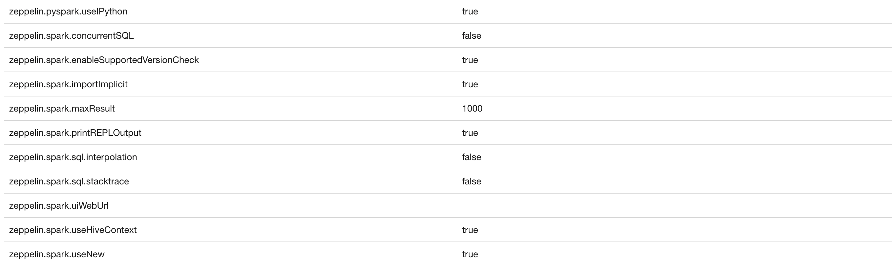

[TOC]

# HDP Kerberos

文档是基于`HDP 3.0` 环境进行说明，Kerberos使用的是`MIT KDC` 模式，安装了 Ranger 进行权限授权操作。

在使用过程，需要铭记使用了Kerberos之后，其实权限存在Linux权限、Kerberos权限、Ambari权限、Ranger权限四个维度对资源进行控制。

## KDC

由于被Long-term Key加密的数据包不能用于网络传送，所以我们使用另一种Short-term Key来加密需要进行网络传输的数据。由于这种Key只在一段时间内有效，即使被加密的数据包被黑客截获，等他把Key计算出来的时候，这个Key早就已经过期了。

KDC维护着一个存储着该Domain中所有帐户的**Account Database**（一般地，这个Account Database由**AD**来维护），也就是说，他知道属于每个Account的名称和派生于该Account Password的**Master Key**。

而用于Client和Server相互认证的**SServer-Client**就是由KDC分发。

KDC生成Session Key规则：使用**Client的Master Key**和**自己的Master Key**对生成的Session Key进行加密

| 命令                       | 说明                                                         |
| -------------------------- | ------------------------------------------------------------ |
| `/usr/bin/ftp`             | 文件传输协议程序                                             |
| `/usr/bin/kdestroy`        | 销毁 Kerberos 票证                                           |
| `/usr/bin/kinit`           | 获取并缓存 Kerberos 票证授予票证                             |
| `/usr/bin/klist`           | 显示当前的 Kerberos 票证                                     |
| `/usr/bin/kpasswd`         | 更改 Kerberos 口令                                           |
| `/usr/bin/ktutil`          | 管理 Kerberos 密钥表文件                                     |
| `/usr/bin/rcp`             | 远程文件复制程序                                             |
| `/usr/bin/rdist`           | 远程文件分发程序                                             |
| `/usr/bin/rlogin`          | 远程登录程序                                                 |
| `/usr/bin/rsh`             | 远程 Shell 程序                                              |
| `/usr/bin/telnet`          | 基于 Kerberos 的 `telnet` 程序                               |
| `/usr/lib/krb5/kprop`      | Kerberos 数据库传播程序                                      |
| `/usr/sbin/gkadmin`        | Kerberos 数据库管理 GUI 程序，用于管理主体和策略             |
| `/usr/sbin/gsscred`        | 管理 gsscred 表项                                            |
| `/usr/sbin/kadmin`         | 远程 Kerberos 数据库管理程序（运行时需要进行 Kerberos 验证），用于管理主体、策略和密钥表文件 |
| `/usr/sbin/kadmin.local`   | 本地 Kerberos 数据库管理程序（运行时无需进行 Kerberos 验证，并且必须在主 KDC 上运行），用于管理主体、策略和密钥表文件 |
| `/usr/sbin/kclient`        | Kerberos 客户机安装脚本，有无安装配置文件皆可使用            |
| `/usr/sbin/kdb5_ldap_util` | 为 Kerberos 数据库创建 LDAP 容器                             |
| `/usr/sbin/kdb5_util`      | 创建 Kerberos 数据库和存储文件                               |
| `/usr/sbin/kgcmgr`         | 配置 Kerberos 主 KDC 和从 KDC                                |
| `/usr/sbin/kproplog`       | 列出更新日志中更新项的摘要                                   |

| 进入kadmin                  | kadmin.local/kadmin                                          |
| --------------------------- | ------------------------------------------------------------ |
| 创建数据库                  | kdb5_util create -r JENKIN.COM -s                            |
| 启动kdc服务                 | service krb5kdc start                                        |
| 启动kadmin服务              | service kadmin start                                         |
| 修改当前密码                | kpasswd                                                      |
| 测试keytab可用性            | kinit -k -t /var/kerberos/krb5kdc/keytab/root.keytab root/master1@JENKIN.COM |
| 查看keytab                  | klist -e -k -t /etc/krb5.keytab                              |
| 清除缓存                    | kdestroy                                                     |
| 通过keytab文件认证登录      | kinit -kt /var/run/cloudera-scm-agent/process/***-HIVESERVER2/hive.keytab hive/node2 |
| 查看此keytab中所有principal | klist -k user.keytab                                         |
| 更新credentials             | kinit -R                                                     |

[Kerberos定制化模版](https://docs.hortonworks.com/HDPDocuments/Ambari-2.5.0.3/bk_ambari-security/content/customizing_the_attribute_template.html)

[管理管理员凭证](https://docs.hortonworks.com/HDPDocuments/Ambari-2.5.0.3/bk_ambari-security/content/managing_admin_credentials.html)

### 合并keytab

```shell
# ktutil
ktutil:  rkt /tmp/service1.keytab
ktutil:  rkt /tmp/service2.keytab
ktutil:  rkt /tmp/service3.keytab
ktutil:  wkt /tmp/combined.keytab
ktutil:  exit
```

### KDC服务器命令

- 在 KDC 服务器上作为 root 用户启动 kadmin 工具。

```shell
#/usr/krb5/sbin/kadmin.local
kadmin.local:
```

- 为 LDAP 服务器创建 ldap/*serverhostname* 主体。*serverhostname* 是将运行 LDAP 服务器的标准 DNS 主机。

```shell
kadmin.local: addprinc ldap/plankton.austin.ibm.com
WARNING: no policy specified for "ldap/plankton.austin.ibm.com@ud3a.austin.ibm.com":
Re-enter password for principal "ldap/plankton.austin.ibm.com@ud3a.austin.ibm.com":
Principal "ldap/plankton.austin.ibm.com@ud3a.austin.ibm.com" created.
kadmin.local:
```

- 为已创建的服务器主体创建密钥表。LDAP 服务器将在服务器启动期间使用该密钥。要创建名为 slapd_krb5.keytab 的密钥表：

```shell
kadmin.local: ktadd -k /etc/security/slapd_krb5.keytab ldap/plankton.austin.ibm.com
Entry for principal ldap/plankton.austin.ibm.com with kvno 2,
encryption type Triple DES cbc mode with HMAC/sha1 added to keytab
WRFILE:/etc/security/slapd_krb5.keytab.
Entry for principal ldap/plankton.austin.ibm.com with kvno 2,
encryption type ArcFour with HMAC/md5 added to keytab WRFILE:/etc/security/slapd_krb5.keytab.
Entry for principal ldap/plankton.austin.ibm.com with kvno 2,
encryption type AES-256 CTS mode with 96-bit SHA-1 HMAC added to keytab
WRFILE:/etc/security/slapd_krb5.keytab.
Entry for principal ldap/plankton.austin.ibm.com with kvno 2,
encryption type DES cbc mode with RSA-MD5 added to keytab WRFILE:/etc/security/slapd_krb5.keytab.
kadmin.local:
```

https://www.ibm.com/support/knowledgecenter/zh/ssw_aix_71/com.ibm.aix.security/krb_bind_principal.htm

`krb5.conf`

```
[libdefaults]
     default_realm = YOUR_DOMAIN.COM
     default_tkt_enctypes = DES-CBC-CRC
     default_tgs_enctypes = DES-CBC-CRC
     ccache_type = 2
[realms]
     YOUR_DOMAIN.COM = {
     kdc = kdc.your_domain.com:88
     admin_server = admin.your_domain.com:749
     }
[domain_realm]
     .your_domain.com = YOUR_DOMAIN.COM
     your_domain.com = YOUR_DOMAIN.COM
[logging]
     kdc = FILE:/var/adm/krb5kdc.log
     admin_server = FILE:/var/log/kadmin.log
     default = FILE:/var/log/krb5lib.log
$>cat /var/kerberos/krb5kdc/kdc.conf
[kdcdefaults]
    kdc_ports = 88
    kdc_tcp_ports = 88

[realms]
    YOUR_DOMAIN.COM = {
        kdc_ports = 88
        admin_keytab = /etc/kadm5.keytab
        database_name = /var/kerberos/krb5kdc/principal
        acl_file = /var/kerberos/krb5kdc/kadm5.acl
        key_stash_file = /var/kerberos/krb5kdc/stash
        max_life = 10h 0m 0s
        max_renewable_life = 7d 0h 0m 0s
        master_key_type = des3-hmac-sha1
        supported_enctypes = arcfour-hmac:normal des3-hmac-sha1:normal 
des-cbc-crc:normal des:normal des:v4 des:norealm des:onlyrealm des:afs3
        default_principal_flags = +preauth
    }
```

Krb5.conf文件会被复制到集群的各个节点

`kadm5.acl`

```
*/admin@YOUR_DOMAIN.COM  *
```

### 关键配置路径

`Krb5.conf`路径：`/etc/krb5.conf`

`krb5.keytab`路径：`/etc/krb5.keytab`

`keytab`路径：`/etc/security/keytabs/`

## Mac环境下使用

### 网页端授权

默认支持Safari浏览器

账号：dmp@EXPER.ORG /  /root/dmp.keytab

```shell
kinit -kt ./dmp.keytab dmp@EXPER.OR
```

```shell
klist
```



#### 支持Chrome

命令行执行如下：

```shell
/Applications/Google\ Chrome.app/Contents/MacOS/Google\ Chrome --auth-server-whitelist="*.FENGDAI.ORG"
```

`"*.FENGDAI.ORG"`为域的名称

如若存在问题，就重启Chrome浏览器

## 常用命令

```
kinit -kt /etc/security/keytabs/hbase.headless.keytab hbase-exper@EXPER.ORG
```

## HBase

```scala
def main(args: Array[String]): Unit = {
    val classPath = new File(this.getClass.getResource("/").getPath).getPath + "/"
    init(Map(
      "hbase.zookeeper.quorum" -> "testdmp3.fengdai.org,testdmp4.fengdai.org,testdmp5.fengdai.org",
      "zookeeper.znode.parent" -> "/hbase-secure",
      "hbase.zookeeper.property.clientPort" -> "2181"
    ))
    withKerberos(Map(
      "java.security.krb5.conf" -> (classPath + "krb5.conf"),
      "hbase.master.kerberos.principal" -> "hbase/_HOST@EXPER.ORG",
      "hbase.regionserver.kerberos.principal" -> "hbase/_HOST@EXPER.ORG",
      "loginUserFromKeytabUser" -> "hbase-exper@EXPER.ORG",
      "loginUserFromKeytabPath" -> (classPath + "hbase.headless.keytab")
    ))
    val conn = ConnectionFactory.createConnection(conf)
    conn.getAdmin.listTableNames().toList.foreach(println)
  }

  private val conf = HBaseConfiguration.create

  def init(args: Map[String, String]): Unit = {
    conf.set("hbase.zookeeper.quorum", args("hbase.zookeeper.quorum"))
    conf.set("zookeeper.znode.parent", args("zookeeper.znode.parent"))
    conf.set("hbase.zookeeper.property.clientPort", args("hbase.zookeeper.property.clientPort"))
  }

  def withKerberos(args: Map[String, String]): Unit = {
    System.setProperty("java.security.krb5.conf", args("java.security.krb5.conf"))
    System.setProperty("sun.security.krb5.debug", "true")
    conf.set("hadoop.security.authentication", "kerberos")
    conf.set("hbase.security.authentication", "Kerberos")
    conf.set("hbase.master.kerberos.principal", args("hbase.master.kerberos.principal"))
    conf.set("hbase.regionserver.kerberos.principal", args("hbase.regionserver.kerberos.principal"))
    UserGroupInformation.setConfiguration(conf)
    UserGroupInformation.loginUserFromKeytab(args("loginUserFromKeytabUser"), args("loginUserFromKeytabPath"))
  }
```

### 错误

```
org.apache.hadoop.security.KerberosAuthException: failure to login: for principal: hbase-exper from keytab /Users/gjason/Downloads/hbase.headless.keytab javax.security.auth.login.LoginException: Checksum failed
```

检查一下keytab是否过期了

### 连接Phoenix

https://docs.hortonworks.com/HDPDocuments/HDP2/HDP-2.6.3/bk_security/content/kerb-config-secure-phoenix.html

```shell
kinit -kt /etc/security/keytabs/spnego.service.keytab HTTP/testdmp7.fengdai.org
```

HTTP账号的背后，其实是Ambari中的账号，与Linux系统中的用户体系是没有关系的，只需要在Ranger-Settings中添加HTTP的用户即可

**scala代码**

```scala
// 两个System属性都不是必须的，可以尝试一下
System.setProperty("java.security.krb5.conf", "/etc/krb5.conf")
    //    System.setProperty("sun.security.krb5.debug", "true")
    System.setProperty("phoenix.queryserver.spnego.auth.disabled", "true")
    init("jdbc:phoenix:thin:url=http://testdmp7.fengdai.org:8765;serialization=PROTOBUF;authentication=SPNEGO;principal=HTTP/testdmp7.fengdai.org;keytab=/etc/security/keytabs/spnego.service.keytab", null, null)
    val conn = getConnection
    executeQuery("select * from DOP_VISIT_INFO", Seq(), conn)(rs => {
      if (rs.next()) {
        val l = rs.getObject(1)
        println("id:" + l)
      }
    })
```

### 支持多租户方式

在实现多租户功能中，Phoenix使用的是代理的方式，doAs的值就表示要代理的用户，Phoenix的权限根据该用户进行控制。

当spark服务中部署的应用中使用了`Phoenix Query Server`，需要在所有yarn服务器中将拥有权限的keytab放置服务器中，一般keytab放置于`/etc/security/keytabs`目录下。因为Executor任务会读取Linux环境下的keytab文件（当然路径还是可以自己指定的，这里说的是yarn方式部署情况）。

#### 配置

需要在Ambari下HBase中`hbase-site.xml`添加配置

```
hbase.thrift.support.proxyuser=true
hbase.regionserver.thrift.http=true
phoenix.queryserver.withRemoteUserExtractor=true
```

修改`core-site.xml`添加配置

```
hadoop.proxyuser.HTTP.hosts=true
hadoop.proxyuser.HTTP.groups=true
```

代码

```scala
  def main(args: Array[String]): Unit = {
    val classPath = new File(this.getClass.getResource("/").getPath).getPath + "/"
    System.setProperty("java.security.krb5.conf", classPath + "krb5.conf")
    //    System.setProperty("sun.security.krb5.debug", "true")
    //    System.setProperty("sun.security.spnego.debug", "true")
     //classOf[org.apache.phoenix.jdbc.PhoenixDriver]
    // val conf = HBaseConfiguration.create
    // conf.set("hbase.zookeeper.quorum", "testdmp3.fengdai.org,testdmp4.fengdai.org,testdmp5.fengdai.org")
   //  conf.set("zookeeper.znode.parent", "/hbase-secure")
   //  conf.set("hbase.zookeeper.property.clientPort", "2181")
   //  conf.set("hbase.master", "testdmp4.fengdai.org:16000")
   //  conf.set("hadoop.security.authentication", "kerberos")
    // conf.set("hbase.security.authentication", "Kerberos")
    // conf.set("hbase.master.kerberos.principal", "hbase/_HOST@EXPER.ORG")
      // phoenix.queryserver.spnego.auth.disabled
    // conf.set(QueryServices.QUERY_SERVER_SPNEGO_AUTH_DISABLED_ATTRIB, "true")
      // phoenix.queryserver.disable.kerberos.login
    // conf.set(QueryServices.QUERY_SERVER_DISABLE_KERBEROS_LOGIN, "false")

    val instance = new HikariDataSource()
    instance.setJdbcUrl("jdbc:phoenix:thin:url=http://testdmp7.fengdai.org:8765?doAs=hbase;serialization=PROTOBUF;authentication=SPNEGO;principal=hbase-exper@EXPER.ORG;keytab=" + classPath + "hbase.headless.keytab")
    instance.setDriverClassName("org.apache.phoenix.queryserver.client.Driver")
    instance.setConnectionTestQuery("SELECT 1")

    val conn = instance.getConnection
    var stmt: PreparedStatement = null
    var rs: ResultSet = null
    try {
      stmt = conn.prepareStatement("select * from DOP_VISIT_INFO limit 10")
      rs = stmt.executeQuery()
      while (rs.next()) {
        println(">>>>>>>" + rs.getString("id"))
      }
    } catch {
      case e: Throwable =>
        throw e
    } finally {
      if (rs != null && !rs.isClosed) {
        rs.close()
      }
      if (stmt != null && !stmt.isClosed) {
        stmt.close()
      }
      if (conn != null && !conn.isClosed) {
        conn.close()
      }
    }
  }
```

在URL中使用到的keytab没有特殊的要求，只要能支持认证就可以了。doAs是为了作为一个资源的伪装者，比如：doAs=user1，那么只能访问user1能被访问的资源，其他的都不可以。

[Phoenix源码](https://github.com/apache/phoenix/blob/master/phoenix-queryserver/src/main/java/org/apache/phoenix/queryserver/server/QueryServer.java)

### Q&A

1、`The KEYTAB does not  reference a normal, existent file: hbase.headless.keytab`

**A：**路径下找不到这个文件，路径应该错误的。

2、`Caused by: java.lang.RuntimeException: Failed to perform Kerberos login`

**A：** principal与keytab不一致，导致认证不通过，或者当前keytab不存在相应的权限，需要对其合并应该拥有的权限进去

3、`The KEYTAB does not reference a normal, existent file: /etc/security/keytabs/testdcpods-group.keytab`

**A：**查看一下keytab是否每一天yarn服务器都有创建文件，必须所有服务器都覆盖到，同时，确认一下linux下的权限是否存在问题，可以先chmod 644，等没有问题之后，再尝试chmod 755。

4、`Exception in thread "main" java.lang.IllegalArgumentException: Can't get Kerberos realm`

**A：**`krb5.conf` 配置文件存在格式或者配置问题。可以参考：

```
[logging]
 default = FILE:/var/log/krb5libs.log
 kdc = FILE:/var/log/krb5kdc.log
 admin_server = FILE:/var/log/kadmind.log

[libdefaults]
 dns_lookup_realm = false
 ticket_lifetime = 24h
 renew_lifetime = 7d
 forwardable = true
 rdns = false
 default_realm = EXPER.ORG
 default_ccache_name = KEYRING:persistent:%{uid}
 dns_fallback = no
 dns_lookup_kdc = true
 udp_preference_limit = 1

[realms]
  EXPER.ORG = {
   kdc = testdmp1.fengdai.org
   admin_server = testdmp1.fengdai.org
   default_domain = EXPER.ORG
  }
[domain_realm]
  .exper.org = EXPER.ORG
  exper.org = EXPER.ORG
```

5、是否需要创建Linux用户进行权限配置

**A：** 需要，需要所有服务器都进行相应的用户创建，通过ranger进行功能的授权。

6、`org.apache.hadoop.hbase.security.AccessDeniedException: org.apache.hadoop.hbase.security.AccessDeniedException: Insufficient permissions for user ‘dcp@EXPER.ORG',action: put, tableName:gjx_test, family:cf1, column: name`

**A:** dcp用户不存在该表的权限，使用Ranger进行授权就可以了。

7、`main : run as user is testdcpods main : requested yarn user is testdcpods User testdcpods not found`

**A:** 没有在Linux下面创建用户。

8、提交到yarn的用户与Phoenix用户可以不一致吗？

**A:** 可以不一致，只要各自相应的权限拥有即可

10、`KrbException: Fail to create credential. (63) - No service creds`

或者 `Failed to initialize pool: Failed to execute HTTP Request, got HTTP/401` 

**A:** 将 `krb5.conf` 配置中的 `default_realm` 设为当前环境的 `realm`。

## Livy Client

```scala
object Application {
//java -Djava.security.auth.login.config=login.conf Application
  def main(args: Array[String]): Unit = {
    val classPath = new File(this.getClass.getResource("/").getPath).getPath + "/"
//    System.setProperty("java.security.krb5.conf", classPath + "krb5.conf")
//    System.getProperty("kerberosPrincipal", "HTTP/testdmp7.fengdai.org")
//    System.getProperty("kerberosKeytab", classPath + "spnego.service.keytab")
    System.setProperty("java.security.auth.login.config", classPath + "login.conf")
    val headers = new util.HashMap[String, String]
    headers.put("Content-Type", "application/json")
    headers.put("Accept", "application/json")
    headers.put("X-Requested-By", "admin")
    KBHttpUtils.postAccess("http://testdmp7.fengdai.org:8999/batches", headers, "{\"className\": \"org.apache.spark.examples.SparkPi\",\"executorMemory\": \"1g\",\"args\": [200],\"file\": \"/fayson-yarn/jars/spark-examples-1.6.0-cdh5.14.0-hadoop2.6.0-cdh5.14.0.jar\"}")

  }
}
```

```scala
package com.tairanchina.csp.dmp.example.livy

import java.io.{ByteArrayOutputStream, IOException, InputStream}
import java.net.URL
import java.util

import net.sourceforge.spnego.SpnegoHttpURLConnection

import scala.collection.JavaConversions._

/**
  * Created on 2018/9/11.
  *
  * @author 迹_Jason
  */

object KBHttpUtils {
  /**
    * HttpGET请求
    *
    * @param url
    * @param headers
    * @return
    */
  def getAccess(url: String, headers: util.Map[String, String]): String = {
    val sb = new StringBuilder
    val bos = new ByteArrayOutputStream
    var in: InputStream = null
    try {
      val spnego = new SpnegoHttpURLConnection("Client")
      spnego.setRequestMethod("GET")
      if (headers != null && headers.size > 0) headers.foreach(v => spnego.setRequestProperty(v._1, v._2))
      spnego.connect(new URL(url), bos)
      in = spnego.getInputStream
      val b = new Array[Byte](1024)
      var len = in.read(b)
      while (len > 0) {
        sb.append(new String(b, 0, len))
        len = in.read(b)
      }
    } catch {
      case e: Exception =>
        e.printStackTrace()
    } finally {
      if (in != null) try
        in.close()
      catch {
        case e: IOException =>
          e.printStackTrace()
      }
      if (bos != null) try
        bos.close()
      catch {
        case e: IOException =>
          e.printStackTrace()
      }
    }
    System.out.println("Result:" + sb.toString)
    sb.toString
  }

//  /**
//    * HttpDelete请求
//    *
//    * @param url
//    * @param headers
//    * @return
//    */
//  def deleteAccess(url: String, headers: util.Map[String, String]): String = {
//    val sb = new StringBuilder
//    val bos = new ByteArrayOutputStream
//    var in = null
//    try {
//      val spnego = new SpnegoHttpURLConnection("Client")
//      spnego.setRequestMethod("DELETE")
//      if (headers != null && headers.size > 0) headers.forEach((K: String, V: String) => spnego.setRequestProperty(K, V))
//      spnego.connect(new URL(url), bos)
//      in = spnego.getInputStream
//      val b = new Array[Byte](1024)
//      var len = 0
//      while ( {
//        (len = in.read(b)) > 0
//      }) sb.append(new String(b, 0, len))
//    } catch {
//      case e: Exception =>
//        e.printStackTrace()
//    } finally {
//      if (in != null) try
//        in.close()
//      catch {
//        case e: IOException =>
//          e.printStackTrace()
//      }
//      if (bos != null) try
//        bos.close()
//      catch {
//        case e: IOException =>
//          e.printStackTrace()
//      }
//    }
//    System.out.println("Result:" + sb.toString)
//    sb.toString
//  }

  /**
    * HttpPost请求
    *
    * @param url
    * @param headers
    * @param data
    * @return
    */
  def postAccess(url: String, headers: util.Map[String, String], data: String): String = {
    val sb = new StringBuilder
    val bos = new ByteArrayOutputStream
    var in :InputStream= null
    try {
      val spnego = new SpnegoHttpURLConnection("Client")
      spnego.setRequestMethod("POST")
      if (headers != null && headers.size > 0) headers.foreach(v => spnego.setRequestProperty(v._1, v._2))
      if (data != null) bos.write(data.getBytes)
      spnego.connect(new URL(url), bos)
      System.out.println("Kerberos data:" + data)
      System.out.println("HTTP Status Code: " + spnego.getResponseCode)
      System.out.println("HTTP Status Message: " + spnego.getResponseMessage)
      in = spnego.getInputStream
      val b = new Array[Byte](1024)
      var len = in.read(b)
      while (len > 0) {
        sb.append(new String(b, 0, len))
        len = in.read(b)
      }
    } catch {
      case e: Exception =>
        e.printStackTrace()
    } finally {
      if (in != null) try
        in.close()
      catch {
        case e: IOException =>
          e.printStackTrace()
      }
      if (bos != null) try
        bos.close()
      catch {
        case e: IOException =>
          e.printStackTrace()
      }
    }
    System.out.println("Result:" + sb.toString)
    sb.toString
  }
}
```

## SPNEGO

`login.conf`

```
Client {
  com.sun.security.auth.module.Krb5LoginModule required
  storeKey=true
  useKeyTab=true
  debug=true
  keyTab="/etc/security/keytabs/spnego.service.keytab"
  principal="HTTP/testdmp7.fengdai.org";
};
```

`krb5.conf`

```
# Configuration snippets may be placed in this directory as well

[logging]
 default = FILE:/var/log/krb5libs.log
 kdc = FILE:/var/log/krb5kdc.log
 admin_server = FILE:/var/log/kadmind.log

[libdefaults]
 dns_lookup_realm = false
 ticket_lifetime = 24h
 renew_lifetime = 7d
 forwardable = true
 rdns = false
 default_realm = FENGDAI.ORG
 default_ccache_name = KEYRING:persistent:%{uid}
 dns_fallback = no
 dns_lookup_kdc = true
 udp_preference_limit = 1

[realms]
  FENGDAI.ORG = {
   kdc = test-dmp1.fengdai.org:88
   kdc = test-dmp8.fengdai.org:88
   admin_server = test-dmp1.fengdai.org
   default_domain = FENGDAI.ORG
  }

[domain_realm]
  .fengdai.org = FENGDAI.ORG
  fengdai.org = FENGDAI.ORG
```

`Http方式调用`

```scala
 val sb = new StringBuilder
    val bos = new ByteArrayOutputStream
    var in: InputStream = null
    try {
      System.setProperty("java.security.auth.login.config", "login.conf")
      System.setProperty("java.security.krb5.conf", "krb5.conf")
      val spnego = new SpnegoHttpURLConnection(loginModuleName)
      spnego.setRequestMethod(httpMethod.name())
      if (headers != null && headers.size > 0) headers.foreach(v => spnego.setRequestProperty(v._1, v._2))
      else {
        spnego.setRequestProperty(HttpHeaders.CONTENT_TYPE, MediaType.APPLICATION_JSON_VALUE)
        spnego.setRequestProperty(HttpHeaders.ACCEPT,  MediaType.APPLICATION_JSON_VALUE)
        spnego.setRequestProperty("X-Requested-By", "admin")
      }
      if (data != null) bos.write(data.getBytes)
      spnego.connect(new URL(url), bos)
      logger.info(s"Spnego Http Request Params $data,HTTP Status Code-${spnego.getResponseCode},HTTP Status Message-${spnego.getResponseMessage}")
      in = spnego.getInputStream
      val b = new Array[Byte](1024)
      var len = in.read(b)
      while (len > 0) {
        sb.append(new String(b, 0, len))
        len = in.read(b)
      }
      sb.toString
    } catch {
      case e: Exception =>
        logger.error(e.getMessage, e.getCause)
        s"Kerberos认证失败-${e.getMessage}"
    } finally {
      if (in != null) try
        in.close()
      catch {
        case e: IOException =>
          logger.error(e.getMessage, e.getCause)
          return s"Kerberos认证失败-${e.getMessage}"
      }
      if (bos != null) try
        bos.close()
      catch {
        case e: IOException =>
          logger.error(e.getMessage, e.getCause)
          s"Kerberos认证失败-${e.getMessage}"
      }
    }
```

http://lab.howie.tw/2013/12/Kerberos-Authentication-with-SPNEGO.html

```shell
curl --negotiate -u: -X POST \
  http://test-dmp7.fengdai.org:8999/batches \
  -H 'Cache-Control: no-cache' \
  -H 'X-Requested-By: admin' \
  -H 'Content-Type: application/json' \
  -H 'Postman-Token: 2ec10f63-65ca-4c5b-a054-fecafc139111' \
  -H 'X-User-Id: 111' \
  -d '{
  "name": "DMP EXPER ODS",
  "file": "/dmp/zyztest2/storage-ods-1.8.0-SNAPSHOT-jar-with-dependencies.jar",
  "className": "com.tairanchina.csp.dmp.components.storage.ods.ODSMain",
  "args": ["-c","http://10.200.23.146:8089/management-admin/","-p","exper","-l","feature_kerberos","--krb5ConfPath","/etc/krb5.conf","--principal","testdcpods","--keyTab","/etc/security/keytabs/testdcpods-group.keytab"],
"conf":{"spark.yarn.maxAppAttempts":1,"spark.driver.extraJavaOptions":"-Dlog4j.configuration=log4j.properties.template","spark.executor.extraJavaOptions":"-Dlog4j.configuration=log4j.properties.template"},
  "driverMemory": "1024M",
  "executorMemory": "1024M",
  "executorCores": 1,
  "numExecutors": 6
}'
```

> 多租户创建多个jaas文件，在服务中切换会存在缓存问题，无法进行文件路径动态切换，可通过在同一个jaas文件下，创建多个module实现多租户功能，该方法还支持不停服动态修改文件。

https://docs.oracle.com/javase/1.5.0/docs/guide/security/jaas/spec/com/sun/security/auth/module/Krb5LoginModule.html

## Ranger

Ranger作为授权组件


### HDFS

备用模式的选项使用Ambari→HDFS→Configs→Advanced ranger-hdfs-security中的属性进行配置。

```shell
 xasecure.add-hadoop-authorization  =  true
```

### 将HDFS umask从022更改为077

这将防止除所有者以外的任何人访问任何新的文件或文件夹。

理员可以通过Ambari更改此属性：Ambari->HDFS->Configs->Advanced->Advanced hdfs-site。

```shell
fs.permissions.umask-mode=022
```

### 命令行修改权限

```shell
hdfs dfs -chmod -R 700 /user/*
```

### 授权文件夹权限

Ranger只能控制文件夹维度的权限，不能控制具体的文件的权限。假设租户A拥有`tenant/a`路径的RXW权限，租户B向租户A申请`tenant/a/a1`路径的RX权限。这个时候，A可以在Ranger中为A创建一个路径权限，同时要将`Delegate Admin`打上勾。租户B就可以使用`tenant/a/a1`。

### 查看日志

Ranger日志存放路径为`/var/log/ranger/admin/xa_portal.log` 

### Hive数据脱敏实现

[文档](https://www.jianshu.com/p/d9941b8687b7)

#### Q&A

1、Ranger fails with error "Error creating policy"

```
2017-10-24 15:51:28,710 [http-bio-6080-exec-12] INFO  org.apache.ranger.common.RESTErrorUtil (RESTErrorUtil.java:345) - Request failed. loginId=holger_gov, logMessage=User 'holger_gov' does not have delegated-admin privilege on given resourcesjavax.ws.rs.WebApplicationException  at org.apache.ranger.common.RESTErrorUtil.createRESTException(RESTErrorUtil.java:337)
```

解决方案：

User holger_gov does not have privileges to create policy. User has to have ADMIN role in ranger or needs to be delegated admin for the specified resource. Can you check this?

[来源](https://community.hortonworks.com/questions/142361/ranger-fails-with-error-error-creating-policy.html)

## Zepplin

### Phoenix Kerberos



### Spark Kerberos





Spark Interpreters 中必须存在`SPARK_HOME`配置。

## Yarn

### 如何实现应用隔离

使用 Kerberos 进行权限的控制，就可以对 yarn 中的应用进行隔离，不同的用户只能看到自己的提交的应用，但也可以通过 Ranger 对权限进行授权。

### 如何实现资源的隔离

通过 Yarn 的队列可以实现不同租户之间的资源的隔离。

## Kylin

https://kyligence.io/zh/2018/06/14/using-kerberos-cdh-deploy-kylin/


## Spark

`spark.acls.enable = true`

支持在 spark 重启之后的新应用的yarn页面删除应用、history日志、applicationMaster日志，下载日志。根据 `spark.admin.acls`，`spark.admin.acls.groups` 进行用户和组的配置。

`spark.history.ui.acls.enable = true`

支持查看所有history日志，已经执行完的日志。配置 `spark.history.ui.admin.acls`，
`spark.history.ui.admin.acls.groups`进行用户和组的控制。

**e.g.**

```xml
spark.admin.acls:dmpadmin
spark.admin.acls.groups:dmpadmin
spark.history.kerberos.enabled: true
spark.acls.enable: true
spark.history.ui.acls.enable: true
spark.history.ui.admin.acls:dmpadmin
spark.history.ui.admin.acls.groups:dmpadmin
```

`spark.modify.acls = true`

指定Web UI的修改者列表。

`spark.ui.view.acls = true`

指定Web UI的访问者列表。

https://spark.apache.org/docs/latest/security.html

http://support.huawei.com/hedex/pages/EDOC1100006861YZH0302P/01/EDOC1100006861YZH0302P/01/resources/zh-cn_topic_0085568617.html

https://spark-reference-doc-cn.readthedocs.io/zh_CN/latest/more-guide/monitoring.html

http://jerryshao.me/2018/01/15/spark-security-overview/

[监控和工具 — Spark 2.2.x 中文文档 2.2.1 文档](https://spark-reference-doc-cn.readthedocs.io/zh_CN/latest/more-guide/monitoring.html)
[Spark Security面面观 - jerryshao blog](http://jerryshao.me/2018/01/15/spark-security-overview/)
[配置Spark Web UI ACL](http://support.huawei.com/hedex/pages/EDOC1100006861YZH0302P/01/EDOC1100006861YZH0302P/01/resources/zh-cn_topic_0085568617.html)

## Q&A

1、

```
Tue May 08 18:58:37 UTC 2018, null, java.net.SocketTimeoutException: callTimeout=60000,
callDuration=68287: Call to c1103-node4.squadron-labs.com/172.25.34.18:16020 failed on local
exception: org.apache.hadoop.hbase.exceptions.ConnectionClosingException:
Connection to c1103-node4.squadron-labs.com/172.25.34.18:16020 is closing.
Call id=9, waitTime=12 row 'SYSTEM:CATALOG,,' on table 'hbase:meta' at region=hbase:meta,,
1.1588230740, hostname=c1103-node4.squadron-labs.com,16020,1525805611312, seqNum=0
 -> RetriesExhaustedException: Failed after attempts=36, exceptions:
Tue May 08 18:58:37 UTC 2018, null, java.net.SocketTimeoutException: callTimeout=60000,
callDuration=68287: Call to c1103-node4.squadron-labs.com/172.25.34.18:16020 failed on
local exception: org.apache.hadoop.hbase.exceptions.ConnectionClosingException:
Connection to c1103-node4.squadron-labs.com/172.25.34.18:16020 is closing.
Call id=9, waitTime=12 row 'SYSTEM:CATALOG,,' on table 'hbase:meta' at region=hbase:meta,,
1.1588230740, hostname=c1103-node4.squadron-labs.com,16020,1525805611312, seqNum=0
 -> SocketTimeoutException: callTimeout=60000, callDuration=68287:
Call to c1103-node4.squadron-labs.com/172.25.34.18:16020 failed on local exception:
org.apache.hadoop.hbase.exceptions.ConnectionClosingException: Connection to
c1103-node4.squadron-labs.com/172.25.34.18:16020 is closing. Call id=9, waitTime=12 row
'SYSTEM:CATALOG,,' on table 'hbase:meta' at region=hbase:meta,,1.1588230740,
hostname=c1103-node4.squadron-labs.com,16020,1525805611312, seqNum=0 ->
ConnectionClosingException: Call to c1103-node4.squadron-labs.com/172.25.34.18:16020
failed on local exception: org.apache.hadoop.hbase.exceptions.ConnectionClosingException:
Connection to c1103-node4.squadron-labs.com/172.25.34.18:16020 is closing. Call id=9,
waitTime=12 -> ConnectionClosingException:
Connection to c1103-node4.squadron-labs.com/172.25.34.18:16020 is closing.
Call id=9, waitTime=12. Error -1 (00000) null

java.lang.RuntimeException: java.sql.SQLException:
```

**A：** When performing SPNEGO authentication, the impersonation of end users to HTTP user must be allowed. The above error occurs when that impersonation is not allowed.

```json
hadoop.proxyuser.HTTP.groups=*
hadoop.proxyuser.HTTP.hosts=*
```

2、no user password

检查一下是否 principal 名和 keytab 路径是否正确。

