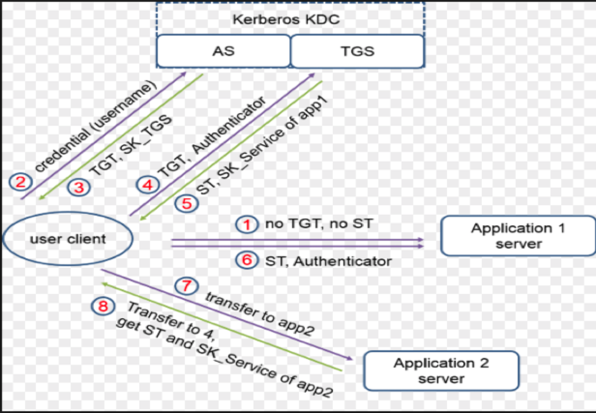
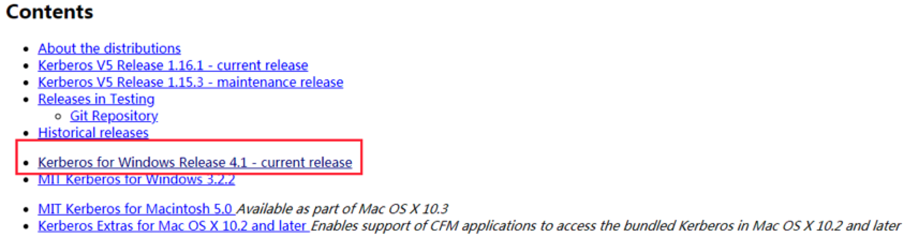
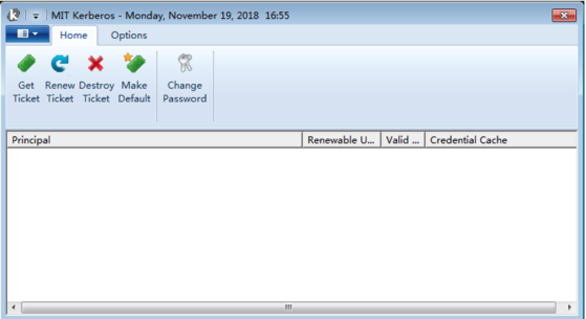

## HDP 客户端安装与配置

### Kerberos MIT KDC

文档是基于`HDP 3.0` 环境进行说明，Kerberos使用的是`MIT KDC` 模式。以下内容也是基于`MIT KDC` 进行相应的讲述。



主要是由三部分组成：Client，KDC，Server

- AS（Authentication Server）=  认证服务器
- KDC（Key Distribution Center）=  密钥分发中心
- TGT（Ticket Granting Ticket）=  认证票据
- TGS（Ticket Granting Server）=  票据授权服务器
- SS（Service Server）=  特定服务提供端
- ST（Service Ticket）= 服务票据

#### KDC

KDC由认证服务器和票据授权服务器组成的。KDC中保存着大量密钥数据库，HDP在开启Kerberos后会自动生成。每个网络服务节点，无论是Client还是Server都共享一份只有他自己和KDC知道的密钥集合。密钥的内容用于证明实体的身份。如若两个实体间的通信，KDC产生一个会话密钥，用来加密他们之间的交互信息。

### 流程

1、执行`kinit -kt`

- **客户端用户**发送自己的**用户名**到**KDC服务器**，向**AS服务**进行认证
- **KDC服务器**会生成相应的**TGT票据**，追加时间戳，在本地数据库中查找该用户的密码，并用该密码对TGT进行加密，将加密后的TGT返回给客户端用户
- 客户端收到返回信息，并使用自己的密码进行解密之后，就能得到真实的TGT票据了

2、Principal用户调用特定服务

- 客户端就发送TGT到KDC服务器中的TGS服务
- 当该用户的TGT验证通过，并且其有权访问所申请的服务时，TGS服务会生成一个该服务所对应的Ticket和Session Key，返还给客户端
- 客户端将服务请求与该Ticket一并发送给相应的服务端

> TGT是有过期时间的，当然也可以自己进行配置为永不过期。

网上找到的例子帮助理解一下：

用户要去游乐场，首先要在门口检查用户的身份(即 CHECK 用户的 ID 和 PASS), 如果用户通过验证，游乐场的门卫 (AS) 即提供给用户一张门卡 (TGT)。

这张卡片的用处就是告诉游乐场的各个场所，用户是通过正门进来，而不是后门偷爬进来的，并且也是获取进入场所一把钥匙。

现在用户有张卡，但是这对用户来不重要，因为用户来游乐场不是为了拿这张卡的而是为了游览游乐项目，这时用户摩天楼，并想游玩。

这时摩天轮的服务员 (client) 拦下用户，向用户要求摩天轮的 (ST) 票据，用户说用户只有一个门卡 (TGT), 那用户只要把 TGT 放在一旁的票据授权机 (TGS) 上刷一下。 票据授权机 (TGS) 就根据用户现在所在的摩天轮，给用户一张摩天轮的票据 (ST), 这样用户有了摩天轮的票据，现在用户可以畅通无阻的进入摩天轮里游玩了。

当然如果用户玩完摩天轮后，想去游乐园的咖啡厅休息下，那用户一样只要带着那张门卡 (TGT). 到相应的咖啡厅的票据授权机 (TGS) 刷一下，得到咖啡厅的票据 (ST) 就可以进入咖啡厅。

当用户离开游乐场后，想用这张 TGT 去刷打的回家的费用，对不起，用户的 TGT 已经过期了，在用户离开游乐场那刻开始，用户的 TGT 就已经销毁了。

### 安装

#### Windows环境

[下载地址](http://web.mit.edu/kerberos/dist/)

选择如下



跟着导航安装完成后，

1. 在PATH环境变量的配置。将安装目录下的bin目录配置追加到最前（`C:\Program`
   `Files\MIT\Kerberos\bin`），可以在环境变量Path中先检查是否存在，默认情况会安装到`C:\Program Files\MIT\Kerberos` 路径
2. 同时在`C:\ProgramData\MIT\Kerberos5`，路径下生成kerberos的配置文件`krb5.ini`

> 将安装后PATH环境变会自动生成的bin目录位置放在jdk目录的前面，因为jdk中含有klist，kinit等命令，这时进行认证的话，读取到的是jdk中的命令，实现不了认证，会出现如下问题


#### Mac环境

MacOS 系统默认就安装了Kerberos，还带有票据显示软件。

### 修改配置

安装成功客户端之后，根据`HDP-Kerberos`信息对`C:\ProgramData\MIT\Kerberos5\krb5.ini`（`Mac:/etc/krb5.conf`）修改

```
[logging]
 default = FILE:/var/log/krb5libs.log
 kdc = FILE:/var/log/krb5kdc.log
 admin_server = FILE:/var/log/kadmind.log

[libdefaults]
 dns_lookup_realm = false
 ticket_lifetime = 24h
 renew_lifetime = 7d
 forwardable = true
 rdns = false
 default_realm = EXPER.ORG
 default_ccache_name = KEYRING:persistent:%{uid}
 dns_fallback = no
 dns_lookup_kdc = true
 udp_preference_limit = 1

[realms]
  EXPER.ORG = {
   kdc = testdmp1.fengdai.org
   admin_server = testdmp1.fengdai.org
   default_domain = EXPER.ORG
  }
[domain_realm]
  .exper.org = EXPER.ORG
  exper.org = EXPER.ORG
```

此时，你可以从Kerberos服务节点上，下载一个Keytab进行服务的安装结果的认证。

执行命令校验

```shell
kinit -k -t ./hbase.headless.keytab hbase
```

在Kerberos客户端查看状态



### 常用命令

| 进入kadmin                  | kadmin.local/kadmin                                          |
| --------------------------- | ------------------------------------------------------------ |
| 创建数据库                  | kdb5_util create -r JENKIN.COM -s                            |
| 启动kdc服务                 | service krb5kdc start                                        |
| 启动kadmin服务              | service kadmin start                                         |
| 修改当前密码                | kpasswd                                                      |
| 测试keytab可用性            | kinit -k -t /var/kerberos/krb5kdc/keytab/root.keytab root/master1@JENKIN.COM |
| 查看keytab                  | klist -e -k -t /etc/krb5.keytab                              |
| 清除缓存                    | kdestroy                                                     |
| 通过keytab文件认证登录      | kinit -kt /var/run/cloudera-scm-agent/process/***-HIVESERVER2/hive.keytab hive/node2 |
| 查看此keytab中所有principal | klist -k user.keytab                                         |
| 更新credentials             | kinit -R                                                     |

