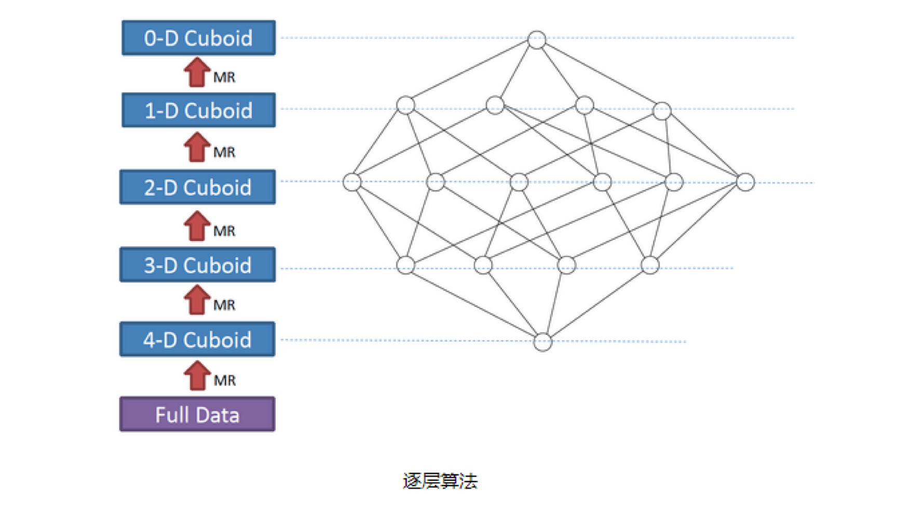
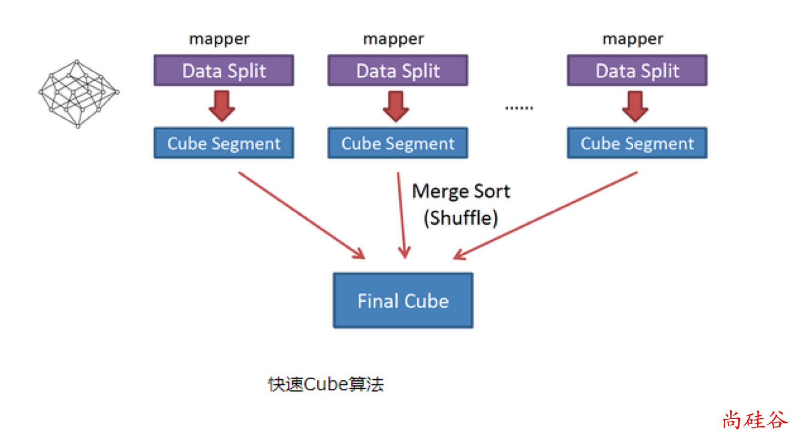

## 什么是 Kylin

​	

### 名词解释

超高基（UHC) 维度：基数表示维度不同值的数量。通常，维度的基数从数十到数百万。如果超过百万，我们将其称为超高基维度，例如：用户 ID，电话号码等。

维度：维度就是观察数据的角度。它通常是数据记录的一个属性，例如时间、地点等。

度量：度量就是被聚合后的统计值，也是聚合运算的结果，如图中的销售额，抑或是销售商品的总件数。

Cuboid：对于每一种维度的组合，将度量做聚合运算，然后将运算的结果保存为一个物化视图，称为`Cuboid`。

Cube：所有维度组合的`Cuboid`作为一个整体。一个 `Cube` 就是许多按维度聚合的物化视图的集合。

Cube Segment：是指针对源数据中的某一个片段，计算出来的 Cube 数据。通常数据仓库中的数据数量会随着时间的增长而增长，而 Cube Segment 也是按时间顺序来构建的。

### 特性

- 支持 SQL 接口
- 支持超大规模数据集
- 亚秒级响应
- 可伸缩性
- 高吞吐率
- BI 工具集成

## 限制与前提

- Kylin 会在 cube 中包含所有的 cuboid 场景，一旦 Cube 被构建完成，它的结构不能被修改。
- 大数据查询要的一般是统计结果，是多条记录经过聚合函数计算后的统计值。原始的记录则不是必需的，或者访问频率和概率都极低。
- 聚合是按维度进行的，由于业务范围和分析需求是有限的，有意义的维度聚合组合也是相对有限的，一般不会随着数据的膨胀而增长。
- 数据源可以是: Hadoop, Hive, Kafka, RDBMS。
- 只支持离线任务。

## 主要功能

### Kylin 可视化

可以与 Kylin 结合使用的可视化工具很多，例如：

- ODBC：与 Tableau、Excel、PowerBI 等工具集成
- JDBC：与 Saiku、BIRT 等 Java 工具集成
- RestAPI：与 JavaScript、Web 网页集成
- Kylin 开发团队还贡献了 Zepplin 的插件，也可以使用 Zepplin 来访问 Kylin 服务。

### 丰富的预聚合语法

SUM, MIN, MAX、COUNT DISTINCT、TOP_N。

## 实现原理与思想

### 核心算法

预计算过程是 Kylin 从 Hive 中读取原始数据，按照我们选定的维度进行计算，并将结果集保存到 Hbase 中，默认的计算引擎为 MapReduce，可以选择 Spark 作为计算引擎。

一次 build 的结果，我们称为一个 Segment。构建过程中会涉及多个 Cuboid 的创建，具体创建过程算法由`kylin.cube.algorithm`参数决定，参数值可选 `auto`，`layer` 和 `inmem`， 默认值为 `auto`，即 Kylin 会通过采集数据动态地选择一个算法 (`layer or inmem`)，如果用户很了解 Kylin 和自身的数据、集群，可以直接设置喜欢的算法。

#### 逐层构建算法（layer）

我们知道，一个 N 维的 Cube，是由 1 个 N 维子立方体、N 个 (N-1) 维子立方体、N*(N-1)/2个(N-2)维子立方体、......、N个1维子立方体和1个0维子立方体构成，总共有2^N个子立方体组成，

在逐层算法中，按维度数逐层减少来计算，每个层级的计算（除了第一层，它是从原始数据聚合而来），**是基于它上一层级的结果来计算的。**比如，[Group by A, B]的结果，可以基于[Group by A, B, C]的结果，通过去掉C后聚合得来的；这样可以减少重复计算；当 0 维度Cuboid计算出来的时候，整个Cube的计算也就完成了。

**每一轮的计算都是一个MapReduce任务，且串行执行；一个 N 维的 Cube，至少需要 N 次 MapReduce Job。**

##### 算法优点：

- 此算法充分利用了 MapReduce 的能力，处理了中间复杂的排序和洗牌工作，故而算法代码清晰简单，易于维护；
- 受益于 Hadoop 的日趋成熟，此算法对集群要求低，运行稳定；在内部维护 Kylin 的过程中，很少遇到在这几步出错的情况；即便是在Hadoop集群比较繁忙的时候，任务也能完成。

##### 算法缺点：

- 当 Cube 有比较多维度的时候，所需要的 MapReduce 任务也相应增加；由于Hadoop的任务调度需要耗费额外资源，特别是集群较庞大的时候，反复递交任务造成的额外开销会相当可观；
- 由于 Mapper 不做预聚合，此算法会对 Hadoop MapReduce 输出较多数据; 虽然已经使用了Combiner 来减少从 Mapper 端到 Reducer 端的数据传输，所有数据依然需要通过 Hadoop MapReduce 来排序和组合才能被聚合，无形之中增加了集群的压力;
- 对 HDFS 的读写操作较多：由于每一层计算的输出会用做下一层计算的输入，这些`Key-Value`需要写到 HDFS 上；当所有计算都完成后，Kylin 还需要额外的一轮任务将这些文件转成 HBase 的 HFile 格式，以导入到 HBase 中去；

总体而言，该算法的效率较低，尤其是当 Cube 维度数较大的时候。

#### 2. 快速构建算法（inmem）

也被称作“逐段”(`By Segment`) 或“逐块”(`By Split`) 算法，从1.5.x开始引入该算法

利用`Mapper`端计算先完成大部分聚合，再将聚合后的结果交给`Reducer`，从而降低对网络瓶颈的压力。

该算法的主要思想是，对`Mapper`所分配的数据块，将它计算成一个完整的小`Cube` 段（包含所有 Cuboid ）；每个 Mapper将 计算完的 Cube 段输出给 Reducer 做合并，生成大 Cube，也就是最终结果；如图所示解释了此流程。

##### 与旧算法相比，快速算法主要有两点不同：

- Mapper 会利用内存做预聚合，算出所有组合；Mapper 输出的每个 Key 都是不同的，这样会减少输出到 Hadoop MapReduce 的数据量，Combiner 也不再需要；
- 一轮 MapReduce 便会完成所有层次的计算，减少 Hadoop 任务的调配。

>对稳定性有很高要求选用 MR 方式，把性能放在首位的选用 Spark。
>
>如果你的 cube 只有简单度量（SUM, MIN, MAX)，建议使用 Spark。如果 cube 中有复杂类型度量（COUNT DISTINCT, TOP_N），建议使用 MapReduce。

### HBase 数据存储

#### HBase 的 RowKey

rowkey 是由维度字段字拼接而成，同时，kylin 为了节省空间，对数据进行了编码和压缩。编码类型提供了字典、整数、固定长度、Date、Time选项，默认是字典类型。

#### Rowkey 维度排列顺序

将必要的维度放在前面，之后是作为 where 条件的维度。当多个维度作为查询条件的时候，将超高基维度放在前面，这样就充分利用查询条件缩小 HBase 扫描范围，提高查询效率。

## 问题与解答

1. Cube 可以支持多少个维度？

Cube 的最大物理维度数量 (不包括衍生维度) 是 63，但是不推荐使用大于 30 个维度的 Cube，会引起维度灾难。

Cube的构建的构建过程？

https://www.jianshu.com/p/7906f428aaec

3. cube 剪枝优化？

https://www.jianshu.com/p/7906f428aaec

## 总结

## 文档

https://zhenchao125.gitbooks.io/bigdata_kylin_atguigu/di-5-zhang-cube-gou-jian-you-hua/51-zhao-dao-wen-ti-cube.html

https://www.jianshu.com/p/abd5e90ab051

[Apache Kylin on HBase](https://yq.aliyun.com/live/1070?spm=a2c4e.11154022.liveshowinfo.15.532b1416977lf5)

