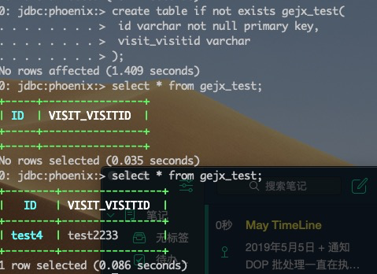

# Phoenix 数据导入与导出

Phoenix 官方提供了相应的导入和导出的方案，分别位于：

导入：https://phoenix.apache.org/bulk_dataload.html

导入、导出：https://phoenix.apache.org/pig_integration.html

导出需要依赖 `Apache Pig` 相应进行实现。我们先来聊聊如何导出吧。

**环境：**HDP 3.0.0、HBase 2.0.0、Phoenix 5.0.0、Pig 0.16.0

## 导出

Phoenix 官方提供的 Pig 方案，看似很简单，其实还是有很多需要注意的地方，比较官方给的都是最简单的示例，而实际应用场景的时候，会碰到很多意想不到的问题。我在本文就讲讲我的实现方法和遇到的坑吧。

以下操作需要先安装 Pig 环境。

`test.pig`

```shell
REGISTER /usr/hdp/3.0.0.0-1634/hbase/lib/*.jar;
REGISTER lib/*.jar;
rows = load 'hbase://table/DOP_VISIT_INFO_V2' USING org.apache.phoenix.pig.PhoenixHBaseLoader('dev-dmp3.fengdai.org,dev-dmp4.fengdai.org,dev-dmp5.fengdai.org');
```

- REGISTER：注册所需要的包，官方示例中没有响应的体现，在使用过程中，如果遇到找不到类的相关问题，一般就是包不存在导致的，可以通过 REGISTER 进行引用，**并且支持相对路径和模糊匹配哦。**
- `hbase://table/DOP_VISIT_INFO_V2` ：是指需要备份的表，如果是全表就用 `hbase://table` ，后面跟表名，这里就是 `DOP_VISIT_INFO_V2` 查询的结果导出则用 `hbase://query` ，后面跟查询语句。
- `PhoenixHBaseLoader 参数`：ZooKeeper 地址。

执行语句：

```shell
pig -x mapreduce test.pig
```

相应的导出的数据是存储在 HDFS 上，需要留意一下脚本执行完以后相应的日志中会有体现。

### CSV

```shell
REGISTER /usr/hdp/3.0.0.0-1634/hbase/lib/*.jar;
REGISTER lib/*.jar;
rows = load 'hbase://table/DOP_VISIT_INFO_V2' USING org.apache.phoenix.pig.PhoenixHBaseLoader('dev-dmp3.fengdai.org,dev-dmp4.fengdai.org,dev-dmp5.fengdai.org');
STORE rows INTO 'dop_visit_info_v2.csv' USING PigStorage(',');
```

`STORE rows INTO 'dop_visit_info_v2.csv' USING PigStorage(',')` ：导出到 HDFS 的文件路径和数据存储格式，这里就是存放 `dop_visit_info_v2.csv` 目录下，这里千万注意，这是一个文件夹，而不是一个 `csv` 文件，起初，我也很单纯的以为，Too Young，使用逗号进行分隔。

### Query

```shell
REGISTER /usr/hdp/3.0.0.0-1634/hbase/lib/*.jar;
REGISTER lib/*.jar;
rows = load 'hbase://query/select * DOP_VISIT_INFO_V2 where age >18' USING org.apache.phoenix.pig.PhoenixHBaseLoader('dev-dmp3.fengdai.org,dev-dmp4.fengdai.org,dev-dmp5.fengdai.org');
```

**注意：** 使用query语句指定的导出方式存在很大的限制，比如说不能指定 `GROUP BY , LIMIT , ORDER BY , DISTINCT` ；同时也无法指定使用聚合函数，如 `count，sum` 等。

### 数据校验

数据存储在 HDFS 下哦。

```shell
hdfs dfs -cat '/dop_visit_info_v2.csv/part-m-00000'
```

## 导入

### Pig 方式

Phoenix 支持使用 **Pig StoreFunc** 实现 `bulk upload` 数据导入。

```shell
REGISTER /usr/hdp/3.0.0.0-1634/hbase/lib/*.jar;
REGISTER lib/*.jar;
A = load 'gejx.csv' USING PigStorage(',') as (ID:chararray, DOP_VISIT_VISITID:chararray); 
STORE A into 'hbase://GEJX_TEST' using
    org.apache.phoenix.pig.PhoenixHBaseStorage('dev-dmp3.fengdai.org,dev-dmp4.fengdai.org,dev-dmp5.fengdai.org','-batchSize 100');
```

- `gejx.csv` ：导出的数据存储路径
- `hbase://GEJX_TEST` ：导入的表
- `-batchSize 100`：upsert 批量条数
- `ID:chararray, DOP_VISIT_VISITID:chararray` ：字段名称与类型映射关系，这里的字段名是属于 GEJX_TEST 表中的字段，也就是目标持久化的表名
- `USING PigStorage(',')`：可选，如果是使用上方 CSV 导出方式，则需要加上

**注意：** 表需要提前创建哦，否则，会报表不存在。


#### 数据类型

Pig 数据类型默认是 chararray，常用数据类型为：int、long、float、double、chararray、bytearray、map、tuple、bag。

详细查看 [pig 数据类型](https://n3xtchen.github.io/n3xtchen/hadoop/2014/01/06/hadoop-data-pig-data-type) 。

如果 Phoenix 表中存在 null 值，通过 Pig 方式导入导出数据会存在 null 变成了空字符串。

### MR

在使用 https://phoenix.apache.org/bulk_dataload.html 中 MR 方式时，由于 HDP 环境开启了 Kerberos 模式，一直遇到了认证的问题，后来发现支持 `-D` 的语法，不过这里需要注意的是一定要放在 hadoop jar 参数命令之前，否则会报没有这个命令的错误。

```shell
hadoop jar /usr/hdp/3.0.0.0-1634/phoenix/phoenix-5.0.0.3.0.0.0-1634-client.jar org.apache.phoenix.mapreduce.CsvBulkLoadTool -Dhbase.master.kerberos.principal=hbase/_HOST@DEV.ORG -Dhbase.regionserver.kerberos.principal=hbase/_HOST@DEV.ORG -Dhadoop.security.authentication=kerberos -Dhbase.security.authentication=kerberos -Dphoenix.schema.isNamespaceMappingEnabled=true -Dphoenix.schema.mapSystemTablesToNamespace=false -Dphoenix.queryserver.withRemoteUserExtractor=true --table GEJX_TEST --input /user/dmpadmin/gejx.csv -z dev-dmp3.fengdai.org,dev-dmp4.fengdai.org,dev-dmp5.fengdai.org:/hbase-secure
```

`phoenix-5.0.0.3.0.0.0-1634-client.jar` 该包是存放在 Phoenix 安装目录下的，并不是 lib 目录。

## 高级

以上的方式导入和导出是相互割裂的，而有一种场景在生产上也碰到的很多，就是表与表之间的数据同步，比如，现在有两张表 A 表和 B 表，表部分字段一样，字段名称不一样，现在需要将 A 表中的数据同步到 B 表，我们也可以通过 Pig 方式实现。

```shell
REGISTER /usr/hdp/3.0.0.0-1634/hbase/lib/*.jar;
REGISTER lib/*.jar;
A = load 'hbase://query/select * from GEJX' USING org.apache.phoenix.pig.PhoenixHBaseLoader('dev-dmp3.fengdai.org,dev-dmp4.fengdai.org,dev-dmp5.fengdai.org');
STORE A into 'hbase://GEJX_TEST' using
    org.apache.phoenix.pig.PhoenixHBaseStorage('dev-dmp3.fengdai.org,dev-dmp4.fengdai.org,dev-dmp5.fengdai.org','-batchSize 100');
```

将导入和导出放在一起进行操作，batchSize 可以根据实际情况进行相应的调整。



## Q&A

1. Zookeeper 端口配置

   ```shell
   zk1:2181,zk2:2181,zk3:2181
   ```

2. Kerberos 认证

   开启 Keberos 模块的场景下，需要提前在 Pig 所在服务器下进行 kinit 操作

3. 数据导出导入顺序保证

4. 报错：`org.apache.pig.PigServer - exception during parsing: Error during parsing. null Failed to parse: null`

   一般是语法错误导致的。

5. 报错：`ERROR org.apache.pig.tools.grunt.GruntParser - ERROR 0: java.io.IOException: java.lang.RuntimeException: java.lang.Integer cannot be coerced to TINYINT`

   这个问题就无法解决了，目标表的不能使用 TINYINT 类型。

## 参考

- [pig导出hbase表格式为CSV](https://www.jianshu.com/p/cdb60f0d5ed7)
- [Phoenix4.6 导出csv文件](http://itfish.net/article/59764.html)
- [pig 数据类型](https://n3xtchen.github.io/n3xtchen/hadoop/2014/01/06/hadoop-data-pig-data-type)
- [Storing Data](https://www.tutorialspoint.com/apache_pig/apache_pig_storing_data.htm)