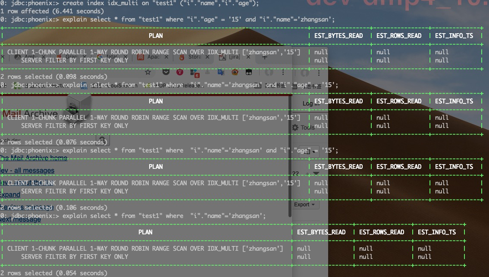

# Phoenix索引

## 索引

在Phoenix中存在本地索引和全局索引之分。本地索引其索引数据会混合在业务表中，全局索引是单独创建一张索引表进行记录索引信息

## 默认规则

- 需求表对读的操作比较多的，使用全局索引，写的操作比较多，使用本地索引

## 本地索引

本地索引存在于业务表中，其会单独建一个列族`[L0]`，与业务字段是不同的列族。

### 默认值

对存在默认值设定的业务表，添加本地索引，会出现默认值丢失的情况，除非查询条件中存在主键字段

### 数据迁移

1. 将索引列族去除
2. 使用MapReduce导出HBASE中的数据
3. 在新库中Phoenix中创建表
4. 导入数据
5. 创建本地索引

## 全局索引

全局索引是单独建一张索引表。

### 默认值

对存在默认值设定的业务表，添加全局索引，完美支持，此时，不要使用不可变索引（IMMUTABLE_ROWS=true）不可变索引只会进行插入数据，不会更新数据，从而导致数据的覆盖

### 数据迁移

1. 直接Hbase中的业务表和索引表都导出
2. 新库中导入数据

## 索引实践

联合两个字段作为索引时，任选其一或者组合方式作为查询条件，都可以索引命中，并且无顺序要求。