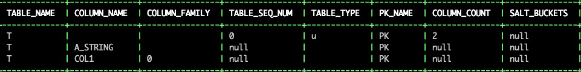
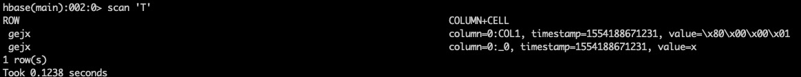

```
CREATE TABLE T
(    
a_string varchar not null,  
col1 integer  
CONSTRAINT pk PRIMARY KEY (a_string)  
)  
COLUMN_ENCODED_BYTES = none;
```

```
select * from SYSTEM.CATALOG where table_name='T';
```



```
upsert into t (a_string,col1)values('gejx',1);
```



```
CREATE TABLE T
(    
a_string varchar not null,  
col1 integer  
CONSTRAINT pk PRIMARY KEY (a_string)  
)  
COLUMN_ENCODED_BYTES = 0;
```


