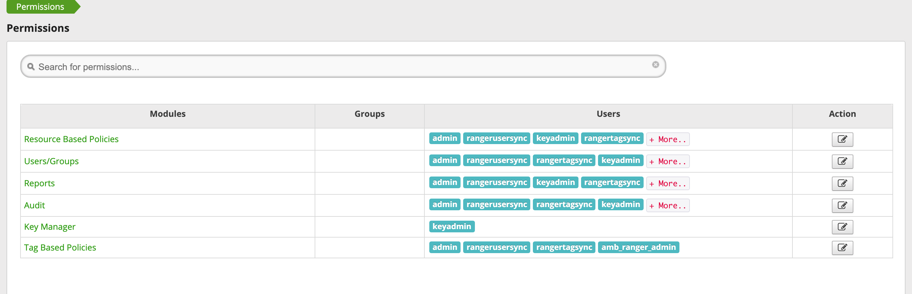
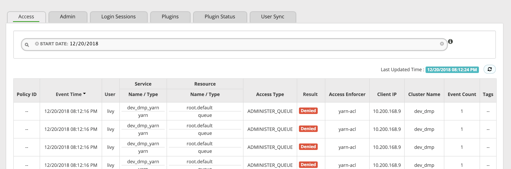
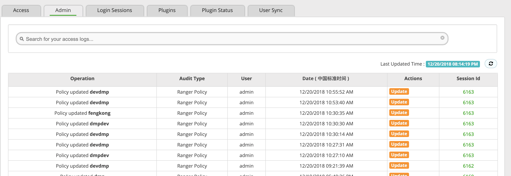
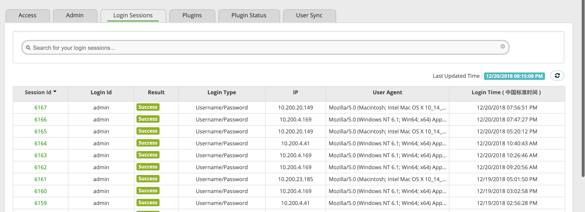
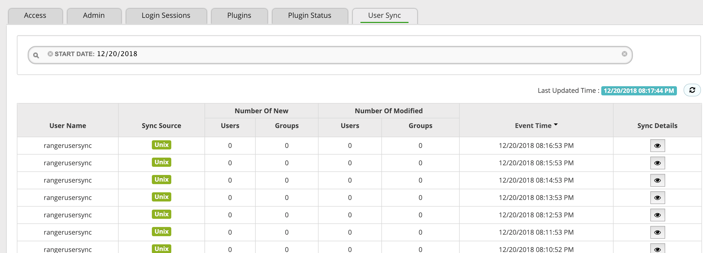
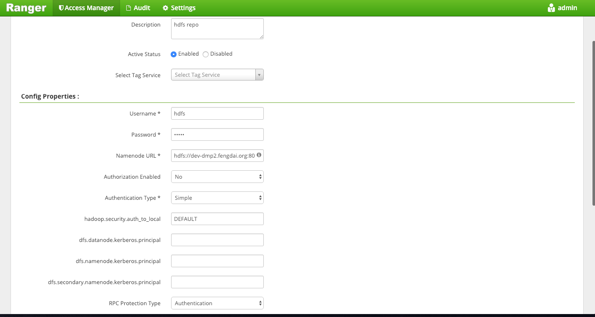
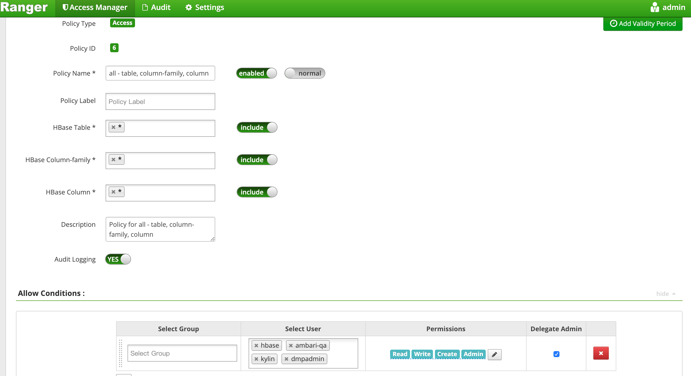

## Ranger

Apache Ranger 是 Hadoop平台上实现，监控和管理全面数据安全性的工具。只需要安装相应的插件，即可实现 Yarn、HDFS、HBase、Hive、Kafka、Kylin、Elasticsearch等组件可视化权限控制支持。

> 本文会根据作者实战过程使用的场景进行说明，一些未使用到的插件，可能不能准确的进行详细说明。

### User&Group

Ranger **用户类型**分为 External、Internal 两种。External 是从服务器中的用户同步到 Ranger 下，需要注意的是服务器端进行用户的删除，是不会数据同步到 Ranger 中，需要自行手动操作。Internal 则是直接在 Ranger 中创建的用户。与 Kerberos 方案时，使用 External 方式进行数据的权限控制。

```shell
# 创建用户
useradd dmp
# 删除用户
userdel -r dmp
```

Ranger **组**与其他系统的概念是一致的。作为多个用户的集合，一些公共的权限配置可以放在组中，通过对组的权限控制，就可以实现对组中用户的能力赋予。组的操作与 External 相同，是通过操作服务器的方式实现，但系统中的 group 组下没有用户，Ranger是不会进行组的同步。

```shell
# 创建组
usermod -a -G dmp dmpGroup
```

### Permissions

用于配置 Ranger Web 的相应权限，只有管理者权限用户可以进行相应操作。 



### Audit

#### Access

认证信息的日志记录的查询。



#### Admin

权限配置更新的日志查询。



#### Login Session

Ranger Web 页面登录信息日志。



#### Plugins

安装的插件的操作日志。


#### Plugins Status

插件的一些安装变更的信息。


#### User Sync

用户同步记录，同步时间可以进行配置，修改`ranger.usersync.sleeptimeinmillisbetweensynccycle` 配置即可。



### Hadoop插件

#### 添加Hadoop服务



- Service Name : *name of the repository; required when configuring agents*
- Description : *a description of the repository*
- Active status : *Enabled or Disabled*
- Repository Type : *HDFS (cannot be modified)*
- User Name : *end system username that can be used for connection*
- fs.default.name : *location of the Hadoop HDFS service, as noted in the Hadoop configuration file core-site.xml OR (if this is a HA environment) the path for the primary NameNode*
- hadoop.security.authorization : *true or false, as specified in core-site.xml, to enable authorization for different protocols or not.*
- hadoop.security.authentication : *type of authentication in use, as noted in the Hadoop configuration file core-site.xml. Can be either simple or Kerberos (required only if authorization is enabled)*
- hadoop.security.auth_to_local : *maps the login  credential to a username with Hadoop. Use  the value noted in the Hadoop configuration file, core-site.xml*
- dfs.datanode.kerberos.principal : *principal associated with the DataNode where the repository resides, as noted in the Hadoop configuration file hdfs-site.xml (required only if Kerberos authentication is enabled)*
- dfs.namenode.kerberos.principal : *principal associated with the NameNode where the repository resides, as noted in the Hadoop configuration file hdfs-site.xml (required only if Kerberos authentication is enabled)*
- dfs.secondary.namenode.kerberos.principal : *principal associated with the secondary NameNode where the repository resides, as noted in the Hadoop configuration file hdfs-site.xml  (required only if Kerberos authentication is enabled)*
- hadoop.rpc.protection : *a comma-separated list of protection values for secured SASL connections. Possible values are authentication, integrity and privacy.* 
- Common Name For Certificate : *name of the certificate*

#### HDFS与Ranger


#### 配置Hadoop策略


- **Policy ID:** 策略的主键ID
- **Policy Name:** 策略的名称
- **Resource Path:** 策略控制的路径信息，支持 * 方式对路径的模糊匹配
- **Permissions:** 分Write(w)、Execute(x)、Read(r)三种类型，写操作需要结合 Write 和 Execute 两者实现。
- **Delegate Admin:** 对其打勾，就拥有了继承的管理者的权限，即相应的用户或组拥有对其下资源进行自定义的更细化权限控制。
- **Recursive:** 支持递归

### HBase插件

#### 添加 HBase Service


- Service Name : *name of the repository; required when configuring agents*
- Description : *a description of the repository*
- Active status : *Enabled or Disabled*
- Repository Type : *HBase (cannot be modified)*
- User Name : *end system username that can be used for connection*
- Password : *password for the username entered above*
- hadoop.security.authorization : *type of authorization in use. Can be either simple or Kerberos.*
- hbase.master.kerberos.principal : *Kerberos principal for the HBase Master (required only if Kerberos authetication is enabled)*
- hbase.security.authentication : *As noted in the Hadoop configuration file hbase-site.xml*
- hbase.zookeeper.property.cientPort : *As noted in the Hadoop configuration file hbase-site.xml*
- hbase.zookeeper.quorum :*As noted in the Hadoop configuration file hbase-site.xml*
- zookeeper.znode.parent : *As noted in the Hadoop configuration file hbase-site.xml*

#### 配置HBase策略



- **HBase Table：**拥有权限的表。namespace:tableName
- **HBase Column-family：**拥有的列族。
- **HBase Column：**拥有的列名

### Yarn

#### 添加Yarn服务


#### 配置Yarn策略


yarn 中队列信息


Ambari下配置 yarn 队列


**Queue:** Yarn的队列类型控制，可以是`*`，默认是`root.default`

**Permissions:** `submit-app` 提交应用的权限，`admin-queue` 查看所有的应用列表

### 拓展阅读

官方文档：https://cwiki.apache.org/confluence/pages/viewpage.action?pageId=57901344