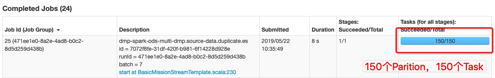
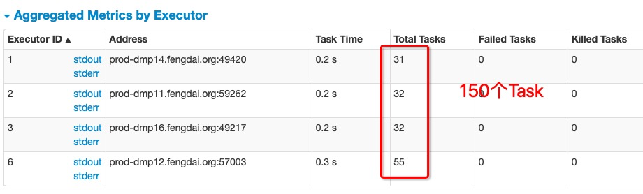

# Spark基础理解

介绍Spark中的一些概念：

- RDD（resillient distributed dataset）：弹性分布式数据集。Spark应用程序通过使用Spark的转换API可以将RDD封装为一系列具有血缘关系的RDD，也就是DAG。只有通过Spark的动作API才会将RDD及其DAG提交到DAGScheduler。RDD的祖先一定是一个跟数据源相关的RDD，负责从数据源迭代读取数据。
- DAG（Directed Acycle graph）：有向无环图。在图论中，如果一个有向图无法从某个顶点出发经过若干条边回到该点，则这个图是一个有向无环图（DAG图）。Spark使用DAG来反映各RDD之间的依赖或血缘关系。
- Partition：数据分区。即一个RDD的数据可以划分为多少个分区。Spark根据Partition的数量来确定Task的数量。
- NarrowDependency：窄依赖。即子RDD依赖于父RDD中固定的Partition。NarrowDependency分为OneToOneDependency和RangeDependency两种。
- ShuffleDependency：Shuffle依赖，也称为宽依赖。即子RDD对父RDD中的所有Partition都可能产生依赖。子RDD对父RDD各个Partition的依赖将取决于分区计算器（Partitioner）的算法。
- Job：用户提交的作业。当RDD及其DAG被提交给DAGScheduler调度后，DAGScheduler会将所有RDD中的转换及动作视为一个Job。一个Job由一到多个Task组成。
- Stage：Job的执行阶段。DAGScheduler按照ShuffleDependency作为Stage的划分节点对RDD的DAG进行Stage划分（上游的Stage将为ShuffleMapStage）。因此一个Job可能被划分为一到多个Stage。Stage分为ShuffleMapStage和ResultStage两种。
- Task：具体执行任务。一个Job在每个Stage内都会按照RDD的Partition 数量，创建多个Task。Task分为ShuffleMapTask和ResultTask两种。ShuffleMapStage中的Task为ShuffleMapTask，而ResultStage中的Task为ResultTask。ShuffleMapTask和ResultTask类似于Hadoop中的 Map任务和Reduce任务。

Spark Core中提供了Spark最基础与最核心的功能，主要包括：

- 基础设施：在Spark中有很多基础设施，被Spark中的各种组件广泛使用。这些基础设施包括Spark配置（SparkConf）、Spark内置的Rpc框架（在早期Spark版本中Spark使用的是Akka）、事件总线（ListenerBus）、度量系统。SparkConf用于管理Spark应用程序的各种配置信息。Spark内置的Rpc框架使用Netty实现，有同步和异步的多种实现，Spark各个组件间的通信都依赖于此Rpc框架。如果说Rpc框架是跨机器节点不同组件间的通信设施，那么事件总线就是SparkContext内部各个组件间使用事件——监听器模式异步调用的实现。度量系统由Spark中的多种度量源（Source）和多种度量输出（Sink）构成，完成对整个Spark集群中各个组件运行期状态的监控。
- SparkContext：通常而言，用户开发的Spark应用程序（Application）的提交与执行都离不开SparkContext的支持。在正式提交Application之前，首先需要初始化SparkContext。SparkContext隐藏了网络通信、分布式部署、消息通信、存储体系、计算引擎、度量系统、文件服务、Web UI等内容，应用程序开发者只需要使用SparkContext提供的API完成功能开发。
- SparkEnv：Spark执行环境（SparkEnv）是Spark中的Task运行所必须的组件。SparkEnv内部封装了Rpc环境（RpcEnv）、序列化管理器、广播管理器（BroadcastManager）、map任务输出跟踪器（MapOutputTracker）、存储体系、度量系统（MetricsSystem）、输出提交协调器（OutputCommitCoordinator）等Task运行所需的各种组件。
- 存储体系：Spark优先考虑使用各节点的内存作为存储，当内存不足时才会考虑使用磁盘，这极大地减少了磁盘I/O，提升了任务执行的效率，使得Spark适用于实时计算、迭代计算、流式计算等场景。在实际场景中，有些Task是存储密集型的，有些则是计算密集型的，所以有时候会造成存储空间很空闲，而计算空间的资源又很紧张。Spark的内存存储空间与执行存储空间之间的边界可以是“软”边界，因此资源紧张的一方可以借用另一方的空间，这既可以有效利用资源，又可以提高Task的执行效率。此外，Spark的内存空间还提供了Tungsten的实现，直接操作操作系统的内存。由于Tungsten省去了在堆内分配Java对象，因此能更加有效的利用系统的内存资源，并且因为直接操作系统内存，空间的分配和释放也更迅速。在Spark早期版本还使用了以内存为中心的高容错的分布式文件系统Alluxio（Tachyon）供用户进行选择。Alluxio能够为Spark提供可靠的内存级的文件共享服务。
- 调度系统：调度系统主要由DAGScheduler和TaskScheduler组成，它们都内置在SparkContext中。DAGScheduler负责创建Job、将DAG中的RDD划分到不同的Stage、给Stage创建对应的Task、批量提交Task等功能。TaskScheduler负责按照FIFO或者FAIR等调度算法对批量Task进行调度；为Task分配资源；将Task发送到集群管理器分配给当前应用的Executor上由Executor负责执行等工作。现如今，Spark增加了SparkSession和DataFrame等新的API，SparkSession底层实际依然依赖于SparkContext。
- 计算引擎：计算引擎由内存管理器（MemoryManager）、Tungsten、任务内存管理器（TaskMemoryManager）、Task、外部排序器（ExternalSorter）、Shuffle管理器（ShuffleManager）等组成。MemoryManager除了对存储体系中的存储内存提供支持和管理，还外计算引擎中的执行内存提供支持和管理。Tungsten除用于存储外，也可以用于计算或执行。TaskMemoryManager对分配给单个Task的内存资源进行更细粒度的管理和控制。ExternalSorter用于在map端或reduce端对ShuffleMapTask计算得到的中间结果进行排序、聚合等操作。ShuffleManager用于将各个分区对应的ShuffleMapTask产生的中间结果持久化到磁盘，并在reduce端按照分区远程拉取ShuffleMapTask产生的中间结果。

一个task 每次只能处理一个 partition 的数据





一个 executor core 同时只能处理一个 task 任务


## Spark SQL

[http://ixiaosi.art/2019/02/18/spark/spark-structured-streaming%E5%88%86%E6%9E%90/](http://ixiaosi.art/2019/02/18/spark/spark-structured-streaming分析/)

https://blog.csdn.net/LS_ice/article/details/81981762

### DataFrame

一种类表结构的数据结构。一般为RDD、List、Seq等列表形式数据结构转换得到。

```scala
 val buffer: ArrayBuffer[DopVisitInfoDto] = new ArrayBuffer()
 ...
 val dopVisitInfoTable: DataFrame = spark.createDataFrame(buffer)
 val dop_visit_info = dopVisitInfoTable
      .withColumn("LOGGING_TIME", ($"DOP_VISIT_LOGGINGTIME" / 1000).cast(TimestampType))
      .withColumn("year", year($"LOGGING_TIME"))
      .withColumn("month", month($"LOGGING_TIME"))
      .withColumn("day", dayofmonth($"LOGGING_TIME"))
      .withColumn("hour", hour($"LOGGING_TIME"))
```

**cast**：转换字段数据格式为指定类型

**withColumn**：基于现有的数据字段数据，进行一些处理，得到新的数据，将其作为新的字段存储一下来

```scala
// 数据持久化
dop_visit_info.persist()
// 创建tempView
dop_visit_info.createOrReplaceTempView("dop_visit_info")
```

**persist()**：将数据进行持久化

**createOrReplaceTempView()**：创建一种类似于Table的数据格式，支持SQL化查询

```scala
    spark.sql(
      """select year,month,day,DOP_VISIT_URL,DOP_VISIT_REFERURL,
        |count(ID) as DOP_PV_CNT
        |from dop_visit_info group by year,month,day,DOP_VISIT_URL,DOP_VISIT_REFERURL
      """.stripMargin).rdd.map(result => {
      val year = result.getInt(0)
      val month = result.getInt(1)
      val day = result.getInt(2)
      val DOP_VISIT_URL = result.getString(3)
      val dop_date = year*10000 + month*100 +day
      Referral(year, month, day,dop_date, DOP_VISIT_URL, result.getString(4),DOP_VISIT_URL+result.getString(4),result.getLong(5))
    }).foreachPartition(partition => {
      val updateSql =
        """INSERT INTO dop_day_page_path(
          |  year, month, day, dop_date,dop_visit_url,dop_visit_referurl,dop_md5_url,dop_pv_cnt,create_by,create_time,update_by)
          |VALUES (?, ?, ?, ?, ?, ?, md5(?),?,'',now(),'') ON DUPLICATE KEY UPDATE dop_pv_cnt = ? """.stripMargin
      JDBCTemplate.init(parameter.mysqlUrl, parameter.mysqlUser, parameter.mysqlPassword,flag="mysql")
      partition.foreach(record => {
          // JDBC持久化操作
        JDBCTemplate.pick("mysql").executeUpdate(updateSql, Seq( record.year, record.month, record.day,record.dopDate,
          record.visitUrl, record.referralUrl, record.md5Url,record.pvCnt, record.pvCnt))
      })
    })
```

`Spark SQL`化查询，使用`foreachPartition`提高数据处理性能。

## 算子

https://blog.csdn.net/tanggao1314/article/details/51582017