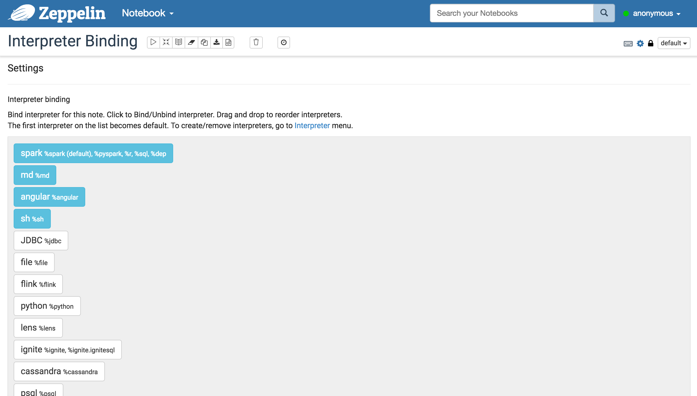
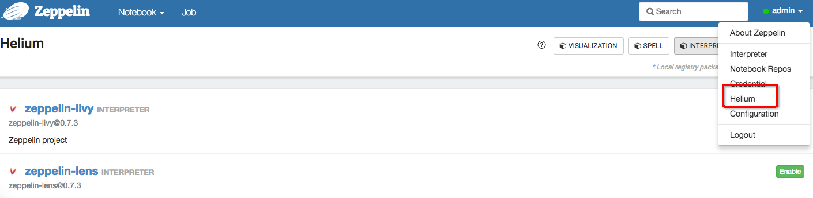

# Zeppelin使用笔记

## 配置说明

| zeppelin-env.sh                           | zeppelin-site.xml                                | Default value                                                | Description                                                  |
| ----------------------------------------- | ------------------------------------------------ | ------------------------------------------------------------ | ------------------------------------------------------------ |
| ZEPPELIN_PORT                             | zeppelin.server.port                             | 8080                                                         | Zeppelin server port                                         |
| ZEPPELIN_MEM                              | N/A                                              | -Xmx1024m -XX:MaxPermSize=512m                               | JVM mem options                                              |
| ZEPPELIN_INTP_MEM                         | N/A                                              | ZEPPELIN_MEM                                                 | JVM mem options for interpreter process                      |
| ZEPPELIN_JAVA_OPTS                        | N/A                                              |                                                              | JVM options                                                  |
| ZEPPELIN_ALLOWED_ORIGINS                  | zeppelin.server.allowed.origins                  | *                                                            | Enables a way to specify a ',' separated list of allowed origins for rest and websockets.  i.e. http://localhost:8080 |
| N/A                                       | zeppelin.anonymous.allowed                       | true                                                         | Anonymous user is allowed by default.                        |
| ZEPPELIN_SERVER_CONTEXT_PATH              | zeppelin.server.context.path                     | /                                                            | A context path of the web application                        |
| ZEPPELIN_SSL                              | zeppelin.ssl                                     | false                                                        |                                                              |
| ZEPPELIN_SSL_CLIENT_AUTH                  | zeppelin.ssl.client.auth                         | false                                                        |                                                              |
| ZEPPELIN_SSL_KEYSTORE_PATH                | zeppelin.ssl.keystore.path                       | keystore                                                     |                                                              |
| ZEPPELIN_SSL_KEYSTORE_TYPE                | zeppelin.ssl.keystore.type                       | JKS                                                          |                                                              |
| ZEPPELIN_SSL_KEYSTORE_PASSWORD            | zeppelin.ssl.keystore.password                   |                                                              |                                                              |
| ZEPPELIN_SSL_KEY_MANAGER_PASSWORD         | zeppelin.ssl.key.manager.password                |                                                              |                                                              |
| ZEPPELIN_SSL_TRUSTSTORE_PATH              | zeppelin.ssl.truststore.path                     |                                                              |                                                              |
| ZEPPELIN_SSL_TRUSTSTORE_TYPE              | zeppelin.ssl.truststore.type                     |                                                              |                                                              |
| ZEPPELIN_SSL_TRUSTSTORE_PASSWORD          | zeppelin.ssl.truststore.password                 |                                                              |                                                              |
| ZEPPELIN_NOTEBOOK_HOMESCREEN              | zeppelin.notebook.homescreen                     |                                                              | A notebook id displayed in Apache Zeppelin homescreen  i.e. 2A94M5J1Z |
| ZEPPELIN_NOTEBOOK_HOMESCREEN_HIDE         | zeppelin.notebook.homescreen.hide                | false                                                        | This value can be "true" when to hide the notebook id set by `ZEPPELIN_NOTEBOOK_HOMESCREEN`on the Apache Zeppelin homescreen.  For the further information, please read [Customize your Zeppelin homepage](https://zeppelin.apache.org/docs/0.6.2/manual/notebookashomepage.html). |
| ZEPPELIN_WAR_TEMPDIR                      | zeppelin.war.tempdir                             | webapps                                                      | A location of jetty temporary directory                      |
| ZEPPELIN_NOTEBOOK_DIR                     | zeppelin.notebook.dir                            | notebook                                                     | The root directory where notebook directories are saved      |
| ZEPPELIN_NOTEBOOK_S3_BUCKET               | zeppelin.notebook.s3.bucket                      | zeppelin                                                     | S3 Bucket where notebook files will be saved                 |
| ZEPPELIN_NOTEBOOK_S3_USER                 | zeppelin.notebook.s3.user                        | user                                                         | A user name of S3 bucket i.e. `bucket/user/notebook/2A94M5J1Z/note.json` |
| ZEPPELIN_NOTEBOOK_S3_ENDPOINT             | zeppelin.notebook.s3.endpoint                    | s3.amazonaws.com                                             | Endpoint for the bucket                                      |
| ZEPPELIN_NOTEBOOK_S3_KMS_KEY_ID           | zeppelin.notebook.s3.kmsKeyID                    |                                                              | AWS KMS Key ID to use for encrypting data in S3 (optional)   |
| ZEPPELIN_NOTEBOOK_S3_EMP                  | zeppelin.notebook.s3.encryptionMaterialsProvider |                                                              | Class name of a custom S3 encryption materials provider implementation to use for encrypting data in S3 (optional) |
| ZEPPELIN_NOTEBOOK_AZURE_CONNECTION_STRING | zeppelin.notebook.azure.connectionString         |                                                              | The Azure storage account connection string i.e. `DefaultEndpointsProtocol=https;AccountName=<accountName>;AccountKey=<accountKey>` |
| ZEPPELIN_NOTEBOOK_AZURE_SHARE             | zeppelin.notebook.azure.share                    | zeppelin                                                     | Share where the notebook files will be saved                 |
| ZEPPELIN_NOTEBOOK_AZURE_USER              | zeppelin.notebook.azure.user                     | user                                                         | An optional user name of Azure file share i.e. `share/user/notebook/2A94M5J1Z/note.json` |
| ZEPPELIN_NOTEBOOK_STORAGE                 | zeppelin.notebook.storage                        | org.apache.zeppelin.notebook.repo.VFSNotebookRepo            | Comma separated list of notebook storage                     |
| ZEPPELIN_INTERPRETERS                     | zeppelin.interpreters                            | org.apache.zeppelin.spark.SparkInterpreter, org.apache.zeppelin.spark.PySparkInterpreter, org.apache.zeppelin.spark.SparkSqlInterpreter, org.apache.zeppelin.spark.DepInterpreter, org.apache.zeppelin.markdown.Markdown, org.apache.zeppelin.shell.ShellInterpreter, ... | Comma separated interpreter configurations [Class]  NOTE: This property is deprecated since Zeppelin-0.6.0 and will not be supported from Zeppelin-0.7.0 |
| ZEPPELIN_INTERPRETER_DIR                  | zeppelin.interpreter.dir                         | interpreter                                                  | Interpreter directory                                        |
| ZEPPELIN_WEBSOCKET_MAX_TEXT_MESSAGE_SIZE  | zeppelin.websocket.max.text.message.size         | 1024000                                                      | Size in characters of the maximum text message to be received by websocket. |

具体配置查看`Zeppelin UI`右上角的Configuration

## Dependence管理

### 添加私服地址

[配置私服地址](https://zeppelin.apache.org/docs/0.7.2/manual/dependencymanagement.html)

### 修改Interpreter的依赖私服地址

**spark Interpreter**

| 配置项                                  | 值                                                           |
| --------------------------------------- | ------------------------------------------------------------ |
| zeppelin.dep.additionalRemoteRepository | spark-packages,http://dl.bintray.com/spark-packages/maven,false; |

修改该配置项可以进行对私服的修改，格式：`id,url,snapshot`

### Notebook方式

```
%spark_arithmetic_kerberos.dep
z.reset()
z.load("com.tairanchina.csp.dmp:spark-jdbc-template:1.8.0-RC")
```

```
%spark_arithmetic_kerberos
import com.tairanchina.csp.dmp.template.spark.jdbc
```

> 分成两个Paragraph进行，在同一个Paragraph是不行的

使用第三方库

```
%dmp_spark.dep
z.reset()
z.addRepo("trc").url("http://121.41.17.205:18081/nexus/content/groups/public")
z.load("com.tairanchina.csp.dmp:spark-hdfs-template:1.6.0-RC")
```

## 支持语言

| 标识   | 语言     |
| ------ | -------- |
| %sh    | Shell    |
| %md    | markdown |
| %html  | html     |
| %spark | Spark    |

## Form

由一系列的表单组件组成，实现参数的传入。支持 Input、Select、CheckBox等组件。


文档地址：[URL](https://zeppelin.apache.org/docs/0.8.0/usage/dynamic_form/intro.html#text-input-form-1)

### %md

#### Input

```t&#39;x
${formName=defaultValue}
```

#### Select

```
${formName=defaultValue,option1|option2...}
```

```
${formName=defaultValue,option1(DisplayName)|option2(DisplayName)...}
```

#### Checkbox

```
${checkbox:formName=defaultValue1|defaultValue2...,option1|option2...}
```

> 以上是Scope为`paragraph`方式，note方式使用`$$`即可

#### %spark

`scope: paragraph`

#### Input

```
%spark
println("Hello "+z.textbox("name"))
```

**存在默认值**

```
%spark
println("Hello "+z.textbox("name", "sun")) 
```

#### Select

```
%spark
 printlnprintl ("Hello "+z.select("day", Seq(("1","mon"),
                                    ("2","tue"),
                                    ("3","wed"),
                                    ("4","thurs"),
                                    ("5","fri"),
                                    ("6","sat"),
                                    ("7","sun"))))
```

#### Checkbox

```
%spark
val options = Seq(("apple","Apple"), ("banana","Banana"), ("orange","Orange"))
println("Hello "+z.checkbox("fruit", options).mkString(" and "))
```

**The difference in the method names:**

| Scope paragraph    | Scope note   |
| ------------------ | ------------ |
| input (or textbox) | noteTextbox  |
| select             | noteSelect   |
| checkbox           | noteCheckbox |

## 图表化展示

文档地址：[URL](https://zeppelin.apache.org/docs/0.8.0/usage/display_system/basic.html#html)

## 解释器（Interpreter）

对一些语法的解析、包括依赖的包等管理，可以理解为是一个环境的配置。

文档地址：[URL](https://zeppelin.apache.org/docs/0.8.0/usage/interpreter/overview.html)

### 创建解释器

当属性名称**由大写字母，数字和下划线（[A-Z_0-9]）组成时，属性将导出为环境变量**。否则将属性设置为**JVM属性**。

每个Notebook可以使用Notebook右上角的设置图标绑定到多个解释器设置。



### 自定义Interpreter

Zeppelin自带了spark、md、jdbc等，当然也支持自定义方式去创建特有的Interpreter

URL:https://zeppelin.apache.org/docs/0.6.2/development/writingzeppelininterpreter.html#what-is-apache-zeppelin-interpreter

https://zeppelin.apache.org/docs/0.6.2/manual/interpreters.html#connecting-to-the-existing-remote-interpreter

### 解释器绑定模式

每个解释器设置可以选择“shared”，“scoped”，“isolated”解释器绑定模式之一。在“shared”模式下，绑定到解释器设置的每个笔记本将共享单个解释器实例。在“scoped”模式下，每个笔记本将在同一个解释器进程中创建新的Interpreter实例。在“隔离”模式下，每个笔记本将创建新的Interpreter进程。


### 远程解释器

URL：https://zeppelin.apache.org/docs/0.6.2/manual/interpreters.html#connecting-to-the-existing-remote-interpreter

### 解释器市场



### 依赖管理

#### 添加依赖

```shell
%spark.dep
z.load("org.apache.hbase:hbase-client:2.0.0")
```

## 上下文（Context）

Zeppelin预定义了一个`z`对象。在不同的解释器中都被使用。

### Spark DataFrames

```scala
df = spark.read.csv('/path/to/csv')
z.show(df)
```

### Object Exchange

```scala
// Put object from scala
%spark
val myObject = ...
z.put("objName", myObject)

// Exchanging data frames
myScalaDataFrame = ...
z.put("myScalaDataFrame", myScalaDataFrame)

val myPythonDataFrame = z.get("myPythonDataFrame").asInstanceOf[DataFrame]
```

### Form Creation

```scala
%spark
/* Create text input form */
z.input("formName")

/* Create text input form with default value */
z.input("formName", "defaultValue")

/* Create select form */
z.select("formName", Seq(("option1", "option1DisplayName"),
                         ("option2", "option2DisplayName")))

/* Create select form with default value*/
z.select("formName", "option1", Seq(("option1", "option1DisplayName"),
                                    ("option2", "option2DisplayName")))
```

文档地址：[URL](https://zeppelin.apache.org/docs/0.8.0/usage/other_features/zeppelin_context.html)

## 可以提供

- 生成的图表生成链接，可以复用到Web页面上；[URL](https://zeppelin.apache.org/docs/0.8.0/usage/other_features/publishing_paragraphs.html)
- 支持定时任务，但需要配置开启；[URL](https://zeppelin.apache.org/docs/0.8.0/usage/other_features/cron_scheduler.html)
- 支持API方式对外提供服务；[URL](https://zeppelin.apache.org/docs/0.8.0/usage/rest_api/notebook.html)

## 问题与解决方案

问题：java.lang.RuntimeException: SPARK_HOME is not specified in interpreter-setting for non-local mode, if you specify it in zeppelin-env.sh, please move that into  interpreter setting

Spark_Home没有指定，需要在相应的解释器中添加

```
SPARK_HOME /usr/hdp/current/spark2-client/
```

问题：

```shell
java.lang.RuntimeException: id: admin: no such user
```

可以通过重启或者尝试restart interpreter