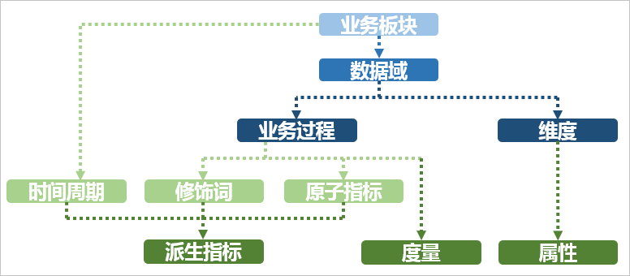
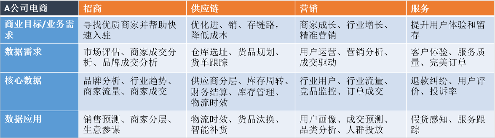
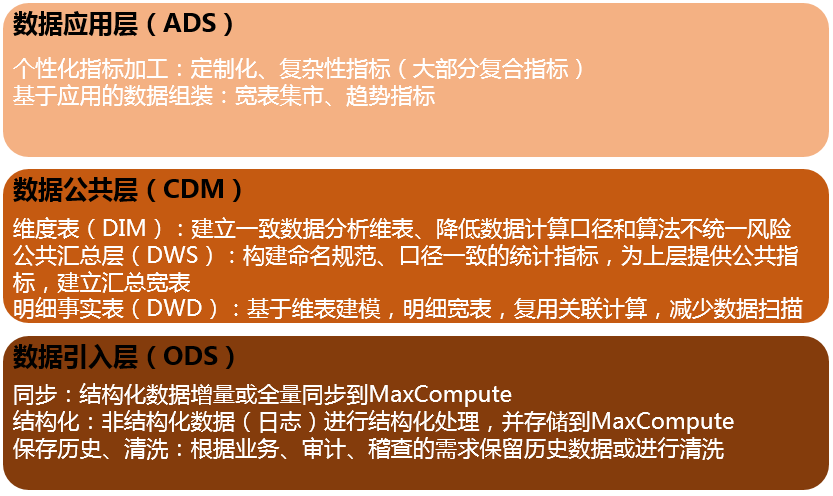
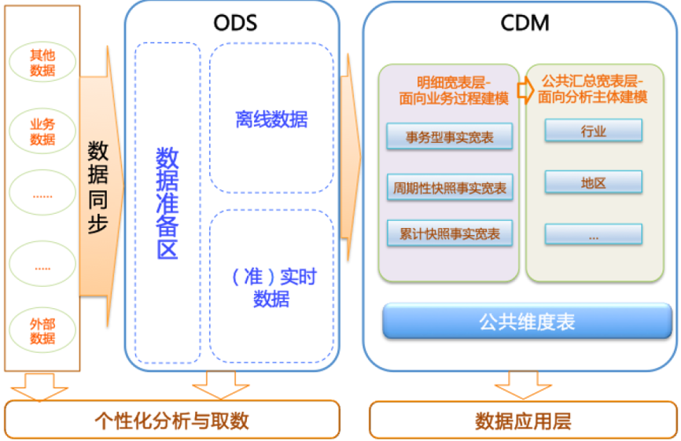
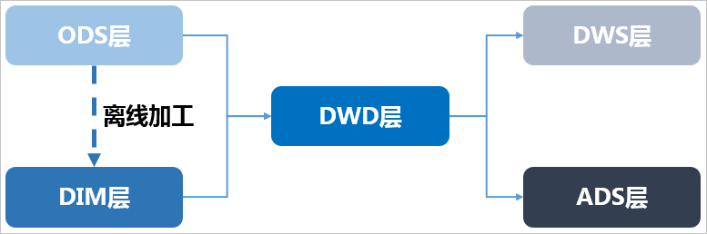

# 数仓构建流程

[](http://static-aliyun-doc.oss-cn-hangzhou.aliyuncs.com/assets/img/0979011751/p59651.png)

## 基本概念

在正式学习本教程之前，您需要首先理解以下基本概念：

- 业务板块：比数据域更高维度的业务划分方法，适用于特别庞大的业务系统。
- 维度：维度建模由Ralph Kimball提出。维度模型主张从分析决策的需求出发构建模型，为分析需求服务。维度是度量的环境，**是我们观察业务的角度，用来反映业务的一类属性** 。属性的集合构成维度 ，也可以称为实体对象。例如， 在分析交易过程时，可以通过买家、卖家、商品和时间等维度描述交易发生的环境。
- 属性（维度属性）：维度所包含的表示**维度的列称为维度属性**。维度属性是查询约束条件、分组和报表标签生成的基本来源，是数据易用性的关键。
- 度量：在维度建模中，**将度量称为事实** ， 将环境描述为维度，维度是用于分析事实所需要的多样环境。度量通常为数值型数据，作为事实逻辑表的事实。
- 指标：指标分为原子指标和派生指标。原子指标是基于某一业务事件行为下的度量，是**业务定义中不可再拆分的指标**，是具有明确业务含义的名词 ，体现明确的业务统计口径和计算逻辑，例如支付金额。
  - 原子指标=业务过程+度量
  - 派生指标=时间周期+修饰词+原子指标，派生指标可以理解为对原子指标业务统计范围的圈定。
- 业务限定：统计的业务范围，筛选出符合业务规则的记录（类似于SQL中**where**后的条件，不包括时间区间）。
- 统计周期：统计的时间范围，例如最近一天，最近30天等（类似于SQL中**where**后的时间条件）。
- 统计粒度：**统计分析的对象或视角，定义数据需要汇总的程度，可理解为聚合运算时的分组条件**（类似于SQL中的**group by**的对象）。粒度是维度的一个组合，指明您的统计范围。例如，某个指标是某个卖家在某个省份的成交额，则粒度就是卖家、地区这两个维度的组合。如果您需要统计全表的数据，则粒度为全表。在指定粒度时，您需要充分考虑到业务和维度的关系。统计粒度常作为派生指标的修饰词而存在。

基本概念之间的关系和举例如下图所示。[](http://static-aliyun-doc.oss-cn-hangzhou.aliyuncs.com/assets/img/0979011751/p47282.png)[](http://static-aliyun-doc.oss-cn-hangzhou.aliyuncs.com/assets/img/1979011751/p58877.png)

## 业务调研

### 确定需求

在进行数据仓库构建之前，首先需要确定数仓构建的目标与需求，进行全面的业务调研。您需要了解真实的业务需求是什么，以及确定整个业务系统能解决什么问题。

#### 业务调研

充分的业务调研和需求分析是数据仓库建设的基石，直接决定数据仓库能否建设成功。在数仓建设项目启动前，您需要请相关的业务人员介绍具体的业务，以便明确各个团队的分析员、运营人员的需求，沉淀出相关文档。

您可以通过调查表、访谈等形式详细了解以下信息：

1. 用户的组织架构和分工界面。例如，用户可能分为数据分析、运营、维护部门，各个部门对数仓的需求不同，您需要对不同部门分别进行调研。
2. 用户的整体业务架构，各个业务模块之间的联系与信息流动的流程。梳理出整体的业务数据框架。
3. 各个已有的业务系统的主要功能及获取的数据。

本教程中以A公司的电商业务为例，梳理出业务数据框架如下图所示。A公司的电商业务板块分为招商、供应链、营销、服务四个板块，每个板块的需求和数据应用都不同。在您构建数仓之前，首先需要明确构建数仓服务的业务的板块和需要具体满足的业务需求。[](http://static-aliyun-doc.oss-cn-hangzhou.aliyuncs.com/assets/img/4752160751/p44519.png)

此外，您还需要进一步了解各业务板块中已有的各数据功能模块。功能模块通常和业务板块紧耦合，对应一个或多个表，可以作为构建数仓的数据源。下表展现的是一个营销业务板块的数据功能模块。

| **功能模块** | **A公司电商营销管理** |
| ------------ | --------------------- |
| 商品管理     | Y                     |
| 用户管理     | Y                     |
| 购买流程     | Y                     |
| 交易订单     | Y                     |
| 用户反馈     | Y                     |

**说明** Y代表包含该功能模块，N代表不包含。

本教程中，假设用户是电商营销部门的营销数据分析师。数据需求为最近一天某个类目（例如：厨具）商品在各省的销售总额、该类目Top10销售额商品名称、各省客户购买力分布（人均消费额）等，用于营销分析。最终的业务需求是通过营销分析完成该类目的精准营销，提升销售总额。通过业务调研，我们将着力分析**营销**业务板块的**交易订单**功能模块。

#### 需求分析

在未考虑数据分析师、业务运营人员的数据需求的情况下，单纯根据业务调研建设的数据仓库可用性差。完成业务调研后，您需要进一步收集数据使用者的需求，进而对需求进行深度的思考和分析。

需求分析的途径有两种：

- 根据与分析师、业务运营人员的沟通获知需求。
- 对报表系统中现有的报表进行研究分析。

在进行需求分析阶段，您需要沉淀出业务分析或报表中的指标，以及指标的定义和粒度。粒度可以作为维度的输入。建议您思考下列问题，对后续的数据建模将有巨大的帮助：

- 业务数据是根据什么（维度、粒度）汇总的，衡量标准是什么？例如，成交量是维度，订单数是度量。
- 明细数据层和汇总数据层应该如何设计？公共维度层该如何设计？是否有公共的指标？
- 数据是否需要冗余、沉淀到汇总数据层中？

举例： 数据分析师需要了解A公司电商业务中厨具类目的成交金额。当获知这个需求后，您需要分析：根据什么（维度）汇总、汇总什么（度量）以及汇总的范围多大（粒度）。例如，类目是维度，金额是度量，范围是全表。此外，还需要思考明细数据和汇总数据应该如何设计、是否是公共层的报表、数据是否需要沉淀到汇总表中等因素。

需求调研的分析产出通常是记录原子与派生指标的文档。

### 分析业务过程

业务过程可以概括为一个个不可拆分的行为事件。用户的业务系统中，通过埋点或日常积累，通常已经获取了充足的业务数据。为理清数据之间的逻辑关系和流向，首先需要理解用户的业务过程，了解过程中涉及到的数据系统。

您可以采用过程分析法，将整个业务过程涉及的每个环节一一列清楚，包括技术、数据、系统环境等。在分析企业的工作职责范围（部门）后，您也可以借助工具通过逆向工程抽取业务系统的真实模型。您可以参考业务规划设计文档以及业务运行（开发、设计、变更等）相关文档，全面分析数据仓库涉及的源系统及业务管理系统：

- 每个业务会生成哪些数据，存在于什么数据库中。
- 对业务过程进行分解，了解过程中的每一个环节会产生哪些数据，数据的内容是什么。
- 数据在什么情况下会更新，更新的逻辑是什么。

业务过程可以是单个业务事件，例如交易的支付、退款等；也可以是某个事件的状态，例如当前的账户余额等；还可以是一系列相关业务事件组成的业务流程。具体取决于您分析的是某些事件过去发生情况、当前状态还是事件流转效率。

选择粒度：在业务过程事件分析中，您需要预判所有分析需要细分的程度和范围，从而决定选择的粒度。 识别维表、选择好粒度之后，您需要基于此粒度设计维表，包括维度属性等，用于分析时进行分组和筛选。最后，您需要确定衡量的指标。

本教程中，经过业务过程调研，我们了解到用户电商营销业务的交易订单功能模块的业务流程如下。[](http://static-aliyun-doc.oss-cn-hangzhou.aliyuncs.com/assets/img/zh-CN/4610795751/p44562.png)

这是一个非常典型的电商交易业务流程图。在该业务流程图中，有创建订单、买家付款、卖家发货、确认收货四个核心业务步骤。由于确认收货代表交易成功，我们重点分析确认收货（交易成功）步骤即可。

在明确用户的业务过程之后，您可以根据需要进行分析决策的业务划分数据域。

### 划分数据域

数据仓库是面向主题（数据综合、归类并进行分析利用的抽象）的应用。数据仓库模型设计除横向的分层外，通常也需要根据业务情况进行纵向划分数据域。数据域是联系较为紧密的数据主题的集合，是业务对象高度概括的概念层次归类，目的是便于数据的管理和应用。

#### 划分数据域

通常，您需要阅读各源系统的设计文档、数据字典和数据模型设计文档，研究逆向导出的物理数据模型。进而，可以**进行跨源的主题域合并**，跨源梳理出整个企业的数据域。

**数据域是指面向业务分析，将业务过程或者维度进行抽象的集合**。为保障整个体系的生命力，数据域需要抽象提炼，并长期维护更新。**在划分数据域时，既能涵盖当前所有的业务需求，又能让新业务在进入时可以被包含进已有的数据域或扩展新的数据域**。数据域的划分工作可以在业务调研之后进行，需要分析各个业务模块中有哪些业务活动。

数据域可以按照用户企业的部门划分，也可以按照业务过程或者业务板块中的功能模块进行划分。例如A公司电商营销业务板块可以划分为如下数据域，数据域中每一部分都是实际业务过程经过归纳抽象之后得出的。

| 数据域     | 业务过程                         |
| :--------- | :------------------------------- |
| 会员店铺域 | 注册、登录、装修、开店、关店     |
| 商品域     | 发布、上架、下架、重发           |
| 日志域     | 曝光、浏览、点击                 |
| 交易域     | 下单、支付、发货、确认收货       |
| 服务域     | 商品收藏、拜访、培训、优惠券领用 |
| 采购域     | 商品采购、供应链管理             |

### 定义维度与构建总线矩阵

明确每个数据域下有哪些业务过程后，您需要开始定义维度，并基于维度构建总线矩阵。

## 定义维度

在划分数据域、构建总线矩阵时，需要结合对业务过程的分析定义维度。以本教程中A电商公司的营销业务板块为例，在交易数据域中，我们重点考察确认收货（交易成功）的业务过程。

在确认收货的业务过程中，主要有商品和收货地点（本教程中，假设收货和购买是同一个地点）两个维度所依赖的业务角度。从商品角度我们可以定义出以下维度：

- 商品ID（主键）
- 商品名称
- 商品交易价格
- 商品新旧程度： 1 全新 2 闲置 3 二手
- 商品类目ID
- 商品类目名称
- 品类ID
- 品类名称
- 买家ID
- 商品状态： 0 正常 1 删除 2 下架 3 从未上架
- 商品所在城市
- 商品所在省份

从地域角度，我们可以定义出以下维度：

- 城市code
- 城市名称
- 省份code
- 省份名称

作为维度建模的核心，在企业级数据仓库中必须保证维度的唯一性。以A公司的商品维度为例，有且只允许有一种维度定义。例如，省份code这个维度，对于任何业务过程所传达的信息都是一致的。

#### 构建总线矩阵

明确每个数据域下有哪些业务过程后，即可构建总线矩阵。您需要明确业务过程与哪些维度相关，并定义每个数据域下的业务过程和维度。如下所示是A公司电商板块交易功能的总线矩阵，我们定义了购买省份、购买城市、类目名称、类目ID、品牌名称、品牌ID、商品名称、商品ID、成交金额等维度。

| 数据域/过程 | 一致性维度 |        |          |        |          |        |          |          |      |      |
| ----------- | ---------- | ------ | -------- | ------ | -------- | ------ | -------- | -------- | ---- | ---- |
| 购买省份    | 购买城市   | 类目ID | 类目名称 | 品牌ID | 品牌名称 | 商品ID | 商品名称 | 成交金额 |      |      |
| 交易        | 下单       | Y      | Y        | Y      | Y        | Y      | Y        | Y        | Y    | N    |
| 支付        | Y          | Y      | Y        | Y      | Y        | Y      | Y        | Y        | N    |      |
| 发货        | Y          | Y      | Y        | Y      | Y        | Y      | Y        | Y        | N    |      |
| 确认收货    | Y          | Y      | Y        | Y      | Y        | Y      | Y        | Y        | Y    |      |

**说明** Y代表包含该维度，N代表不包含。

不同的数据域维度是存在不一样的。

### 明确统计指标

需求调研输出的文档中，含有原子指标与派生指标，此时我们需要在设计汇总层表模型前完成指标的设计。

#### 指标定义注意事项

原子指标是明确的统计口径、计算逻辑： `原子指标=业务过程+度量`。派生指标即常见的统计指标：`派生指标=时间周期+修饰词+原子指标`。原子指标的创建需要在业务过程定义后方才可创建。派生指标的创建一般需要在了解具体报表需求之后展开，在新建派生指标前必须新建好原子指标。 注意事项如下：

- 原子指标、修饰类型及修饰词，直接归属在业务过程下，其中修饰词继承修饰类型的数据域。
- 派生指标可以选择多个修饰词，由具体的派生指标语义决定。例如，支付金额为原子指标，则客单价（支付金额除以买家数）为派生指标。
- 派生指标唯一归属一个原子指标，继承原子指标的数据域，与修饰词的数据域无关。

#### 根据业务需求确定指标

本教程中，用户是电商营销部门的营销数据分析师。数据需求为最近一天厨具类目的商品在各省的销售总额、该类目Top10销售额商品名称、各省用户购买力分布（人均消费额）等，用于营销分析。

根据之前的分析，我们确认业务过程为：确认收货（交易成功），而度量为商品的销售金额。因此根据业务需求，我们可以定义出原子指标：商品成功交易金额。

派生指标为：

- 最近一天全省厨具类目各商品销售总额
- 最近一天全省厨具类目人均消费额（消费总额除以人数）

最近一天全省厨具类目各商品销售总额进行降序排序后取前10名的名称，即可得到该类目Top10销售额商品名称。

## 数仓模型设计

### 数仓分层

在阿里巴巴的数据体系中，我们建议将数据仓库分为三层，自下而上为：数据引入层（ODS，Operation Data Store）、数据公共层（CDM，Common Data Model）和数据应用层（ADS，Application Data Service）。

数据仓库的分层和各层级用途如下图所示。[](http://static-aliyun-doc.oss-cn-hangzhou.aliyuncs.com/assets/img/zh-CN/6598695751/p44631.png)

- 数据引入层（ODS，Operation Data Store）：将原始数据几乎无处理的存放在数据仓库系统，结构上与源系统基本保持一致，是数据仓库的数据准备区。主要完成基础数据引入到MaxCompute的职责，同时可以基础数据记录的历史变化的。

- 数据公共层（CDM，Common Data Model，又称通用数据模型层），包含DIM维度表、DWD和DWS，由ODS层数据加工而成。主要完成数据加工与整合，建立一致性的维度，构建可复用的面向分析和统计的明细事实表，以及汇总公共粒度的指标。

  - 公共维度层（DIM）：基于维度建模理念思想，建立整个企业的一致性维度。降低数据计算口径和算法不统一风险。

    公共维度层的表通常也被称为逻辑维度表，维度和维度逻辑表通常一一对应。

  - 公共汇总粒度事实层（DWS）：以分析的主题对象作为建模驱动，基于上层的应用和产品的指标需求，构建公共粒度的汇总指标事实表，以宽表化手段物理化模型。构建命名规范、口径一致的统计指标，为上层提供公共指标，建立汇总宽表、明细事实表。

    公共汇总粒度事实层的表通常也被称为汇总逻辑表，用于存放派生指标数据。

  - 明细粒度事实层（DWD）：以业务过程作为建模驱动，基于每个具体的业务过程特点，构建最细粒度的明细层事实表。可以结合企业的数据使用特点，将明细事实表的某些重要维度属性字段做适当冗余，即宽表化处理。

    明细粒度事实层的表通常也被称为逻辑事实表。

- 数据应用层（ADS，Application Data Service）：存放数据产品个性化的统计指标数据。根据CDM与ODS层加工生成。

该数据分类架构在ODS层分为三部分：数据准备区、离线数据和准实时数据区。整体数据分类架构如下图所示。

[](http://static-aliyun-doc.oss-cn-hangzhou.aliyuncs.com/assets/img/zh-CN/6598695751/p44636.png)

在本教程中，从交易数据系统的数据经过DataWorks数据集成，同步到数据仓库的ODS层。经过数据开发形成事实宽表后，再以商品、地域等为维度进行公共汇总。

整体的数据流向如下图所示。其中，ODS层到DIM层的ETL（萃取（Extract）、转置（Transform）及加载（Load））处理是在MaxCompute中进行的，处理完成后会同步到所有存储系统。ODS层和DWD层会放在数据中间件中，供下游订阅使用。而DWS层和ADS层的数据通常会落地到在线存储系统中，下游通过接口调用的形式使用。

[](http://static-aliyun-doc.oss-cn-hangzhou.aliyuncs.com/assets/img/zh-CN/6598695751/p46107.png)


### DWS

明细粒度事实层以业务过程驱动建模，基于每个具体的业务过程特点，构建最细粒度的明细层事实表。您可以结合企业的数据使用特点，将明细事实表的某些重要维度属性字段做适当冗余，即宽表化处理。

公共汇总粒度事实层（DWS）和明细粒度事实层（DWD）的事实表作为数据仓库维度建模的核心，需紧绕业务过程来设计。通过获取描述业务过程的度量来描述业务过程，包括引用的维度和与业务过程有关的度量。度量通常为数值型数据，作为事实逻辑表的依据。事实逻辑表的描述信息是事实属性，事实属性中的外键字段通过对应维度进行关联。

事实表中一条记录所表达的业务细节程度被称为粒度。通常粒度可以通过两种方式来表述：一种是维度属性组合所表示的细节程度，一种是所表示的具体业务含义。

作为度量业务过程的事实，通常为整型或浮点型的十进制数值，有可加性、半可加性和不可加性三种类型：

- 可加性事实是指可以按照与事实表关联的任意维度进行汇总。
- 半可加性事实只能按照特定维度汇总，不能对所有维度汇总。例如库存可以按照地点和商品进行汇总，而按时间维度把一年中每个月的库存累加则毫无意义。
- 完全不可加性，例如比率型事实。对于不可加性的事实，可分解为可加的组件来实现聚集。

事实表相对维表通常更加细长，行增加速度也更快。维度属性可以存储到事实表中，这种存储到事实表中的维度列称为维度退化，可加快查询速度。与其他存储在维表中的维度一样，维度退化可以用来进行事实表的过滤查询、实现聚合操作等。

明细粒度事实层（DWD）通常分为三种：事务事实表、周期快照事实表和累积快照事实表，详情请参见[数仓建设指南](https://help.aliyun.com/document_detail/117432.html#concept-226664)。

- 事务事实表用来描述业务过程，跟踪空间或时间上某点的度量事件，保存的是最原子的数据，也称为原子事实表。
- 周期快照事实表以具有规律性的、可预见的时间间隔记录事实。
- 累积快照事实表用来表述过程开始和结束之间的关键步骤事件，覆盖过程的整个生命周期，通常具有多个日期字段来记录关键时间点。当累积快照事实表随着生命周期不断变化时，记录也会随着过程的变化而被修改。

## 明细粒度事实表设计原则

明细粒度事实表设计原则如下所示：

- 通常，一个明细粒度事实表仅和一个维度关联。
- 尽可能包含所有与业务过程相关的事实 。
- 只选择与业务过程相关的事实。
- 分解不可加性事实为可加的组件。
- 在选择维度和事实之前必须先声明粒度。
- 在同一个事实表中不能有多种不同粒度的事实。
- 事实的单位要保持一致。
- 谨慎处理Null值。
- 使用退化维度提高事实表的易用性。

明细粒度事实表整体设计流程如下图所示。[](http://static-aliyun-doc.oss-cn-hangzhou.aliyuncs.com/assets/img/zh-CN/1007495751/p46108.png)

在一致性度量中已定义好了交易业务过程及其度量。明细事实表注意针对业务过程进行模型设计。明细事实表的设计可以分为四个步骤：选择业务过程、确定粒度、选择维度、确定事实（度量）。粒度主要是在维度未展开的情况下记录业务活动的语义描述。在您建设明细事实表时，需要选择基于现有的表进行明细层数据的开发，清楚所建表记录存储的是什么粒度的数据。

## 明细粒度事实层（DWD）规范

通常您需要遵照的命名规范为：**dwd_{业务板块/pub}_{数据域缩写}_{业务过程缩写}[_{自定义表命名标签缩写}] _{单分区增量全量标识}**，pub表示数据包括多个业务板块的数据。单分区增量全量标识通常为：i表示增量，f表示全量。例如： dwd_asale_trd_ordcrt_trip_di（A电商公司航旅机票订单下单事实表，日刷新增量）及dwd_asale_itm_item_df（A电商商品快照事实表，日刷新全量）。

本教程中，DWD层主要由三个表构成：

- 交易商品信息事实表：dwd_asale_trd_itm_di。
- 交易会员信息事实表：ods_asale_trd_mbr_di。
- 交易订单信息事实表：dwd_asale_trd_ord_di。

DWD层数据存储及生命周期管理规范请参见[CDM明细层设计规范](https://help.aliyun.com/document_detail/117437.html#concept-226671)。

## 建表示例

本教程中充分使用了维度退化以提升查询效率，建表语句如下所示。

```
CREATE TABLE IF NOT EXISTS dwd_asale_trd_itm_di
(
    item_id              BIGINT COMMENT '商品ID',
    item_title           STRING COMMENT '商品名称',
    item_price           DOUBLE COMMENT '商品价格',
    item_stuff_status    BIGINT COMMENT '商品新旧程度_0全新1闲置2二手',
    item_prov            STRING COMMENT '商品省份',
    item_city            STRING COMMENT '商品城市',
    cate_id              BIGINT COMMENT '商品类目ID',
    cate_name            STRING COMMENT '商品类目名称',
    commodity_id         BIGINT COMMENT '品类ID',
    commodity_name       STRING COMMENT '品类名称',
    buyer_id             BIGINT COMMENT '买家ID',
)
COMMENT '交易商品信息事实表'
PARTITIONED BY (ds     STRING COMMENT '日期')
LIFECYCLE 400;

CREATE TABLE IF NOT EXISTS ods_asale_trd_mbr_di
(
    order_id         BIGINT COMMENT '订单ID',
    bc_type          STRING COMMENT '业务分类',
    buyer_id         BIGINT COMMENT '买家ID',
    buyer_nick       STRING COMMENT '买家昵称',
    buyer_star_id    BIGINT COMMENT '买家星级ID',
    seller_id        BIGINT COMMENT '卖家ID',
    seller_nick      STRING COMMENT '卖家昵称',
    seller_star_id   BIGINT COMMENT '卖家星级ID',
    shop_id          BIGINT COMMENT '店铺ID',
    shop_name        STRING COMMENT '店铺名称'
)
COMMENT '交易会员信息事实表'
PARTITIONED BY (ds     STRING COMMENT '日期')
LIFECYCLE 400;

CREATE TABLE IF NOT EXISTS dwd_asale_trd_ord_di
(
    order_id              BIGINT COMMENT '订单ID',
    pay_order_id          BIGINT COMMENT '支付订单ID',
    pay_status            BIGINT COMMENT '支付状态_1未付款2已付款3已退款',
    succ_time             STRING COMMENT '订单交易结束时间',
    item_id               BIGINT COMMENT '商品ID',
    item_quantity         BIGINT COMMENT '购买数量',
    confirm_paid_amt      DOUBLE COMMENT '订单已经确认收货的金额',
    logistics_id          BIGINT COMMENT '物流订单ID',
    mord_prov             STRING COMMENT '收货人省份',
    mord_city             STRING COMMENT '收货人城市',
    mord_lgt_shipping     BIGINT COMMENT '发货方式_1平邮2快递3EMS',
    mord_address          STRING COMMENT '收货人地址',
    mord_mobile_phone     STRING COMMENT '收货人手机号',
    mord_fullname         STRING COMMENT '收货人姓名',
    buyer_nick            STRING COMMENT '买家昵称',
    buyer_id              BIGINT COMMENT '买家ID'
)
COMMENT '交易订单信息事实表'
PARTITIONED BY (ds       STRING COMMENT '日期')
LIFECYCLE 400;
```

### 数仓与数据集市关系

DW 一般存储的是基于事实的大宽表，而 DM 则一般是在部门或者工作组视角，结合自身业务属性，对 DW 数据的进行的一个简化，以达到查询效率的提升和复杂度的降低。数据仓库就是一致化了的数据集市的集合。

良好的数据集市特点：

(1) 特定用户群体所需的信息，通常是一个部门或者一个特定组织的用户，且无需受制于源系统的大量需求和操作性危机（相对于数据仓库）。 
(2) 支持**访问非易变（nonvolatile）的业务信息**。（非易变的信息是以预定的时间间隔进行更新的，并且不受 OLTP 系统进行中的更新的影响。） 
(3) 调和来自于组织里多个运行系统的信息，比如账目、销售、库存和客户管理以及组织外部的行业数据。 
(4) 通过默认有效值、使各系统的值保持一致以及添加描述以使隐含代码有意义，从而提供净化的（cleansed）数据。 
(5) 为即席分析和预定义报表提供合理的查询响应时间（由于数据集市是部门级的，相对于庞大的数据仓库来讲，其查询和分析的响应时间会大大缩短）。

https://blog.csdn.net/map_lixiupeng/article/details/41131549