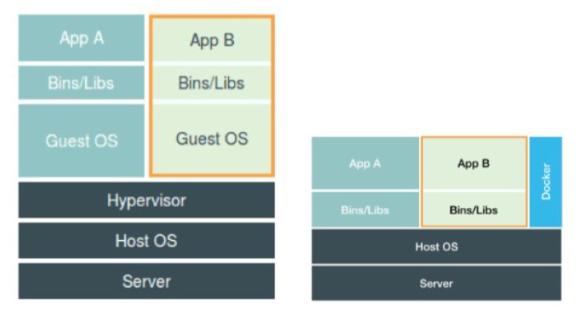

# Docker

Docker 使用了 2007 年已经成 Linux 中一部分的 cgroups 和 命名空间。

## Docker 解决了什么问题

简化了发布流程与降低发布风险。没有 Docker 之前，我们部署可能要先由物理机创建一个虚拟机实例安装相应的系统，再安装需要发布的应用所需的依赖模块，这里面还牵扯着版本号冲突，环境不一致、配置项不一致等种种可能发生的问题，即使一切都很顺利，那这个时间也是相对比较长的，而 Docker 帮你做到了一次可用，次次可用，并且响应速度迅速，环境是纯粹的，只留所需的。

- 组织有序
- 高移植性
- 安全可靠

容器的“单进程模型”，并不是指容器里只能运行“一个”进程，而是指容器没有管理多个进程的能力。这是因为容器里 PID=1 的进程就是应用本身，其他的进程都是这个PID=1 进程的子进程。可是，用户编写的应用，并不能够像正常操作系统里的 init 进程或者
systemd 那样拥有进程管理的功能。比如，你的应用是一个 Java Web 程序(PID=1)，然后你执行 docker exec 在后台启动了一个 Nginx 进程(PID=3)。可是，当这个 Nginx 进程异常退出的时候，你该怎么知道呢?这个进程退出后的垃圾收集工作，又应该由谁去做呢?

## 为什么使用存储卷

容器运行时，一般会产生相应的日志信息，在 Docker 中日志文件不会进行截断等处理，只会永远的成长，只要容器不停。

## Push 镜像

1. 首先有一个 Docker 仓库 账号
2. `docker login`
3. `docker tag imagename username/repository:tag`
4. `docker push username/repository:tag` 

```shell
docker tag friendlyhello gordon/get-started:part2
```

## Service

首先要安装 Docker Compose 。

`docker-compose.yml`

```yml
version: "3"
services:
  web:
    # replace username/repo:tag with your name and image details
    image: zoeminghong/docker-demp:v1.0.0
    deploy:
      replicas: 5
      resources:
        limits:
          cpus: "0.1"
          memory: 50M
      restart_policy:
        condition: on-failure
    ports:
      - "4000:80"
    networks:
      - webnet
networks:
  webnet:
```

A single container running in a service is called a **task**. Tasks are given unique IDs that numerically increment, up to the number of `replicas` you defined in `docker-compose.yml`. List the tasks for your service：

> getstartedlab_web as service name

### 负载均衡

```shell
# 开启 swarm
docker swarm init
docker stack deploy -c docker-compose.yml getstartedlab
```

```shell
docker service ps getstartedlab_web
# or
docker container ls -q
```

Service 根据 Replicas 配置生成 N 个 Container 提供负载均衡服务。

#### 修改配置之后

```shell
docker stack deploy -c docker-compose.yml getstartedlab
```

重新执行该命令进行生效

#### 停止Service

```shell
# 停止 app
docker stack rm getstartedlab
# 停止 swarm
docker swarm leave --force
```

## 命令备忘录

- `-it: ` 这是两个参数，一个是 -i：交互式操作，一个是 -t 终端。我们这里打算进入 bash 执行一些命令并查看返回结果，因此我们需要交互式终端。
- `--rm：` 这个参数是说容器退出后随之将其删除。默认情况下，为了排障需求，退出的容器并不会立即删除，除非手动 docker rm。我们这里只是随便执行个命令，看看结果，不需要排障和保留结果，因此使用`--rm`可以避免浪费空间。
- `-d: ` 后台运行，`--detach` 。
- `-p: ` 端口号。`<外部>:<内部>`
- `--name: ` 实例名称
- `-e: ` 环境变量

```shell
docker --version
# 显示 Docker 系统信息，包括镜像和容器数
docker info
# to view even more details about your Docker installation
docker info
# 查询镜像
docker search <镜像名>
# to run the simple Docker image, hello-world:
docker run -dit hello-world 
# 查看日志
docker logs -f <容器名>
# 重启容器
docker restart <容器名>
# 重命名容器名
docker rename <旧容器名> <新容器名>
# 将容器id写到 /tmp/dockerid 中
docker run --cidfile /tmp/dockerid <镜像>
# List images that was downloaded to your machine
docker image ls 
# Get the service ID for the one service in our application
docker service ls
# Get the service ID for the one service in our application
docker stack services servicename
# Go into shell command
docker exec -it ${CONTAINER ID} /bin/bash
# 查看镜像组成
docker history <镜像ID>
# 容器宕机，重启容器
docker run --restart always
# 容器中的PID
docker top <容器名>
# 复制其他容器的存储卷路径
docker run --volumes-from <容器名>
# 在容器退出时就能够自动清理容器内部的文件系统
docker run --rm <镜像名>
# 与另一个容器建立联系 <name>:<alias>
docker run -d --name node --link selenium_hub:hub selenium/node-chrome-debug

# 查看所有的容器
docker container ls --all
docker container ls -a
docker ps -a

# 删除所有已经终止状态的容器
docker container prune
docker ps -aq
# Now run the build command. This creates a Docker image, which we’re going to name using the --tag option. Use -t if you want to use the shorter option.
# default version is latest. the full command is friendlyhello:v1.0.0
# . 指定上下文的目录
docker build --tag=friendlyhello .
# 4000 container outside port，80 container port
docker run -p 4000:80 friendlyhello:v1.0.0
# Now let’s run the app in the background, in detached mode
docker run -d -p 4000:80 friendlyhello
# stop container by CONTAINER ID
docker container stop 1fa4ab2cf395
# force kill
docker container kill 1fa4ab2cf395
# Remove specified container from this machine
docker container rm 1fa4ab2cf395
docker container rm <镜像名>:<标签>
# Remove all containers
docker container rm $(docker container ls -a -q)
# Remove specified image from this machine
docker image rm <image id>
# Remove all images from this machine
docker image rm $(docker image ls -a -q)
# Inspect task or container
docker inspect <task or container>
# 查看容器存储层的变动
docker diff ${CONTAINER ID} 
# 基于原先的镜像，生成新的镜像
docker commit \
    --author "迹_Jason" \
    --message "修改index" \
    <容器名> \
    <新镜像名>:<新标签>
    
# 查看容器的IP地址
docker inspect --format='{{.NetworkSettings.IPAddress}}' ${CONTAINER_ID}
# --add-host ：指定往/etc/hosts添加的host
docker run -itd --name hadoop0 --hostname hadoop0 --net network_my --ip 192.168.10.30 --add-host hadoop1:192.168.10.31 --add-host hadoop2:192.168.10.32  -d -P -p 50070:50070 -p 8088:8088 hadoop:master

# 列出所有的容器 ID
docker ps -aq
# 停止所有的容器
docker stop $(docker ps -aq)

# 清理所有停止运行的容器：
docker container prune
# or
docker rm $(docker ps -aq)
# 删除所有的镜像
docker rmi $(docker images -q)
```

## Docker 配置文件 daemon.json

```json
{
	// DNS 解析地址
  "dns": ["your_dns_address", "8.8.8.8"]
}
```

修改完 daemon.json 文件后执行  `sudo service docker restart`

## 数据共享与持久化

这一节介绍如何在 Docker 内部以及容器之间管理数据，在容器中管理数据主要有两种方式：

- 数据卷（Data Volumes）
- 挂载主机目录 (Bind mounts)

### Union 文件系统

Union文件系统（[UnionFS](http://en.wikipedia.org/wiki/UnionFS)）是一种分层、轻量级并且高性能的文件系统，它支持对文件系统的修改作为一次提交来一层层的叠加，同时可以将不同目录挂载到同一个虚拟文件系统下(unite several directories into a single virtual filesystem)。

Union 文件系统是 Docker 镜像的基础。镜像可以**通过分层来进行继承**，基于基础镜像（没有父镜像），可以制作各种具体的应用镜像。

另外，不同 Docker 容器就可以共享一些基础的文件系统层，同时再加上自己独有的改动层，大大提高了存储的效率。

Docker 中使用的 AUFS（AnotherUnionFS）就是一种 Union FS。 AUFS 支持为每一个成员目录（类似 Git 的分支）设定只读（readonly）、读写（readwrite）和写出（whiteout-able）权限, 同时 AUFS 里有一个类似分层的概念, 对只读权限的分支可以逻辑上进行增量地修改(不影响只读部分的)。

Docker 目前支持的 Union 文件系统种类包括 AUFS, btrfs, vfs 和 DeviceMapper。

### 数据卷

`数据卷`是一个可供一个或多个容器使用的特殊目录，它绕过`UFS`，可以提供很多有用的特性：

- 数据卷 可以在容器之间共享和重用
- 对 数据卷 的修改会立马生效
- 对 数据卷 的更新，不会影响镜像
- 数据卷 默认会一直存在，即使容器被删除

> 注意：数据卷 的使用，类似于 Linux 下对目录或文件进行 mount，镜像中的被指定为挂载点的目录中的文件会隐藏掉，能显式看的是挂载的数据卷。

选择 -v 还是 -–mount 参数： Docker 新用户应该选择`--mount`参数，经验丰富的 Docker 使用者对`-v`或者 `--volume`已经很熟悉了，但是推荐使用`--mount`参数。

创建一个数据卷：

```shell
$ docker volume create my-vol
```

查看所有的 数据卷：

```shell
$ docker volume ls
local               my-vol
```

在主机里使用以下命令可以查看指定 数据卷 的信息

```shell
$ docker volume inspect my-vol
[
    {
        "Driver": "local",
        "Labels": {},
        "Mountpoint": "/var/lib/docker/volumes/my-vol/_data",
        "Name": "my-vol",
        "Options": {},
        "Scope": "local"
    }
]
```

启动一个挂载数据卷的容器：在用`docker run`命令的时候，使用`--mount`标记来将 数据卷 挂载到容器里。在一次`docker run`中可以挂载多个 数据卷。下面创建一个名为 web 的容器，并加载一个 数据卷 到容器的 /webapp 目录。

```shell
$ docker run -d -P \
    --name web \
    # -v my-vol:/wepapp \
    --mount source=my-vol,target=/webapp \
    training/webapp \
    python app.py
```

查看数据卷的具体信息：在主机里使用以下命令可以查看 web 容器的信息

```shell
$ docker inspect web
...
"Mounts": [
    {
        "Type": "volume",
        "Name": "my-vol",
        "Source": "/var/lib/docker/volumes/my-vol/_data",
        "Destination": "/app",
        "Driver": "local",
        "Mode": "",
        "RW": true,
        "Propagation": ""
    }
],
...
```

删除数据卷：

```
$ docker volume rm my-vol
```

数据卷 是被设计用来持久化数据的，它的生命周期独立于容器，Docker 不会在容器被删除后自动删除 数据卷，并且也不存在垃圾回收这样的机制来处理没有任何容器引用的 数据卷。如果需要在删除容器的同时移除数据卷。可以在删除容器的时候使用`docker rm -v`这个命令。 无主的数据卷可能会占据很多空间，要清理请使用以下命令

```
$ docker volume prune
```

**All:**

```shell
# 创建数据卷
docker volume create <name>
# 显示数据卷的详细信息 
docker volume inspect <name>
# 列出所有的数据卷
docker volume ls <name>
# 删除所有未使用的 volumes，并且有 -f 选项
docker volume prune
# 删除一个或多个未使用的 volumes，并且有 -f 选项
docker volume rm <names>
```

### 挂载主机目录

选择 -v 还是 -–mount 参数： Docker 新用户应该选择 --mount 参数，经验丰富的 Docker 使用者对 -v 或者 --volume 已经很熟悉了，但是推荐使用 --mount 参数。

挂载一个主机目录作为数据卷：使用 `--mount` 标记可以指定挂载一个本地主机的目录到容器中去。

```shell
$ docker run -d -P \
    --name web \
    # -v /src/webapp:/opt/webapp \
    --mount type=bind,source=/src/webapp,target=/opt/webapp \
    training/webapp \
    python app.py
```

上面的命令加载主机的 /src/webapp 目录到容器的 /opt/webapp目录。这个功能在进行测试的时候十分方便，比如用户可以放置一些程序到本地目录中，来查看容器是否正常工作。本地目录的路径必须是绝对路径，以前使用 -v 参数时如果本地目录不存在 Docker 会自动为你创建一个文件夹，现在使用 --mount 参数时如果本地目录不存在，Docker 会报错。

常用配置如下：

- **type** 指定挂载方式，我们这里用到的是 volume，其实还可以有 bind 和 tmpfs。

- **volume-driver** 指定挂载数据卷的驱动程序，默认值是 local。

- **source** 指定挂载的源，对于一个命名的数据卷，这里应该指定这个数据卷的名称。在使用时可以写 source，也可以简写为 src。
- **destination** 指定挂载的数据在容器中的路径。在使用时可以写 destination，也可以简写为 dst 或 target。
- **readonly** 指定挂载的数据为只读。
- **volume-opt** 可以指定多次，用来提高更多的 mount 相关的配置。

Docker 挂载主机目录的默认权限是 读写，用户也可以通过增加`readonly`指定为 只读。

```shell
$ docker run -d -P \
    --name web \
    # -v /src/webapp:/opt/webapp:ro \
    --mount type=bind,source=/src/webapp,target=/opt/webapp,readonly \
    training/webapp \
    python app.py
```

加了`readonly`之后，就挂载为 只读 了。如果你在容器内 /opt/webapp 目录新建文件，会显示如下错误:

```shell
/opt/webapp # touch new.txt
touch: new.txt: Read-only file system
```

查看数据卷的具体信息：在主机里使用以下命令可以查看 web 容器的信息

```shell
$ docker inspect web
...
"Mounts": [
    {
        "Type": "bind",
        "Source": "/src/webapp",
        "Destination": "/opt/webapp",
        "Mode": "",
        "RW": true,
        "Propagation": "rprivate"
    }
],
```

挂载一个本地主机文件作为数据卷：`--mount`标记也可以从主机挂载单个文件到容器中

```shell
$ docker run --rm -it \
   # -v $HOME/.bash_history:/root/.bash_history \
   --mount type=bind,source=$HOME/.bash_history,target=/root/.bash_history \
   ubuntu:17.10 \
   bash

root@2affd44b4667:/# history
1  ls
2  diskutil list
```

这样就可以记录在容器输入过的命令了。

### 存储卷容器

作为统一管理存储卷的容器。该种模式称之为管理卷。

```shell
# Alpine 操作系统是一个面向安全的轻型 Linux 发行版
docker run -d --volume /var/lib/cassandra/data --name db alpine echo Data Container
```

`--volumes-from` 引用存储卷容器，可以指定多个容器。

```shell
docker run -d --volumes-from db --name cass cassandra:2.2
```

找到 `/var/lib/cassandra/data` 的确切位置，可以通过 inpsect 命令：

```shell
docker inspect -f "{{json .Volumes}}" db
```

### 权限

Docker 挂载数据卷的默认权限是可读写(rw)，用户也可以通过 ro 标记指定为只读：

```shell
docker run -d -P –name web -v /var/data:/opt/webdata:ro myimg/webapp python app.py
```

### volume driver 把数据存储到其它地方

除了默认的把数据卷中的数据存储在宿主机，docker 还允许我们通过指定 volume driver 的方式把数据卷中的数据存储在其它的地方，比如 Azrue Storge 或 AWS 的 S3。

```shell
docker volume create --driver vieux/sshfs \
    -o sshcmd=nick@10.32.2.134:/home/nick/sshvolume \
    -o password=yourpassword \
    mysshvolume
```

### 数据的覆盖问题

- 如果挂载一个空的数据卷到容器中的一个非空目录中，那么这个目录下的文件会被复制到数据卷中。
- 如果挂载一个非空的数据卷到容器中的一个目录中，那么容器中的目录中会显示数据卷中的数据。如果原来容器中的目录中有数据，那么这些原始数据会被隐藏掉。

这两个规则都非常重要，灵活利用第一个规则可以帮助我们初始化数据卷中的内容。掌握第二个规则可以保证挂载数据卷后的数据总是你期望的结果。

[参考](https://docs.docker.com/storage/)

## 网络

[https://www.qikqiak.com/k8s-book/docs/7.Docker%E7%9A%84%E7%BD%91%E7%BB%9C%E6%A8%A1%E5%BC%8F.html](https://www.qikqiak.com/k8s-book/docs/7.Docker的网络模式.html)

计算机拥有两种类型的接口：一类是以太网接口，另一类是本地回环接口。以太网接口就是你最熟悉的那类网络接口，它用来连接其他的接口和进程。本地回环接口则不会连接到其他任何接口。咋看起来，这类接口好像毫无用处，但是利用网络协议来与同一台计算机上其他程序进行通信时，本地回环接口通常是非常有用的。

Docker 创建的是一种虚拟网络，目的是让所有正在运行的容器能够连接到以太网，这种虚拟网络被称为网桥。

Docker 网络类型

- 单主机虚拟网络
- 多主机虚拟网络

### 网络容器原型

所有 Docker 容器都要符合这四种原型中的一种。这些原型定义了一个容器如何与其他的本地容器、主机网络进行通信。

- Closed 容器
- Bridged 容器
- Joined 容器
- Open 容器

#### Closed 容器

运行在这种容器中的进程只能够访问本地回环忌口。容器只能和本地程序进行通信。

```shell
docker run --rm --net none alpine:latest ip addr
```

#### Bridged 容器

Bridged 容器拥有两个接口，一个是私有的本地回环接口，另外一个私有接口通过网桥连接到主机的其他容器。

选择 Bridged 容器的最常见理由就是进程需访问外部网络。docker 默认网络模式。

```shell
docker run --rm --net bridge alpine:latest ip addr
```

#### Joined 容器

创建一个具体的容器，然后将它和一个新的容器连接起来。

```shell
docker run -d -name brady -net none alpine:latest nc -l 127.0.0.1:3333
```

```shell
docker run -it -net container:brady alpine:latest netstat -al
```

#### Open 容器

没有网络容器，并且对主机网络有完全的访问权。包括对重要主机服务的访问权。

```shell
docker run --rm --net host alpine:latest ip addr
```

### 自定义命令解析

DNS 是一种能够将主机名映射成 IP 地址的协议。

设置 host

```shell
docker run --rm --hostname barker alpine:latest nslookup barker
```

设置 DNS

```shell
# --dns 支持设置多个 DNS 服务器
docker run --rm --dns 8.8.8.8 alpine:latest nsloopup docker.com
```

如果经常在不同网络供应商之间切换，使用一个特定的 DNS 服务器能够提供一致性。

设置查找域

当设置该选项时，在查询时，任何不包括一直顶级域名（.com,.net）的主机名都会自动加上该后缀名。

```shell
# --dns-search 支持设置多个查找域
docker run --rm --dns-search docker.com alpine:latest nsloopup registry.hub
```

自定义主机名与 IP 地址映射关系

自定义的关系会保存到容器的 `/etc/hosts` 文件中。

```shell
# --add-host 支持设置多个
docker run --rm --add-host test:10.100.12.2 alpine:latest nslookup test
```

### 端口映射

Docker 提供了一个 `-p` 选项，它能够在主机网络栈上的端口和容器端口之间创建映射关系。

```shell
# 容器端口 2222 绑定到主机接口的一个动态端口上
docker run -p 2222
# 一个具体的容器端口绑定到每一个主机接口的某一个具体接口上
docker run -p 2222:2222
# 将容器端口绑定到指定ip地址的主机接口的动态端口上
docker run -p 192.168.0.32::2222
# 将容器端口绑定到拥有指定 IP 地址的主机接口的一个具体的端口上
docker run -p 192.168.0.32:1111:1111
```

`-p` 支持多个混合使用

#### Expose

Expose 容器对外暴露使用，与 `-p` 的区别是 `--expose ` 不支持主机网络直接访问，但支持`--link` 方式使用。

```shell
# -P 暴露所有端口
docker run -d --name philbin --expose 8000 -P dockerinaction/ch5_expose
```

```shell
# 查看端口映射
docker port philbin
```

定义网桥的地址和子网

```
docker -d --dip "192.168.0.128"
```

定义容器所能够获取的 IP 地址的范围

```
docker -d --fixed-cidr "192.168.0.128/26"
```

定义最大的传输单元（MTU）

设置 Docker 网桥的最大传输单元

```
docker -d -mtu 1200
```

### 跨容器依赖

#### 链接 — 本地服务发现

一个新容器与另一个容器相连接。当新容器被创建时，目标容器必须正在运行。原因很简单，只有容器正在运行，它们才能维持其 IP 地址。如果它们停止了，那么它们将会失去 IP 地址的租约。

为新容器添加一条链接会发生以下三件事：

- 描述目标容器的环境变量会被创建
- 链接的别名和对应的目标容器的 IP 地址会被添加到 DNS 覆盖列表中
- 如果跨容器通信被禁止了，Docker 会添加特定的防火墙规则来允许被链接的容器间的通信

能够用来通信的端口就是那些已经被目标容器公开的端口。因此，当跨容器通信（ICC）被允许时，`--expose` 选项为容器端口到主机端口的映射提供了捷径。当跨容器通信（ICC）被禁止时，`--expose` 选项成了定义防火墙规则和在网络上显式容器接口的一个工具。

如果跨容器通信被允许，那么攻击者很容易就能够从数据库中偷取信息。如果跨容器通信被禁止，攻击者就不能够从被攻击的容器访问到其他容器了。

链接的本质就是静态的、具有方向性和无传递性的依赖。无传递性意味着被链接的容器不会继承链接。

```shell
docker run -d --name importantData --expose 3306 dockerinaction/mysql service mysql_noauth start
```

```shell
docker run -d --name importantWebapp --link importantData:db dockerinaction/ch5_web startapp.sh -db tcp://db:3306
```

#### 链接别名

别名只要求在被创建容器范围内是唯一的。

```shell
docker run --link a:alias-a --link b:alias-b
```

## 资源控制

基于 Linux Namespace 的隔离机制相比于虚拟化技术也有很多不足之处，其中最主要的问题就是:隔离得不彻底。

尽管 Docker 使用 Linux Namespace 方案实现了 Mount、Network 等等的隔离，还是存在一些比如 CPU资源、Mem资源、时间是不存在隔离的，如果某个容器中修改了时间，就会导致所有在该宿主机上的容器应用都发生了变更。

尽管你可以在容器里通过 Mount Namespace 单独挂载其他不同版本的操作系统文件，比如 CentOS 或者 Ubuntu，但这并不能改变共享宿主机内核的事实。这意味着，如果你要在 Windows 宿主机上运行 Linux 容器，或者在低版本的 Linux 宿主机上运行高版本的 Linux 容器，都是行不通的。

### Cgroups

Linux Cgroups 的全称是 Linux Control Group。它最主要的作用，就是限制一个进程组能够使用的资源上限，包括 CPU、内存、磁盘、网络带宽等等。

此外，Cgroups 还能够对进程进行优先级设置、审计，以及将进程挂起和恢复等操作。在今天的分享中，我只和你重点探讨它与容器关系最紧密的“限制”能力，并通过一组实践来带你认识一下 Cgroups。

在 Linux 中，Cgroups 给用户暴露出来的操作接口是文件系统，即它以文件和目录的方式组织在操作系统的 /sys/fs/cgroup 路径下。在 Ubuntu 16.04 机器里，我可以用 mount 指令把它们展示出来，这条命令是:

```shell
$ mount -t cgroup
cpuset on /sys/fs/cgroup/cpuset type cgroup (rw,nosuid,nodev,noexec,relatime,cpuset)
cpu on /sys/fs/cgroup/cpu type cgroup (rw,nosuid,nodev,noexec,relatime,cpu)
cpuacct on /sys/fs/cgroup/cpuacct type cgroup (rw,nosuid,nodev,noexec,relatime,cpuacct)
blkio on /sys/fs/cgroup/blkio type cgroup (rw,nosuid,nodev,noexec,relatime,blkio)
memory on /sys/fs/cgroup/memory type cgroup (rw,nosuid,nodev,noexec,relatime,memory)
...
```

它的输出结果，是一系列文件系统目录。如果你在自己的机器上没有看到这些目录，那你就需要自己去挂载 Cgroups，具体做法可以自行 Google。

如果熟悉 Linux CPU 管理的话，你就会在它的输出里注意到 cfs_period 和 cfs_quota 这样的关键词。这两个参数需要组合使用，可以用来限制进程在长度为 cfs_period 的一段时间内，只能被分配到总量为 cfs_quota 的 CPU 时间。

```shell
docker run -it --cpu-period=100000 --cpu-quota=20000 ubuntu /bin/bash
```

在启动这个容器后，我们可以通过查看 Cgroups 文件系统下，CPU 子系统中，“docker”这
个控制组里的资源限制文件的内容来确认:

```shell
$ cat /sys/fs/cgroup/cpu/docker/5d5c9f67d/cpu.cfs_period_us
100000
$ cat /sys/fs/cgroup/cpu/docker/5d5c9f67d/cpu.cfs_quota_us
20000
```

这就意味着这个 Docker 容器，只能使用到 20% 的 CPU 带宽。意味着在每 100 ms 的时间里，被该控制组
限制的进程只能使用 20 ms 的 CPU 时间，也就是说这个进程只能使用到 20% 的 CPU 带宽。

### 镜像

一个镜像看似只有一个文件组成，实则由一个或多层构成，在 pull 镜像时，会发现多层依赖的情况，从而导致下载镜像的速度也存在差异。当本地已经存在相应层依赖数据时，相应的就可以加快速度。每一层可以理解为一个maven的依赖项。

容器中正在运行的服务对分层一无所知，容器具有镜像提供的独占副本，Union 文件系统是创建有效文件系统隔离极为关键的一套工具，其他工具还有MNT命名空间和chroot系统调用。

该文件系统在你主机系统上创建挂载点，对分层使用进行封装。

分层好处：存在公共层，对于一个镜像来说公共层正常情况下都只要下载一次就行了，不存在虚拟机一样，重复存储一样的数据。

系统存在多种文件系统，在 Docker 中可以通过 `--storage-driver`  命令进行指定。

[https://xftony.github.io/docker/2018/05/04/Docker%E5%9F%BA%E7%A1%80%E6%8A%80%E6%9C%AF-Union-File-System.html](https://xftony.github.io/docker/2018/05/04/Docker基础技术-Union-File-System.html)

#### None 镜像

分为有效镜像和无效镜像两种。

为了理解 `<none>` 镜像，我们先要理解 Docker镜像系统的工作机制，以及 layers是如何组织起来的。

当我拉取一个镜像的时候，运行 `docker images -a`命令，会发现我凭空多出来一个 `< none>:< none>` 镜像。

```shell
docker images -a
REPOSITORY                TAG                 IMAGE ID            CREATED             SIZE
stresser                  latest              68ee9b96793e        9 days ago          242MB
<none>                    <none>              dbcff8952263        9 days ago          242MB
```

镜像是有多个 layer 组成的，当 pull 一个镜像的时候，会拉取该镜像包含的父 layer，但有的父 layer 不存在名称，默认为 None，这种情况是有效的镜像，不占用磁盘空间。

另一种类型的 < none>:< none> 镜像是dangling images ，这种类型会造成磁盘空间占用问题。

像Java和Golang这种编程语言都有一个内存区，这个内存区不会关联任何的代码。这些语言的垃圾回收系统优先回收这块区域的空间，将他返回给堆内存，所以这块内存区对于之后的内存分配是有用的。

docker的`悬挂(dangling)文件系统`与上面的原理类似，他是没有被使用到的并且不会关联任何镜像，因此我们需要一种机制去清理这些悬空镜像。

我们在上文已经提到了有效的< none>镜像，他们是一种中间层，那无效的< none>镜像又是怎么出现的？这些 dangling镜像主要是我们触发 `docker build` 和 `docker pull`命令产生的。

P53

### 卷

通过 `-v` 或者  `-volume` 自定义设置存储路径，支持多个一起使用。

`--volumes-from` 从其他容器复制卷

删除容器孤立卷

```
docker rm -v statudent
```

删除所有已停止的卷数据

```
docker rm -v $(docker ps -aq)
```

### 网络

```
docker run --rm --net none alpine:latest ip addr
```

### 资源隔离

八个命名空间

- MNT：文件系统访问和结构
- chroot(): 控制文件系统根目录的位置
- Cgroups：资源保护
- PID：进程标示符合进程能力
- NET：网络访问和结构
- UTS：主机和域名
- USR：用户名和标识符
- IPC：通过共享内存进行通信

### Namespace

这种机制，其实就是对被隔离应用的进程空间做了手脚，使得这些进程只能看到重新计算过的进程编号，比如 PID=1。可实际上，他们在宿主机的操作系统里，还是原来的第 100 号进程。

这时，新创建的这个进程将会“看到”一个全新的进程空间，在这个进程空间里，它的 PID 是1。之所以说“看到”，是因为这只是一个“障眼法”，在宿主机真实的进程空间里，这个进程的 PID 还是真实的数值，比如 100。

除了 PID Namespace，Linux 操作系统还提供了 Mount、UTS、IPC、Network 和 User 这些 Namespace，用来对各种不同的进程上下文进行“障眼法”操作。

**虚拟机与 Docker 对比**



Docker 不存在 Guest OS 这一层的资源消耗，更加的节省资源，但同时 Docker 的问题是隔离的不够彻底，多个容器之间共用一个操作系统内核，其实质就是一个特殊的进程而已。

### Cgroups 

就是 Linux 内核中用来为进程设置资源限制的一个重要功能。它最主要的作用，就是限制一个进程组能够使用的资源上限，包括 CPU、内存、磁盘、网络带宽等等。Cgroups 还能够对进程进行优先级设置、审计，以及将进程挂起和恢复等操作。

```shell
[root@dev-tidb4 ~]# mount -t cgroup
cgroup on /sys/fs/cgroup/systemd type cgroup (rw,nosuid,nodev,noexec,relatime,xattr,release_agent=/usr/lib/systemd/systemd-cgroups-agent,name=systemd)
cgroup on /sys/fs/cgroup/cpu,cpuacct type cgroup (rw,nosuid,nodev,noexec,relatime,cpuacct,cpu)
cgroup on /sys/fs/cgroup/cpuset type cgroup (rw,nosuid,nodev,noexec,relatime,cpuset)
cgroup on /sys/fs/cgroup/blkio type cgroup (rw,nosuid,nodev,noexec,relatime,blkio)
cgroup on /sys/fs/cgroup/hugetlb type cgroup (rw,nosuid,nodev,noexec,relatime,hugetlb)
cgroup on /sys/fs/cgroup/net_cls,net_prio type cgroup (rw,nosuid,nodev,noexec,relatime,net_prio,net_cls)
cgroup on /sys/fs/cgroup/perf_event type cgroup (rw,nosuid,nodev,noexec,relatime,perf_event)
cgroup on /sys/fs/cgroup/freezer type cgroup (rw,nosuid,nodev,noexec,relatime,freezer)
cgroup on /sys/fs/cgroup/devices type cgroup (rw,nosuid,nodev,noexec,relatime,devices)
cgroup on /sys/fs/cgroup/pids type cgroup (rw,nosuid,nodev,noexec,relatime,pids)
cgroup on /sys/fs/cgroup/memory type cgroup (rw,nosuid,nodev,noexec,relatime,memory)
```

Linux Cgroups 的设计还是比较易用的，简单粗暴地理解呢，它就是一个子系统目录加上一组资源限制文件的组合。而对于 Docker 等 Linux 容器项目来说，它们只需要在每个子系统下面，为每个容器创建一个控制组(即创建一个新目录)，然后在启动容器进程之后，把这个进程的 PID 填写到对应控制组的 tasks 文件中就可以了。

Docker 在镜像的设计中，引入了层(layer)的概念。也就是说，用户制作镜像的每一步操作，都会生成一个层，也就是一个增量 rootfs。

### chroot

在 Linux 操作系统里，有一个名为 chroot 的命令可以帮助你在 shell 中方便地完成这个工作。顾名思义，它的作用就是帮你“change root file system”，即改变进程的根目录到你指定的位置。它的用法也非常简单。

而这个挂载在容器根目录上、用来为容器进程提供隔离后执行环境的文件系统，就是所谓的“容器镜像”。它还有一个更为专业的名字，叫作:rootfs(根文件系统)。

### UnionFS

Union File System 也叫 UnionFS，最主要的功能是将多个不同位置的目录联合挂载(unionmount)到同一个目录下。比如，我现在有两个目录 A 和 B，它们分别有两个文件:

```
$ tree
.
├── A
│  ├── a
│  └── x
└── B
├── b └── x
```

然后，我使用联合挂载的方式，将这两个目录挂载到一个公共的目录 C 上:

```
$ mkdir C
$ mount -t aufs -o dirs=./A:./B none ./C
```

这时，我再查看目录 C 的内容，就能看到目录 A 和 B 下的文件被合并到了一起:

```
$ tree ./C
./C
├── a
├── b
└── x
```

可以看到，在这个合并后的目录 C 里，有 a、b、x 三个文件，并且 x 文件只有一份。这，就是“合并”的含义。此外，如果你在目录 C 里对 a、b、x 文件做修改，这些修改也会在对应的目录 A、B 中生效。

Docker 下这个挂载点就是 ` /var/lib/docker/aufs/mnt/`，