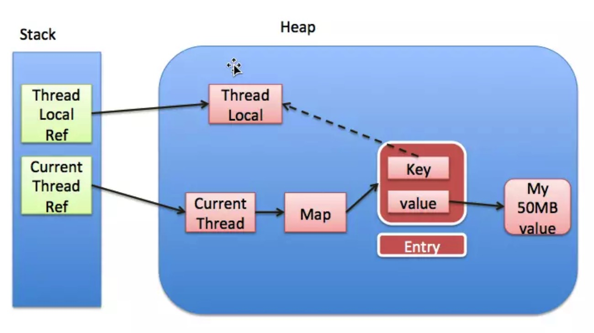
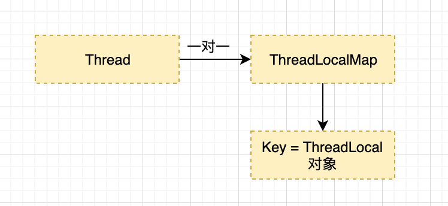

## ThreadLocal

首先 ThreadLocal 是一个泛型类，保证可以接受任何类型的对象。其能保证线程与线程之间相互隔离。

**使用场景**

如上文所述，ThreadLocal 适用于如下两种场景

- 每个线程需要有自己单独的实例
- 实例需要在多个方法中共享，但不希望被多线程共享

存储用户Session、解决线程安全的问题（Java7中的SimpleDateFormat不是线程安全的）



## 实现原理：

因为一个线程内可以存在多个 ThreadLocal 对象，所以其实是 ThreadLocal 内部维护了一个 Map ，这个 Map 不是直接使用的 HashMap ，而是 ThreadLocal 实现的一个叫做 ThreadLocalMap 的静态内部类。而我们使用的 get()、set() 方法其实都是调用了这个ThreadLocalMap类对应的 get()、set() 方法。例如下面的 set 方法：

### set 方法

ThreadLocal的set方法，大致意思为

- 首先获取当前线程
- 利用当前线程作为句柄获取一个**ThreadLocalMap**的对象
- 如果上述ThreadLocalMap对象不为空，则设置值，否则创建这个ThreadLocalMap对象并设置值

源码如下：

```java
public void set(T value) {
    Thread t = Thread.currentThread();
    ThreadLocalMap map = getMap(t);
    if (map != null)
        map.set(this, value);
    else
        createMap(t, value);
}
```

下面是一个利用Thread对象作为句柄获取ThreadLocalMap对象的代码

```java
ThreadLocalMap getMap(Thread t) {
    return t.threadLocals;
}
```

上面的代码获取的实际上是Thread对象的threadLocals变量，可参考下面代码

```java
class Thread implements Runnable {
    /* ThreadLocal values pertaining to this thread. This map is maintained
     * by the ThreadLocal class. */

    ThreadLocal.ThreadLocalMap threadLocals = null;
}
```

而如果一开始设置，即ThreadLocalMap对象未创建，则新建ThreadLocalMap对象，并设置初始值。

```java
void createMap(Thread t, T firstValue) {
    t.threadLocals = new ThreadLocalMap(this, firstValue);
}
```

总结：实际上ThreadLocal的值是放入了当前线程的一个ThreadLocalMap实例中，所以只能在本线程中访问，其他线程无法访问。

从上面可以知道，ThreadLocal 实例（this）被 ThreadLocalMap 所持有，当使用线程池管理线程时，由于复用线程，就会出现 ThreadLocalMap 中存在过多的新 ThreadLocal 实例，从而导致内存泄漏。

threadLocalMap 初始大小为16，当容量超过2/3时会自动扩容。

### 真的只能被一个线程访问么

既然上面提到了 ThreadLocal 只对当前线程可见，是不是说 ThreadLocal 的值只能被一个线程访问呢？

使用 InheritableThreadLocal 对象可以实现多个线程访问 ThreadLocal 的值。

如下，我们在主线程中创建一个 InheritableThreadLocal 的实例，然后在子线程中得到这个 InheritableThreadLocal 实例设置的值。

```java
`private void testInheritableThreadLocal() {     final ThreadLocal threadLocal = new InheritableThreadLocal();     threadLocal.set("droidyue.com");     Thread t = new Thread() {         @Override         public void run() {             super.run();             Log.i(LOGTAG, "testInheritableThreadLocal =" + threadLocal.get());         }     };      t.start(); } `
```

上面的代码输出的日志信息为

```shell
`I/MainActivity( 5046): testInheritableThreadLocal =droidyue.com `
```

使用 InheritableThreadLocal 可以将某个线程的 ThreadLocal 值在其子线程创建时传递过去。因为在线程创建过程中，有相关的处理逻辑。

### 内存泄漏问题

实际上 ThreadLocalMap 中使用的 key 为 ThreadLocal 的弱引用，弱引用的特点是，如果这个对象只存在弱引用，那么在下一次垃圾回收的时候必然会被清理掉。

所以如果 ThreadLocal 没有被外部强引用的情况下，在垃圾回收的时候会被清理掉的，这样一来 ThreadLocalMap中使用这个 ThreadLocal 的 key 也会被清理掉。但是，value 是强引用，不会被清理，这样一来就会出现 key 为 null 的 value。

ThreadLocalMap实现中已经考虑了这种情况，在调用 set()、get()、remove() 方法的时候，会清理掉 key 为 null 的记录。如果说会出现内存泄漏，那只有在出现了 key 为 null 的记录后，没有手动调用 remove() 方法，并且之后也不再调用 get()、set()、remove() 方法的情况下。

**如何避免：**

使用完ThreadLocal后，执行remove操作，避免出现内存溢出情况。

## 问题

**1、ThreadLocal 中map的 key 是什么？**

Map的key是ThreadLocal类的实例对象，value为用户的值，并不是网上大多数的例子key是线程的名字或者标识。

**2、ThreadLocal 是如何实现多线程线程安全的？**



- 每个线程都会创建一个 ThreadLocalMap 对象，这是一个 Map 对象，Map 中 Key 为 ThreadLocal 实例对象，Value 为调用者赋予的值。
- 在多线程场景中，就会存在创建多个 ThreadLocal 对象实例了，至于为什么 ThreadLocalMap 要是一个 Map 对象，由于一个线程中可能存在多个 ThreadLocal 实例对象。

所以可以看出 ThreadLocal 实现线程安全是靠每个线程独自拥有一个变量，并非是共享的。

**3、ThreadLocal 的 set 操作流程？**

1. 根据当前线程对象获取 ThreadLocalMap 对象
2. 如果 ThreadLocalMap  为空则初始化并**与当前线程对象绑定**
3. key 为ThreadLocal 对象实例

**4、ThreadLocal 的 get 操作流程？**

1. 根据当前线程对象获取 ThreadLocalMap 对象
2. 以 ThreadLocal 对象实例进行 threadLocalHashCode，获取 table 索引位置，从而获取 key

**5、ThreadLocal的内存泄露问题？**

ThreadLocalMap使用ThreadLocal的弱引用作为key，如果一个ThreadLocal没有外部强引用引用他，那么系统gc的时候，这个ThreadLocal势必会被回收，这样一来，ThreadLocalMap中就会出现key为null的Entry，就没有办法访问这些key为null的Entry的value，如果当前线程再迟迟不结束的话，这些key为null的Entry的value就会一直存在一条强引用链：
Thread Ref -> Thread -> ThreaLocalMap -> Entry -> value
永远无法回收，造成内存泄露。

ThreadLocalMap设计时的对上面问题的对策：
ThreadLocalMap的getEntry函数的流程大概为：

首先从ThreadLocal的直接索引位置(通过ThreadLocal.threadLocalHashCode & (table.length-1)运算得到)获取Entry e，如果e不为null并且key相同则返回e；
如果e为null或者key不一致则向下一个位置查询，如果下一个位置的key和当前需要查询的key相等，则返回对应的Entry。否则，如果key值为null，则擦除该位置的Entry，并继续向下一个位置查询。在这个过程中遇到的key为null的Entry都会被擦除，那么Entry内的value也就没有强引用链，自然会被回收。仔细研究代码可以发现，set操作也有类似的思想，将key为null的这些Entry都删除，防止内存泄露。
　　但是光这样还是不够的，上面的设计思路依赖一个前提条件：要调用ThreadLocalMap的getEntry函数或者set函数。这当然是不可能任何情况都成立的，所以很多情况下需要使用者手动调用ThreadLocal的remove函数，手动删除不再需要的ThreadLocal，防止内存泄露。所以JDK建议将ThreadLocal变量定义成private static的，这样的话ThreadLocal的生命周期就更长，由于一直存在ThreadLocal的强引用，所以ThreadLocal也就不会被回收，也就能保证任何时候都能根据ThreadLocal的弱引用访问到Entry的value值，然后remove它，防止内存泄露。

为什么要不断往后找key为null的情况呢，首先这个threadLocalHashCode是有规律，不断往后累加的，如果在前面的entity中存在为空的情况，也就意味着后面值也有可能存在为null的情况。

**6、ThreadLocalMap 结构？**


默认数组长度为 16，负载因子为 2/3，解决冲突的方法是再hash法，也就是：在当前hash的基础上再自增一个常量。

**7、如何实现一个线程多个ThreadLocal对象，每一个ThreadLocal对象是如何区分的呢？**

```java
private final int threadLocalHashCode = nextHashCode();
private static AtomicInteger nextHashCode = new AtomicInteger();
private static final int HASH_INCREMENT = 0x61c88647;
private static int nextHashCode() {
      return nextHashCode.getAndAdd(HASH_INCREMENT);
}
```

对于每一个ThreadLocal对象，都有一个final修饰的int型的threadLocalHashCode不可变属性，对于基本数据类型，可以认为它在初始化后就不可以进行修改，所以可以唯一确定一个ThreadLocal对象。
　　但是如何保证两个同时实例化的ThreadLocal对象有不同的threadLocalHashCode属性：在ThreadLocal类中，还包含了一个static修饰的AtomicInteger（[əˈtɒmɪk]提供原子操作的Integer类）成员变量（即类变量）和一个static final修饰的常量（作为两个相邻nextHashCode的差值）。由于nextHashCode是类变量，所以每一次调用ThreadLocal类都可以保证nextHashCode被更新到新的值，并且下一次调用ThreadLocal类这个被更新的值仍然可用，同时AtomicInteger保证了nextHashCode自增的原子性。

**8、为什么不直接用线程id来作为ThreadLocalMap的key？**

在一个线程多个ThreadLocal对象时，就无法进行区分了。