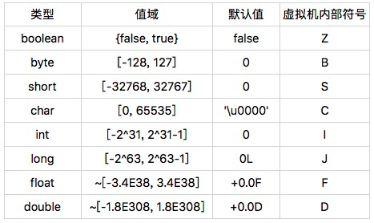

## Java的基本类型

### Java虚拟机的boolean类型

在 Java 语言规范中，boolean 类型的值只有两种可能，它们分别用符号“true”和“false”来表示。在 Java 虚拟机规范中，boolean 类型则被映射成 int 类型。具体来说，**“true”被映射为整数 1，而“false”被映射为整数 0**。这个编码规则约束了 Java 字节码的具体实现。

因而Java编译器与Java解析器必须一起遵守这个规则，如若Java编译器将boolean类型的true映射为其他值，比如：3，Java解析器无法得到true的场景了。

### Java的基本类型

Java 的基本类型都有对应的值域和默认值。可以看到，byte、short、int、long、float 以及 double 的值域依次扩大，而且前面的值域被后面的值域所包含。因此，从前面的基本类型转换至后面的基本类型，**无需强制转换**。另外一点值得注意的是，尽管他们的**默认值看起来不一样，但在内存中都是 0。**

在这些基本类型中，**boolean 和 char 是唯二的无符号类型**。在不考虑违反规范的情况下，boolean 类型的取值范围是 0 或者 1。char 类型的取值范围则是 [0, 65535]。通常我们可以认定 char 类型的值为非负数。这种特性十分有用，比如说作为数组索引等。

在前面的例子中，我们能够将整数 2 存储到一个声明为 boolean 类型的局部变量中。那么，声明为 byte、char 以及 short 的局部变量，**是否也能够存储超出它们取值范围的数值呢？**

答案是**可以的**。而且，这些超出取值范围的数值同样会带来一些麻烦。比如说，声明为 char 类型的局部变量实际上有可能为负数。

Java 的浮点类型采用 IEEE 754 浮点数格式。以 float 为例，**浮点类型通常有两个 0，+0.0F 以及 -0.0F。**

前者在 Java 里是 0，后者是符号位为 1、其他位均为 0 的浮点数，在内存中等同于十六进制整数 0x8000000（即 -0.0F 可通过 Float.intBitsToFloat(0x8000000) 求得）。尽管它们的内存数值不同，**但是在 Java 中 +0.0F == -0.0F 会返回真。**

在有了 +0.0F 和 -0.0F 这两个定义后，我们便可以定义浮点数中的正无穷及负无穷。**正无穷就是任意正浮点数（不包括 +0.0F）除以 +0.0F 得到的值，而负无穷是任意正浮点数除以 -0.0F 得到的值。在 Java 中，正无穷和负无穷是有确切的值，在内存中分别等同于十六进制整数 0x7F800000 和 0xFF800000。**

你也许会好奇，既然整数 0x7F800000 等同于正无穷，那么 **0x7F800001** 又对应什么浮点数呢？

这个数字对应的浮点数是 **NaN（Not-a-Number）**。

不仅如此，[0x7F800001, 0x7FFFFFFF] 和 [0xFF800001, 0xFFFFFFFF] 对应的都是 NaN。当然，一般我们计算得出的 NaN，比如说通过 +0.0F/+0.0F，**在内存中应为 0x7FC00000**。**这个数值，我们称之为标准的 NaN，而其他的我们称之为不标准的 NaN。**

NaN 有一个有趣的特性：除了“!=”始终返回 true 之外，所有其他比较结果都会返回 false。

### Java基本类型的大小

在第一篇中我曾经提到，Java 虚拟机每调用一个 Java 方法，便会创建一个栈帧。为了方便理解，这里我只讨论供解释器使用的解释栈帧（interpreted frame）。

这种栈帧有两个主要的组成部分，分别是局部变量区，以及字节码的操作数栈。这里的局部变量是广义的，除了普遍意义下的局部变量之外，它还包含实例方法的“this 指针”以及方法所接收的参数。

在 Java 虚拟机规范中，局部变量区等价于一个数组，并且可以用正整数来索引。**除了 long、double 值需要用两个数组单元来存储之外，其他基本类型以及引用类型的值均占用一个数组单元。**

也就是说，boolean、byte、char、short 这四种类型，在栈上占用的空间和 int 是一样的，和引用类型也是一样的。因此，在 32 位的 HotSpot 中，这些类型在栈上将占用 4 个字节；而在 64 位的 HotSpot 中，他们将占 8 个字节。(32/8=4bytes, 64/8=8bytes)

当然，**这种情况仅存在于局部变量**，而并不会出现在存储于堆中的字段或者数组元素上。对于 byte、char 以及 short 这三种类型的字段或者数组单元，它们在堆上占用的空间分别为一字节、两字节，以及两字节，也就是说，跟这些类型的值域相吻合。

因此，当我们将一个 int 类型的值，存储到这些类型的字段或数组时，相当于做了一次隐式的掩码操作。举例来说，当我们把 0xFFFFFFFF（-1）存储到一个声明为 char 类型的字段里时，由于该字段仅占两字节，所以高两位的字节便会被截取掉，最终存入“\uFFFF”。(int为4位，而char只需要2位，-1为int类型，要转为char，就要截取2位)

boolean 字段和 boolean 数组则比较特殊。在 HotSpot 中，boolean 字段占用一字节，而 boolean 数组则直接用 byte 数组来实现。为了保证堆中的 boolean 值是合法的，HotSpot 在存储时显式地进行掩码操作，也就是说，只取最后一位的值存入 boolean 字段或数组中。

讲完了存储，现在我来讲讲加载。Java 虚拟机的算数运算几乎全部依赖于操作数栈。也就是说，我们需要将堆中的 boolean、byte、char 以及 short 加载到操作数栈上，而后将栈上的值当成 int 类型来运算。

对于 boolean、char 这两个无符号类型来说，加载伴随着零扩展。举个例子，char 的大小为两个字节。在加载时 char 的值会被复制到 int 类型的低二字节，而高二字节则会用 0 来填充。

对于 byte、short 这两个类型来说，加载伴随着符号扩展。举个例子，short 的大小为两个字节。在加载时 short 的值同样会被复制到 int 类型的低二字节。如果该 short 值为非负数，即最高位为 0，那么该 int 类型的值的高二字节会用 0 来填充，否则用 1 来填充。

除 long 和 double 外，其他基本类型与引用类型在解释执行的方法栈帧中占用的大小是一致的，但它们在堆中占用的大小确不同。在将 boolean、byte、char 以及 short 的值存入字段或者数组单元时，Java 虚拟机会进行掩码操作。在读取时，Java 虚拟机则会将其扩展为 int 类型。

### 拓展知识

1、ASMTools

修改字节码的Java库

2、IEEE 754浮点数格式

几乎所有计算机都支持二进制数据表示，即能直接识别二进制数据表示并具有相应的指令系统。通常采用的二进制定点数据表示主要有：符号数值、反码、补码以及带偏移增值码四种形式，其中最常用的是补码形式。

3、掩码

将源码与掩码经过按位运算或逻辑运算得出新的操作数。其中要用到按位运算如OR运算和AND运算。用于如将ASCII码中大写字母改作小写字母。

如A的ASCII码值为65= (01000001)2，a的ASCII码值为97=(01100001)2，要想把大写字母A转化为小写字母只需要将A的ASCII码与(00100000)2进行或运算就可以得到小写字母a。