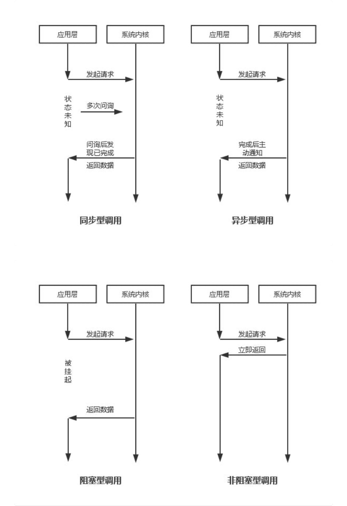
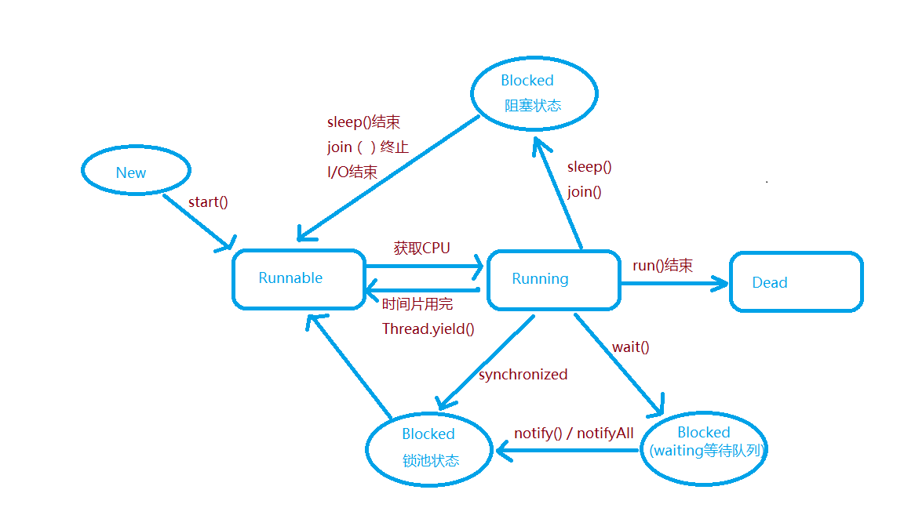

# 多线程

#### 什么是进程？

- 程序（任务）的执行过程。
- 持有资源（共享内存，共享文件）和线程（可以看做为载体）。

#### 什么是线程

- 线程是系统中最小的执行单元。
- 同一个进程中有多个线程。
- 线程共享进程的资源

#### 异步、同步、阻塞、非阻塞区别？



### Java多线程的生命周期与同步锁？



NEW  
             A thread that has not yet started in this states
RUNNABLE
    A thread executing in the Java virtual machine is in this state
BLOCKED
    A thread that is blocked waiting for a monitor lock is in this state
WAITING
    A thread that is waiting indefinitely for another thread to perform a particular action is in this state.
TIMED_WAITING
    A thread that is waiting for another thread to perform an action for up to a specified waiting time is in this state.
TERMINATED A thread that has exited in this state.

- 初始状态（New）：新创建了一个线程对象就绪状态（Runnable）：线程对象创建后，调用了该线程的start()方法，处于该状态的线程位于线程池中，处于可运行状态，等待获取CPU资源
- 运行状态：就绪状态的线程获取了CPU的资源，执行run()方法里面的程序
- 阻塞状态（Blocked）:线程因为某种原因失去的CPU的运行资源。暂时停止运行。直到线程再次进入就绪状态，才会继续开始运行
  阻塞状态一共有三种情况：
  1. 等待阻塞：线程运行时调用wait()方法，JVM使该线程进入等待队列（wait blocked pool），直到notify() / notifyAll()，线程被唤醒进入到锁池（lock blocked pool），准备抢锁回到可运行状态（特别注意：wait()方法会释放同步锁）
  2. 同步阻塞：运行的线程在获取对象的同步锁时，若该同步锁被别的线程占用，则JVM会把该线程放入到锁池中
  3. 其他阻塞：线程在运行时调用join()和sleep()方法，sleep()时间结束,join()终止或IO完成都会回到Runnable状态，等待JVM调度

Thread类的yield方法可以让一个running状态的线程转入runnable

以下情况，持有锁的线程会释放锁
1.执行完同步代码块（synchronized）
2.执行同步代码块的过程中，遇到异常（exception）
3.执行同步代码块的过程中，执行了锁所属对象的wait()方法，这个线程会释放锁，进入等待池
以下情况，同步锁不会被释放
1.执行Thread.sleep()方法，当前线程放弃CPU使用权进入睡眠，睡眠中不会释放锁
2.执行Thread.yield()方法，当前线程放弃CPU使用权，但不会释放锁
3.其他线程执行了当前线程的suspend()方法,当前线程被暂停，但不会释放锁
另外，wait(),notify(),notifyAll()三个方法都是Object类中的方法
锁池：某个线程在进入对象的synchronized方法之前必须先获得该对象的锁，如果该对象的锁正在被其他线程拥有，这个线程就会进入该对象的锁池中。
等待池：wait()方法必须出现在synchronized中，所以在执行wait()之前该线程就已经拥有了该对象的锁，调用wait()方法之后，线程释放对象的锁，进入到该对象的等待池中。直到该对象的notifyAll()方法被调用，那么处于该对象等待池中的线程就会全部进入该对象的锁池中，准备抢锁。如果调用的是该对象的notify()方法，那么仅仅有一个处于该对象的等待池中的线程会随机进入该对象的锁池。

### 进入wait/notify方法之前，为什么要获取synchronized锁？

执行monitorenter指令可以获取对象的monitor，而lock.wait()方法通过调用native方法wait(0)实现，其中接口注释中有这么一句：

> The current thread must own this object's monitor.

表示线程执行lock.wait()方法时，必须持有该lock对象的monitor，如果wait方法在synchronized代码中执行，该线程很显然已经持有了monitor。

https://www.jianshu.com/p/f4454164c017

### synchronized 实现原理


### 锁传递


线程与进程

同一个进程中的所有线程都将共享进程的内存地址空间，因此这些线程都能访问相同的变量并在同一个堆上分配对象。

同步容器类

同步容器类在每一个操作期间都持有一个锁。

编写线程安全代码的核心是在于要**对状态访问操作进行管理** ，特别是对共享的和可变的状态的访问。

一个对象是否是线程安全，取决于对象是否以同步机制来协同方式被访问

对变量状态实现同步的方案：

- 不在线程之间共享该状态变量
- 将状态变量修改为不可变的变量
- 在访问状态变量时使用同步

无状态对象一定是线程安全

竞态条件

通过一个可能失效的观测结果来决定下一步的动作。

要避免竞态条件问题，就必须在某个线程修改该变量时，通过某种方式防止其他线程使用这个变量，从而确保其他线程只能在修改操作完成之前或之后读取和修改状态，而不是在修改状态的过程中。

委托失败

如果某个类含有复合操作时，仅靠委托并不足以实现线程安全性。在这种情况下，类必须要提供自己的加锁机制以保证这些复合操作都是原子性，除非整个复合操作都可以委托给状态变量。

ThreadLocal

为每个使用 ThreadLocal 变量的线程存有一份独立的副本，从而保证线程的安全。

ThreadLocal 类似于全局变量，会降低代码的可重用性，并在类之间引入隐含的耦合性，因此在使用时要格外小心。

ConcurrentHashMap

ConcurrentHashMap 使用了分段锁，实现最大程度的共享。在这种机制中，任意数量的读取线程可以并发地访问 Map，执行读取操作的线程和执行写入操作的线程可以并发地访问 Map。返回的迭代器具有弱一致性。弱一致性的迭代器可以容忍并发的修改。size 和 isEmpty 是一个近似值，而不是准确值。

Queue

LinkedBlockingQueue：FIFO，与LinkedList 一致

ArrayBlockingQueue：FIFO，与 ArrayList 一致

PriorityBlockingQueue：自定义优先级顺序

SynchronousQueue：没有存储功能，因此 put 和 take 会一直阻塞。

Executor

Executor执行的任务的生命周期：创建，提交，开始，完成。

Executor支持已提交未开始的任务的取消，对于已经在执行的任务，只能通过中断。

异构任务并行化

当存在A、B两个任务分配给两个工人，但执行时间相差10倍，仅仅多线程方式无法直接提升性能，但如果将一大部分的线程分配给执行时间长的，一小部分给执行时间快的，相应的可以提升性能，**FutureRenderer** 就是用来做这件事的。只有当大量相互独立切同构的任务可以并发进行处理时，才能体现出将程序的工作负载分配到多个任务中带来的真正性能提升。

双端队列与工作密取

每个消费者都有各自的双端队列。如果一个消费者完成了自己双端队列中的全部工作，那么他可以从其他消费者双端队列**末尾**秘密的获取工作。比传统的队列更具有可伸缩性，这是因为工作者线程不会在单个共享的任务队列上发生竞争。

Interrupt

调用 Interrupt 并不意味着立即停止目标线程正在进行的工作，只是传递了请求中断的消息。sleep、wait方法会监听线程状态，当检测到中断请求之后，会响应的抛出 InterruptedException 异常。

具体来说，当对一个线程，调用 interrupt() 时，
① 如果线程处于被阻塞状态（例如处于sleep, wait, join 等状态），那么线程将立即退出被阻塞状态，并抛出一个InterruptedException异常。仅此而已。
② 如果线程处于正常活动状态，那么会将该线程的中断标志设置为 true，仅此而已。被设置中断标志的线程将继续正常运行，不受影响。

守护线程

线程分为两种：守护线程和正常线程。当 JVM 启动时，除了主线程外，其他都是守护线程，**守护线程与主线程之间的区别在于当JVM停止时，所有仍然存在的守护线程都将被抛弃——既不会执行 finally 代码块，也不会执行回卷栈，而 JVM 只是直接退出。**  如果线程退出时，守护线程，则会正常退出。

线程创建新线程时，新线程会继承父线程。

终结器

当一些其他资源需要显式交还给操作系统时，例如：文件句柄或套接字句柄。为了实现这个功能垃圾回收器对那些定义了 finalize 方法的对象会进行特殊处理：在回收器释放它们后，调用他们的 finalize 方法，从而保证一些持久化的资源被释放。

1、哪些设计能帮助你设计线程安全的类？

良好的面向对象技术、不可修改性、以及明晰的不变性规范。

2、什么时候才考虑编写并发应用程序？

有明确的证据证明串行方式已经存在性能问题了或者有性能测试结果告知并行方式能提高效率。

3、线程安全类与线程安全程序？

线程安全程序并非全部由线程安全类构成，完全有线程安全类构成的程序也不一定就是线程安全程序。线程安全类也可以包含非线程安全的类。

4、什么叫线程安全？

当多个线程访问某个类时，这个类始终都能表现出正确的行为，那么就称这个类是线程安全的。

5、为什么不在每个方法上加关键字 synchronized ？

过多的使用会导致程序过多的同步，而且仅仅是同步的话，并不一定能保证复合操作时是原子的。

6、synchronized 作用？

- 实现原子性
- 确定临界区
- 内存可见性：线程可以看到被修改之后的对象状态

7、非 volatile 类型的 long 和 double 变量？

java 内存模型要求，变量的读取操作和写入操作都必须是原子操作，但对于非 volatile 类型的 long 和 double 变量， JVM 允许将64 位的读操作和写操作分解为两个 32 位操作。当读取一个非volatile 类型的 long 变量时，如果对该变量的读操作和写操作在不同的线程中执行，那么很可能会读取到某个值的高32位和另一个值的低32位。因此不使用 volatile 关键字来声明他们，会存在不安全。

8、volatile 与 加锁机制的区别？

加锁机制既可以确保可见性又可以确保原子性，而volatile变量只能确保可见性。

当且仅当满足以下条件时，才应该使用 volatile 变量：

- 对变量的写入操作不依赖变量的当前值，或者你能确保只有单个线程更新变量的值
- 该变量不会与其他状态变量一起纳入不变性条件中
- 在访问变量时不需要加锁

不可变对象是线程安全的，什么样的对象才是不可变的呢？

- 对象创建以后其状态就不能修改
- 对象的所有域都是 final 类型
- 对象时正确创建的（在对象的创建期间，this 引用没有逸出）

10、不可变对象有什么价值？

不可变对象具有一定的原子性，与 volatile 合用可以实现线程安全。

Java中体现不可变性的特点主要是final和构造函数

11、如何安全的发布一个对象？

对象的引用以及对象的状态必须同时对其他线程可见。

12、最简单和最安全方式发布一个静态构造的对象？

静态的初始化器。静态初始化器由JVM在类的初始化阶段执行。由于在JVM内部存在着同步机制，因此通过这种方式初始化的任何对象都可以被安全的发布。

```
public static Holder holder = new Holder(42);
```

13、有哪些方式可以保证线程安全？

- 实例封闭，限制只能由一个线程访问，单线程访问或通过一个锁，限定在特定的区域内。
- 

14、什么是 Java 监视器模式？

 Java 监视器模式的对象会把对象的所有可变状态都封装起来，并由对象自己的内置锁来保护。

15、`Object.wait()/Object.notify()/Object.notifyAll()` 作用？

wait：当前线程就会在这个对象上等待。比如，线程 A 中调用 `obj.wait()` 方法，那么线程 A 就会停止继续执行，而转为等待状态。直到其他线程调用 notify() 或者 notifyAll() 时。在调用 wait 方法的时候会先解锁。

notify：从等待队列中随机抽取一个唤醒。不会释放锁

notifyAll：将等待队列中的所有线程都唤醒。不会释放锁。

在多线程中，一个对象可能被多个线程使用的情况，所以要在调用以上3个方法时，只能在 synchronized 语句中调用。在操作之前都要先获取 Object 监视器。

16、suspend 与 resume

suspend：将线程挂起，等待 resume 唤醒。但不推荐使用，线程在暂停的时候，没有释放资源（锁）。

resume：唤醒被 suspend 挂起的线程。

17、join

join：很多时候，一个线程的输入可能非常依赖与另外一个或者多个线程的输出，此时，这个线程就需要等待依赖线程执行完毕，才能继续执行。其本质是让**调用线程 wait() 在当前线程对象实例上**。

18、yield

它会使当前线程让出 CPU 资源，让出 CPU 资源并不代表不执行了，它也会去竞争 CPU 资源，可能会抢占到 CPU 资源，从而继续执行。
