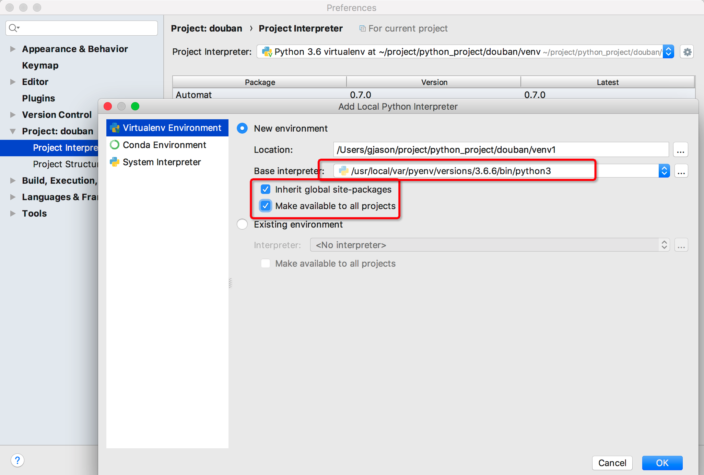

# Pyenv多版本管理

声明：以下是以MacOS环境进行说明

## 安装

### 安装homebrew：

```shell
/usr/bin/ruby -e "$(curl -fsSL https://raw.githubusercontent.com/Homebrew/install/master/install)"  
```

即可成功安装HomeBrew 

### 通过homebrew来安装pyenv

```shell
brew install pyenv 
```

### 配置`.bash_profile`

```shell
open .bash_profile
```

添加如下语句：

```
export PYENV_ROOT=/usr/local/var/pyenv
if which pyenv > /dev/null; then eval "$(pyenv init -)"; fi
```

保存之后，刷新文件

```
source .bash_profile
```

### 安装指定Python

查看python版本

```
pyenv install --list
```

你将会看到一系列的配置

1. 纯数字的(如2.1.3, 2.7.12)是官方发布版本,  
2. anaconda 也是一个python版本,只是自带了很多用于科学计算的第三方包和管理这些第三方包的管理工具(类似于pip)  
3. miniconda- 是anaconda的迷你版(仅仅包涵对应的python版本和第三方包管理工具,第三方包如果使用需要自己下载)  
4. IronPython 是一种在 NET 和 Mono 上实现的 Python 语言.使用.net开发  
5. JPython是完全用JPython实现的python，它支持用java扩展，  
6. 和CPythonPyPy的区别是使用了JIT(即时编译)技术  

安装指定版本

```
# 3.6.6 为版本号
pyenv install 3.6.6
```

## pyenv其他说明

### 指令

```
# 查看可以安装python版本列表
pyenv install --list
# 安装指定版本python
pyenv install 3.5.2
# 卸载python
pyenv uninstall  3.5.2
# 查看已经安装的python版本
pyenv versions
# 查看当前使用python版本
pyenv version
```

### 全局设置python版本

不推荐这么做,说是mac操作系统的文件也会调用原生的2.7的python版本  

```
pyenv global 3.5.2
# 取消
pyenv global --unset
```

### 设置目录级python版本

```
pyenv local 3.5.2
# 取消
pyenv local --unset
```

### 为当前shell会话设置python版本

```
pyenv shell 3.5.2
# 取消
pyenv shell --unset
```

### 安装依赖包

```
pip uninstall <包名>
```

## pyenv中python安装路径

```
/usr/local/var/pyenv/versions/3.5.2/bin/python3.5
```

## 在Pycharm中配置

