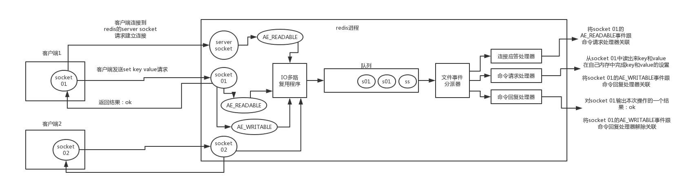

# Redis

## Redis 连接流程



- 客户端 Socket01 向 Redis 的 Server Socket 请求建立连接，此时 Server Socket 会产生一个 `AE_READABLE` 事件，IO 多路复用程序监听到 server socket 产生的事件后，将该事件压入队列中。文件事件分派器从队列中获取该事件，交给`连接应答处理器`。连接应答处理器会创建一个能与客户端通信的 Socket01，并将该 Socket01 的 `AE_READABLE` 事件与命令请求处理器关联。
- 假设此时客户端发送了一个 `set key value` 请求，此时 Redis 中的 Socket01 会产生 `AE_READABLE` 事件，IO 多路复用程序将事件压入队列，此时事件分派器从队列中获取到该事件，由于前面 Socket01 的 `AE_READABLE` 事件已经与命令请求处理器关联，因此事件分派器将事件交给命令请求处理器来处理。命令请求处理器读取 Scket01 的 `set key value` 并在自己内存中完成 `set key value` 的设置。操作完成后，它会将 Scket01 的 `AE_WRITABLE` 事件与令回复处理器关联。
- 如果此时客户端准备好接收返回结果了，那么 Redis 中的 Socket01 会产生一个 `AE_WRITABLE` 事件，同样压入队列中，事件分派器找到相关联的命令回复处理器，由命令回复处理器对 socket01 输入本次操作的一个结果，比如 `ok`，之后解除 Socket01 的 `AE_WRITABLE` 事件与命令回复处理器的关联。

## 持久化方式

### RDB

在运行情况下， Redis 以数据结构的形式将数据维持在内存中， 为了让这些数据在 Redis 重启之后仍然可用， Redis 分别提供了 RDB 和 AOF 两种[持久化](http://en.wikipedia.org/wiki/Persistence_(computer_science))模式。

在 Redis 运行时， RDB 程序将当前内存中的数据库快照保存到磁盘文件中， 在 Redis 重启动时， RDB 程序可以通过载入 RDB 文件来还原数据库的状态。

RDB 功能最核心的是 `rdbSave` 和 `rdbLoad` 两个函数， 前者用于生成 RDB 文件到磁盘， 而后者则用于将 RDB 文件中的数据重新载入到内存中：

![digraph persistent {      rankdir = LR;      node [shape = circle, style = filled];      edge [style = bold];      redis_object [label = "内存中的\n数据对象", fillcolor = "#A8E270"];      rdb [label = "磁盘中的\nRDB文件", fillcolor = "#95BBE3"];      redis_object -> rdb [label = "rdbSave"];      rdb -> redis_object [label = "rdbLoad"]; }](assets/graphviz-cd96bfa5c61ef2b8dd69a9b0a97cde047cb722a8.svg)

本章先介绍 [SAVE](http://redis.readthedocs.org/en/latest/server/save.html#save) 和 [BGSAVE](http://redis.readthedocs.org/en/latest/server/bgsave.html#bgsave) 命令的实现， 以及 `rdbSave` 和 `rdbLoad` 两个函数的运行机制， 然后以图表的方式， 分部分来介绍 RDB 文件的组织形式。

#### 保存

`rdbSave` 函数负责将内存中的数据库数据以 RDB 格式保存到磁盘中， 如果 RDB 文件已存在， 那么新的 RDB 文件将替换已有的 RDB 文件。

在保存 RDB 文件期间， 主进程会被阻塞， 直到保存完成为止。

[SAVE](http://redis.readthedocs.org/en/latest/server/save.html#save) 和 [BGSAVE](http://redis.readthedocs.org/en/latest/server/bgsave.html#bgsave) 两个命令都会调用 `rdbSave` 函数，但它们调用的方式各有不同：

- [SAVE](http://redis.readthedocs.org/en/latest/server/save.html#save) 直接调用 `rdbSave` ，阻塞 Redis 主进程，直到保存完成为止。在主进程阻塞期间，服务器不能处理客户端的任何请求。
- [BGSAVE](http://redis.readthedocs.org/en/latest/server/bgsave.html#bgsave) 则 `fork` 出一个子进程，子进程负责调用 `rdbSave` ，并在保存完成之后向主进程发送信号，通知保存已完成。因为 `rdbSave` 在子进程被调用，所以 Redis 服务器在 [BGSAVE](http://redis.readthedocs.org/en/latest/server/bgsave.html#bgsave) 执行期间仍然可以继续处理客户端的请求。

#### SAVE 、 BGSAVE 、 AOF 写入和 BGREWRITEAOF

除了了解 RDB 文件的保存方式之外， 我们可能还想知道， 两个 RDB 保存命令能否同时使用？ 它们和 AOF 保存工作是否冲突？

本节就来解答这些问题。

##### SAVE

前面提到过， 当 [SAVE](http://redis.readthedocs.org/en/latest/server/save.html#save) 执行时， Redis 服务器是阻塞的， 所以当 [SAVE](http://redis.readthedocs.org/en/latest/server/save.html#save) 正在执行时， 新的 [SAVE](http://redis.readthedocs.org/en/latest/server/save.html#save) 、 [BGSAVE](http://redis.readthedocs.org/en/latest/server/bgsave.html#bgsave) 或 [BGREWRITEAOF](http://redis.readthedocs.org/en/latest/server/bgrewriteaof.html#bgrewriteaof) 调用都不会产生任何作用。

只有在上一个 [SAVE](http://redis.readthedocs.org/en/latest/server/save.html#save) 执行完毕、 Redis 重新开始接受请求之后， 新的 [SAVE](http://redis.readthedocs.org/en/latest/server/save.html#save) 、 [BGSAVE](http://redis.readthedocs.org/en/latest/server/bgsave.html#bgsave) 或 [BGREWRITEAOF](http://redis.readthedocs.org/en/latest/server/bgrewriteaof.html#bgrewriteaof) 命令才会被处理。

另外， 因为 AOF 写入由后台线程完成， 而 [BGREWRITEAOF](http://redis.readthedocs.org/en/latest/server/bgrewriteaof.html#bgrewriteaof) 则由子进程完成， 所以在 [SAVE](http://redis.readthedocs.org/en/latest/server/save.html#save) 执行的过程中， AOF 写入和 [BGREWRITEAOF](http://redis.readthedocs.org/en/latest/server/bgrewriteaof.html#bgrewriteaof) 可以同时进行。

##### BGSAVE

在执行 [SAVE](http://redis.readthedocs.org/en/latest/server/save.html#save) 命令之前， 服务器会检查 [BGSAVE](http://redis.readthedocs.org/en/latest/server/bgsave.html#bgsave) 是否正在执行当中， 如果是的话， 服务器就不调用 `rdbSave` ， 而是向客户端返回一个出错信息， 告知在 [BGSAVE](http://redis.readthedocs.org/en/latest/server/bgsave.html#bgsave) 执行期间， 不能执行 [SAVE](http://redis.readthedocs.org/en/latest/server/save.html#save) 。

这样做可以避免 [SAVE](http://redis.readthedocs.org/en/latest/server/save.html#save) 和 [BGSAVE](http://redis.readthedocs.org/en/latest/server/bgsave.html#bgsave) 调用的两个 `rdbSave` 交叉执行， 造成竞争条件。

另一方面， 当 [BGSAVE](http://redis.readthedocs.org/en/latest/server/bgsave.html#bgsave) 正在执行时， 调用新 [BGSAVE](http://redis.readthedocs.org/en/latest/server/bgsave.html#bgsave) 命令的客户端会收到一个出错信息， 告知 [BGSAVE](http://redis.readthedocs.org/en/latest/server/bgsave.html#bgsave) 已经在执行当中。

[BGREWRITEAOF](http://redis.readthedocs.org/en/latest/server/bgrewriteaof.html#bgrewriteaof) 和 [BGSAVE](http://redis.readthedocs.org/en/latest/server/bgsave.html#bgsave) 不能同时执行：

- 如果 [BGSAVE](http://redis.readthedocs.org/en/latest/server/bgsave.html#bgsave) 正在执行，那么 [BGREWRITEAOF](http://redis.readthedocs.org/en/latest/server/bgrewriteaof.html#bgrewriteaof) 的重写请求会被延迟到 [BGSAVE](http://redis.readthedocs.org/en/latest/server/bgsave.html#bgsave) 执行完毕之后进行，执行 [BGREWRITEAOF](http://redis.readthedocs.org/en/latest/server/bgrewriteaof.html#bgrewriteaof) 命令的客户端会收到请求被延迟的回复。
- 如果 [BGREWRITEAOF](http://redis.readthedocs.org/en/latest/server/bgrewriteaof.html#bgrewriteaof) 正在执行，那么调用 [BGSAVE](http://redis.readthedocs.org/en/latest/server/bgsave.html#bgsave) 的客户端将收到出错信息，表示这两个命令不能同时执行。

[BGREWRITEAOF](http://redis.readthedocs.org/en/latest/server/bgrewriteaof.html#bgrewriteaof) 和 [BGSAVE](http://redis.readthedocs.org/en/latest/server/bgsave.html#bgsave) 两个命令在操作方面并没有什么冲突的地方， 不能同时执行它们只是一个性能方面的考虑： 并发出两个子进程， 并且两个子进程都同时进行大量的磁盘写入操作， 这怎么想都不会是一个好主意。

#### 载入

当 Redis 服务器启动时， `rdbLoad` 函数就会被执行， 它读取 RDB 文件， 并将文件中的数据库数据载入到内存中。

在载入期间， 服务器每载入 1000 个键就处理一次所有已到达的请求， 不过只有 `PUBLISH` 、 `SUBSCRIBE` 、 `PSUBSCRIBE` 、 `UNSUBSCRIBE` 、 `PUNSUBSCRIBE` 五个命令的请求会被正确地处理， 其他命令一律返回错误。 等到载入完成之后， 服务器才会开始正常处理所有命令。

发布与订阅功能和其他数据库功能是完全隔离的，前者不写入也不读取数据库，所以在服务器载入期间，订阅与发布功能仍然可以正常使用，而不必担心对载入数据的完整性产生影响。

另外， 因为 AOF 文件的保存频率通常要高于 RDB 文件保存的频率， 所以一般来说， AOF 文件中的数据会比 RDB 文件中的数据要新。

因此， 如果服务器在启动时， 打开了 AOF 功能， 那么程序优先使用 AOF 文件来还原数据。 只有在 AOF 功能未打开的情况下， Redis 才会使用 RDB 文件来还原数据。

### AOF

https://redisbook.readthedocs.io/en/latest/internal/aof.html

## Redis的内存淘汰

## 事务

在 Redis 中，MULTI / EXEC / DISCARD / WATCH 这四个命令是我们实现事务的基石

假设我们通过 WATCH 命令在事务执行之前监控了多个 keys ，倘若在 WATCH 之后有任何 Key 的值发生了变化，EXEC 命令执行的事务都将被放弃，同时返回 `nil` 应答以通知调用者事务执行失败。

Redis 事务无法保证原子性。

## 主从同步

Redis 的主从同步(replication)机制，允许 Slave 从 Master 那里，通过网络传输拷贝到完整的数据备份，从而达到主从机制。

- 主数据库可以进行读写操作，当发生写操作的时候自动将数据同步到从数据库，而从数据库一般是只读的，并接收主数据库同步过来的数据。
- 一个主数据库可以有多个从数据库，而一个从数据库只能有一个主数据库。
- 第一次同步时，主节点做一次 bgsave 操作，并同时将后续修改操作记录到内存 buffer ，待完成后将 RDB 文件全量同步到复制节点，复制节点接受完成后将 RDB 镜像加载到内存。加载完成后，再通知主节点将期间修改的操作记录同步到复制节点进行重放就完成了同步过程。

## Redis 底层数据类型

### SDS

用于保存 String 类型数据。Redis 是用 C 语言写的，但是对于Redis的字符串，却不是 C 语言中的字符串（即以空字符’\0’结尾的字符数组），它是自己构建了一种名为 简单动态字符串（simple dynamic string,SDS）的抽象类型，并将 SDS 作为 Redis的默认字符串表示。

```c
struct sdshdr{
     //记录buf数组中已使用字节的数量
     //等于 SDS 保存字符串的长度
     int len;
     //记录 buf 数组中未使用字节的数量
     int free;
     //字节数组，用于保存字符串
     char buf[];
}
```

#### SDS 比 C语言 String 类型好在哪里

- 获取字符串长度时间复杂度 O(1)
- 由于len属性和free属性的存在，可以防止缓冲区溢出风险
- 减少修改字符串的内存重新分配次数

### 链表

Redis链表特性：

- 双端：链表具有前置节点和后置节点的引用，获取这两个节点时间复杂度都为O(1)。
- 无环：表头节点的 prev 指针和表尾节点的 next 指针都指向 NULL,对链表的访问都是以 NULL 结束。　　
- 带链表长度计数器：通过 len 属性获取链表长度的时间复杂度为 O(1)。
- 多态：链表节点使用 void* 指针来保存节点值，可以保存各种不同类型的值。

### 字典

**解决哈希冲突：**这个问题上面我们介绍了，方法是链地址法。

**扩容和收缩：**当哈希表保存的键值对太多或者太少时，就要通过 rerehash(重新散列）来对哈希表进行相应的扩展或者收缩。

具体步骤：

　　　　1. 如果执行扩展操作，会基于原哈希表创建一个大小等于 ht[0].used*2n 的哈希表（也就是每次扩展都是根据原哈希表已使用的空间扩大一倍创建另一个哈希表）。相反如果执行的是收缩操作，每次收缩是根据已使用空间缩小一倍创建一个新的哈希表。
   　　　　2. 重新利用上面的哈希算法，计算索引值，然后将键值对放到新的哈希表位置上。
   　　　　3. 所有键值对都迁徙完毕后，释放原哈希表的内存空间。

**渐近式 rehash:**

什么叫渐进式 rehash？也就是说扩容和收缩操作不是一次性、集中式完成的，而是分多次、渐进式完成的。如果保存在Redis中的键值对只有几个几十个，那么 rehash 操作可以瞬间完成，但是如果键值对有几百万，几千万甚至几亿，那么要一次性的进行 rehash，势必会造成Redis一段时间内不能进行别的操作。所以Redis采用渐进式 rehash,这样在进行渐进式rehash期间，字典的删除查找更新等操作可能会在两个哈希表上进行，第一个哈希表没有找到，就会去第二个哈希表上进行查找。但是进行 增加操作，一定是在新的哈希表上进行的。

### 跳跃表

跳跃表（skiplist）是一种有序数据结构，它通过在每个节点中维持多个指向其它节点的指针，从而达到快速访问节点的目的。具有如下性质：

　　1. 由很多层结构组成；

　　2. 每一层都是一个有序的链表，排列顺序为由高层到底层，都至少包含两个链表节点，分别是前面的head节点和后面的nil节点；
  　　3. 最底层的链表包含了所有的元素；

　　4. 如果一个元素出现在某一层的链表中，那么在该层之下的链表也全都会出现（上一层的元素是当前层的元素的子集）；
  　　5. 链表中的每个节点都包含两个指针，一个指向同一层的下一个链表节点，另一个指向下一层的同一个链表节点；


### 整数集合

整数集合（intset）是Redis用于保存整数值的集合抽象数据类型，它可以保存类型为int16_t、int32_t 或者int64_t 的整数值，并且保证集合中不会出现重复元素。

### 压缩列表

压缩列表（ziplist）是Redis为了节省内存而开发的，是由一系列特殊编码的连续内存块组成的顺序型数据结构，一个压缩列表可以包含任意多个节点（entry），每个节点可以保存一个字节数组或者一个整数值。

**压缩列表的原理：压缩列表并不是对数据利用某种算法进行压缩，而是将数据按照一定规则编码在一块连续的内存区域，目的是节省内存。**