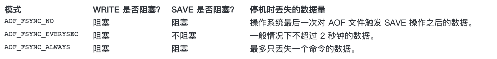

# Redis 面试指南

[TOC]

#### Redis 有什么优点？

**1. 速度快**

因为数据存在内存中，类似于 HashMap ，HashMap 的优势就是查找和操作的时间复杂度都是O (1) 。

**2. 支持丰富数据类型**

支持 String ，List，Set，Sorted Set，Hash 五种基础的数据结构。

在基础的数据结构之上，还提供 [Bitmap](http://redisdoc.com/bitmap/index.html)、[HyperLogLog](http://redisdoc.com/hyperloglog/index.html)、[GEO](http://redisdoc.com/geo/index.html) 等高级的数据结构。

**3. 丰富的特性**

- 订阅发布 Pub / Sub 功能
- Key 过期策略
- 事务
- 支持多个 DB
- 计数

Redis 5.0 增加了 Stream 功能，一个新的强大的支持多播的可持久化的消息队列，提供类似 Kafka 的功能。

**4. 持久化存储**

Redis 提供 RDB 和 AOF 两种数据的持久化存储方案，解决内存数据库最担心的万一 Redis 挂掉，数据会消失掉。

**5、高可用**

内置 Redis Sentinel ，提供高可用方案，实现主从故障自动转移。

内置 Redis Cluster ，提供集群方案，实现基于槽的分片方案，从而支持更大的 Redis 规模。

#### Redis 和 Memcached 的区别有哪些？

**1. Redis 支持复杂的数据结构**

- Memcached 仅提供简单的字符串。
- Redis 提供复杂的数据结构，丰富的数据操作。

**2. Redis 原生支持集群模式**

- 在 Redis3.x 版本中，官方便能支持 Cluster 模式。
- Memcached 没有原生的集群模式，需要依靠客户端来实现往集群中分片写入数据。

**3. 性能对比**

- Redis 只使用单核，而 Memcached 可以使用多核，所以平均每一个核上 Redis在存储小数据时比 Memcached 性能更高。
- 在 100k 以上的数据中，Memcached 性能要高于 Redis 。虽然 Redis 最近也在存储大数据的性能上进行优化，但是比起 Memcached，还是稍有逊色。

**4. 内存管理机制不同**

相比来说，Redis 的内存管理机制，会更加简单。

- Redis 采用的是**包装**的 malloc/free ，使用时现场申请的方式。
- Memcached 采用的是 Slab Allocation 机制管理内存，预分配的内存池的方式。

如果对比两者的内存使用效率：

- 简单的 Key-Value 存储的话，Memcached 的内存利用率更高，可以使用类似内存池。
- 如果 Redis 采用 hash 结构来做 key-value 存储，由于其组合式的压缩， 其内存利用率会高于 Memcached 。

**5. 网络 IO 模型**

- Memcached 是多线程，非阻塞 IO 复用的网络模型，原型上接近 Nignx 。
- Redis 使用单线程的 IO 复用模型，自己封装了一个简单的 AeEvent 事件处理框架，主要实现了 epoll ， kqueue 和 select ，更接近 Apache 早期的模式。

**6. 持久化存储**

- Memcached 不支持持久化存储，重启时，数据被清空。
- Redis 支持持久化存储，重启时，可以恢复已持久化的数据。

#### 请说说 Redis 的线程模型？

 Redis 是非阻塞 IO ，多路复用

#### 讲一下文件事件处理器的结构包含哪些？

- 多个 Socket 。
- IO 多路复用程序。
- 文件事件分派器。
- 事件处理器（连接应答处理器、命令请求处理器、命令回复处理器）。

#### 讲一下客户端与 redis 的一次通信过程？

- 客户端 Socket01 向 Redis 的 Server Socket 请求建立连接，此时 Server Socket 会产生一个 `AE_READABLE` 事件，IO 多路复用程序监听到 server socket 产生的事件后，将该事件压入队列中。文件事件分派器从队列中获取该事件，交给`连接应答处理器`。连接应答处理器会创建一个能与客户端通信的 Socket01，并将该 Socket01 的 `AE_READABLE` 事件与命令请求处理器关联。
- 假设此时客户端发送了一个 `set key value` 请求，此时 Redis 中的 Socket01 会产生 `AE_READABLE` 事件，IO 多路复用程序将事件压入队列，此时事件分派器从队列中获取到该事件，由于前面 Socket01 的 `AE_READABLE` 事件已经与命令请求处理器关联，因此事件分派器将事件交给命令请求处理器来处理。命令请求处理器读取 Scket01 的 `set key value` 并在自己内存中完成 `set key value` 的设置。操作完成后，它会将 Scket01 的 `AE_WRITABLE` 事件与令回复处理器关联。
- 如果此时客户端准备好接收返回结果了，那么 Redis 中的 Socket01 会产生一个 `AE_WRITABLE` 事件，同样压入队列中，事件分派器找到相关联的命令回复处理器，由命令回复处理器对 socket01 输入本次操作的一个结果，比如 `ok`，之后解除 Socket01 的 `AE_WRITABLE` 事件与命令回复处理器的关联。

#### 为什么 Redis 单线程模型也能效率这么高？

1、C 语言实现。

2、纯内存操作。

3、基于非阻塞的 IO 多路复用机制。

4、单线程，避免了多线程的频繁上下文切换问题。

5、丰富的数据结构。

#### Redis 有哪些持久化的方式？

RDB 和 AOF

#### 讲一下 RDB 实现持久化实现方式？

保存

`rdbSave` 函数负责将内存中的数据库数据以 RDB 格式保存到磁盘中， 如果 RDB 文件已存在， 那么新的 RDB 文件将替换已有的 RDB 文件。

在保存 RDB 文件期间， 主进程会被阻塞， 直到保存完成为止。

加载

当 Redis 服务器启动时， `rdbLoad` 函数就会被执行， 它读取 RDB 文件， 并将文件中的数据库数据载入到内存中。

在载入期间， 服务器每载入 1000 个键就处理一次所有已到达的请求， 不过只有 `PUBLISH` 、 `SUBSCRIBE` 、 `PSUBSCRIBE` 、 `UNSUBSCRIBE` 、 `PUNSUBSCRIBE` 五个命令的请求会被正确地处理， 其他命令一律返回错误。 等到载入完成之后， 服务器才会开始正常处理所有命令。

#### Save 与 BGSave 的区别？

[SAVE](http://redis.readthedocs.org/en/latest/server/save.html#save) 和 [BGSAVE](http://redis.readthedocs.org/en/latest/server/bgsave.html#bgsave) 两个命令都会调用 `rdbSave` 函数，但它们调用的方式各有不同：

- [SAVE](http://redis.readthedocs.org/en/latest/server/save.html#save) 直接调用 `rdbSave` ，阻塞 Redis 主进程，直到保存完成为止。在主进程阻塞期间，服务器不能处理客户端的任何请求。
- [BGSAVE](http://redis.readthedocs.org/en/latest/server/bgsave.html#bgsave) 则 `fork` 出一个子进程，子进程负责调用 `rdbSave` ，并在保存完成之后向主进程发送信号，通知保存已完成。因为 `rdbSave` 在子进程被调用，所以 Redis 服务器在 [BGSAVE](http://redis.readthedocs.org/en/latest/server/bgsave.html#bgsave) 执行期间仍然可以继续处理客户端的请求。

#### 在执行 Save 时，AOF 的相关操作会受影响吗？

不会，因为 AOF 写入由后台线程完成， 而 [BGREWRITEAOF](http://redis.readthedocs.org/en/latest/server/bgrewriteaof.html#bgrewriteaof) 则由子进程完成， 所以在 [SAVE](http://redis.readthedocs.org/en/latest/server/save.html#save) 执行的过程中， AOF 写入和 [BGREWRITEAOF](http://redis.readthedocs.org/en/latest/server/bgrewriteaof.html#bgrewriteaof) 可以同时进行。

#### BGREWRITEAOF 和 BGSAVE 可以同时执行吗？

不可以，两个命令在操作方面并没有什么冲突的地方， 不能同时执行它们只是一个性能方面的考虑： 并发出两个子进程， 并且两个子进程都同时进行大量的磁盘写入操作， 这怎么想都不会是一个好主意。

#### AOF 同步方式是怎样的？

Redis 将所有对数据库进行过写入的命令（及其参数）记录到 AOF 文件。

除了 [SELECT](http://redis.readthedocs.org/en/latest/connection/select.html#select) 命令是 AOF 程序自己加上去的之外， 其他命令都是之前我们在终端里执行的命令。

同步命令到 AOF 文件的整个过程可以分为三个阶段：

1. 命令传播：Redis 将执行完的命令、命令的参数、命令的参数个数等信息发送到 AOF 程序中。
2. 缓存追加：AOF 程序根据接收到的命令数据，将命令转换为网络通讯协议的格式，然后将协议内容追加到服务器的 AOF 缓存中。
3. 文件写入和保存：AOF 缓存中的内容被写入到 AOF 文件末尾，如果设定的 AOF 保存条件被满足的话， `fsync` 函数或者 `fdatasync` 函数会被调用，将写入的内容真正地保存到磁盘中。

#### AOF 中缓存追加请概述一下？

将命令从字符串对象转换回原来的协议文本，协议文本生成之后， 它会被追加到 `redis.h/redisServer` 结构的 `aof_buf` 末尾。

整个缓存追加过程可以分为以下三步：

1. 接受命令、命令的参数、以及参数的个数、所使用的数据库等信息。
2. 将命令还原成 Redis 网络通讯协议。
3. 将协议文本追加到 `aof_buf` 末尾。

#### AOF 中文件写入和保存步骤的操作请概述一下？

每当服务器常规任务函数被执行、 或者事件处理器被执行时， `aof.c/flushAppendOnlyFile` 函数都会被调用， 这个函数执行以下两个工作：

WRITE：根据条件，将 `aof_buf` 中的缓存写入到 AOF 文件。

SAVE：根据条件，调用 `fsync` 或 `fdatasync` 函数，将 AOF 文件保存到磁盘中。

AOF 保存模式有哪些？

1. `AOF_FSYNC_NO` ：不保存。
2. `AOF_FSYNC_EVERYSEC` ：每一秒钟保存一次。
3. `AOF_FSYNC_ALWAYS` ：每执行一个命令保存一次。

1. 不保存：WRITE 都会被执行， 但 SAVE 会被略过，只有在 Redis 被关闭、AOF 功能被关闭、系统的写缓存被刷新的三个场景下，才会触发 Save 操作，而且该 **Save 操作时会引起 Redis 主进程阻塞**
2. 每一秒钟保存一次：原则上每隔一秒钟就会执行一次， 因为 **SAVE 操作是由后台子线程调用的**， 所以它**不会引起服务器主进程阻塞。** 这种模式最多丢失不多于 2 秒的数据。
3. 每执行一个命令保存一次：在这种模式下，每次执行完一个命令之后， WRITE 和 SAVE 都会被执行。因为 SAVE 是由 Redis 主进程执行的，所以在 SAVE 执行期间，**主进程会被阻塞**，不能接受命令请求。性能最差。

#### AOF 文件的读取和数据还原步骤？

Redis 读取 AOF 文件并还原数据库的详细步骤如下：

1. 创建一个不带网络连接的伪客户端（fake client）。
2. 读取 AOF 所保存的文本，并根据内容还原出命令、命令的参数以及命令的个数。
3. 根据命令、命令的参数和命令的个数，使用伪客户端执行该命令。
4. 执行 2 和 3 ，直到 AOF 文件中的所有命令执行完毕。

#### AOF 重写是为了解决什么问题？

解决AOF 文件越来越大的问题。随着运行时间的流逝， AOF 文件会变得越来越大。对 AOF 文件进行重写（rewrite）： 创建一个新的 AOF 文件来代替原有的 AOF 文件， 新 AOF 文件和原有 AOF 文件保存的数据库状态完全一样， 但新 AOF 文件的体积小于等于原有 AOF 文件的体积。

#### 如何实现 AOF 重写的实现方案？

根据键的类型， 使用适当的写入命令来重现键的当前值， 这就是 AOF 重写的实现原理。

 Redis 不希望 AOF 重写造成服务器无法处理请求， 所以 Redis 决定将 AOF 重写程序放到**（后台）子进程**里执行。

不过， 使用子进程也有一个问题需要解决： 因为子进程在进行 AOF 重写期间， 主进程还需要继续处理命令， 而**新的命令可能对现有的数据进行修改**， 这会让当前数据库的数据和重写后的 AOF 文件中的数据不一致。

为了解决这个问题， Redis 增加了一个 AOF 重写缓存， 这个缓存在 fork 出子进程之后开始启用， Redis 主进程在接到新的写命令之后， 除了会将这个写命令的协议内容追加到现有的 AOF 文件之外， 还会追加到这个缓存中。

 当子进程在执行 AOF 重写时， 主进程需要执行以下三个工作：

1. 处理命令请求。
2. 将写命令追加到现有的 AOF 文件中。
3. 将写命令追加到 AOF 重写缓存中。

#### AOF 后台重写的触发条件？

AOF 重写可以由用户通过调用 [BGREWRITEAOF](http://redis.readthedocs.org/en/latest/server/bgrewriteaof.html#bgrewriteaof) 手动触发。

#### 使用子进程，而不使用线程，有什么优势？

子进程带有主进程的数据副本，使用子进程而不是线程，可以在**避免锁的情况下，保证数据的安全性**。

#### Redis 有几种数据“过期”策略？

- 被动删除：当读/写一个已经过期的 key 时，会触发惰性删除策略，直接删除掉这个过期 key 。
- 主动删除：由于惰性删除策略无法保证冷数据被及时删掉，所以 Redis 会定期主动淘汰一批已过期的 key 。
- 主动删除：当前已用内存超过 maxmemory 限定时，触发主动清理策略，即 [「数据“淘汰”策略」](http://svip.iocoder.cn/Redis/Interview/#) 。

#### Redis 有哪几种数据“淘汰”策略？

1. volatile-lru
2. volatile-ttl
3. volatile-random
4. allkeys-lru
5. allkeys-random
6. 【默认策略】no-enviction
7. volatile-lfu
8. allkeys-lfu

#### 如何使用 Redis 实现分布式锁？

set 指令附带 nx 参数，保证有且只有一个进程获得到。

Redis 分布式锁丢失问题，Redlock 方案。**需要至少在 `N/2 + 1` Redis 节点获得锁成功。**

#### 什么是 Redis 事务？

MULTI / EXEC / DISCARD / WATCH。

假设我们通过 WATCH 命令在事务执行之前监控了多个 keys ，倘若在 WATCH 之后有任何 Key 的值发生了变化，EXEC 命令执行的事务都将被放弃，同时返回 `nil` 应答以通知调用者事务执行失败。

和关系型数据库中的事务相比，在 Redis 事务中如果有某一条命令执行失败，其后的**命令仍然会被继续执行**。

#### 说说 Redis 都有哪些应用场景？

- **缓存**：这应该是 Redis 最主要的功能了，也是大型网站必备机制，合理地使用缓存不仅可以加 快数据的访问速度，而且能够有效地降低后端数据源的压力。
- **共享Session**：对于一些依赖 session 功能的服务来说，如果需要从单机变成集群的话，可以选择 redis 来统一管理 session。
- **消息队列系统**：消息队列系统可以说是一个大型网站的必备基础组件，因为其具有业务 解耦、非实时业务削峰等特性。Redis提供了发布订阅功能和阻塞队列的功 能，虽然和专业的消息队列比还不够足够强大，但是对于一般的消息队列功 能基本可以满足。比如在分布式爬虫系统中，使用 redis 来统一管理 url队列。
- **分布式锁**：在分布式服务中。可以利用Redis的setnx功能来编写分布式的锁，虽然这个可能不是太常用。

#### 如何解决 Redis 缓存穿透和缓存雪崩问题

**缓存雪崩：** 由于缓存层承载着大量请求，有效地 保护了存储层，但是如果缓存层由于某些原因不能提供服务，比如 **Redis 节点挂掉了，热点 key 全部失效了**，在这些情况下，所有的请求都会直接请求到数据库，可能会造成数据库宕机的情况。

**预防和解决缓存雪崩问题**，可以从以下三个方面进行着手：

- **1、使用 Redis 高可用架构**：使用 Redis 集群来保证 Redis 服务不会挂掉
- **2、缓存时间不一致：** 给缓存的失效时间，加上一个随机值，避免集体失效
- **3、限流降级策略**：有一定的备案，比如个性推荐服务不可用了，换成热点数据推荐服务

**缓存穿透：** 缓存穿透是**指查询一个根本不存在的数据**，这样的数据肯定不在缓存中**，这会导致请求全部落到数据库上**，有可能出现数据库宕机的情况。

**预防和解决缓存穿透问题**，可以考虑以下两种方法：

- **1、缓存空对象：** 将空值缓存起来，但是这样就有一个问题，大量无效的空值将占用空间，非常浪费。
- **2、布隆过滤器拦截：** 将所有可能的查询key 先映射到布隆过滤器中，查询时先判断key是否存在布隆过滤器中，存在才继续向下执行，如果不存在，则直接返回。布隆过滤器有一定的误判，所以需要你的业务允许一定的容错性。

#### Redis 数据结构底层实现有哪几种

1. **简单动态字符串** ：保存字符串数据
2.   **链表** ：列表键存储
3.   **字典** ：redis 自身字典实现，hash 碰撞的时候采用**链地址法**，通过 rehash 方式，将哈希表的负载因子维持在一个合理的范围之内
4.   **跳跃表**：一个是实现**有序集合键**，另外一个是在**集群节点**中用作**内部数据结构**。
5.   **整数集合**： 集合键存储
6.   **压缩列表：** 列表键和哈希键
7.   **对象**

拓展阅读：https://www.cnblogs.com/jaycekon/p/6227442.html

## 推荐文章

- [RDB](https://redisbook.readthedocs.io/en/latest/internal/rdb.html)
- 