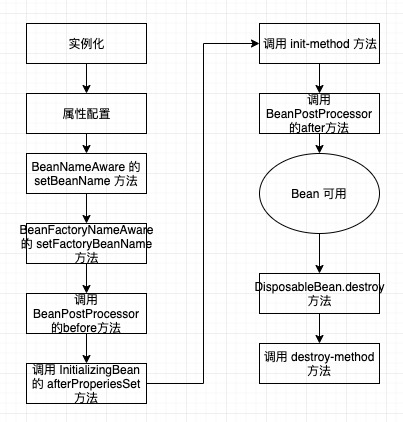

# Spring 源码分析

## 接口说明

### BeanDefinition

用来描述 bean 实例的信息体

### BeanFactory 

对 Bean 的一些操作，getBean 获取 bean，或者 containBean 是否存在 bean

`.doGetBean `方法 实例化Bean

### BeanDefinitionHolder

beanName 与 BeanDefinition 的包装体

### BeanDefinitionRegistry

BeanDefinition 管理者, 通过 BeanFactory 将 BeanDefinition 注册到 Map 中。

在 AnnotationConfigApplicationContext 中，其父类 GenericApplicationContext 中已经实现了 BeanDefinitionRegistry 接口

### DefaultListableBeanFactory

是 BeanFactory 一种实现。

`.registerBeanDefinition` 方法是将 beanName 与 BeanDefinition 关系进行注册到 Map(ConcurrentHashMap) 中

### BeanFactoryPostProcessor

是一个拓展接口

BeanFactoryPostProcessor 是在 spring 容器加载了 bean 的定义文件之后，在 bean 实例化之前，可以修改 bean 的相关信息，比如bean的scope从singleton 改为 prototype。

### BeanPostProcessor

BeanPostProcessor，可以在spring容器实例化bean之后，在执行bean的初始化方法前后，添加一些自己的处理逻辑。这里说的初始化方法，指的是下面两种：
1）bean实现了InitializingBean接口，对应的方法为afterPropertiesSet

2）在bean定义的时候，通过init-method设置的方法

注意：BeanPostProcessor是在spring容器加载了bean的定义文件并且实例化bean之后执行的。BeanPostProcessor的执行顺序是在BeanFactoryPostProcessor之后。

spring中，有内置的一些BeanPostProcessor实现类，例如：

`org.springframework.context.annotation.CommonAnnotationBeanPostProcessor`：支持@Resource注解的注入
`org.springframework.beans.factory.annotation.RequiredAnnotationBeanPostProcessor`：支持@Required注解的注入
`org.springframework.beans.factory.annotation.AutowiredAnnotationBeanPostProcessor`：支持@Autowired注解的注入
`org.springframework.orm.jpa.support.PersistenceAnnotationBeanPostProcessor`：支持@PersistenceUnit和@PersistenceContext注解的注入
`org.springframework.context.support.ApplicationContextAwareProcessor`：用来为bean注入ApplicationContext等容器对象
这些注解类的BeanPostProcessor，在spring配置文件中，可以通过这样的配置 `<context:component-scan base-package="*.*" /> `，自动进行注册。（spring通过ComponentScanBeanDefinitionParser类来解析该标签）

执行顺序是 `BeanFactoryPostProcessor > BeanPostProcessor.before > afterPropertiesSet(bean初始化) > init-method(bean初始化) > BeanPostProcessor.after`

https://blog.csdn.net/caihaijiang/article/details/35552859

### ApplicationListener

事件监听器

### AbstractAutowireCapableBeanFactory 

@Autowired注解 初始化 Bean 的 BeanFactory 

`.doCreateBean` 初始化 bean
    `.createBeanInstance` 实例化 Bean
   ` .populateBean` 为 bean 实例 赋值，依赖注入方式
    `.initializeBean `初始化

### Aware 

获取 Bean 一些信息，例如 bean 名称、beanFactory之类的
https://juejin.im/post/5d3505fcf265da1bc14b6640

## 初始化流程

## 概念说明

一、FactoryBean 与 BeanFactory 区别？

FactoryBean  是一种 Bean 的类型，该接口实现了一些 Bean 的基础信息。

BeanFactory 是一个 Bean 的工厂类，在IOC容器的基础上给Bean的实现加上了一个简单工厂模式和装饰模式，负责将 BeanDefinition 注入到 Map 中。

二、控制反转IOC 与 依赖注入 DI 说明？

控制反转（Inversion of Control） 就是依赖倒置原则的一种代码设计的思路。具体采用的方法就是所谓的依赖注入（Dependency Injection）。

[IOC 和依赖注入 DI 关系](https://www.zhihu.com/question/23277575/answer/169698662)

## 设计模式

- 工厂模式： Spring使用工厂模式通过 BeanFactory、ApplicationContext 创建 bean 对象
- 模板模式：Spring 中 jdbcTemplate、hibernateTemplate 
- 观察者模式：事件驱动
- 适配器模式 :Spring AOP 的增强或通知(Advice)使用到了适配器模式、spring MVC 中也是用到了适配器模式适配Controller
- 代理模式：Spring AOP 功能的实现
- 单例设计模式 : Spring 中的 Bean 默认都是单例的。
- 包装器设计模式 : 我们的项目需要连接多个数据库，而且不同的客户在每次访问中根据需要会去访问不同的数据库。这种模式让我们可以根据客户的需求能够动态切换不同的数据源。

