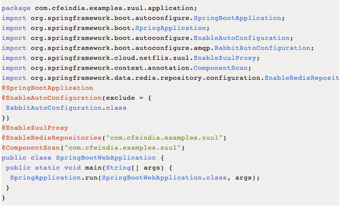
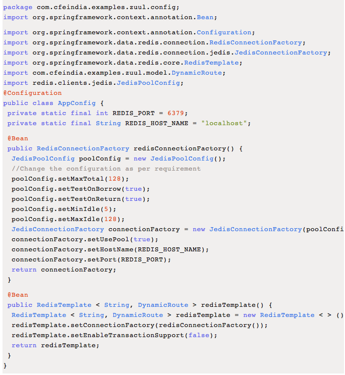

# Spring Boot中Redis的应用

## Redis作为持久化库

依赖

```xml
<dependency>           
	<groupId>org.springframework.boot</groupId>
	<artifactId>spring-boot-starter-data-redis</artifactId>
</dependency>
```

扫描



配置



应用

