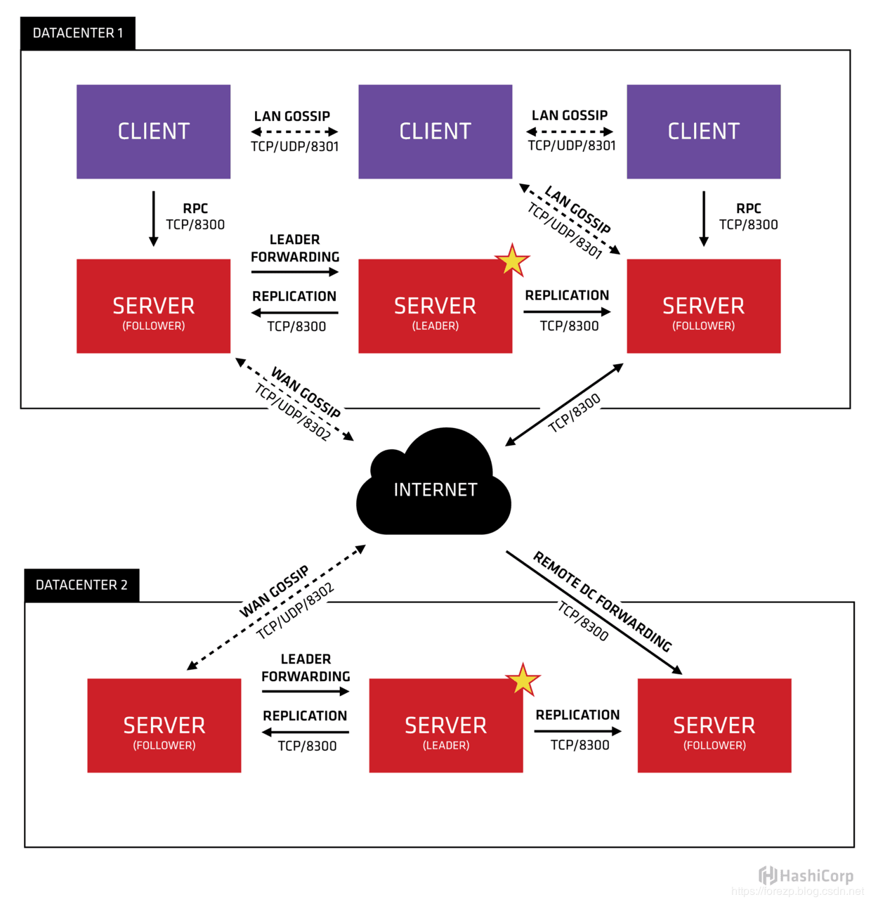

# Consul

Consul是HashiCorp公司推出的开源软件，通过 GO 语言编写，提供服务注册和发现、配置、多数据中心的高可用方案等能力，分布式一致方面采用 [raft 算法 ](https://segmentfault.com/a/1190000020798156)实现，并且很容易和 Spring Cloud 等微服务框架集成，使用起来非常的简单，具有简单、易用、可插排等特点。简而言之，Consul 提供了一种完整的服务网格解决方案 。

## Consul具有以下的特点和功能

- 服务发现：Consul的客户端可以向Consul注册服务，例如api服务或者mysql服务，其他客户端可以使用Consul来发现服务的提供者。Consul支持使用DNS或HTTP来注册和发现服务。
- 运行时健康检查：Consul客户端可以提供任意数量的运行状况检查机制，这些检查机制可以是给定服务（“是Web服务器返回200 OK”）或本地节点（“内存利用率低于90％”）相关联。这些信息可以用来监控群集的运行状况，服务发现组件可以使用这些监控信息来路由流量，可以使流量远离不健康的服务。
- KV存储：应用程序可以将Consul的键/值存储用于任何需求，包括动态配置，功能标记，协调，领导者选举等。它采用HTTP API使其易于使用。
- 安全服务通信：Consul可以为服务生成和分发TLS证书，以建立相互的TLS连接。
- 多数据中心：Consul支持多个数据中心。这意味着Consul的用户不必担心构建额外的抽象层以扩展到多个区域。

## Consul原理

每个提供服务的节点都运行了Consul的代理，运行代理不需要服务发现和获取配置的KV键值对，代理只负责监控检查。代理节点可以和一个或者多个Consul server通讯。 Consul服务器是存储和复制数据的地方。服务器本身选出了领导者。虽然Consul可以在一台服务器上运行，但建议使用3到5，以避免导致数据丢失的故障情况。建议为每个数据中心使用一组Consul服务器。

如果你的组件需要发现服务，可以查询任何Consul Server或任何Consul客户端，Consul客户端会自动将查询转发给Consul Server。

需要发现其他服务或节点的基础架构组件可以查询任何Consul服务器或任何Consul代理。代理会自动将查询转发给服务器。每个数据中心都运行Consul服务器集群。发生跨数据中心服务发现或配置请求时，本地Consul服务器会将请求转发到远程数据中心并返回结果。

### 术语

- Agent agent：是一直运行在Consul集群中每个成员上的守护进程。通过运行 consul agent 来启动。agent可以运行在client或者server模式。指定节点作为client或者server是非常简单的，除非有其他agent实例。所有的agent都能运行DNS或者HTTP接口，并负责运行时检查和保持服务同步。

- Client 一个Client是一个转发所有RPC到server的代理。这个client是相对无状态的。client唯一执行的后台活动是加入LAN gossip池。这有一个最低的资源开销并且仅消耗少量的网络带宽。

- Server：一个server是一个有一组扩展功能的代理，这些功能包括参与Raft选举，维护集群状态，响应RPC查询，与其他数据中心交互WAN gossip和转发查询给leader或者远程数据中心。

- DataCenter 虽然数据中心的定义是显而易见的，但是有一些细微的细节必须考虑。例如，在EC2中，多个可用区域被认为组成一个数据中心？我们定义数据中心为一个私有的，低延迟和高带宽的一个网络环境。这不包括访问公共网络，但是对于我们而言，同一个EC2中的多个可用区域可以被认为是一个数据中心的一部分。

- Consensus：在我们的文档中，我们使用Consensus来表明就leader选举和事务的顺序达成一致。由于这些事务都被应用到有限状态机上，Consensus暗示复制状态机的一致性。

- Gossip：Consul建立在Serf的基础之上，它提供了一个用于多播目的的完整的gossip协议。Serf提供成员关系，故障检测和事件广播。更多的信息在gossip文档中描述。这足以知道gossip使用基于UDP的随机的点到点通信。

- LAN Gossip 它包含所有位于同一个局域网或者数据中心的所有节点。

- WAN Gossip：它只包含Server。这些server主要分布在不同的数据中心并且通常通过因特网或者广域网通信。
  RPC 远程过程调用。这是一个允许client请求server的请求/响应机制。




让我们分解这张图并描述每个部分。首先，我们能看到有两个数据中心，标记为“1”和“2”。Consul对多数据中心有一流的支持并且希望这是一个常见的情况。

在每个数据中心，client和server是混合的。一般建议有3-5台server。这是基于有故障情况下的可用性和性能之间的权衡结果，因为越多的机器加入达成共识越慢。然而，并不限制client的数量，它们可以很容易的扩展到数千或者数万台。

同一个数据中心的所有节点都必须加入gossip协议。这意味着gossip协议包含一个给定数据中心的所有节点。这服务于几个目的：第一，不需要在client上配置server地址。发现都是自动完成的。第二，检测节点故障的工作不是放在server上，而是分布式的。这是的故障检测相比心跳机制有更高的可扩展性。第三：它用来作为一个消息层来通知事件，比如leader选举发生时。

每个数据中心的server都是Raft节点集合的一部分。这意味着它们一起工作并选出一个leader，一个有额外工作的server。leader负责处理所有的查询和事务。作为一致性协议的一部分，事务也必须被复制到所有其他的节点。因为这一要求，当一个非leader得server收到一个RPC请求时，它将请求转发给集群leader。

server节点也作为WAN gossip Pool的一部分。这个Pool不同于LAN Pool，因为它是为了优化互联网更高的延迟，并且它只包含其他Consul server节点。这个Pool的目的是为了允许数据中心能够以low-touch的方式发现彼此。这使得一个新的数据中心可以很容易的加入现存的WAN gossip。因为server都运行在这个pool中，它也支持跨数据中心请求。当一个server收到来自另一个数据中心的请求时，它随即转发给正确数据中想一个server。该server再转发给本地leader。

这使得数据中心之间只有一个很低的耦合，但是由于故障检测，连接缓存和复用，跨数据中心的请求都是相对快速和可靠的。

## Consul 服务注册发现流程

Consul在业界最广泛的用途就是作为服务注册中心，同Eureka类型，consul作为服务注册中心，它的注册和发现过程如下图：


在上面的流程图上有三个角色，分别为服务注册中心、服务提供者、服务消费者。

- 服务提供者Provider启动的时候，会向Consul发送一个请求，将自己的host、ip、应用名、健康检查等元数据信息发送给Consul
- Consul 接收到 Provider 的注册后，定期向 Provider 发送健康检查的请求，检验Provider是否健康
- 服务消费者Consumer会从注册中心Consul中获取服务注册列表，当服务消费者消费服务时，根据应用名从服务注册列表获取到具体服务的实例（1个或者多个），从而完成服务的调用。

## Consul 与 Eureka 对比

根据上边注册中心组建对比的表格，我们知道，Consul和Eureka最大区别在于，Consul保证CA,而Eureka保证了AP。

**Consul强一致性带来的是：**

服务注册相比Eureka会稍慢一些。因为Consul的raft协议要求必须过半数的节点都写入成功才认为注册成功
Leader挂掉时，重新选举期间整个consul不可用。保证了强一致性但牺牲了可用性。

**Eureka保证高可用(A)和最终一致性：**

服务注册相对要快，因为不需要等注册信息replicate到其他节点，也不保证注册信息是否replicate成功。[[当数据出现不一致时](https://juejin.im/post/5d3ffce56fb9a06af7121025)](https://juejin.im/post/5d3ffce56fb9a06af7121025)，虽然A, B上的注册信息不完全相同，但每个Eureka节点依然能够正常对外提供服务，这会出现查询服务信息时如果请求A查不到，但请求B就能查到。如此保证了可用性但牺牲了一致性。


## Consul下载和安装

下载地址：https://www.consul.io/downloads.html

### Linux

启动命令：

```shell
nohup consul agent -server -bootstrap-expect 1 -config-dir /etc/consul.d/ -data-dir /tmp/consul -ui -bind=0.0.0.0 >> /var/opt/consul/consul.log 2>&1 
```

### Mac

```shell
# 安装
brew install consul
# 修改 Consul 启动参数
vim /usr/local/opt/consul/homebrew.mxcl.consul.plist
# 修改 ProgramArguments 部分
<key>ProgramArguments</key><array><string>/usr/local/opt/consul/bin/consul</string><string>agent</string><string>-server</string><string>-bootstrap</string><string>-advertise</string><string>127.0.0.1</string><string>-data-dir</string><string>./data</string><string>-ui</string></array>
# Consul 启动
bashbrew services start consul
```

### 访问 Web 界面

访问：http://localhost:8500

```shell
-bootstrap：启动模式，此模式下，节点可以选举自己为leader，一个数据中心只能有一个此模式启动的节点。机群启动后，新启动的节点不建议使用这种模式。
-bootstrap-expect：设定一个数据中心需要的服务节点数，可以不设置，设置的数字必须和实际的服务节点数匹配。consul会等待直到数据中心下的服务节点满足设定才会启动集群服务。初始化leader选举，不能和bootstrap混用。必须配合-server配置。
-bind：绑定的内部通讯地址，默认0.0.0.0，即，所有的本地地址，会将第一个可用的ip地址散播到集群中，如果有多个可用的ipv4，则consul启动报错。[::]ipv6，TCP UDP协议，相同的端口。防火墙配置。
-client：客户端模式，http dns，默认127.0.0.1，回环令牌网址
-config-file：配置文件位置
-config-dir：配置文件所在文件夹，会加载其下所有配置文件，.json或者.hcl文件，加载顺序为字母表顺序；可用配置多个此配置，从而加载多个文件夹，子文件夹的配置不会被加载。
-config-format：配置文件格式，配置了，则加载相应个是的文件。不配置，则consul自动识别。
-data-dir：状态数据存储文件夹，所有的节点都需要。文件夹位置需要不收consul节点重启影响，必须能够使用操作系统文件锁，unix-based系统下，文件夹文件权限为0600，注意做好账户权限控制，
-datacenter：数据中心名称，默认dc1，一个数据中心的所有节点都必须在一个LAN中。
-dev：开发模式，去掉所有持久化选项，内存服务器模式。
-disable-host-node-id：不使用host信息生成node ID，适用于同一台服务器部署多个实例用于测试的情况。随机生成nodeID
-dns-port：v7.0以后，自定义dns 端口，覆盖默认8600
-enable-script-checks：是否允许使用脚本进行健康检查，默认false，最好配置enable acl
-encrypt：consul网络通讯加密key，base64加密，16比特；consul keygen产生。集群中的每个实例必须提供相同的，只需提供一次，然后会保存到数据文件。重启自动加载。consul节点启动后提供，会被忽略。
-hcl：添加hcl格式配置，和已有的配置合并。可以使用多个此配置。
-http-port：http api端口，覆盖默认的8500。适用于云环境指定。
-log-file：日志记录文件，如果没有提供文件名，则默认Consul-时间戳.log
-log-level：日志级别，默认info，包含：trace，debug，info，warn，err；consul monitor监控
-log-rotate-bytes：新日志文件生成大小阈值。
-log-rotate-rotation：新日志生成时间阈值
-join：需要加入的其它节点地址，可以多次使用，加入多个节点。
-retry-join：会进行加入重试，适用于认定加入节点最终会正常的情况。ipv4，ipv6，dns
-retry-interval：上述，重试间隔，默认30s
-retry-max：重试次数，默认0，无限次重试
-join-wan， -retry-join-wan， -retry-interval-wan， -retry-max-wan 
-node：节点名称，默认主机名
-node-id：节点ID，
-pid-file：consul 存储 pid 的文件位置，用于主动发信号。如停止节点，重载配置等。
-protocol：使用的协议，升级时使用。consul -v查看协议版本
-raft-protocol：使用raft协议版本，默认3
-raft-snapshot-threshold：raft执行快照，提交次数阈值。一般不需要设置，io密集型应用可以调高。避免所有的节点同一时间快照。此值过大，会造成相应日志文件变大，节点重启恢复会耗费更长时间。1.1.0后，默认16384，之前8192.
-raft-snapshot-interval：执行快照间隔，影响类似上个配置，1.1.0后默认30s，之前5s。
-rejoin：节点会尝试重新加入集群。
-server：服务端节点模式。
-server-port：服务端RPC端口，v1.2.2后提供。
-non-voting-server：服务节点不参与选举，接受日志复制，用于横向扩展，服务查询请求。（类比zookeeper 观察者节点）
-syslog：linux OSX系统，配置日志输出到系统日志。
-ui：内置web ui界面。
-ui-dir：web ui 资源文件夹，使用此配置，则不需也不能使用再-ui配置。
```

具体参数：https://www.consul.io/docs/agent/options.html

默认使用端口：

- 服务端RPC：默认8300，TCP。
- Serl LAN：处理LAN gossip，默认8301，TCP UDP。
- Serl WAN：处理LAN gossip，默认8302，TCP UDP。
- HTTP API：8500，TCP.
- DNS：8600，TCP,UDP.

## Consul 客户端

### 添加依赖

添加 pom 依赖

```xml
<!--监控，提供了健康检查-->
<dependency>
	<groupId>org.springframework.boot</groupId>
	<artifactId>spring-boot-starter-actuator</artifactId>
</dependency>
<dependency>
	<groupId>org.springframework.cloud</groupId>
	<artifactId>spring-cloud-starter-consul-discovery</artifactId>
</dependency>
```

### 修改配置

`bootstrap.yml`

```yml
spring:
 cloud:
  consul:
   host: xxx.xxx.xxx.xxx # 地址
   port: 8500 # 端口
   discovery:
   	register: true # 是否注册到 consul
    prefer-ip-address: true # ip 优先，以ip方式注册到 consul
    instance-id: ${spring.application.name}:${spring.cloud.client.ip-address} # 实例名称
    healthCheckInterval: 15s  # 健康检查时间间隔
    health-check-url: http://${spring.cloud.client.ip-address}:${server.port}/actuator/  # 健康检查地址
```

### 启动类

添加 `@EnableDiscoveryClient` 注解，或者直接 `@SpringCloudApplication`

```java
@SpringCloudApplication
public class GatewayApplication {
    public static void main(String[] args) {
        SpringApplication.run(GatewayApplication.class, args);
    }
}
```

### 启用配置文件的相关配置项

```yml
spring:
  application:
    name: consul-provider
  cloud:
    consul:
      config:
          enabled: true
          format: yaml           
          prefix: config     
          profile-separator: ':'    
          data-key: data 
```

网页上访问 consul 的 KV 存储的管理界面，即http://localhost:8500/ui/dc1/kv，创建配置记录。

### 使用 @RefreshScope 实现动态刷新配置

```java
@RestController
@RefreshScope
public class FooBarController {

    @Value("${foo.bar}")
    String fooBar;

    @GetMapping("/foo")
    public String getFooBar() {
        return fooBar;
    }
}
```

### 参数说明

```yaml
spring:
 cloud:
  consul:
   host: xxx.xxx.xxx.xxx # 地址
   port: 8500 # 端口
   discovery:
   	register: true # 是否注册到 consul
   	serviceName: service-producer
    prefer-ip-address: true # ip 优先，以ip方式注册到 consul
    tags: version=1.0  # key-value
    instance-id: ${spring.application.name}:${spring.cloud.client.ip-address} # 实例名称
    healthCheckInterval: 15s  # 健康检查时间间隔
    health-check-url: http://${spring.cloud.client.ip-address}:${server.port}/actuator/  # 健康检查地址
```

注册的服务名称属性为 `spring.cloud.consul.discovery.serviceName`，而不再是像 Eureka 中使用 `spring.application.name=xx`。

## API

- http://localhost:8500/v1/agent/checks : 获取当前所有服务健康状况

- http://localhost:8500/v1/acl/bootstrap : 创建 token

- http://localhost:8500/v1/acl/create : 创建 ACL 配置
- http://127.0.0.1:8500/v1/agent/service/deregister/my-service-id : 下线服务

参见：[API 详情](https://www.consul.io/api/agent/service.html)

## ACL

### Consul 服务端配置

#### 生成 token

以 PUT 方式访问 http://localhost:8500/v1/acl/bootstrap ，取 SecretID 或 ID 你会发现这两个值其实是一样的。

```json
{
    "ID": "e292b56b-eee4-76c6-07a1-af7a81fc8c38",
    "AccessorID": "3aea8f1b-f30a-5a0a-3970-14135c4ce1a3",
    "SecretID": "e292b56b-eee4-76c6-07a1-af7a81fc8c38",
    "Description": "Bootstrap Token (Global Management)",
    "Policies": [
        {
            "ID": "00000000-0000-0000-0000-000000000001",
            "Name": "global-management"
        }
    ],
    "Local": false,
    "CreateTime": "2019-12-16T16:11:54.159198+08:00",
    "Hash": "oyrov6+GFLjo/KZAfqgxF/X4J/3LX0435DOBy9V22I0=",
    "CreateIndex": 1061,
    "ModifyIndex": 1061
}
```

#### 修改 Consul 服务端配置文件

在 Consul 服务所在配置路径下（`/etc/consul.d`），创建一个 `acl.json` 文件，进行如下配置，完成配置重启 Consul 服务。

```json
{
  "acl_master_token": "e292b56b-eee4-76c6-07a1-af7a81fc8c38",
	"acl_default_policy": "deny",
	"server": true,
	"log_level": "INFO",
	"bootstrap_expect": 1,
  "client_addr": "0.0.0.0"
}
```

我们在网上会看到 `acl_token` 配置项，该用于 Consul 客户端认证时使用。

> acl.json 文件名不要随意取名，可能会存在配置项不识别的问题

#### 创建 ACL 规则

以 PUT 方式访问 http://localhost:8500/v1/acl/create 

请求参数如下：

```json
{
  "Name": "AgentToken",
  "Type": "client",
  "Rules": "node \"\" { policy = \"read\" } node \"\" { policy = \"write\" } service \"\" { policy = \"read\" } service \"\" { policy = \"write\" }  key \"\" { policy = \"read\" } key \"\" { policy = \"write\" } agent \"\" { policy = \"read\" } agent \"\" { policy = \"write\" }  session \"\" { policy = \"read\" } session \"\" { policy = \"write\" }"
}
```

#### 检查是否认证生效

```shell
# 命令行下，返回空
consul members
# 返回列表数据
consul members -token e292b56b-eee4-76c6-07a1-af7a81fc8c38
```

### Consul 客户端配置

#### Spring Cloud Consul 客户端配置

在 Consul 客户端配置 `acl-token` 配置项，推荐放在 `bootstrap.yml` 文件下

```yaml
spring:
  cloud:
    consul:
      discovery:
        enabled: true
        healthCheckPath: ${management.server.servlet.context-path}/health
        healthCheckInterval: 15s
        prefer-ip-address: true
        register: true
        acl-token: e292b56b-eee4-76c6-07a1-af7a81fc8c38
      host: localhost
      port: 8500
```

### Rules

在上方第三步中的规则配置说明项。

| Policy                                                       | Scope                                                        |
| ------------------------------------------------------------ | ------------------------------------------------------------ |
| [`agent`](https://www.consul.io/docs/guides/acl.html#agent-rules) | Utility operations in the [Agent API](https://www.consul.io/api/agent.html), other than service and check registration |
| [`event`](https://www.consul.io/docs/guides/acl.html#event-rules) | Listing and firing events in the [Event API](https://www.consul.io/api/event.html) |
| [`key`](https://www.consul.io/docs/guides/acl.html#key-value-rules) | Key/value store operations in the [KV Store API](https://www.consul.io/api/kv.html) |
| [`keyring`](https://www.consul.io/docs/guides/acl.html#keyring-rules) | Keyring operations in the [Keyring API](https://www.consul.io/api/operator/keyring.html) |
| [`node`](https://www.consul.io/docs/guides/acl.html#node-rules) | Node-level catalog operations in the [Catalog API](https://www.consul.io/api/catalog.html), [Health API](https://www.consul.io/api/health.html), [Prepared Query API](https://www.consul.io/api/query.html), [Network Coordinate API](https://www.consul.io/api/coordinate.html), and [Agent API](https://www.consul.io/api/agent.html) |
| [`operator`](https://www.consul.io/docs/guides/acl.html#operator-rules) | Cluster-level operations in the [Operator API](https://www.consul.io/api/operator.html), other than the [Keyring API](https://www.consul.io/api/operator/keyring.html) |
| [`query`](https://www.consul.io/docs/guides/acl.html#prepared-query-rules) | Prepared query operations in the [Prepared Query API](https://www.consul.io/api/query.html) |
| [`service`](https://www.consul.io/docs/guides/acl.html#service-rules) | Service-level catalog operations in the [Catalog API](https://www.consul.io/api/catalog.html), [Health API](https://www.consul.io/api/health.html), [Prepared Query API](https://www.consul.io/api/query.html), and [Agent API](https://www.consul.io/api/agent.html) |
| [`session`](https://www.consul.io/docs/guides/acl.html#session-rules) | Session operations in the [Session API](https://www.consul.io/api/session.html) |

涉及 Token 失效问题，参数说明等，可以查看 [Consul Access Control（ACLS）](https://juejin.im/post/5d3ffce56fb9a06af7121025)。

参见：[官方 ACL 配置](https://www.consul.io/docs/acl/index.html)

## Consul Web UI 安全

consul 本身并没有提供 web ui 的安全性保证，只要防火墙允许，则在外网的任何人也可以访问其 web ui，这一点比较危险，这里采用基本的 `auth_basic` 来保证 consul web ui 的安全性，方案简述如下：

1. 以 server 模式运行 consul agent 的服务器，其配置网络策略，仅允许在内网范围内其它节点可访问其8500端口。

2. 以client模式运行consul agent的节点，其如果打开 web ui，则只绑定地址127.0.0.1；其可以以8500端口连接consul server agent，但在使用consul相关功能时，必须使用client token或management token。

3. 在内网中采用nginx或apache做反向代理至consul server agent节点的8500端口，并在nginx或apache中配置`auth_basic`认证。反向代理及`auth_basic`认证的配置参考下面：

   ```bash
   yum install -y httpd-tools
   htpasswd -c /etc/nginx/htpsswd consul_access # 执行后会要求你输入密码，完了就完成了账号密码的生成
   # 下面以配置nginx示例，apache的配置类似
   upstream consul {
          server 10.12.142.216:8500;
          server 10.12.142.217:8500;
          server 10.12.142.218:8500;
   }
   server {
       listen 18500;
       server_name consul.xxxx.com;
       location / {
           proxy_pass http://consul;
           proxy_read_timeout 300;
           proxy_connect_timeout 300;
           proxy_redirect off;
           auth_basic "Restricted";
           auth_basic_user_file /etc/nginx/htpasswd;
       }
   }
   ```

4. 配置网络策略，在外网仅允许访问nginx的反向代理地址，访问时需输入`auth_basic`认证信息，并且在使用consul相关功能时，必须使用client token（原则上不允许将management token带出到外网）。

## Spring Cloud Consul 配置

##### 核心参数

| 配置项                      | 默认值    |
| :-------------------------- | :-------- |
| spring.cloud.consul.enabled | true      |
| spring.cloud.consul.host    | localhost |
| spring.cloud.consul.port    | 8500      |

其他参数配置参见：[Spring Cloud Consul 从入门到精通](https://blog.csdn.net/valada/article/details/80878737)

## 问题

1、存在 Critical 问题

导致的原因可能是没有引用 `spring-boot-starter-actuator` 依赖导致

```xml
<dependency>
  <groupId>org.springframework.boot</groupId>
  <artifactId>spring-boot-starter-actuator</artifactId>
</dependency>
```

2、`Spring Cloud Consul` 错误信息如下，原因是 SC 应用中没有配置 `acl-token`，跟是否是 bootstrap 与 application 是没有关系的哦，如果还存在问题，可以查看是否配置文件名称错误了，或者 debug 一下 ConsulDiscoveryProperties 类中的配置初始化操作。

```
com.ecwid.consul.v1.OperationException: OperationException(statusCode=403, statusMessage='Forbidden', statusContent='Permission denied')
```

## 拓展阅读

[Spring Cloud Consul 之Greenwich版本全攻略](https://blog.csdn.net/forezp/article/details/87273153)

[Consul 入门指南](https://book-consul-guide.vnzmi.com/06_setup_cluster.html)

[Spring Cloud Consul](https://cloud.spring.io/spring-cloud-consul/reference/html/#configuration-properties)

[springcloud微服务体系（二）—2.0G版 Consul注册中心搭建](https://blog.csdn.net/BecauseSy/article/details/90700231)

[consul 配置/KV/ACL](https://www.jianshu.com/p/05741685af33)

[Spring Cloud Consul 从入门到精通](https://blog.csdn.net/valada/article/details/80878737)

[Consul Basics](https://www.consul.io/docs/agent/basics.html)

[Consul API](https://www.consul.io/api/index.html)

[Consul Access Control（ACLS）](https://juejin.im/post/5d3ffce56fb9a06af7121025)